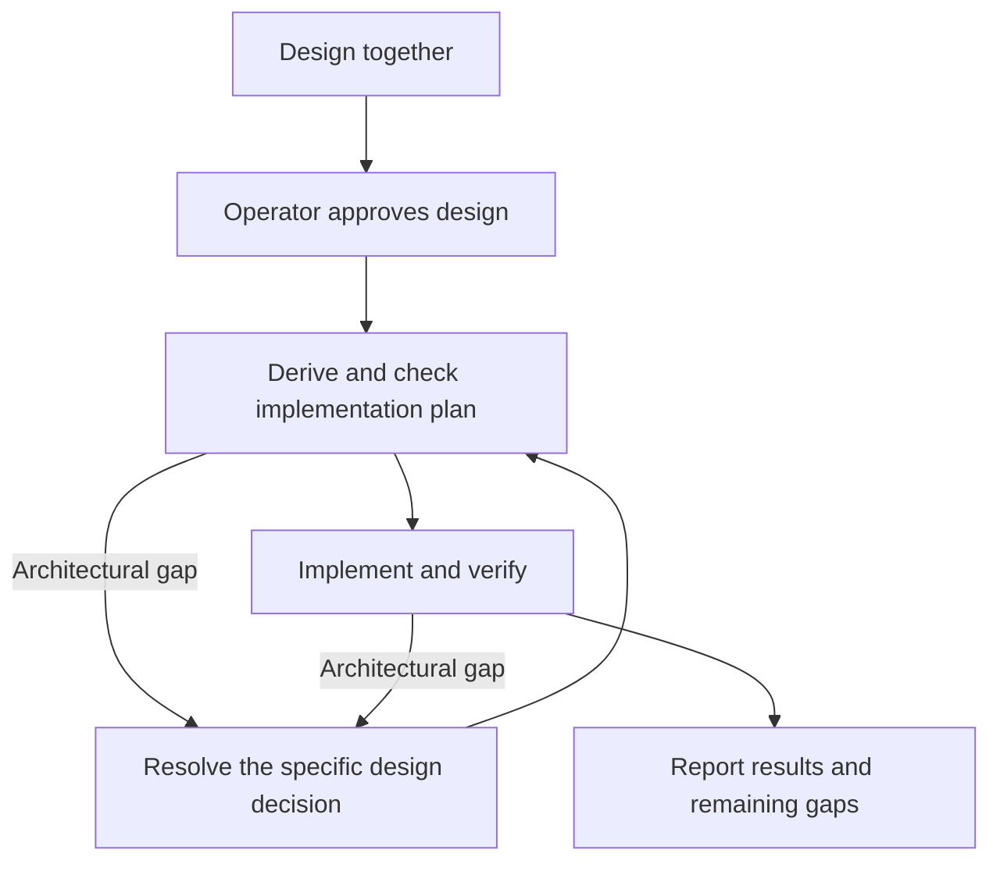

# Design

## The order

1. **Probe before propose.** Measure the current state first — read the code,
   run the check, read the owning package's godoc and design doc. A design
   argued against an unmeasured state is a guess wearing a plan's clothes.
2. **Shape before detail.** Give the operating human the shape first — a
   mermaid diagram of the structure or flow — and confirm it before
   elaborating. The shape gives the details a place to live in the reader's
   head; detail that arrives first has nowhere to go.
3. **Approaches before design.** Two or three, with trade-offs and a
   recommendation. YAGNI ruthlessly — remove anything no ruling asked for.
4. **One question at a time**, multiple choice preferred, when an unresolved
   decision needs the operator. This limits interruptions; it does not require
   a question at every step. Carry settled decisions forward. Investigation,
   progress updates and routine next steps are not permission gates.
5. **The ratchet.** New complexity prompts a check against the agreed shape,
   not an automatic stop. Bring back a changed architectural decision; handle
   implementation detail within the design.

## The artifact

A design doc carries four sections and nothing else:

1. **Shape** — mermaid first: the one picture that *is* the design. Diagrams
   for structure and flow; prose for naming and word choices.
2. **Law** — the rules, present tense, each carrying at most one
   why-sentence. The doc states invariants; it does not narrate how they came
   to be.
3. **Rulings** — a status table. Columns: `ID`, `status`, `scope`,
   `ruled by`, `date`. Statuses: `settled`, `deferred-until-X`, `open`,
   `superseded`. Rulings number into the conversation as R1, R2, … No
   verbatim quotes — a quote reads as authority to a future session and
   outlives its meaning.
4. **Open** — the unsettled questions, named per item, so a settled question
   is not re-opened and an unsettled one is not mistaken for settled.

An idea's working documents — brainstorming notes, use-cases, plans — take
whatever shape the idea needs; the design doc is where an idea graduates
into law, and the graduation is declared: a law doc carries a `## Rulings`
section, which is what the genre check keys on.

Everything else is the **case file**: the transcript, the approaches that
lost, the evidence table pinned to a commit, the corrections. It lives in the
issue or the PR, one hop from the doc — visible for the archaeology, absent
from every future session's context. Everything a loaded doc carries is
co-equal input; law and case file compete for the same salience, and the case
file loses on purpose. Evidence obeys the same rule: the invariant is stated
in the doc; `file:line @ commit` rides with the ruling that established it.
The tell is greppable and the check makes it a mechanism: run
`game-dev/scripts/check-doc-genres.sh` before publishing the design PR — a
finding is the smell of case file in law, exempt only by the operator's
inline `<!-- case-file -->` ruling.

## From design to implementation

Design with the operator in terms they can judge: responsibilities, boundaries,
behavior and what done means. The session then translates that agreement into
an implementation plan; the operator need not supervise that translation.

**A faithful plan is authorized by the approved design.** Make the plan visible,
check it, then execute without asking for a second approval. Planning is real
work before implementation, not a retrospective list of edits. Keep it in the
issue or PR, or a linked working document, separate from the design's law.

The plan is as small as the work allows and names:

- the design requirements each step delivers, including acceptance checks;
- the owning repositories/modules and affected contracts, based on inspection;
- the development sequence, dependencies and applicable merge/release order;
- verification at the changed seams and observable proof of the intended result;
- assumptions and gaps, resolved or explicitly deferred within the agreed scope.

Before implementation, walk the plan against both the design and the current
code. Check for missing owners, unavailable provider capabilities, integration
steps and requirements without proof. Resolve what the design answers; bring
back only decisions it does not authorize. Do not invent extra features to fill
hypothetical gaps.

## Gap judgment

- **Implementation detail:** local algorithms, helpers, file organization or
  test fixtures that preserve the agreed contracts and responsibilities. Choose,
  verify and continue; update the plan when useful.
- **Gap answered by the design:** a missing step or adapter whose owner and
  behavior follow from the agreement. Add it to the plan and continue.
- **Architectural gap:** proceeding requires changing or inventing an ownership
  boundary, public contract, source of truth, lifecycle, dependency direction,
  user-visible behavior or acceptance scope not settled by the design. Pause
  the affected work and bring back the specific decision with evidence, its
  consequence and a recommendation. Do not reopen settled parts of the design.

Difficulty, extra edits or a failing test alone are not architectural gaps.
Reversibility alone does not authorize changing the architecture. When unsure,
name the invariant that might change; investigate first if evidence can settle
it, otherwise ask about that decision rather than seeking blanket permission.

Apply the same test during planning, implementation and verification. A gap
found after implementation is reported plainly: what was found, impact on the
agreement, and whether it blocks completion or is a proposed follow-up. Do not
silently weaken acceptance criteria, claim completion with a known blocking gap,
or defer a required architectural decision on the operator's behalf.

Operator corrections calibrate this judgment. Keep the concrete example and
reasoning in the issue or PR; carry the confirmed reusable distinction into
this skill or the owning guidance. Do not turn every incident into a new gate.

## The gate

Game additions and architectural changes need the operator's design agreement
before implementation. Agreement can be given in conversation and recorded in
the linked issue or design PR; a separate design PR is not required for every
change. When a law doc is produced, enter its rulings with attribution and scope.
A ruling about one doc does not become workspace-wide doctrine.

Once the design is agreed, a faithful checked plan needs no separate approval.
A change to the design returns only the affected decision to the operator.
Routine documentation and mechanical work do not need a separate design cycle.
This authorization does not replace repository review, release, merge or other
explicit safety gates.

Where a design doc is needed: cross-repo designs in
`rpg-project/ideas/<topic>/design.md`; toolkit-scoped designs in
`rpg-toolkit/docs/ideas/<name>/`; other repos by their own convention. Package
rules and seams remain documented with their owning source. The issue can track
multiple implementing PRs; a design PR need not stay open to track execution.

## The language

Roles, not names: the session, the operator, the owning repo. Identity lives
in the record — ruling rows carry `ruled by` — never in procedure. Attributed
quotes may stand where they already exist, as history; new procedural text
assumes nothing about who is at the wheel.

## Deliberately not in this version

Classification ladders, staged approval gates, mandatory design-PR ceremonies,
spec directories and vocabulary borrowed from other processes. The meaningful
gate is the operator's agreement on what is being built.
