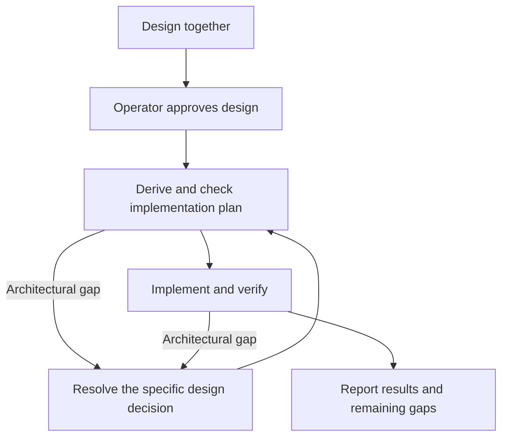

# Design

## Brainstorming — throwing noodles at the wall

When the operator is exploring an idea, stay loose. We are discovering what
might be worth building, not selecting from a menu the session has invented.
Offer possibilities, follow tangents, connect ideas and ask open-ended questions
when useful. Do not use multiple-choice questions to funnel the exploration.
Examples are sparks, not an exhaustive set of options.

The structured design order below applies once there is a direction to shape,
not to every speculative thought. Brainstorming does not require a diagram,
a shortlist of approaches, rulings or a design document. Check facts when they
matter, but do not turn each possibility into a code investigation or plan.
An interesting idea is not an approved requirement or permission to implement.

Follow the operator's move toward making an idea concrete; if that intent is
unclear, ask whether to keep exploring or start shaping it. This is a conversational
transition, not a new approval ceremony. Exploration can reopen during design.

## Converge on a brief

Once there is a direction to shape, write back a short understanding the operator
can recognize and correct:

- the intended outcome and who it serves;
- constraints and non-goals;
- concrete success scenarios — what someone can observe when it works;
- settled decisions versus assumptions and unresolved questions.

Use what the operator already supplied; do not ask them to repeat it or approve
another stage. Invite correction and carry the corrected brief into design.
Keep it in the issue or a linked working document. Check proposed structure and
behavior against it: agreement on a diagram alone is not agreement on what the
system must do.

## The design order

1. **Probe before propose.** Measure the current state first — read the code,
   run the check, read the owning package's godoc and design doc. A design
   argued against an unmeasured state is a guess wearing a plan's clothes.
2. **Shape before detail.** Give the operating human the shape first — a
   mermaid diagram of the structure or flow — and confirm it before
   elaborating. The shape gives the details a place to live in the reader's
   head; detail that arrives first has nowhere to go. Once the shape holds,
   grow it into the walkthrough (below) — owners, contracts, refusals and
   costs — and seek agreement on that, not on the picture alone.
3. **Approaches before design.** Two or three, with trade-offs and a
   recommendation. YAGNI ruthlessly — remove anything no ruling asked for.
4. **One question at a time**, when an unresolved decision needs the operator.
   Multiple choice can help with a genuinely bounded design decision once we
   know what we are building; it is not the default and never an exploration
   funnel. This limits interruptions; it does not require a question at every
   step. Carry settled decisions forward. Investigation, progress updates and
   routine next steps are not permission gates.
5. **The ratchet.** New complexity prompts a check against the agreed shape,
   not an automatic stop. Bring back a changed architectural decision; handle
   implementation detail within the design.

## The artifacts

A design produces two documents for two readers, plus the case file. The
**design doc** is law: terse, present tense, what must hold. The
**walkthrough** is understanding: a teammate who codes, reading it cold, learns
which component owns each noun, what crosses each seam in which type, what
each boundary refuses to do, and what each decision costs. Law without the
walkthrough is obeyed without being understood. A walkthrough without law is
rationale with no authority.

### The walkthrough

`ideas/<topic>/README.md` (or `walkthrough.md` when README is already the
folder's index) beside the design doc: component shape,
ownership-and-contracts table with each boundary's refusals, one value walked
source to screen, separations that look like one thing, a trade-offs table
naming what was not taken, edges, where a likely change lands, and a source
map. It cites rulings by ID, never restates them, and carries no delivery
status or correction stories — those are case file. **Read
[the walkthrough guide](walkthrough.md) before writing one.** It is the surface
the operator agrees on, and it changes in the same PR as any law it explains.

### The design doc

A design doc carries four sections and nothing else:

1. **Shape** — mermaid first: the one picture that *is* the design. Diagrams
   for structure and flow; prose for naming and word choices.
2. **Law** — the rules, present tense, each carrying at most one
   why-sentence. The doc states invariants; it does not narrate how they came
   to be.
3. **Rulings** — a status table. Columns: `ID`, `status`, `scope`,
   `ruled by`, `date`. Statuses: `settled`, `deferred-until-X`, `open`,
   `superseded`. Rulings number into the conversation as R1, R2, … No
   verbatim quotes — a quote reads as authority to a future session and
   outlives its meaning.
4. **Open** — the unsettled questions, named per item, so a settled question
   is not re-opened and an unsettled one is not mistaken for settled.

An idea's working documents — brainstorming notes, use-cases, plans — take
whatever shape the idea needs; the design doc is where an idea graduates
into law, and the graduation is declared: a law doc carries a `## Rulings`
section, which is what the genre check keys on.

Everything else is the **case file**: the transcript, the approaches that
lost, the evidence table pinned to a commit, the corrections. It lives in the
issue or the PR, one hop from the doc — visible for the archaeology, absent
from every future session's context. Everything a loaded doc carries is
co-equal input; law and case file compete for the same salience, and the case
file loses on purpose. Evidence obeys the same rule: the invariant is stated
in the doc; `file:line @ commit` rides with the ruling that established it.
The tell is greppable and the check makes it a mechanism: run
`game-dev/scripts/check-doc-genres.sh` before publishing the design PR — a
finding is the smell of case file in law, exempt only by the operator's
inline `<!-- case-file -->` ruling.

## Design completeness

Before deriving implementation tasks, check that the agreement settles the
in-scope responsibilities and interfaces, inputs and outputs, state changes and
lifecycle, failure/absence/invalid-input behavior, and observable acceptance
scenarios. Name exclusions explicitly; do not invent requirements to make a
checklist look complete. For each unit, make clear what it owns, how its consumer
uses it, and what it depends on — the walkthrough's ownership table is where
that becomes visible; a row that cannot be filled is an unsettled design.

Put durable rules in the existing law sections; examples, acceptance scenarios
and investigation evidence can live in linked working documents or the issue.
Do not add implementation sections to the four-section law artifact. Resolve
missing detail from the agreement where possible; return only unsettled design
decisions to the operator, using the gap judgment below.

## From design to implementation

Design with the operator in terms they can judge: responsibilities, boundaries,
behavior and what done means. The session then translates that agreement into
an implementation plan; the operator need not supervise that translation.

**A faithful plan is authorized by the approved design.** Make the plan visible,
check it, then execute without asking for a second approval. Planning is real
work before implementation, not a retrospective list of edits. Keep it in the
issue or PR, or a linked working document, separate from the design's law.

After design agreement, **read [the implementation planning guide](planning.md)
and complete its task contracts and visible checks before implementation**.
A list of repositories or intended edits is not an implementation plan. The
plan must let a fresh implementer execute a bounded task without reconstructing
the design conversation or inventing its contracts.

Scale the plan to the work, not the precision down to an outline. The guide
requires concrete files, interfaces, test assertions and verification commands,
plus requirement coverage and provider/consumer seam checks against inspected
code. Keep the plan separate from the design's law, link both in the paper trail,
and update affected tasks when implementation reveals a gap.

Planning ends with a checked, handoff-ready plan. Execute directly or delegate
only as authorized by the operator and applicable instructions; readiness is not
permission to spawn agents. Repository review, release and merge gates remain
in force.

## Gap judgment

- **Implementation detail:** local algorithms, helpers, file organization or
  test fixtures that preserve the agreed contracts and responsibilities. Choose,
  verify and continue; update the plan when useful.
- **Gap answered by the design:** a missing step or adapter whose owner and
  behavior follow from the agreement. Add it to the plan and continue.
- **Architectural gap:** proceeding requires changing or inventing an ownership
  boundary, public contract, source of truth, lifecycle, dependency direction,
  user-visible behavior or acceptance scope not settled by the design. Pause
  the affected work and bring back the specific decision with evidence, its
  consequence and a recommendation. Do not reopen settled parts of the design.

Difficulty, extra edits or a failing test alone are not architectural gaps.
Reversibility alone does not authorize changing the architecture. When unsure,
name the invariant that might change; investigate first if evidence can settle
it, otherwise ask about that decision rather than seeking blanket permission.

Apply the same test during planning, implementation and verification. A gap
found after implementation is reported plainly: what was found, impact on the
agreement, and whether it blocks completion or is a proposed follow-up. Do not
silently weaken acceptance criteria, claim completion with a known blocking gap,
or defer a required architectural decision on the operator's behalf.

Operator corrections calibrate this judgment. Keep the concrete example and
reasoning in the issue or PR; carry the confirmed reusable distinction into
this skill or the owning guidance. Do not turn every incident into a new gate.

## The gate

Game additions and architectural changes need the operator's design agreement
before implementation. Agreement can be given in conversation and recorded in
the linked issue or design PR; a separate design PR is not required for every
change. When a law doc is produced, enter its rulings with attribution and scope.
A ruling about one doc does not become workspace-wide doctrine.

Once the design is agreed, a faithful checked plan needs no separate approval.
A change to the design returns only the affected decision to the operator.
Routine documentation and mechanical work do not need a separate design cycle.
This authorization does not replace repository review, release, merge or other
explicit safety gates.

Where a design doc is needed: cross-repo designs in
`rpg-project/ideas/<topic>/design.md`; toolkit-scoped designs in
`rpg-toolkit/docs/ideas/<name>/`; other repos by their own convention. Package
rules and seams remain documented with their owning source. The issue can track
multiple implementing PRs; a design PR need not stay open to track execution.

## The language

Roles, not names: the session, the operator, the owning repo. Identity lives
in the record — ruling rows carry `ruled by` — never in procedure. Attributed
quotes may stand where they already exist, as history; new procedural text
assumes nothing about who is at the wheel.

## Deliberately not in this version

Classification ladders, staged approval gates, mandatory design-PR ceremonies,
spec directories and vocabulary borrowed from other processes. The meaningful
gate is the operator's agreement on what is being built.
