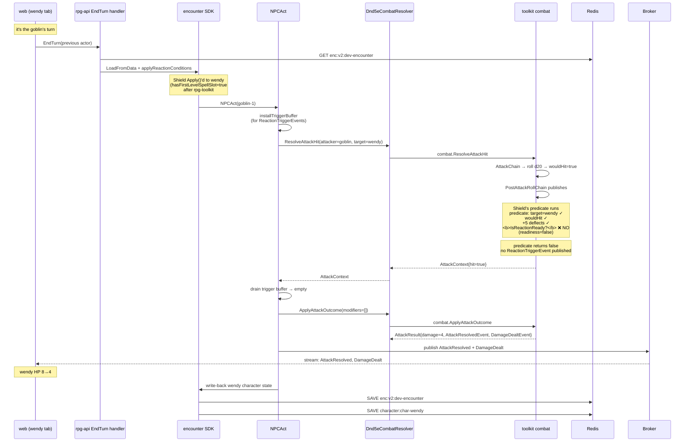
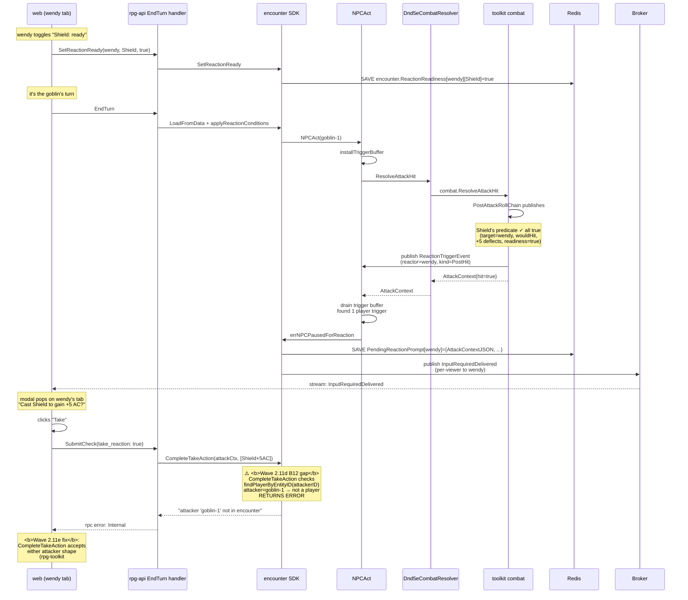
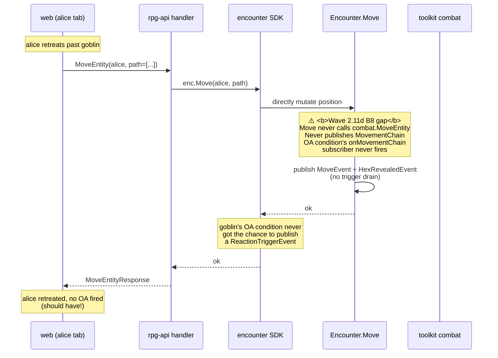
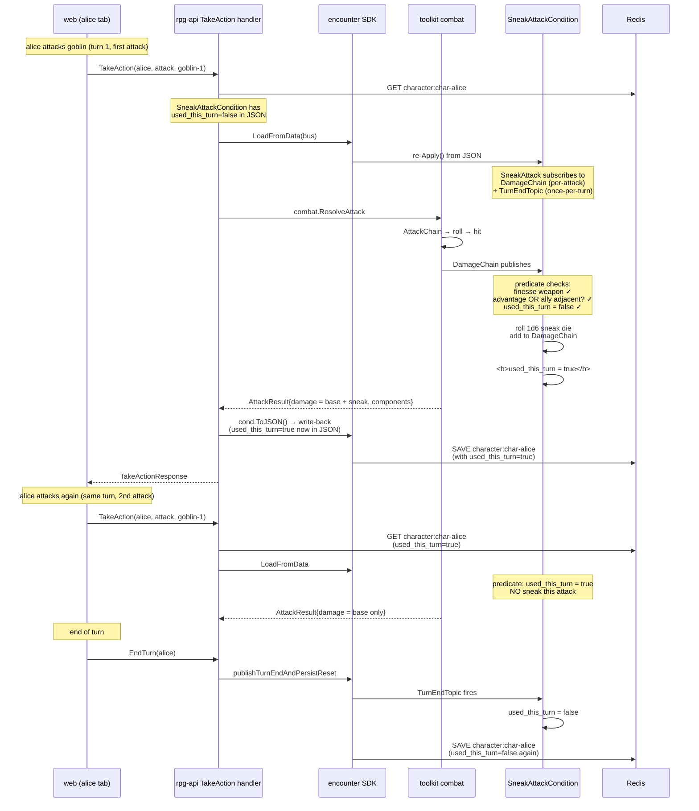
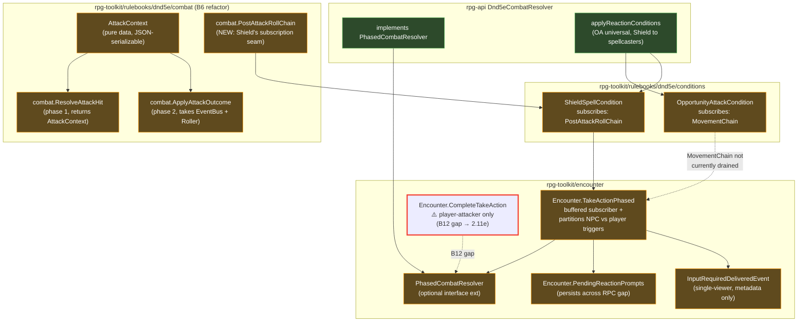

# Wave 2.11d — reaction surface diagrams

> Sequence diagrams for the new flows Wave 2.11d shipped. Read `../system.md` first for repo + boundary context.

## What this wave added

**Goal sentence (scope-adjusted)**: orchestration plumbing (PhasedCombatResolver SDK + Dnd5eCombatResolver impl), readiness toggle infrastructure (SetReactionReady RPC + per-character UI), Shield + OA condition predicate verification (toolkit unit tests + rpg-api `NotReady_NoPrompt` integration test), publish-before-save + single-reactor enforcement fixes, `cmd/devseed` real-character seed pipeline, interactive visual playtest harness.

**What's NOT verified end-to-end yet** (deferred to Wave 2.11e):
- Shield-fires-and-blocks-NPC-attack (needs `CompleteTakeAction` NPC-attacker symmetry — rpg-toolkit#662)
- Player-OA-on-movement (needs `MovementResolver` SDK extension — rpg-toolkit#658)

## Flow 1: Shield-not-ready (the path that DOES work end-to-end)

The negative-case path — proves the readiness gate works. NPC attacks wizard, wizard's Shield is NOT readied, no prompt fires, attack hits inline.

Verified by integration test `TestPlayerShield_NotReady_NoPrompt` in `internal/handlers/dnd5e/v2/encounter/integration_player_shield_test.go` (rpg-api #542).

## Flow 2: Shield-ready (the path Wave 2.11e completes)

The path Wave 2.11d's predicate validates but the SDK can't resume. Shows where the **B12 gap** sits.

After Wave 2.11e #662 lands: the dashed-arrow path completes (CompleteTakeAction → ApplyAttackOutcome with Shield modifier baked in → publish AttackResolved with deflected outcome → spell slot decremented → wendy survives).

## Flow 3: Player-OA-on-movement (the path B8 surfaced as broken)

The path that doesn't fire at all today because `Encounter.Move` bypasses MovementChain entirely. Shows the **B8 gap** and what Wave 2.11e #658 changes.

After Wave 2.11e #658 lands: new `MovementResolver` interface (parallel to `PhasedCombatResolver`); rpg-api implements wrapping `combat.MoveEntity`; `Encounter.Move` calls resolver per-step + drains ReactionTriggerEvents via `installTriggerBuffer`. NPC OAs (Player trigger) fan out the same way as Flow 2.

## Flow 4: Sneak Attack invariant (Wave 2.11c regression canary)

The path that proves 2.11d's dep bumps didn't break 2.11c's foundation. UsedThisTurn must persist across attacks via JSON round-trip + write-back.

The persistence flow that B10 indirectly verified — when `LoadFromData` was silently dropping SpellSlots (the pre-existing bug fixed in rpg-toolkit#660), this same write-back pattern was the ONLY thing keeping the SneakAttack invariant working. The integration tests in rpg-api are the regression canary.

## Where the new SDK surface lives

The red-outlined `Encounter.CompleteTakeAction` is the B12 SDK gap — works for player-attacks (the path TakeActionPhased was originally built for), can't accept NPC attackers. Wave 2.11e #662 extends or splits it.

## What got verified this wave

| Verification | Where it lives | Status |
|---|---|---|
| Toolkit unit tests for OA + Shield predicates | `rulebooks/dnd5e/conditions/{opportunity_attack,shield_spell}_test.go` | ✅ green in #656 |
| Toolkit unit tests for phased combat (inline + NPC pause + player pause + legacy fallback) | `encounter/combat_phased_test.go` | ✅ green in #656 |
| AttackContext JSON round-trip + EventBus validation | `rulebooks/dnd5e/combat/attack_phases_test.go` | ✅ green in #656 |
| Character data round-trip (SpellSlots + ClassResources) | `rulebooks/dnd5e/character/character_test.go` | ✅ green in #660 |
| rpg-api `TestPlayerShield_NotReady_NoPrompt` integration | `internal/handlers/dnd5e/v2/encounter/integration_player_shield_test.go` | ✅ green in #542 |
| Sneak Attack canary (Wave 2.11c regression) | `internal/handlers/dnd5e/v2/encounter/integration_sneak_attack_test.go` | ✅ still green post-bump |
| Web harness tests (modal + panel + tri-state + stream + visual layer) | `src/components/playtest/PlaytestHarness.test.tsx` + `useSetReactionReady.test.ts` + `playtestMapHelpers.test.ts` | ✅ green in #408 + #412 |
| MCP playtest: seed loads + RPCs fire + #410 tri-state + attack flow + encounter-end | this session, driven via Chrome DevTools on :9222 | ✅ verified |

What did NOT get verified (deferred to Wave 2.11e):
- Shield resume with NPC attacker (B12)
- Player-OA on player movement (B8)
- Multi-Shield-style modifier stacking (not currently possible — only one post-hit reaction shipped)

Updated 2026-05-19.
