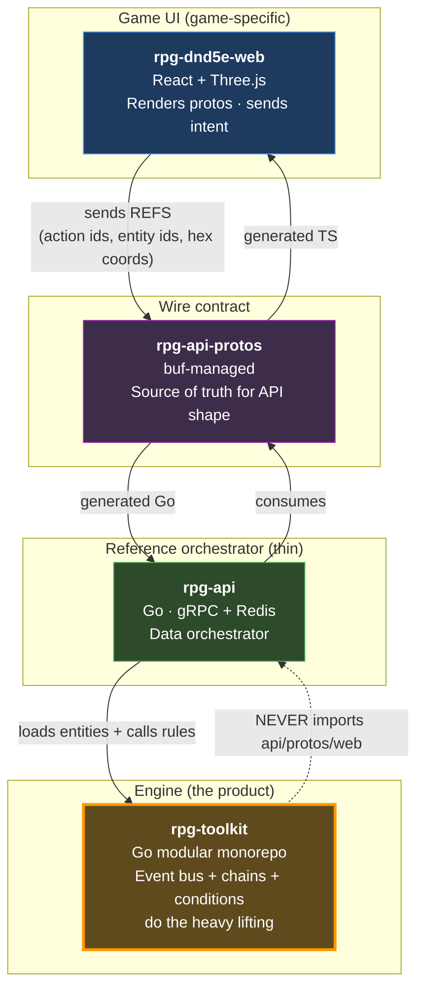
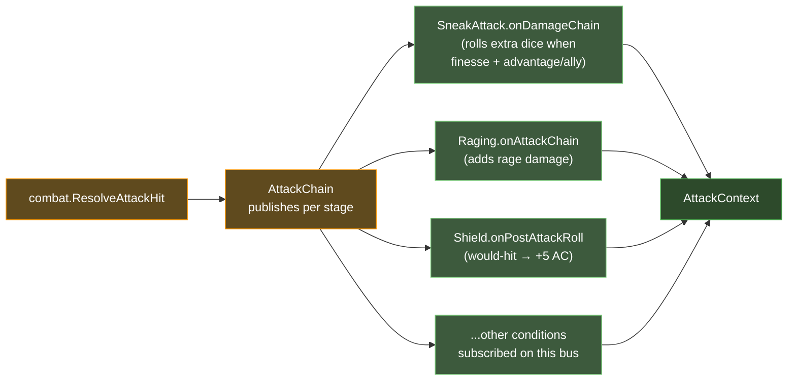
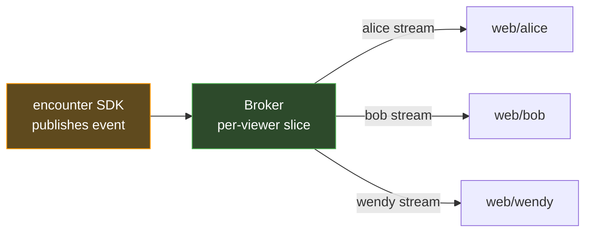

# System architecture

> **What this is**: the cross-repo platform architecture. Per-repo details live in each repo's own `docs/architecture/` so PR review enforces freshness.
>
> **Read this first** to ground on layer responsibilities and what crosses each boundary. Per-repo deep-dives linked at the bottom.

## The platform shape (this is the load-bearing framing)



**rpg-toolkit is the product.** It's the generic rules engine. Anyone building a different D&D-like game (or a different ruleset entirely) could host the toolkit through their own orchestrator + UI. The toolkit's API surface is the load-bearing thing.

**rpg-api is a thin reference orchestrator.** It's "how to wire toolkit to gRPC + Redis." It should feel small. Handlers convert proto↔entity, orchestrators speak entity types, repos persist. **Toolkit does all rule computation.** When rpg-api grows complex, that's a signal the toolkit is missing something — file the toolkit issue, don't paper over it in the orchestrator.

**rpg-dnd5e-web is the game UI** — game-specific, built on the platform. Renders protos, sends intent. Knows nothing about rules.

**rpg-api-protos is the wire contract** — shape only, no logic.

See `project_toolkit_as_product` memory for the full strategic framing (Kirk's words, 2026-05-19).

## The boundary rule

```
Client sends REFERENCES (keys, ids)  -> NEVER calculations
API orchestrates by KEY              -> NEVER knows what "rage" does
Toolkit implements RULES             -> returns rich breakdowns for rendering
```

| Layer | Knows | Doesn't know | Smell when it does |
|---|---|---|---|
| **web** | proto shapes, what to render, what intent to send | game rules, calculations | client-side game logic = `feedback_no_logic_in_web` |
| **rpg-api** | feature keys/refs, data orchestration, when to call toolkit | calculations, condition predicates, "if attack ≥ AC" | switch on rule names = toolkit gap, file issue |
| **rpg-toolkit** | all D&D 5e rules + breakdowns | protos, gRPC, redis, web | importing rpg-api or protos = boundary violation |
| **rpg-api-protos** | wire shape only | implementations | logic in proto comments isn't enforced — only types are |

If you see logic in the wrong layer, **state the boundary call** (per `feedback_dont_defer_boundary_calls`) — don't surface it as a deferred design question.

## How conditions + the event bus do the heavy lifting

This is the toolkit's load-bearing pattern. Status effects (called **conditions** internally — same concept) implement the `BusEffect` interface: `Apply(bus)` subscribes to event chains, `Remove(bus)` unsubscribes.

When an attack resolves, conditions on the participants modify the outcome **through the chain**, not through special-case code in the orchestrator:



**The orchestrator (rpg-api) just `Apply()`s the right conditions to the right entities on load.** All the rule logic is inside the subscribers. Adding a new feature (Counterspell, Cutting Words, Sentinel) is "add a new condition that subscribes to the right chain" — no orchestrator code changes.

This is what Kirk means by "the game server should be simple to implement." The complexity lives where it belongs: in the toolkit's domain-specific code, not scattered across the orchestrator.

## What crosses each boundary

### web → protos → api (player intent)

Player intent flows down as proto messages. Web NEVER computes rule outcomes; it sends references and the server returns the truth.

Today's RPCs (v1alpha2 EncounterService):
- `MoveEntity({encounter_id, entity_id, path: [Hex...]})`
- `TakeAction({encounter_id, entity_id, action_ref, target_id})`
- `SetReactionReady({encounter_id, entity_id, reaction_ref, ready})`
- `SubmitCheck({encounter_id, player_id, roll, take_reaction})`
- `Interact`, `EndTurn`, `CreateEncounter`, `GetEncounter`, `StreamEncounter`

### api → web (per-viewer stream events)

Server pushes state changes as a stream. Each event is **per-viewer-projected** — the server slices visibility before sending so the web never sees what its player shouldn't.



### api ↔ toolkit (rule calls)

rpg-api calls toolkit functions with entity types. Toolkit returns rich breakdowns. NEVER vice versa.

| Examples |
|---|
| `combat.ResolveAttackHit(ctx, input)` → `*AttackContext` (phase 1) |
| `combat.ApplyAttackOutcome(ctx, input)` → `*AttackResult` (phase 2) |
| `character.LoadFromData(data, bus)` → `*Character` (rehydration) |
| `encounter.New(id, broker)` → `*Encounter` (construction) |
| `encounter.TakeActionPhased(...)` → `TakeActionOutcome{Resolved | Reactions}` |
| `gamectx.WithRoom(ctx, room)` → context layering (chain handlers query via gamectx) |

### api ↔ redis (persistence)

rpg-api owns the storage boundary. Every encounter / character round-trips through JSON via toolkit's `ToData` / `LoadFromData`.

| Key shape | Contents | Lifecycle |
|---|---|---|
| `enc:v2:<encounter_id>` | `encounter.Data` JSON envelope | 24h TTL, mutated on every state change |
| `character:char-<name>` | `character.Data` JSON envelope wrapped in `{data: {...}}` | persistent, mutated on attacks (UsedThisTurn, HP, spell slots) |
| `character:player:<player_id>` | SADD set of character IDs the player owns | persistent |

**Critical persistence rule**: many runtime fields (event subscriptions, computed indexes) DON'T round-trip. The `Data` struct is what survives. Anything that must persist across RPCs MUST be in `Data` + `ToJSON` + `loadJSON` AND rpg-api must call `ToData()` to write back after mutation. This is the bug class that surfaced as B10 in Wave 2.11d (SpellSlots was dropped in LoadFromData — fixed in rpg-toolkit#660).

## Vocabulary (canonical terms used in code + docs)

| Term | Meaning |
|---|---|
| **Game server** | rpg-api |
| **Toolkit / Rulebook** | rpg-toolkit (specifically `rulebooks/dnd5e` for D&D rules) |
| **The web** | rpg-dnd5e-web |
| **Activate** | Player-initiated action with resource cost (Rage.Activate consumes a use) |
| **Apply** | Subscribe to event bus for passive/ongoing effects (RagingCondition.Apply listens for damage) |
| **Chain** | Staged modifier pipeline (base → features → conditions → equipment → final) |
| **Feature** | A `core.Action` that can be activated (costs resources, does something) |
| **Condition** | An applied effect that listens on the event bus (modifies chains passively). Called "status effects" in player-facing terms. |
| **Reference / Ref** | A key like `dnd5e:features:rage` — client sends these, never behavior |

## Per-repo deep-dives (authoritative — kept current by PR review in each repo)

- **rpg-toolkit**: see `docs/architecture/overview.md` + `docs/architecture/components/` for module map + per-module surface
- **rpg-api**: see `docs/architecture/overview.md` + `docs/architecture/components/` for handler/orchestrator/repo split + per-component docs
- **rpg-dnd5e-web**: see `docs/architecture/overview.md` + `docs/architecture/components/` for src tree + key components
- **rpg-api-protos**: see `docs/architecture/overview.md` (or buf.build/kirkdiggler/rpg-api-protos) for proto structure + versioning

If a per-repo overview.md doesn't exist yet (or has gaps), the team-member for that repo owns adding it as part of their next wave's close-the-loop.

## Per-wave sequence diagrams

Inherently cross-repo (a wave's flow spans web → api → toolkit → redis), so they live here, NOT in any single repo.

- [wave-2-11d.md](./diagrams/wave-2-11d.md) — reaction surface (Shield/OA conditions, two-phase orchestration, readiness toggle)

When a wave ships, close-the-loop step 7 includes adding the wave's sequence diagram to `diagrams/`. The trade-off: cross-repo content can't be enforced by per-repo PR review; only the close-the-loop discipline keeps it current.

## What waves change next

- **Wave 2.11e** ([tracker #50](https://github.com/KirkDiggler/rpg-project/issues/50)) — Active: completes the reaction surface. MovementResolver SDK extension so OA fires on player movement; CompleteTakeAction symmetry so Shield resume works against NPC attackers; multi-reactor aggregation when 2nd post-hit reaction ships; broadened registry for ability-score-dependent reactions.
- **Wave 2.11f** — Proposed: AvailableAction enumeration + class-action surfacing in the harness (Flurry of Blows, fighting-style indicators).
- **Wave 2.12** — Sketched: multi-room dungeon flow (doors as room transitions, encounter-ended unlocks next room).

## Doc-freshness ownership

| Doc | Lives in | Updated by |
|---|---|---|
| This file (cross-repo system overview) | rpg-project | director conversation as part of close-the-loop step 7 when boundaries/topology shift |
| `<repo>/docs/architecture/overview.md` (per-repo) | each repo | PR in that repo — review enforces freshness |
| `<repo>/docs/architecture/components/<name>.md` | each repo | PR in that repo that touches the component — `feedback_toolkit_docs_close_the_loop` |
| `diagrams/wave-N.md` (per-wave) | rpg-project | wave close-the-loop chore |

Updated 2026-05-19 (post-Wave-2.11d close-the-loop, restructured to reflect toolkit-as-product framing).
