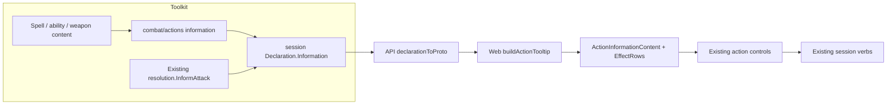

# Action information

[Tracking issue #543](https://github.com/KirkDiggler/rpg-project/issues/543) · [Design law](design.md) · [Base action damage](base-action-damage.md) · [Delivery to the game](delivery.md) · [Target-hover plan](target-hover-plan.md) · [UI implementation plan](ui-implementation-plan.md) · [Provider handoff plan](implementation-plan.md)

This extends the existing offered-action inspection, not the game's action engine. An action explains itself before the player commits: what it does, its assembled base facts, and then the contextual effects that bear on it. The same read-only rendering is shared by the hover card and pinned information panel. The UI owns consumption only; toolkit and API own the facts and their delivery, and gameplay repairs stay with their owning teams (R8).

## Component shape

## Ownership and contracts

| Component | Owns | Input → output |
|---|---|---|
| Rulebook content | Authored descriptions and option explanations | Existing spell data and ability descriptions → action/option metadata |
| `combat/actions` | Read-only base information from the assembled definition | `DescribeInput` → `DescribeOutput.Information` with description and ordered detail lines |
| Shared base-damage ability policy | Whether the declared ability contributes before effects | Modifier and off-hand fact → inclusion answer used by both inspection and execution |
| `session` | Current offer projection and identity | Compiled offer → seam-owned `Declaration.Information`; option description copied with ID/label |
| API/protos | Transport and presence | SDK information → `ActionInformation` / `ActionInformationDetail`; `CastOption.description` |
| Web | Order, typography and accessible read-only access | Current declaration → `ActionTooltip` → `ActionInformationContent` |
| Existing effect assessment | Contextual rule answers | Observed action/target context → existing effect rows and target overrides |

The content owner does not infer execution eligibility from its prose. Session does not calculate damage or author descriptions. API does not interpret information lines. Web does not recognize spell names to explain them, calculate damage, or use metadata as permission to act. Inspection does not call execution.

## Walk a warhammer through

`weaponattack.Assemble` receives the actual weapon and wielder and returns an `actions.Definition`. Its attack profile declares the chosen grip's dice, damage type and ability evidence. The information projection formats those declared facts without rolling or adding contextual contributions. The shared damage-ability policy keeps an off-hand attack's omitted positive modifier out of both the base display and the base execution components (R3).

Session carries that result beside the declaration's unchanged selector and effect rows. API copies the values. The web prints the description, then the supplied base-damage line, then `EffectRows`. A Rage row can explain its contribution without the client converting the base line into a new total (R1, R4).

Bane follows the same route for its description, sourced from `spells.GetData`. Its description explains the curse it can cause; it does not mint a contextual effect merely to fill an empty effects section.

While a member-targeted action is selected, the canvas's existing hover identity
reaches `MapFirstTargeting`. A unique current candidate supplies its actor-row
answers through `effectLinesFor` and its separate held rows through
`heldEffectLinesFor`. The preview stays open while the pointer travels into it
and owns its scrolling/click input, so reading cannot click through to the map.
It does not select or execute an action; explicit Info controls still open the
full reader. These are two access paths to the same received data, not another rule
assessment or an all-conditions query (R9).

## Separations that look like one thing

| Query | Source of truth |
|---|---|
| What does this action do? | Rulebook description |
| What base damage does this assembled attack declare? | Assembled attack and shared base-damage policy |
| Which effects bear on this action now? | Existing effect assessment |
| Can this action or target be selected now? | Declaration/candidate availability |
| What actually happened? | Existing execution result and story |

A description of a potential consequence is not proof that the consequence applies now. Likewise an empty effects list does not prove an action does nothing (R4).

## Trade-offs

| Decision | Benefit | Cost / boundary | Not taken |
|---|---|---|---|
| Information rides the current offer | One identity and freshness lifecycle | Provider projects metadata with offers | Separate inspection request |
| Provider-authored label/value details | UI displays new facts without implementing rules | Provider owns useful copy and formatting | Browser calculation from weapon names |
| Reuse content descriptions | Creation and combat explain the same content | Content authors maintain accurate build-specific prose | Parallel web description catalogue |
| Share base-damage inclusion policy | Inspection cannot invent an off-hand rule | Root and resolution release units both adopt the helper | Duplicate conditional in a tooltip compiler |

## Edges

This changes no gameplay capability, no effect applicability rules, and no target-knowledge policy. It does not add item-use offers, unseen-target information or a damage prediction (R3–R6). Catalogue browsing remains a separate read; only the offered action's content travels with its live declaration.

## Where a change lands

A better spell explanation changes the existing spell content. A new choice explanation changes its option's content. A new kind of base fact changes the toolkit information projection; its text can cross the established detail-line contract unchanged. A new applicability rule belongs to the existing effects design, not the description renderer.

## Source map

| Concern | Path |
|---|---|
| Spell description | `rpg-toolkit/rulebooks/dnd5e/spells/data.go`, `cast.go` |
| Ability projection | `rpg-toolkit/rulebooks/dnd5e/character/action_economy.go`, `action_economy_types.go` |
| Assembled attack | `rpg-toolkit/rulebooks/dnd5e/combat/weaponattack/weaponattack.go` |
| Information projection (new) | `rpg-toolkit/rulebooks/dnd5e/combat/actions/information.go` |
| Effect information | `rpg-toolkit/rulebooks/dnd5e/session/effects.go`, `resolution/inform.go` |
| Selector boundary | `rpg-toolkit/rulebooks/dnd5e/session/declaration_id.go` |
| Wire | `rpg-api-protos/dnd5e/api/session/v1alpha1/types.proto` |
| API projection | `rpg-api/internal/handlers/dnd5e/session/v1alpha1/convert.go` |
| Shared information body (new) | `rpg-dnd5e-web/src/components/session/combat-experience/ActionInformationContent.tsx` |
