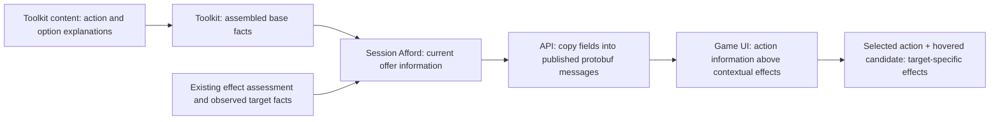

# From the information preview to the game

Tracking: [project#543](https://github.com/KirkDiggler/rpg-project/issues/543).
Contract: [design.md](design.md). This is the delivery map and acceptance record,
not a second rulebook or a change to team ownership.

## What is already in place

As of 2026-10-09:

| Piece | Evidence | What it does not prove |
|---|---|---|
| Wire contract | Protos#384 merged; generated v0.1.230 | A server populating the fields |
| UI consumer and concept | Web#1238 merged to dev as `8ab7a11b` | Live provider delivery or a production release |
| Effect rows and target-specific answers | Existing `Declaration.effects`, `TargetCandidate.effects`, `TargetCandidate.held_effects` | A general inspection of every condition a creature holds |
| Root toolkit foundation | Draft toolkit#1985 at `f68a3389` | Finished ability/option coverage, session projection or consumer adoption |

**No additional proto change is currently needed** for either descriptions or
selected-action target-hover effects. The published shape already carries both.
A new requirement that cannot be expressed by these fields must be identified
with an example before expanding the contract.

The preview renders generated fixtures through real UI components. It is useful
consumer evidence, not evidence that the current API returns those fixture facts.

## Remaining owners and deliverables

| Owner | Work | Existing record |
|---|---|---|
| Toolkit content / root dnd5e module | Complete descriptions for offered abilities/features and nested choices; reuse spell catalogue text; project base damage from the assembled weapon/grip/ability, not an inventory guess | [Toolkit#1987](https://github.com/KirkDiggler/rpg-toolkit/issues/1987), foundation draft#1985 |
| Toolkit resolution | Share the base-damage inclusion policy with execution; retain option explanations through frozen choices; do not combine contextual contributions into a predicted total | Toolkit#1987, original plan T4 |
| Toolkit session | Carry seam-owned action information and option descriptions on current offers, including unavailable compiled offers; preserve effect rows/candidate answers; exclude presentation text from selector serialization | Toolkit#1987, original plan T5 |
| API | Adopt real provider SDK versions and project information/options field-for-field; no game descriptions, calculations or rule lookup table in the server adapter | [API#1084](https://github.com/KirkDiggler/rpg-api/issues/1084) |
| UI | Open a read-only effect preview on a current candidate's hover/focus, using the already supplied target answers; keep explicit full inspection, selection and confirmation separate | [Target-hover plan](target-hover-plan.md) |
| Integration | Run the real provider-backed stack and verify the same facts from Afford response to rendered cards and reload | Project#543; stays open until this proof exists |

Toolkit module PRs follow their own release-unit boundaries. The earlier
[implementation plan](implementation-plan.md) T3–T6 supplies the detailed provider
handoffs. It is **not authorization for this UI session to implement those
owners' work**. Patient Defense remains separately filed in toolkit#1986.

## What the data must say

| Player question | Source | UI behavior |
|---|---|---|
| What does Bane or Dodge do? | `Declaration.information.description` | Read the authored explanation, even with zero contextual effects |
| What base damage does this Warhammer declare? | Ordered `information.details` from its assembled definition | Show the supplied dice/ability/type facts; do not add Rage or other effects into a total |
| What does a cast option do? | `CastOption.description` | Explain before selection; send only the original option ID |
| Which of my effects apply against this target? | Declaration effect rows, with that candidate's ID-matched answers | Replace state/reason/benefit for that target; retain the row's description and participation |
| What effects on that target matter here? | That candidate's `held_effects` | Render separately, never merge into the actor's list |
| Why can't I choose it? | Offer/candidate availability and provider refusal | Display the supplied reason; information does not authorize an action |

An empty target effect list is not a claim that the creature has no conditions.
Only provider-supplied, observer-permitted information is shown. Hidden armour,
resistances, unseen holdings, hit chances and damage predictions are not added.

## Target hover in the game

With a member-targeted action selected, hovering a **unique current candidate**
shows its effect answers immediately. Mouse/pen hover and target-list keyboard
focus inspect; they do not pick, confirm, cast or attack. Selected targets remain
unchanged. Non-candidates and ambiguous candidate IDs do not supply information.

The last target preview remains readable when the pointer leaves the map for the
HUD. Hovering another candidate replaces it. The automatic preview is
pointer-transparent so it cannot intercept a click intended for the map.
Existing **Inspect target / Info / selected-target inspection** controls open the
full interactive, scrollable action-information card. Explicit full inspection
stays on its named target until closed or explicitly changed. Close/Escape
dismisses information without cancelling the action or changing its picks.

The automatic peek prioritizes observed target-held rows, then the actor's
target-specific answers: the target name and current action identify what those
answers are about. It stays out of the way while other dock controls are being
inspected. Full inspection keeps the
agreed description/base-facts-before-effects layout. Stale information is labelled;
a candidate withdrawal or action change cannot leave another target's old rows
on screen. Compact targeting already has its own target-effect path; preserve it.

## Development and release order

1. UI target-hover work proceeds against the existing generated contract and
   effect rows; no backend repair or speculative wire addition is needed.
2. Toolkit owners complete/push their module work. Dependent Go modules develop
   against those pushed commits using real pseudo-versions, never local replaces.
3. API owners adopt the SDK and test actual Afford conversion. Bring up an
   isolated stack using its normal committed dependencies and this web consumer.
4. Walk the acceptance scenarios below before claiming the feature reaches the
   game. A fixture screenshot does not replace this gate.
5. After operator authorization, merge/release toolkit providers inside-out,
   adopt CI-published tags in dependent modules and API, then reverify the joined
   stack. The already-merged UI consumer can read the optional data when supplied.
6. A release to production is a separate operator-controlled action. Merging the
   UI to dev is not proof of deployment or full feature availability.

## Acceptance: what someone can observe

- Real Afford delivers Bane and Dodge explanations; the game shows them with
  zero contextual effect rows. Missing data remains explicit rather than invented.
- Warhammer's displayed base facts match the assembled grip/ability. Its effects
  appear underneath without a combined roll/damage prediction.
- Hover target A then B: each shows its own provider answers, including applying,
  non-applying, dependent and unavailable rows. Target-held effects stay separate.
- Hover/focus/full inspection produce no gameplay RPC and change no selected IDs.
  Multi-target casting still requires its existing explicit confirmation.
- Unavailable candidates remain inspectable where supplied; withdrawn,
  non-candidate or duplicate IDs cannot leave misleading rows behind.
- Option explanations appear before commitment; the exact original ID is sent.
- Fresh responses/reload replace information without borrowing another action's
  rows. Description-only edits do not change provider selectors.
- Desktop, short frames, keyboard and touch retain bounded, readable information
  and existing map/selection behavior.

The remaining optional legacy-inline-tooltip blank-cell DOM assertion from
web#1238's review can accompany the joined integration tests; it is not a gameplay
or provider repair and does not block the completed UI consumer.
