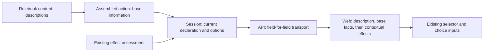

# Action information

## Shape

## Law

- **R1 — One inspection.** An offered action's description and base facts precede its contextual effects in the same inspection. An empty effects list does not hide the action's own information.
- **R2 — Content ownership.** Descriptions are authored with rulebook content and reused across catalogue and live presentation. Session, API and web contain no replacement description table.
- **R3 — Base facts.** Weapon information describes the assembled attack, including its grip, damage pools and participating ability contribution. It is not copied from an unrelated equipment catalogue. Additional contextual effects remain separate; inspection produces no rolled result or combined total.
- **R4 — Meaning of effects.** The existing effect-assessment contract governs applicability, permitted knowledge, target answers, participation and absence. The result an action can cause is description content, not a fabricated contextual effect row.
- **R5 — Every choice.** Offered gameplay actions and their nested options carry explanations. Unavailable offers remain inspectable. Missing information is identified as missing, never synthesized from an identity or interpreted as an action with no consequences.
- **R6 — Reading is inert.** Hover, keyboard and touch inspection do not select, submit, spend, roll or change gameplay state. Existing activation and targeting behavior remains authoritative.
- **R7 — One current offer.** Live information shares the declaration's identity and refresh lifecycle. Presentation text is not selector material and does not change availability. A selected target's effect answers are used only for that same declaration; unrelated inspections never borrow them.

## Rulings

| ID | status | scope | ruled by | date |
|---|---|---|---|---|
| R1 | settled | Base action information with contextual effects directly below | KirkDiggler | 2026-10-08 |
| R2 | settled | Provider-owned descriptions, no frontend rulebook | KirkDiggler | 2026-10-08 |
| R3 | settled | Warhammer-style base damage information without folding contextual effects | KirkDiggler | 2026-10-08 |
| R4 | settled | Descriptions and effects answer different questions | KirkDiggler | 2026-10-08 |
| R5 | settled | Explain offered actions and nested choices, including unavailable choices | KirkDiggler | 2026-10-08 |
| R6 | settled | Preserve existing gameplay interaction and accessible inspection | KirkDiggler | 2026-10-08 |
| R7 | settled | Preserve provider identity, authority and contextual scope | KirkDiggler | 2026-10-08 |

## Open

- **Patient Defense scope:** include a repair of its underlying condition delivery in this wave, or describe its current limitation without changing behavior? The provider case is [toolkit#1986](https://github.com/KirkDiggler/rpg-toolkit/issues/1986); no repair or eligibility change is authorized yet.

New gameplay, expanded effect applicability, roll prediction and new item-use capabilities otherwise remain outside this change.
