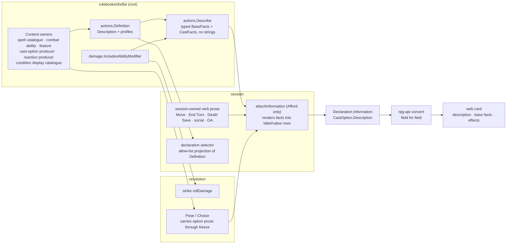

# Action information — provider

The provider half of [action information](design.md): how the toolkit and API
supply what the game's card reads. Plan: [provider slices](provider-slices.md).
Rulings continue the folder's numbering; R1–R9 live in [design.md](design.md).

## Shape

## Law

- **R10 — Facts are typed below the projection.** The root states an action's base facts as typed values. No root or resolution code formats a display string for them. Session renders each fact into one wire `label/value` row; API and web copy it and never re-derive it.
- **R10 — One inclusion answer.** Whether an ability modifier joins base damage has exactly one implementation, `damage.IncludesAbilityModifier`. `actions.Describe` and strike damage both ask it; neither keeps its own conditional.
- **R10 — Facts state, the projection filters.** A fact the projection does not show is still stated below it: a non-participating modifier is a fact with `Participates == false`, not an absent field.
- **R14 — Cast facts are stated.** A cast states, as typed facts: its save abilities, DC and what success buys (negated or half), its damage pools, the conditions it applies by ref with whether a failed save gates them, healing, range, targets, area and concentration. A DC is stated as a number only when its source is static; otherwise it is stated unknown, never guessed.
- **R14 — A condition's prose is its owner's.** An applied condition is named and explained from the condition display catalogue (`conditions.DisplayFor`), never by the spell or session. A condition without catalogue detail is shown by name alone.
- **R11 — The selector is an allow-list.** A declaration ID hashes an explicit mechanical projection of the definition. A field reaches the selector only by being written into that projection. Prose fields are never in it.
- **R11 — Every field is classified.** Each field in the definition's type tree is classified as mechanical or prose by a test. An unclassified field fails the build, so a new mechanical field cannot silently escape identity and new prose cannot silently enter it.
- **R12 — Prose lives with its noun's owner.** A spell's description comes from the spell catalogue. An ability's comes from its combat ability or feature. A choice's comes from the producer that declares the option. A reaction's comes from the condition or feature that offers it. Session authors prose only for the verbs it owns and the opportunity attack it names.
- **One attach point.** Information is attached in `Afford` alone, beside effect rows. No execution path computes or reads it, and it never changes `Available`, `Why`, `ID`, `Candidates` or `Effects`.
- **Absent stays absent.** An empty description stays empty and no facts means no detail rows. Nothing is synthesised from a ref, an ID or a name. A declaration with neither carries no information.
- **Prose survives a freeze, mechanics resume.** Option and offer prose rides frozen payloads and window payloads unchanged. Resuming a frozen action reads only its frozen mechanics.
- **The wire is fixed.** `Declaration.information` and `CastOption.description` carry everything. No proto change, new RPC or stream event is part of this work.

## Rulings

| ID | status | scope | ruled by | date |
|---|---|---|---|---|
| R10 | settled | Root exposes typed base facts; session renders the wire's label/value rows; wire unchanged | KirkDiggler | 2026-10-09 |
| R11 | settled | Declaration selector hashes an explicit allow-list projection of the definition; prose never reaches it | KirkDiggler | 2026-10-09 |
| R12 | settled | Session owns prose for session-owned verbs; the root's basic-action information does not ship | KirkDiggler | 2026-10-09 |
| R13 | settled | Draft toolkit#1985 is the root base, merged forward from main; one nearest-go.mod module per PR; dependents pin only gate-approved heads; no behaviour or wire change beyond the additive information fields; Patient Defense (toolkit#1986) untouched | KirkDiggler | 2026-10-09 |
| R14 | settled | Cast facts stated now: save abilities, DC, success outcome, damage, applied conditions by ref, healing, range, targets, area, concentration; condition prose from its owner; absent stays absent | KirkDiggler | 2026-10-09 |
| R15 | settled | Display names already in selector material stay there: `Definition.Name`, `CastOption.Label`, `MembershipName`, `contributions.Source.Name`/`Label`; every existing golden stays byte-identical; a selector-version bump waits for a use case. Any field named `*Description` is prose by guard | KirkDiggler | 2026-10-09 |
| R16 | settled | A feature whose code does not deliver its benefit returns an empty description: Patient Defense (toolkit#1986) and Deflect Missiles (toolkit#1992); the test names the allowed empties with their issues | KirkDiggler | 2026-10-09 |
| R17 | settled | Session reads `saves` TYPES and CONSTANTS to project a fact; the boundary test refuses any call through the saves import; string stand-ins for constants are refused | KirkDiggler (platform ruling) | 2026-10-09 |

## Open

None. O1–O3 are settled as R14–R16.
