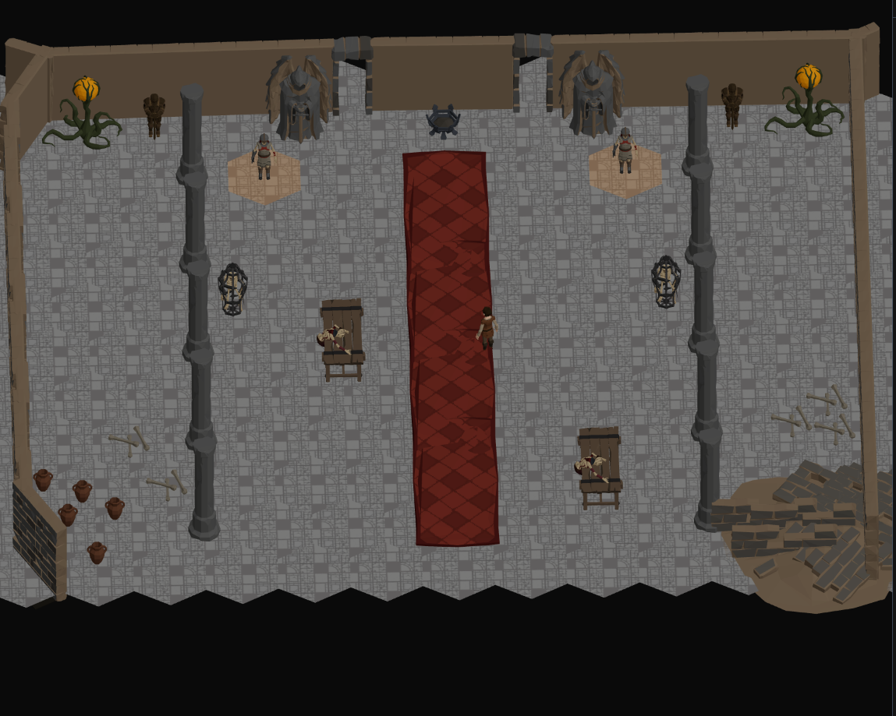

# Archetype-driven crypt shell — design

*Issue: rpg-project#284 · Parent journey: rpg-project#169 · Team: Assets*

## Outcome

Raise the dungeon’s environmental quality by making `archetype: crypt` select
one coherent floor-and-wall shell in both the dungeon builder’s 3D preview and
the playable session.

The first version deliberately supports one effective archetype for the whole
dungeon. It does not add floor or wall pickers. A crypt gets its complete
approved treatment automatically; topology, movement, sight, doors, authored
wall height, and YAML remain mechanics-owned facts exactly as they are today.

The visual target is an **intact worked crypt**: calm continuous flagstone,
finished two-sided masonry, coherent bases and caps, and architecture that lets
rubble, bones, ritual pieces, and other props carry localized decay.



The current props read as authored objects, but the shell does not yet match
them:

- the floor resets the same texture coordinates on every hex and repeats the
  texture twice inside each cell, producing a dense patchwork;
- wall runs repeat and non-uniformly fit one half-wall GLB, with a placeholder
  floor-skirt box and no finished cap treatment;
- the Synty wall piece has a finished front and an unfinished back, so a free
  camera exposes the wrong side of roughly half the possible views
  (rpg-dnd5e-web#791);
- `AtlasRegion.archetype` reaches the client but does not currently select the
  shared floor and wall presentation.

## Decisions

1. **One effective archetype per dungeon for version one.** The existing wire
   remains region-shaped for the future, but the first resolver activates a
   profile only when every atlas region names the same known archetype.
2. **`crypt` selects the whole shell.** There are no individual floor texture,
   wall family, random-variant, or per-region presentation controls.
3. **Continuous masonry, invisible permanent hexes.** Hexes remain the
   mechanical and rendering cells; their floor UVs share one absolute world
   frame so the stonework crosses cell boundaries. Movement, targeting, and
   authoring overlays reveal the grid when needed.
4. **Intact architecture first.** The base profile has no random broken or
   alcove wall pieces and no rune/ornate floor plates. Damage remains localized
   dressing.
5. **True two-sided walls.** Every wall body has two finished masonry faces
   with correct geometry, normals, UVs, and materials. `THREE.DoubleSide` is not
   a substitute for an authored back face.
6. **Provider owns visual truth.** Exact source selection, derivative source,
   artifact bytes, calibration, hashes, bounds, provenance, and evidence live
   in private `rpg-game-assets`. The web consumes the generated runtime
   profile; it does not repair a bad wall or hardcode private calibration.
7. **Builder and game share the same resolver and leaves.** No builder-only
   floor, wall, profile, or artifact URL exists.
8. **Atomic profile or atomic fallback.** A missing, invalid, mixed, or unknown
   profile renders the complete legacy shell, never a new floor with old walls
   or the reverse. The builder names why it fell back.
9. **Lighting remains separate.** The floor keeps the established unlit,
   `toneMapped={false}` material path. Region-authored lighting is the next
   fidelity lane under journey #169, not hidden inside this shell slice.
10. **Rug overlay occlusion remains separate.** Movement markers currently sit
    below the approved rug; rpg-dnd5e-web#823 owns that shared overlay-depth
    defect and does not block this work.

## Existing asset inventory and ownership

The licensed asset flow has three distinct layers:

- Original archives remain outside Git, currently including
  `POLYGON_Dungeon_Pack_SourceFiles_v3.zip` and
  `POLYGON_Dungeons_Map_SourceFiles_v2.zip` under the operator’s Downloads.
- Complete converted private libraries live in
  `rpg-game-assets/library/polygon-dungeon/` (814 GLBs) and
  `library/polygon-dungeons-map/` (57 GLBs).
- The reviewed runtime subset lives under
  `rpg-game-assets/harness/models/synty/` and is mirrored by the web sync into
  its gitignored `public/models/synty/` tree.

The Dungeons Map pack is primarily supplemental book, tomb, and library
dressing. The main Dungeon pack contains the broad shell inventory: floor
textures and plates, full/half/textured/double-sided wall families, trims,
frames, corners, caves, ceilings, entrances, and structural pieces.

The first provider task is a bounded visual audition from those existing
private libraries. It compares the current promoted floor texture families and
suitable full/textured/double-sided wall, trim, and door-frame candidates at
real tactical scale. Kirk’s selected treatment becomes the one profile. Source
filenames are candidates, not consumer authority; only the approved generated
profile is authoritative.

## Runtime profile contract

`rpg-game-assets` generates a consumer-safe manifest at:

```text
harness/models/synty/env/shell-profiles.json
```

It is part of the private runtime tree synced into the web’s ignored static
asset directory. The web repository commits the schema/parser and tests, but
never licensed GLBs, source files, or a copied private manifest.

The version-one schema is equivalent to:

```ts
type Sha256 = string; // exactly 64 lowercase hexadecimal characters
type Vec3 = readonly [number, number, number];
type MeasuredBounds = { min: Vec3; max: Vec3 };

type ShellProfilesV1 = {
  schemaVersion: 1;
  profiles: {
    crypt: {
      floor: {
        diffuse: `textures/${string}.png`;
        sha256: Sha256;
        worldUnitsPerRepeat: number;
      };
      wall: {
        body: {
          file: `env/${string}.glb`;
          sha256: Sha256;
          localSpanAxis: '+X';
          localFaceAxis: 'Z';
          twoSided: true;
          bounds: MeasuredBounds;
        };
        base: { file: `env/${string}.glb`; sha256: Sha256; bounds: MeasuredBounds };
        cap: { file: `env/${string}.glb`; sha256: Sha256; bounds: MeasuredBounds };
        doorSurround: {
          file: `env/${string}.glb`;
          sha256: Sha256;
          bounds: MeasuredBounds;
        };
      };
    };
  };
};
```

The provider generator writes every exact approved path, measured value, and
digest and rejects any absent value. `worldUnitsPerRepeat` is the selected
floor’s measured visual calibration, not a consumer-side tuning knob.

Provider validation enforces:

- one immutable profile key and schema version;
- path containment under the licensed runtime root;
- exact file presence, size, and SHA-256 against the complete promoted
  inventory;
- finite measured bounds and declared local axes;
- compatible body/base/cap spans and floor contact;
- textured triangles with outward normals on both `+localFaceAxis` and
  `-localFaceAxis` for every wall body;
- deterministic generated bytes;
- checked-in private source provenance and required visual evidence.

A structural two-face result is necessary but not sufficient: front and back
renders are mandatory because a geometrically present face can still carry an
unfinished material.

## Profile resolution and shared rendering

The client validates the runtime manifest once and resolves an atlas using a
pure shared rule:

1. an atlas with no regions returns `no-regions`;
2. trim every region’s `archetype`; any empty or unrecognized value returns
   `unknown-archetype`;
3. exactly one distinct recognized value returns that complete immutable
   profile; more than one returns `mixed-archetypes`;
4. manifest load/schema failures return `manifest-unavailable` or
   `invalid-profile`;
5. every fallback selects the complete legacy floor and wall pair.

No server validation is added. The wire intentionally remains capable of mixed
region archetypes later. Version one simply declines to partially render a
shape it does not yet support.

`buildScene3D` carries the atlas archetype set beside its existing floor tiles,
wall runs, door gaps, and props. One shared shell component resolves the
profile and draws:

- the existing `SyntyHexFloor` leaf with profile floor inputs;
- the existing `AtlasWalls`/wall-run leaf with profile wall inputs.

Both `DungeonPreview3D` and `SessionCanvas` mount that same component. Props,
lights, camera, facing, offsets, and artifact URLs remain on their existing
shared paths.

Profile loading is one Suspense/error boundary. It waits for the complete
profile and its required shell resources; an error activates the complete
legacy shell. A failed wall body never leaves a themed floor standing alone.
The builder displays the named fallback reason. The playable route remains
usable and does not expose a developer diagnostic as game content.

## Floor presentation

The floor keeps one mesh per known cell. That preserves current fog, memory,
selection, and interaction behavior and avoids inventing a polygon-union or
large-plate clipping system.

The change is the UV frame. For each floor vertex:

```text
u = absoluteWorldX / profile.floor.worldUnitsPerRepeat
v = absoluteWorldZ / profile.floor.worldUnitsPerRepeat
```

The texture uses repeat wrapping. Absolute world origin is the anchor, so
adding or removing a distant cell never shifts existing stonework and the same
dungeon renders identically after reopen or reconnect. Negative world
coordinates are valid through repeat wrapping.

Consequences:

- adjacent cells evaluate the same UV at their shared world edge;
- the texture no longer restarts inside every hex;
- the selected scale can place larger stones across cell boundaries;
- no random per-cell rotation can break continuity;
- remembered/fogged cells may still change material color while retaining the
  same masonry alignment.

Version one has one diffuse treatment. It does not consume normal/mask maps,
random colorways, modeled square floor plates, ornate tiles, runes, cracks, or
procedural damage. Those can join a later profile without changing this world-
space contract.

`DUNGEON_SURFACE_Y = 0.2`, zero floor extrusion, prop grounding, and tactical
overlay heights do not change in this slice.

## Wall presentation

Authored edges and the existing canonical, order-independent wall-run engine
remain the sole geometry authority. The profile changes how each derived run
is dressed, not which walls exist.

### Wall body

The approved body is tiled along each run through the existing residual-width
strategy: choose a stable piece count and distribute the exact run length
across those pieces instead of creating a tiny last sliver. Profile bounds and
pivot calibration replace hardcoded measurements.

The body fills the run’s effective height. Existing standard height, authored
height multipliers, and optional cutaway calculation still produce that
height. Non-uniform scale remains geometry-baked with corrected normals through
the shared GLB primitive; visual approval must prove that the selected body
tolerates the required fit.

The body must be true two-sided geometry. No runtime duplicate-backface trick,
material-side override, or orientation choice is allowed to hide an unfinished
back. A camera orbit and a partition between two playable spaces must both show
finished masonry.

### Base and top

The base and cap are separate profile pieces because stretching one composite
wall would distort them whenever authored wall height changes.

- Base remains registered to `DUNGEON_SURFACE_Y` and overlays the body at the
  floor joint.
- Cap remains at the final effective wall height and overlays the body at the
  top joint.
- Neither trim’s own vertical thickness is multiplied by wall height.
- The current placeholder `FloorSkirtBox` is absent for an active crypt
  profile.

The selected trims must remain coherent at the optional cutaway stub height;
overlap is acceptable, missing architecture is not.

### Corners and junctions

The existing overlap-miter run extension remains the first-version corner
strategy. Body, base, and cap use the same canonical run endpoints and facing,
so they cannot derive different corners. The provider/game specimen includes:

- one straight seam;
- inside and outside turns;
- a three-run junction;
- both viewing sides.

A dedicated corner post is not introduced unless the selected family fails
that specimen. The previously investigated post-shaped Dungeon pieces are not
silently reused: their relief collapses under the wall-height fit and they have
already failed the intended role visually.

### Doors

Door state, click behavior, opening pose, gaps, and mechanics remain unchanged.
The crypt profile chooses a compatible surround registered to the same run
plane. It must meet the wall body/base/cap from both viewing sides and at
standard and raised height. There is no door style picker and no new door wire
field.

## Candidate and final visual gates

The provider slice has two human gates, both at real game scale:

1. **Candidate gate.** Compare floor texture families and viable
   full/textured/double-sided wall families in a compact shell specimen. Each
   view uses the tactical camera and includes a character for scale.
2. **Integrated gate.** Sync the exact approved provider tree into a web branch
   and capture this same dungeon in builder preview and Save & Play.

The integrated frame must include continuous open floor, a long wall, an
inside/outside corner, a junction, a closed or locked doorway, standard and
raised wall sections, props from the accepted crypt specimen wave, and a camera
angle that sees both wall faces. Kirk alone gives visual approval.

## Verification

### Provider

- candidate source and derivative provenance;
- deterministic shell-profile generation and `--check` mode;
- exact promoted inventory/path/size/SHA validation;
- measured bounds, pivots, axes, floor contact, and span compatibility;
- two-sided normal/material structural checks;
- mesh statistics and explicit warning disposition;
- neutral front/back and detail renders;
- tactical shell contact sheet and accepted-candidate ledger;
- clean web-stage verification of the complete provider tree.

### Web

- manifest parser rejects unknown fields, invalid versions, non-finite
  calibration, unsafe paths, absent required components, and false two-sided
  declarations;
- resolver tests cover uniform known, mixed, unknown, no-region, missing
  manifest, and invalid-profile cases;
- named adjacent-cell UV tests assert float-equal coordinates on their shared
  edge and stable UVs when unrelated cells are added;
- remembered and visible cells retain the same UV frame;
- wall transforms cover straight runs, residual widths, both facings, base and
  cap placement, standard/raised/cutaway heights, corners, junctions, and
  doorway alignment;
- profile-load failure renders the complete legacy pair;
- builder preview and session tests assert the same profile key, component,
  artifact paths, floor surface, wall runs, door gaps, and scene lights;
- focused renderer suites, format/lint/type/build, full `npm run ci-check`, and
  all required GitHub checks pass.

### Real-path evidence

- before/candidate/final builder frames;
- final playable frame from Save & Play;
- Save → reopen preserves the YAML and effective archetype;
- artifact URLs and provider hashes captured from the exact synced tree;
- Kirk’s candidate and integrated verdicts recorded verbatim.

## Delivery and issue reconciliation

This remains one cross-repository wave under rpg-project#284 and journey #169:

1. `rpg-game-assets`: one provider issue and PR for candidate selection,
   derivative sources if required, runtime artifacts, manifest, validation,
   provenance, and private evidence;
2. `rpg-dnd5e-web`: one consumer issue and PR for profile loading/resolution,
   continuous floor UVs, modular two-sided wall presentation, fallback, tests,
   and integrated public-safe screenshots;
3. provider merges before the web pins and consumes its exact merged tree;
4. the project design PR stays open until both slices land and the integrated
   evidence is recorded;
5. rpg-dnd5e-web#791 closes with the web slice;
6. rpg-dnd5e-web#823 remains separate;
7. journey #169 remains In Progress for authored lighting and later shell
   profiles.

## Not now

- mixed archetypes within one dungeon;
- a dungeon-level archetype wire field;
- per-floor, per-wall, per-region, or per-door visual controls;
- modeled square floor plates or merged floor geometry;
- random floor textures, random broken walls, procedural decay, runes, ornate
  plates, ceilings, caves, or additional shell profiles;
- low-wall mechanics, cover, elevation, or changes to movement/sight;
- authored lighting, shadows, VFX, or audio;
- rug/overlay layering (#823);
- new wall topology, corner identity, door mechanics, or YAML fields;
- runtime prop composition.

## Landed record

**Initially recorded 2026-08-26; finalized 2026-08-27 after web follow-up
#828 / PR #829.** The approved provider and web slices are landed; this project
record is the closeout for the implementation wave intended for
rpg-project#284 / PR #285.

### Provider

- [Issue #65](https://github.com/KirkDiggler/rpg-game-assets/issues/65) /
  [PR #68](https://github.com/KirkDiggler/rpg-game-assets/pull/68) merged as
  `f183c96d6d89ecdaf9a2f5dd2c452de485882ed3`.
- Reviewed head:
  `2facea936b47dd0a5750668be6bfa9a664bcc71d`; reviewed/merge tree:
  `46e41c26e39f0b1434e1282379bd2cad06f7fd7f`. Provider evidence commit:
  `b9eaec454bc43bbfdb284fa647ffbdef60ff8a3a`.
- Selected candidates: floor `floor-09-01-u6` at `6u`, wall
  `wall-double-01-worked`; span `+X`, up `+Y`, finished `+Z` and `-Z` faces.
- Runtime profile `harness/models/synty/env/shell-profiles.json`:
  `d02e6398b06f8b347fbe2e68d91d83bfeccd389ea412be5774d34454c2d164a7`.
- Complete inventory: 2,141 files; payload
  `fc815f39b4056b0cbbb4edf8d76b552a78c26a80a66da92e77a55d4c22c08303`; tree
  `f2935197b3c280131afc2da5ac732c0f1e82e1c7b623f2259e9a4ba148f8d57d`.
- Floor hash:
  `ec84f155a32297c64e86b8c678955e25d8f8180023327e42c840dd086916b841`.
  Artifact hashes are body
  `2216b24e5ea943841682a95c5f4a7692525be42f1cb295bf6d69df33a2e142fc`, base
  `6933008930a251aec0f27ac757611097faa15f38db06cb542e91128fa60c4f6f`, cap
  `f56b63ded7b8f8f5ca02a8824df9b9f2a2ca4052d1bf7939281b06c68c059a67`, and
  door surround
  `bd4d0a9ca3da8fcee72f8cfaf72d51040f6754920649b9e30c8c8a2e44093cc0`.
  The existing closed leaf hash is
  `c1445b4dae6a02127be15fcbd59e6f02f207de28a3461cf95a1ceba18f8d4c15`.
- Provider result: `337` passed / `20` skipped; Blender export `12/12`,
  renderer `19/19`, staging `7/7`, and combined renderer/staging `26/26`.
  The recorded commands were the full `python3 -m unittest discover -s scripts
  -p 'test_*.py'` gate, Blender export/reimport, inventory `--check`, stage
  `--verify-only`, and the six-view Blender evidence render. Inventory, profile
  byte-identity, and stage gates passed; optional Draco and Blender `use_nodes`
  warnings remained non-fatal. Kirk’s verbatim verdict was **`looks great`**.

### Web

- [Follow-up issue #828](https://github.com/KirkDiggler/rpg-dnd5e-web/issues/828) /
  [PR #829](https://github.com/KirkDiggler/rpg-dnd5e-web/pull/829) merged as
  `c38ab663a9ced71bd494035854ec67c662205f0c` with tree
  `786bc4bbff12406f9721c918c950675d3f85691e`.
- Reviewed head: `9ca2bf4d86a8a164c2b1ebe6fd54180c0f924a61`.
- Root defect/fix: geometry-derived scale plus child-local registration under
  the exact `gapStart` hinge. Across standard and raised walls and all four
  facings, left/right/top cover is at least `0.020000901`; floor contact is `0`.
  Thinness is deliberately unchanged. Kirk’s verbatim verdict: **`door is
  pretty thin but no gaps`**.
- Provider/profile/frame/leaf hashes are unchanged from the initial landing:
  profile `d02e6398b06f8b347fbe2e68d91d83bfeccd389ea412be5774d34454c2d164a7`,
  door frame `bd4d0a9ca3da8fcee72f8cfaf72d51040f6754920649b9e30c8c8a2e44093cc0`,
  and closed leaf `c1445b4dae6a02127be15fcbd59e6f02f207de28a3461cf95a1ceba18f8d4c15`.
- Focused wall/Atlas/DungeonShell suites: 21 files / 372 tests passed. Full
  `npm run test:run`: 231 files / 3,653 tests passed, one file and one test
  skipped. `npm run ci-check` passed all seven gates; all four GitHub checks
  passed (Lint and Type Check, Deploy Preview, Test, and Security Audit).
  Copilot’s one SHA typo was fixed in `9ca2bf4` and answered in its review
  reply.
- The post-fix builder, playable-game, and close-door PNGs are recorded in the
  public [evidence README](evidence/crypt-shell/README.md), all `1600×900`.

### Review disposition and next lane

PR #829’s one Copilot finding was a SHA typo; commit `9ca2bf4` corrected it and
received a reply in the review thread. The provider, profile, door-frame, and
closed-leaf hashes remain unchanged; the prior `0854...` and `b44e...` screenshots
are superseded pre-registration evidence, not current final evidence.

[rpg-dnd5e-web#828](https://github.com/KirkDiggler/rpg-dnd5e-web/issues/828)
remains **OPEN** pending the post-publication manual close. The separate
[rpg-dnd5e-web#823](https://github.com/KirkDiggler/rpg-dnd5e-web/issues/823)
remains open, and journey
[rpg-project#169](https://github.com/KirkDiggler/rpg-project/issues/169) remains
active for authored lighting; lighting is not part of this landing. No external
issues, comments, board state, or web/provider files were changed here.

The project branch started from published head `30544fc`; current `origin/main`
`f4415270ff14d6ca7ab21f6cb1b2bb79da6a688d` was merged without rebasing as
`4cb86155e3edf8a5047c8e889b2a3b52e27e7267`. This is the post-merge docs base
for the finalized landed record.
