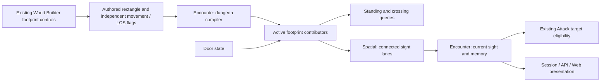

# Authored footprints and connected sight

## Shape

The existing asset-owned rectangle supplies the authored extent. Encounter
composes active contributors; spatial answers geometry queries. Current sight
feeds existing creature-target eligibility. There is no additional blocking-
geometry declaration, checkbox or physical-attack obstruction query in this
slice.

Tracking: [#506](https://github.com/KirkDiggler/rpg-project/issues/506), under
[World Builder #169](https://github.com/KirkDiggler/rpg-project/issues/169).

## Law

- **R1/R17 — Authored extent.** Width, depth, offset and the asset's existing
  placement transform define the footprint independently of visible mesh bounds.
  The compiler converts to the canonical plane once; no separate blocker store
  or asset-free authoring tool is introduced.
- **R2 — Independent declarations.** Movement and LOS flags remain independent.
  Appearance implies neither answer. A sight-only footprint does not prevent
  walking, and a movement-only footprint does not imply opacity.
- **R3/R16/R21 — Connected sight.** Existing LOS-blocking footprints obstruct
  positive-length interior crossings, including lanes beginning or ending
  inside them. Each alternate origin must be nonopaque and connected clearly
  to its original endpoint. Hard or soft obstruction disqualifies that
  connection, at either end; callback errors propagate and boolean sight
  consumers fail closed. A clear connection still permits looking around props.
- **R5/R6 — Doors and contributors.** A closed or locked footprint door
  contributes to movement and sight obstruction. Opening removes that door's
  contribution, not overlapping contributors from other assets. Static wall
  footprints must leave the intended doorway clear.
- **R8/R9/R19 — Standing and clearance.** Creatures stand at hex centers.
  Movement-footprint contact closes standing, boundary included; segment
  interior traversal closes a crossing. Authors reserve clearance with
  footprint extent or the walkable set and may overlap boxes. No automatic
  creature-radius padding, inferred doorway-cell list or within-hex position
  is introduced.
- **R13 — Current sight and memory.** Remembering a creature does not supply
  current sight or a live position feed. Door changes refresh sight without
  erasing learned terrain or locations.
- **R22 — Bounded targeting contract.** Current creature Attack eligibility
  requires current sight; remembered or merely heard creatures are not targets.
  Attack execution revalidates current eligibility rather than trusting an old
  offer. NPC attacks likewise require a currently seen target. This slice
  relies on those existing gates and adds no physical-path query. It defines
  no universal sight requirement for spells, area effects or future actions.
- **R23 — Scope.** The additional blocking-geometry feature is deferred until
  a concrete use case needs a restriction the existing declarations and
  targeting gates cannot express. Sight correctness is not proof that every
  visible target has an unobstructed physical attack path.
- Save, reopen, compile and reload preserve the authored footprint and flags.
  Session and API transport provider results; the client does not reconstruct
  sight or targeting rules.

## Rulings

Rows apply to this design only. Deferred rows authorize no implementation in
this slice. The PR preserves the prior proposals, evidence and scope correction.

| ID | status | scope | ruled by | date |
|---|---|---|---|---|
| R1 | settled | explicit authored geometry; asset-owned scope under R17 | KirkDiggler | 2026-09-28 |
| R2 | settled | independent movement and LOS declarations | KirkDiggler | 2026-09-28 |
| R3 | settled | continuous obstruction and no sight-origin jump | KirkDiggler | 2026-09-28 |
| R4 | deferred-until-partial-terrain-visibility | clipped partial-hex presentation, not creature sight | KirkDiggler | 2026-09-29 |
| R5 | settled | closed-door footprint and open-state removal | KirkDiggler | 2026-09-28 |
| R6 | settled | door state preserves other blocking contributors | KirkDiggler | 2026-09-28 |
| R7 | deferred-until-open-door-footprint-design | distinct open-leaf geometry | KirkDiggler | 2026-09-28 |
| R8 | settled | hex-center standing and continuous crossing | KirkDiggler | 2026-09-28 |
| R9 | settled | authored clearance without inferred door cells | KirkDiggler | 2026-09-28 |
| R10 | superseded | sight contract in R21; extra geometry/presentation work deferred by R23 | KirkDiggler | 2026-09-29 |
| R11 | deferred-until-blocking-geometry-use-case | new declaration and physical-attack obstruction seam | KirkDiggler | 2026-09-29 |
| R12 | deferred-until-player-facing-door-closing | occupied-door refusal; no new close action here | KirkDiggler | 2026-09-29 |
| R13 | settled | current sight versus remembered knowledge | KirkDiggler | 2026-09-28 |
| R14 | superseded | wall-specific seal distinction | KirkDiggler | 2026-09-28 |
| R15 | deferred-until-blocking-geometry-use-case | solid-barrier superset declaration | KirkDiggler | 2026-09-29 |
| R16 | settled | correct existing LOS without another setting | KirkDiggler | 2026-09-28 |
| R17 | settled | existing asset-owned footprints | KirkDiggler | 2026-09-28 |
| R18 | superseded | creature targeting follows R22; additional physical-path checks deferred | KirkDiggler | 2026-09-29 |
| R19 | settled | overlapping boxes and authored standing exclusion | KirkDiggler | 2026-09-28 |
| R20 | deferred-until-blocking-geometry-use-case | checkbox restoration; no checkbox in this slice | KirkDiggler | 2026-09-29 |
| R21 | settled | connected alternate sight origins | KirkDiggler | 2026-09-29 |
| R22 | settled | rely on existing current-sight Attack eligibility, not a new universal action rule | KirkDiggler | 2026-09-29 |
| R23 | settled | cleanup and existing sight only; extra geometry feature deferred | KirkDiggler | 2026-09-29 |

## Open

- No additional geometry implementation is required by this slice. Reopen
  deferred declarations or physical-path checks only with a concrete use case
  and a new operator ruling.
- Partial-terrain visibility output and distinct open-door geometry remain
  separate work, not prerequisites for the current creature-sight fix.
- Provider test-strengthening follow-ups remain independently tracked:
  [toolkit #1915](https://github.com/KirkDiggler/rpg-toolkit/issues/1915) and
  [#1916](https://github.com/KirkDiggler/rpg-toolkit/issues/1916).
