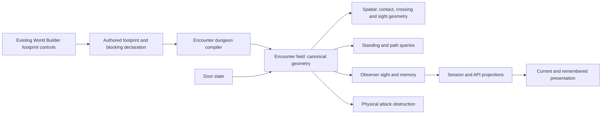

# Authored blocking geometry

## Shape

The existing authored rectangle is the geometric source for blocking. Its
width, depth, offsets and placement define its planar extent independently of
the visible mesh bounds. Existing movement and LOS settings remain available.
**Blocking geometry** declares a solid barrier whose effective restrictions
include movement, sight and physical attack paths. It is a property of authored
geometry, not a wall asset category, and requires no height in this 2D model.
This version uses asset-owned footprints only. The authored box follows its
asset's existing placement transform; its dimensions remain author-controlled.

The declaration belongs to dungeon gameplay content. The compiler converts the
document coordinate frame into the canonical spatial plane once. Encounter
composes the active contributors; spatial supplies geometric answers without
interpreting doors or game rules. Attack consumers use that same obstruction
geometry. Session and API transport results; the web renders them.

This design scopes the behavior and its owning seams. R10 and R11 remain open
technical contracts; publishing this document does not authorize implementation
against unspecified contracts. The tracking surface is [issue #506](https://github.com/KirkDiggler/rpg-project/issues/506),
under [World Builder journey #169](https://github.com/KirkDiggler/rpg-project/issues/169).

## Law

- **R1 — Explicit geometry.** The author controls the blocking footprint;
  visible mesh bounds do not determine its effective extent. This version
  uses the existing asset-owned placement and transform under R17.
- **R2 — Independent declarations.** Movement and LOS can be declared
  separately for ordinary footprints. Appearance implies neither answer.
- **R3 — Continuous obstruction.** Sight respects the authored rectangle
  inside a hex as well as between hexes. Alternate sight origins do not jump
  through an intervening sight-blocking footprint.
- **R4 — Partial visibility.** A visible part of a hex does not authorize
  visibility of the part behind a barrier. Partial overlap does not by itself
  make the entire hex invisible. The presentation contract is subject to R10.
- **R5 — Door state.** A closed or locked door applies its authored footprint
  as blocking geometry. An open door removes that contribution. The author
  sizes the footprint to cover the centers of doorway cells that must be
  unavailable while closed.
- **R6 — Contributor composition.** Opening a door does not disable an
  overlapping footprint belonging to another asset. Any active contributor can obstruct a
  query; removing one does not subtract the others. Static wall footprints
  leave the intended opening clear when passage through an open door is wanted.
- **R8 — Standing and crossing.** Creatures stand at hex centers. An active
  movement footprint covering a center prevents standing there, boundary
  included. A movement segment crossing its interior is blocked. A thin
  footprint can block crossing while leaving both endpoint centers clear.
- **R9 — Authored clearance.** The author reserves clearance by extending
  the movement footprint or removing permanently unusable walkable cells.
  There is no inferred doorway-cell list or automatic creature-radius padding.
  A door's temporary restriction comes from its state, not deleted floor.
- **R12 — Occupied doors.** When closing is exposed, a door cannot close if
  its closed footprint covers a creature's occupied center. This design does
  not add a player-facing close-door action or displace the occupant.
- **R13 — Memory.** Losing sight behind geometry uses the same observer
  memory semantics as going around a corner. Explored terrain remains
  remembered; a remembered creature is not a live position feed. Opening a
  door permits sight refresh; closing it does not erase knowledge.
- **R15 — Solid barrier.** Blocking geometry implies effective movement and
  LOS blocking and prevents physical attacks through its rectangle. Visibility,
  remembered location and adjacent hex centers do not override attack
  obstruction. The inspector communicates the implied restrictions without
  contradictory effective settings. Ordinary props retain their expected
  behavior; no blanket rule for hearing, teleportation or every spell follows.
- **R16 — Existing LOS correctness.** Existing LOS-blocking footprints
  respect their exact authored geometry without requiring the new blocking
  geometry setting. A valid view around a prop does not relocate the observer
  through it. The new setting is not a prerequisite for fixing a sight leak.
- **R17 — Asset-owned scope.** Blocking geometry is authored on assets using
  their existing footprints. Asset-free blockers and a separate placement
  store are outside this version.
- **R18 — Geometric access.** Access to one unblocked portion of a hex does
  not establish access to a creature across an intervening footprint. Sight
  and physical attacks evaluate their actual geometric paths to the target,
  not only target-cell membership or adjacency. Creatures remain centered;
  no relocation within their hex is implied.
- **R19 — Overlapping authoring.** Authors can overlap boxes to form a
  continuous barrier. The overlapping union remains blocked. Wall-adjacent
  standing can be excluded through authored footprint extent or the walkable
  set without introducing a new partial-cell standing model.
- Authoring reuses the existing footprint controls, outlines and blocking
  declarations. A new drawing tool or overlay is not part of this contract.
  Save, reopen, compile and reload preserve the authored meaning.
- Movement, NPC routing, current sight and physical attack eligibility use
  the same active geometric contributors. A door-state change updates their
  answers consistently. Preview or offer checks do not replace execution checks.

## Rulings

Settled rows record conversational rulings for this design's stated behavior
only. Open rows require a concrete proposal and operator ruling on the design
PR before dependent implementation. The PR remains the tracking surface.

| ID | status | scope | ruled by | date |
|---|---|---|---|---|
| R1 | settled | explicit authored geometry; asset-owned scope under R17 | KirkDiggler | 2026-09-28 |
| R2 | settled | independent movement and LOS declarations | KirkDiggler | 2026-09-28 |
| R3 | settled | continuous obstruction and no sight-origin jump through geometry | KirkDiggler | 2026-09-28 |
| R4 | settled | partial-hex visibility intent; mechanism under R10 | KirkDiggler | 2026-09-28 |
| R5 | settled | authored closed-door footprint and open-state removal | KirkDiggler | 2026-09-28 |
| R6 | settled | door state does not remove other assets' blocking contributions | KirkDiggler | 2026-09-28 |
| R7 | deferred-until-open-door-footprint-design | distinct geometry for an open leaf or smaller opening | KirkDiggler | 2026-09-28 |
| R8 | settled | hex-center standing and continuous crossing | KirkDiggler | 2026-09-28 |
| R9 | settled | explicit clearance without inferred door cells | KirkDiggler | 2026-09-28 |
| R10 | open | sight-origin, contact and visibility-output contracts | — | — |
| R11 | open | declaration representation and editing semantics | — | — |
| R12 | settled | occupied-door refusal when closing is exposed | KirkDiggler | 2026-09-28 |
| R13 | settled | current sight versus remembered knowledge | KirkDiggler | 2026-09-28 |
| R14 | superseded | separate wall-specific seal distinction; replaced by R15 and R16 | KirkDiggler | 2026-09-28 |
| R15 | settled | blocking geometry intent as a superset including physical attacks; representation under R11 | KirkDiggler | 2026-09-28 |
| R16 | settled | correct existing LOS independently of the new setting | KirkDiggler | 2026-09-28 |
| R17 | settled | asset-owned footprints only in this version | KirkDiggler | 2026-09-28 |
| R18 | settled | geometric target access rather than whole-hex permission | KirkDiggler | 2026-09-28 |
| R19 | settled | overlapping boxes and explicit exclusion of wall-adjacent standing | KirkDiggler | 2026-09-28 |

## Open

- **R10: lawful sight origins.** Specify which alternate origins are allowed
  and how obstruction between the endpoint and alternate origin is tested in
  both directions. Preserve legitimate views around ordinary props. Confirm
  the reported leak against compiled geometry before selecting the algorithm.
- **R10: contact semantics.** Specify tangency, corner contact and numerical
  tolerance for sight and physical attacks. Overlapping boxes must form a
  continuous barrier; exact edge-to-edge snapping is not an authoring
  prerequisite. Standing and movement retain R8's contact/interior distinction.
- **R10: partial visibility output.** Specify observer origins, existing
  range and light composition, and the authority-to-renderer result for
  partial cells. Reuse existing creature sight and memory. Determine whether
  continuous terrain visibility requires a new projection, persistence or
  protocol surface; an atlas cell list alone does not express a clipped region.
- **R11: declaration and ownership.** Propose the exact field spelling and
  canonical type on the existing asset-owned footprint declaration. Reuse
  its transform and coordinate conversion without copying the rectangle into
  multiple authoritative stores. Asset-free ownership is outside this version.
- **R11: effective flags.** Specify validation, absent-field behavior, and
  what disabling blocking geometry does to the ordinary movement/LOS flags.
  Preserve existing authored declarations and make implied restrictions clear.
- **R11: attack seam.** Name the obstruction query consumed by physical
  attack offers, execution, NPC reach and route destinations. Do not equate
  seeing a target with a clear physical attack path. Scope affected attacks
  explicitly; other effects keep their own rules.
- **R7: open-door geometry.** Distinct open-state footprints remain deferred.
  No new close-door UI, automatic height, creature-radius collision, cover
  calculation or within-hex creature positions are implied by this design.
