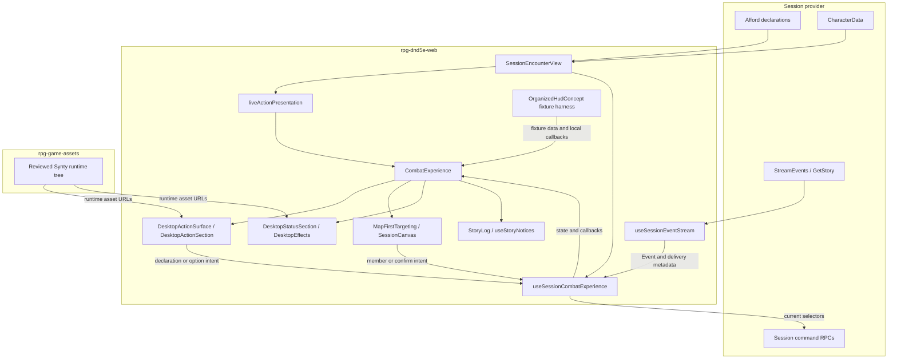

# Desktop hotbar: how the pieces fit

This walkthrough accompanies [web issue #1225](https://github.com/KirkDiggler/rpg-dnd5e-web/issues/1225) and the [design law](design.md). It explains a desktop presentation of the existing combat experience, not a second combat engine. The shared renderer serves both the concept harness and the live encounter; the harness supplies fixtures where the encounter supplies authoritative data and command callbacks. The live slice uses the existing provider contracts; optional richer information remains a named follow-up. If this explanation and the law disagree, the law wins.

## Component shape

The callback arrows describe the live integration boundary, not permission for a child component to import the controller. The parent supplies callbacks. Concept callbacks end in fixture state; live callbacks end in current-selector validation and an RPC. R10, R11 and R13 bind the live joins, command lifecycle and responsive activation. R12 settles the inspection context. R9 excludes favorites from this slice so live play can inform their design.

## Ownership and contracts

Paths in this table are relative to the web repository unless another owner is named.

| Component | Owns | Input → output |
|---|---|---|
| Session provider | Offers and rules answers | `Declaration` with `id`, `verb`, `targetKind`, `available`, `why`, `candidates`, `minTargets`, `maxTargets`, `options` and effect rows → current offers; commands → response and authoritative events |
| `SessionEncounterView` | Live composition and scope | Session/member identity, hook results and `CharacterData` → `CombatExperience` props, `renderMap` and callbacks |
| `liveActionPresentation` | Display joins | `Declaration[]`, known cantrip/spell refs and `FeatureView[]` → `CombatExperienceActionPresentation`; exact joins classify known offers, while unknowns remain visible (R10) |
| `DesktopActionSurface`, `DesktopActionSection` | Icon layout, pages and inspection | Declarations plus `OrganizedActionPresentation` → buttons and declaration intent; `DesktopHotbarCustomization` carries `DesktopHotbarLayout` and `onChange`. The concept's favorite/edit controls are outside this live slice (R9). |
| `desktopHotbarGroups`, `desktopHotbarLayout` | Pure grouping and packing | Declarations and explicit hints → `HotbarGroup[]`; offers, rows and an empty favorite set in this slice → `FavoritePage<T>` |
| `useSessionCombatExperience` | Live interaction and command lifecycle | Current declarations, authority and user intent → `CombatExperiencePresentationState`, callbacks and typed RPC input |
| `memberTargeting`, `MapFirstTargeting` | Selection projection and controls | `MemberTargetingInput` → `MemberTargetingView`; chosen member IDs → target-click/confirm intent |
| `SessionCanvas`, `EntityTargetMarker` | Map picking and visible markers | Candidate IDs, optional `selectedTargets`, `onTargetClick` → member intent and rings/checks; positions come from the map's existing entity data |
| `DesktopStatusSection`, `DesktopEffects` inspection boundary | Read-only status and action information | Private status data or a named `Declaration` and target member → inspection; `buildActionTooltip` projects base information, and `effectLinesFor` projects contextual effects. The action-inspection contract includes zero-effect declarations (R5, R12). |
| `useSessionEventStream` | Ordered, deduplicated delivery and recovery | `Event` → callback with `SessionEventDeliveryMetadata.source` (`live` or `catchup`) |
| `CombatExperience`, `StoryLog`, `useStoryNotices` | Released narration and its presentation lifetime | `CombatExperienceStoryExchange[]`, stream state and scope → history and temporary cards; `holdStoryUntilSettled` preserves dice/reaction pacing |
| Private asset store; web `ActionArt` | Reviewed image bytes; their rendering | Private `harness/models/synty/` → ignored/runtime `/models/synty/` URLs; `ActionIconPresentation` → image or readable fallback |

**The presentation adapter does not become a rules adapter.** It may join exact provider refs for display; it may not identify a feature by the word “Rage,” guess a cantrip from resource cost, or mint an offer (R1, R3).

The layout functions do not own durable preferences or interpret an opaque selector as character identity. R9 keeps favorite identity and storage out of this slice rather than treating fixture IDs as a persistence contract.

The controller does not calculate range, faction eligibility or effects. It checks that intent still names a current provider offer and carries the required input; the server decides the result (R1, R11).

The canvas does not choose a target from screen proximity when an entity was not picked, and a missed member click must not become movement. Its markers visualize selection, not authorization (R6).

The inspection panel does not turn an attack-specific answer into a character-wide passive claim, or require an effect before showing the action's base information (R5, R12).

The notice hook does not interpret raw events again or create a second history. The asset renderer does not supply a description or gameplay category based on an image (R1, R7, R8).

## Walk one thing through: Bane

The Bane fixture in `src/concepts/desktop-hotbar/fixtures.ts` is a concrete example of a member-list spell. Its fixture selector is `bane`; **that string is not a proposed production identity**.

1. The source supplies a `Declaration`: `verb = CAST`, `targetKind = MEMBER`, candidate member IDs, availability and target bounds. In production these values arrive through Afford. The UI neither supplies enemies by faction nor counts targets from spell knowledge.
2. `OrganizedActionPresentation.desktopSectionByDeclarationId` places the offer in Spells, and `desktopSpellKindByDeclarationId` supplies its band. `desktopHotbarGroups` produces a `HotbarGroup` containing the same declaration. Section/band labels are presentation; `Declaration.id` remains the executable selector. Live hints use exact known-spell refs, retaining unknowns in Other spells (R10).
3. `DesktopActionSection` renders an icon and sends the selected declaration through its callback. Selecting it arms the interaction; it does not mean the spell has resolved. A spell with `CastOption[]` first needs one of those exact option IDs, independently of its target picks.
4. A map click produces a member ID. `MemberTargetingInput` combines the declaration with `selectedMembers`, authority and option state; `memberTargetingView` produces available/selected members and confirmation state. Rings, checks, chips and the optional list all describe those same IDs, not parallel selections.
5. Separate confirmation sends the accumulated IDs to the command owner. The live `onCastTargets` boundary checks the current declaration, current option, unique candidates and provider bounds before `useSessionCast` sends `session`, `member`, `declarationId`, `targets` and optional `option`. R11 brings the toggle lifecycle through this boundary while retaining scalar inputs for other RPCs; the generic view alone does not add list support.
6. The response is not a client-authored success story. Authoritative events enter `useSessionEventStream`, retaining sequence and delivery provenance. The combat presentation/pacing path produces `CombatExperienceStoryExchange` entries. History and temporary cards read those entries, preserving their story IDs; cards add an expiry, not a second outcome.

A rejected or withdrawn selection stops at the corresponding boundary and leaves readable feedback. It does not fall back to another similarly named spell or substitute another target.

## Separations that look like one thing

| Query | Source of truth |
|---|---|
| May this exact offer execute now? | Current `Declaration.id`, availability and command owner checks; final provider response |
| Which category should display it? | Explicit presentation facts joined from provider identity, not selector spelling (R10) |
| Which favorite should survive a new offer generation? | A deferred identity/lifetime contract (R9); not part of this slice and not answered by `Declaration.id` |
| Is Rage a button or information? | An activation declaration versus an effect row for a named action/target context |
| What does Command's chosen word do? | Provider-authored option information; `CastOption.label` alone supplies no explanation (R10) |
| Is a member selected or currently selectable? | Local picks versus current `TargetCandidate` answers |
| Is an entry retained or newly announced? | Story identity/history versus live delivery provenance and presentation release |
| Is art available locally or approved for shipping? | Ignored preview files versus the private runtime promotion contract |

Merging these questions makes a plausible UI lie: a captured selector can execute a stale offer, a green marker can promise eligibility, or recovered history can look like a new action. A single `streamState === 'live'` flag is not a substitute for per-entry delivery provenance during background catch-up.

## Trade-offs

| Decision | Benefit | Cost / boundary | Not taken |
|---|---|---|---|
| Shared combat presentation | The concept exercises the same renderer the encounter uses | Web maintainers preserve existing mobile and non-opted-in behavior | A second combat implementation in Concepts Lab |
| Explicit category/ref joins | New classes do not require HUD class branches | Provider/adapter owners must expose and join missing facts (R10) | Name parsing or spell-cost heuristics |
| Provider-driven target controls | Allies and enemies use the same UI model | Controller owners must prove each live verb's input contract (R11) | A Bane-specific selector |
| Separate transient cards and history view | Quiet map without losing narrative access | Presentation owners retain identity, provenance and pacing | Another event-to-prose interpreter |
| Rows and paging without favorites (R4, R9) | Live play can inform useful customization without a premature identity contract | The player cannot pin frequent actions in this slice and may scroll narrow sections | Shipping fixture IDs as durable favorites |
| Private runtime art | Licensed visual assets can ship inside builds | Asset owners curate/promote; web builds must stage the assets | Committing preview PNGs to the public web repo |

## Edges

R5 describes base action information with contextual effects, not an inventory of every passive trait. R12 separates no inspected action from an inspected action with no effects: the former has no action context; the latter still has action information. Choosing a convenient first attack supplies neither a valid default context nor permission to hide the selected action.

R6 describes a shared selection interaction, not a universal multi-target RPC. The live CAST path accepts target lists; other verbs keep their existing scalar contract and cannot silently truncate a list (R11).

The live spell catalog and combat declaration are different seams. A description available to character creation is not automatically present in combat inspection (R10). Missing prose remains missing rather than becoming local rules copy.

Favorite scope, reset behavior, removed favorites and ambiguous semantic matches belong together in the deferred R9 design. They do not block this slice. The fixture-local layout type does not settle them.

Activation on the real route is R13. The accepted concept, a passing isolated component test, and a production rollout are different claims.

## Where a change lands

A new icon belongs in private asset curation and the presentation mapping. It does not require modifying target selection or the rules owner.

A new target-list verb belongs first at the live command contract and controller boundary, then uses the shared selection view. Teaching only `MapFirstTargeting` about it cannot make the RPC support it.

A future favorite that follows a character across sessions requires the deferred R9 ownership and identity decision. That change belongs at the preference boundary, not in layout packing; this slice introduces no account storage.

## Source map

The concept-specific symbols live on web branch `feat/desktop-hotbar`; the project documents do not establish their release status. Revision/evidence belong in the [working notes](integration-notes.md) and issue; executable task contracts and seam checks are in the [implementation plan](implementation-plan.md).

| Concern | Owning source |
|---|---|
| Live composition and command dispatch | `rpg-dnd5e-web/src/components/session/SessionEncounterView.tsx`; `combat-experience/useSessionCombatExperience.ts`; `src/api/useSessionCast.ts` |
| Presentation contracts and grouping | `src/components/session/combat-experience/{types,organizedActionPresentation,liveActionPresentation,desktopHotbarGroups}.ts` |
| Rows, stars and icon UI | `src/components/session/combat-experience/{desktopHotbarLayout.ts,DesktopActionSurface.tsx,DesktopActionSection.tsx,ActionArt.tsx}` |
| Selection projection and map integration | `src/components/session/combat-experience/{memberTargeting.ts,MapFirstTargeting.tsx}`; `src/components/session/SessionCanvas.tsx`; `src/components/hex-grid/EntityTargetMarker.tsx` |
| Inspection | `src/components/session/combat-experience/{DesktopStatusSection.tsx,DesktopEffects.tsx,actionTooltip.ts}` |
| Event delivery and narration | `src/components/session/useSessionEventStream.ts`; `src/components/session/combat-experience/{useSessionCombatExperience.ts,CombatExperience.tsx,storyReveal.ts,useStoryNotices.ts,StoryLog.tsx}` |
| Fixture composition | `src/concepts/desktop-hotbar/{DesktopHotbarConcept.tsx,fixtures.ts}`; `src/concepts/organized-hud/OrganizedHudConcept.tsx` |
| Asset custody and packaging | `rpg-game-assets/README.md`, `harness/models/synty/`; web `scripts/sync-game-assets.sh`, `.github/workflows/docker.yml` |
