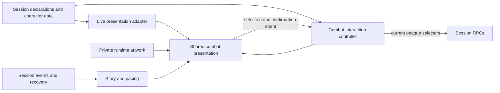

# Desktop hotbar

## Shape

## Law

- **R1 — Authority.** The client renders provider facts and sends intent. Presentation does not invent offers, descriptions, effect applicability, or game legality. Existing [workspace boundaries](../../CLAUDE.md#what-the-foundation-is) govern every layer.
- **R2 — Desktop presentation.** The desktop surface is map-first, with a full-width translucent toolbar, approximately 24px side cushion, 36px icon controls, and opaque hover/focus inspection. Mobile retains its existing interaction surface.
- **R3 — Organization.** Actions, Features, Spells and Items mount only when they contain current offers. Unavailable offers still count. Cantrips form their own spell group; class, level, names and selector spelling do not determine membership.
- **R4 — Rows and paging.** The player selects one through four balanced rows, initially one. Short final pages overlap the preceding tail. Narrow sections scroll rather than change the chosen row count.
- **R9 — Slice boundary.** This live-bar slice excludes favorites, star/edit controls and favorite identity or persistence work. Favorites remain a follow-up design question informed by play with the bar.
- **R5 — Status and inspection.** HP, AC and movement occupy fixed Status presentation. Action inspection shows provider-supplied base action information, including when the action has no effects, with contextual effects alongside it when present. Inspection is informational; executable features remain commands. Provider-authored command options appear in a tray without replacing the toolbar.
- **R12 — Inspection context.** With no action selected or inspected, the contextual window has no action context; it does not borrow an arbitrary attack. For an inspected action, an empty effect list does not suppress its base information. Missing provider facts are not fabricated.
- **R6 — Member targeting.** Map selection and the optional list share one selection. Selected members have visible map markers and removable chips. Multi-target actions require separate confirmation; re-clicking an armed multi-target command preserves its picks. Candidate membership, availability and bounds come from the provider.
- **R7 — Feedback.** The log is optional and initially closed. Temporary notices present released actor/action/result story entries, with at most three visible for six seconds, without deleting those entries from history. Initial and recovered history does not replay as new notices. Debug inspection does not reflow the toolbar or pass clicks through to the map.
- **R8 — Assets.** Licensed source and runtime artwork remain in the private canonical asset store or ignored local previews, never in public source control. Production consumes reviewed runtime assets through the owning asset contract.

## Rulings

| ID | status | scope | ruled by | date |
|---|---|---|---|---|
| R1 | settled | Existing workspace authority boundary | Workspace law | — |
| R2 | settled | Accepted desktop concept and mobile preservation | KirkDiggler | 2026-10-07 |
| R3 | settled | Offer-driven sections and spell grouping | KirkDiggler | 2026-10-07 |
| R4 | settled | Rows and pagination; favorites excluded by R9 | KirkDiggler | 2026-10-08 |
| R5 | settled | Status, base action information plus contextual effects, and option tray | KirkDiggler | 2026-10-08 |
| R6 | settled | Targeting interaction; not new RPC capability | KirkDiggler | 2026-10-07 |
| R7 | settled | Optional history and transient feedback | KirkDiggler | 2026-10-07 |
| R8 | settled | Existing licensed-asset boundary | Workspace law | — |
| R9 | deferred-until-post-bar-playtest | Favorites and their identity, ownership and lifetime; excluded from this slice | KirkDiggler | 2026-10-08 |
| R10 | open | Live classification and description contracts | — | — |
| R11 | open | Live target-controller coverage and invalidation lifecycle | — | — |
| R12 | settled | No arbitrary idle context; action information remains visible without effects | KirkDiggler | 2026-10-08 |
| R13 | open | Live rollout scope and activation | — | — |

## Open

- **R9 (deferred, non-blocking):** Does play with the bar justify favorites? If so, what follows the character across encounters, refreshes and devices, and which provider identity distinguishes offers without persisting executable declaration IDs?
- **R10:** Which exact live fields classify every offered feature/item and distinguish spell kinds, including granted spells? Where do combat descriptions and option explanations come from when the declaration lacks them?
- **R11:** Which live verb contracts support member lists? How do pending picks behave across authoritative refresh, option change, cancellation and scope change while retaining current-selector dispatch checks?
- **R13:** How is the desktop surface activated on the live route, and what is the rollback boundary? The slice brings in the bar without favorites; merge and deployment remain separate gates.
