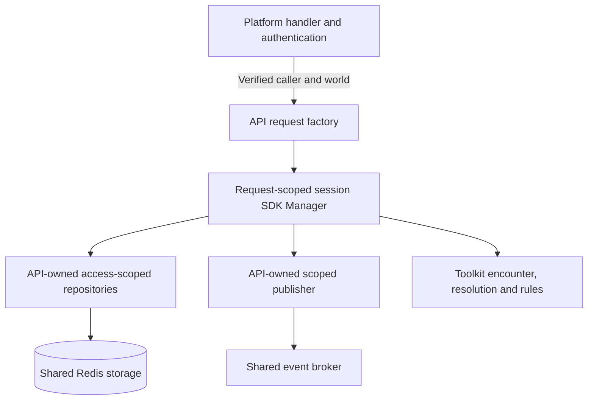

# Discord worlds — API-owned access boundaries

## Shape

World association and access are host concerns. The SDK receives the storage
capabilities the API supplies; it does not decide which worlds a character may
participate in. Character identity is independent of world association.

One API process serves all worlds. Its shared stores and connection pools serve
request-scoped adapters; constructing an adapter does not construct a database
or copy its records. The factory is API code, not a toolkit tenancy abstraction.

## Law

### Authority and association

- The API establishes the caller and world through the platform's authentication
  and admission mechanism. Discord membership is one platform-specific source,
  not an SDK requirement.
- Client references are untrusted. Neither a WorldID nor knowledge of a character
  ID grants access by itself.
- The API owns the association between a character and a world and the policy
  governing access to that character. A change to that association policy does
  not, by itself, change toolkit rules or character identity.
- Character IDs identify characters independently of world ownership. WorldID
  is not encoded into character identity to enforce authorization.
- Current gameplay admits world-owned characters without cross-world transfers
  or shared progression. This is API policy, not a toolkit restriction on what
  relationships a host can support.
- Toolkit rules determine mechanical outcomes. API access decisions do not
  calculate damage, choose spell targets, or reproduce other game rules.

### Dependencies and lifetime

- The API explicitly binds verified scope into its repository and delivery
  adapters. SDK methods call the supplied capabilities using ordinary resource
  IDs; they do not interpret host world-access policy.
- Scope is immutable for the operation. A shared Manager or shared repository
  does not acquire a mutable current-world field.
- A request-scoped SDK Manager uses scoped adapters over shared infrastructure.
  No per-world Manager cache or additional character-data cache is introduced.
- Adapters hold access scope, not cached character snapshots. Rule execution
  retains its normal load/act/save behavior.
- Go context supplies execution cancellation and deadlines. Repositories do not
  discover mandatory world scope through context values, and callbacks do not
  replace their supplied context with a separately saved request context.
- Privileged and non-interactive API entry points establish their own explicit
  authorized scope; missing request authority is not a default-world fallback.

### Reads, writes and delivery

- A scoped repository checks a loaded record's association before returning
  toolkit data. A separate read solely to verify world ownership is unnecessary.
- Missing or inaccessible records do not reveal another world's stored data.
  Storage failures and invalid stored data do not masquerade as an ordinary miss.
- Writes enforce scope as well as reads. Creation uses API-established ownership;
  updates preserve ownership rather than trusting replacement engine data to
  assign it. Globally identified records cannot be overwritten into another
  world merely because scoped reads report them inaccessible.
- World containment and player authority are distinct. Private character access
  requires caller ownership. Authorized gameplay may read or change other party
  members and targets within the permitted world.
- Session, encounter, character and authored-content access follow the same
  ownership boundary, including reads initiated by SDK callbacks. A character
  wrapper alone does not establish isolation for the complete game.
- API delivery adapters attach world routing scope to SDK-projected events.
  Subscriptions validate caller, world and the requested session/member audience;
  the API does not recompute toolkit visibility.
- An open stream retains its selected world and follows the API's authority
  refresh/cancellation policy. Switching worlds establishes a new subscription,
  not a mutation of the old stream's scope.

## Rulings

| ID | status | scope | ruled by | date |
|---|---|---|---|---|
| R1 | settled | API owns platform admission and character/world association; toolkit does not enforce host world authorization | KirkDiggler | 2026-10-02 |
| R2 | settled | Character identity is independent of world association; future host policy is not constrained by world-prefixed character IDs | KirkDiggler | 2026-10-02 |
| R3 | settled | API-scoped dependency separation is the design direction; no additional record/Manager cache | KirkDiggler | 2026-10-02 |
| R4 | settled | Current scope excludes cross-world transfers/shared progression; preserving the seam does not implement those features | KirkDiggler | 2026-10-02 |
| R5 | open | Exact private-character authorization placement and factory/access contracts | — | — |
| R6 | open | Storage write-guard/concurrency contract and creation/update distinctions | — | — |
| R7 | open | Complete consumer adoption and independent execution-context repair plan | — | — |

## Open

The [code-level implementation plan](./implementation-plan.md) supplies proposed
contracts, file destinations, request flows and verification. Its recommendations
for these open items are not additional settled rulings.

- **Private-character authorization.** Determine whether the first SDK-triggered
  character read checks both world and caller ownership through a target-specific
  API adapter, or whether caller ownership remains a pre-call API check. The
  gameplay adapter must not restrict all affected characters to the actor's owner.
- **Write guards.** Define scope-enforcing create/update behavior, including
  concurrent creation of the same global ID and delete/update races. Distinguish
  ownership safety from same-world lost-update handling; do not imply that a
  read-time check alone makes a later write safe.
- **Construction contract.** Specify the API factory's typed inputs/outputs and
  how handlers, lobby lifecycle, private character operations, authoring and
  non-interactive callers obtain their scoped capabilities. Preserve narrow
  consumer interfaces without duplicating every SDK verb in another facade.
- **Execution context.** Trace storage-reaching callbacks and fix cancellation
  propagation at its source. Scoped adapters remove the need to carry world
  authority in ctx; they do not make dropped execution context correct.
- **Adoption and proof.** Reconcile actual provider/consumer versions, map every
  storage/delivery exit, and derive the implementation plan and A/B isolation
  proof. The design direction does not authorize merging the paused candidates.
