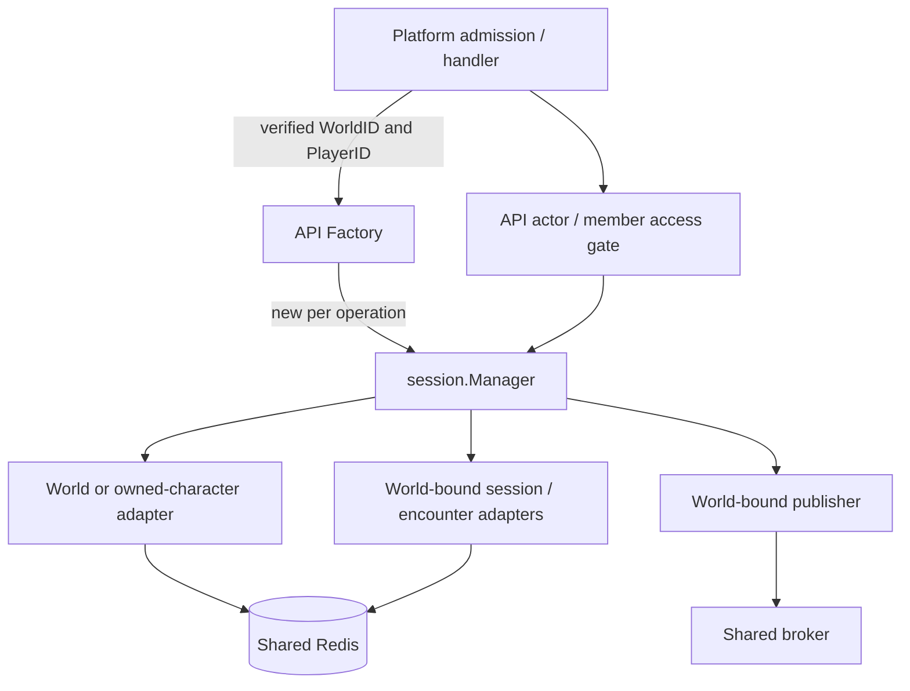

# Discord worlds — code-level implementation plan

**Status: planning draft, not permission to resume the paused patches.** This
plan implements the API-scoped-dependency direction in [design.md](./design.md).
Proposed code below is a contract sketch, not code already added or compiled.
The named new files are deliberate destinations; existing files were inspected.
The old `plan.md` and WorldID-per-SDK-verb proposal remain superseded evidence.

## Reading guide

- [Decisions to inspect](#2-decisions-this-draft-makes-explicit): the choices still
  proposed, rather than hidden in implementation tasks.
- [Storage and writes](#5-task-b--globally-identified-records-scoped-storage-operations).
- [Factory and adapter code](#6-task-c--request-scoped-sdk-factory-and-character-adapters).
- [Handler/server usage](#8-task-e--server-handlers-and-access-gate-construction).
- [Delivery order](#14-delivery-sequence-and-work-ownership) and
  [acceptance checks](#16-verification-commands-and-completion-evidence).

## 1. Scope and measured baseline

This plan covers the #518 outcome: world-owned characters/drafts/rolls, lobbies
and runs, streams/presentation, database-authored dungeons, web identity lifetime,
and shared-backend A/B proof. It spells out the host-scoping foundation first;
that foundation is not a claim that all those outcomes have shipped.

Measured on 2026-10-02:

| Repository | Source baseline | Consequence |
|---|---|---|
| rpg-api | `origin/dev` `cd2cfe030b879291d72a794072c6cbb0c146428e` | #1068 is merged; session v0.113.0 / encounter v0.110.0 already adopted |
| rpg-toolkit | `origin/main` `26664812fba58a4abcb05a305f917f8079089301` | Existing Manager constructor and repository interfaces support host-supplied adapters |
| rpg-dnd5e-web | `origin/dev` `af4ee892304671d02cdec9bb6323d5152d9f698b` | #1217 is merged; preserve current Knowledge/View/Roster rendering |
| rpg-project | `docs/518-world-plan` | Design and this planning record; no runtime implementation |

Measurement trees are `.worktrees/world-contract-measure` in API, toolkit and
web. Re-fetch before execution. Do not apply the old API/web candidates onto
older bases and accidentally undo the dungeon-knowledge work.

### What does not change

- SDK gameplay inputs do **not** gain WorldID for API authorization.
- `sdk.CharacterRepository`, `SessionRepository`, `EncounterRepository` and
  `EventStream` keep their existing signatures for this feature.
- Character IDs remain globally identifying IDs, not `world-character` IDs.
- Toolkit character/encounter rules data do not acquire host ownership fields.
- Client protobuf requests do not acquire blanket WorldID fields.
- Discord/role admission already delivered by #514 is retained, not rebuilt.
- No per-world Manager cache, record cache, middleware-held SDK Manager, global
  mutable current-world field, or generic permissions framework is introduced.
- No transfer/sharing feature, migration/backfill, billing, or deployment/reset
  is included. Reset occurs only at an explicitly targeted cutover later.

## 2. Decisions this draft makes explicit

The design direction is agreed. The following are concrete recommendations for
its open details, not claims that the operator separately ruled on every type.
Review these before treating the plan as executable; downstream steps consistently
use these choices rather than leaving implementers to invent different answers.

| Ref | Proposed choice | Reason / alternative not selected |
|---|---|---|
| P1 | Private SDK character verbs use an exact-character-and-player adapter; gameplay uses a world-contained adapter after API actor authorization | Avoids an extra preflight character read for NextLevel/LevelUp without breaking effects on other players |
| P2 | Keep globally keyed records with API WorldID metadata; world-qualify collection/index/channel keys | Character identity stays independent of association; scoped lookup is an access check, not a requirement to prefix every primary ID |
| P3 | Guard ownership and creation/update rules inside the Redis write transaction | A Get/check followed by unconditional Set is not a safe ownership guard |
| P4 | Construct one Manager for one API operation; reuse it for that operation's ordered SDK calls | SDK construction is dependency wiring, not a connection/game load; no per-world lifecycle/cache |
| P5 | Keep existing whole-aggregate last-writer semantics within an authorized world; do not claim general optimistic concurrency | Ownership guards are required here; whole-game transactional/CAS semantics are a different contract. Existing PatchEquipment protection remains |
| P6 | Store authored dungeon source as YAML with content type and optional comments; preserve existing YAML RPCs | Database ownership does not require a JSON conversion, compression or schema-form project |
| P7 | Treat the pre-existing execution-context defect as a separate, explicitly tracked provider repair, not a dependency required to carry world authority | Scoped adapters must work without world values in ctx. This does not declare lost cancellation correct; see §15 |

P1 and P3 are the substantive open details to confirm. P7 needs an explicit
scope disposition before final readiness: include a separately designed provider
repair in this wave, or track it independently without claiming it fixed. This
plan does not silently choose the latter on the operator's behalf.

## 3. Runtime shape



The factory does not authenticate. Its inputs come from API admission, never
straight from protobuf fields. It validates required scope and constructs
capabilities. Only the handler/auth boundary reads `worldcontext`; no repository
or SDK callback recovers WorldID from ctx.

A world adapter is **not a grant to impersonate every player in that world**.
Handlers still authorize acting members and private resources. Engine effects
on other legitimate world members remain possible.

## 4. Task A — API request identity and stored ownership

### Files

Modify:
- `internal/entities/character.go`
- `internal/entities/character_draft.go`
- `internal/repositories/dice_session/repository.go`
- `internal/repositories/lobby/repository.go`

Add:
- `internal/auth/request_access.go`
- `internal/auth/request_access_test.go`

Retain:
- `internal/auth/role_interceptor.go`, `world_resolver.go` and
  `internal/worldcontext/*` as API admission/carrier code.

### Data to add

```go
// API-owned envelopes, not toolkit data types.
type Character struct {
    WorldID string `json:"world_id"`
    Data *tkcharacter.Data `json:"data"` // existing field/tag
}

// Add WorldID to the existing CharacterDraft, DiceSession and lobby.Data.
// Keep their existing fields/serialization names; do not replace their shapes.

type RequestAccess struct {
    WorldID string
    PlayerID string
}

func RequireRequestAccess(ctx context.Context) (*RequestAccess, error)
```

The existing Character and CharacterDraft wrappers both use a named `Data`
field serialized under `data`; retain that representation and add WorldID beside
it. No toolkit payload rewrite is needed.
`RequireRequestAccess` reads authenticated PlayerID and admitted WorldID, refuses
absence and returns copied values. It does not parse the guild selector, call
Discord again, construct repositories, or add another middleware layer.

Other platform handlers can establish the same API access values through their
own admission mechanism. Background/administrative entry points supply explicitly
authorized scope rather than synthesizing an HTTP identity or a default world.

### Checks

- Missing caller fails unauthenticated; missing admitted world fails closed.
- An unchecked guild/header/proto value never becomes RequestAccess.WorldID.
- No change to Discord owner/admin-role authority or membership-cache policy.

## 5. Task B — globally identified records, scoped storage operations

### Files

Modify each existing `repository.go`, `redis.go`, tests and generated mocks in:
- `internal/repositories/character/`
- `internal/repositories/character_draft/`
- `internal/repositories/dice_session/`

Add focused `world_test.go` / `ownership_write_test.go` suites beside those
repositories. Keep policy with its owning repository, not in a new global Redis
or authorization framework.

### Input changes

Add required `WorldID string` to API-owned Get/Create/Update/Delete/List inputs.
For dice Update, replace the bare session parameter with `UpdateInput` and
`UpdateOutput`. For character PatchEquipment, add WorldID to its existing input
while preserving ExpectedVersion, equipment expectations, conditions and retries.

```go
// API repository contracts — these are NOT SDK interfaces.
type GetInput struct { WorldID, ID string }
type ListByPlayerIDInput struct { WorldID, PlayerID string }
type UpdateInput struct {
    WorldID string
    Character *entities.Character
}
```

These fields are not read from ctx. SDK adapters supply the WorldID bound at
construction; ordinary API character/draft services pass explicit request values.

### Key and metadata behavior

| Resource | Primary identity | World-dependent lookup |
|---|---|---|
| Character | Existing character ID and primary key | Player-character index includes WorldID + PlayerID |
| Draft | Existing draft ID and primary key | One current draft per WorldID + PlayerID |
| Dice rolls | Entity + roll context inside a world | WorldID + entity + context key |
| Run character index, if used | Character IDs remain global | WorldID + session ID |

Use centralized key helpers and an unambiguous segment encoding; do not introduce
a parsing dependency on Discord numeric IDs below admission. Same names may exist
in different worlds; the same global CharacterID cannot be created twice.

Get loads one record and compares its stored WorldID before returning it. Empty
input WorldID is invalid; stored missing ownership is corrupt/unsupported data,
not permission to adopt the request's world. Foreign and missing direct IDs return
NotFound without a second lookup elsewhere. Lists revalidate record association
and owner rather than treating index membership as authority.

### Write algorithm

Use Redis WATCH/transaction discipline, already used by PatchEquipment, with
bounded retries on transaction conflicts. Apply the guard to the record and
relevant index keys; do not rely on a preflight read outside the transaction.

```text
Create:
  validate nonempty scope, ID and owner; proposed metadata matches scope
  WATCH primary key and affected index keys
  require primary ID absent (a foreign record is not an empty slot)
  SET owned envelope + update only this world's indexes in one transaction

Update:
  WATCH primary key
  read current envelope
  require present and permitted WorldID
  require unchanged character/draft owner and identity
  replace permitted data, preserving stored association
  EXEC; on transaction conflict re-read and re-check before bounded retry

Delete:
  WATCH record and its index keys
  require permitted existing record
  delete record and only matching index references in one transaction
```

Same-world whole-record updates can still overwrite another authorized update;
this plan does not advertise CAS on the complete SDK action. Ownership checks
must remain atomic even with that existing last-writer behavior. An Update never
recreates a deleted character/draft. Do not transplant the old README caveat
about read/check/Set as an acceptable ownership-write implementation.

Draft replacement updates only `(WorldID, PlayerID)`'s current draft. It cannot
delete another world's draft or remove a newer index reference from a stale
request. Dice create/update/delete retain existing TTL semantics, but all keys
and payload checks include the explicitly supplied world.

### Checks

- Create the same global CharacterID concurrently under A/B: exactly one record
  wins; the other cannot overwrite, adopt or index it into its own world.
- Foreign Get/Update/Delete/PatchEquipment leaves bytes, Version and indexes
  unchanged. Include malformed/missing ownership and contradictory input cases.
- Delete/update race does not recreate a missing record; owner/world never change.
- Same player has independent draft indexes and roll sessions in A and B.
- Existing equipment conflict/reprojection tests remain meaningful and green.

## 6. Task C — request-scoped SDK factory and character adapters

### Files

Modify:
- `internal/orchestrators/session/orchestrator.go` — shared infrastructure factory
  replaces the exported process-wide Manager.
- `internal/orchestrators/session/character_repo.go` — remove unrestricted SDK
  character construction from runtime wiring; do not import `worldcontext`.

Add:
- `internal/orchestrators/session/factory.go`
- `internal/orchestrators/session/factory_test.go`
- `internal/orchestrators/session/owned_character_repo.go`
- `internal/orchestrators/session/owned_character_repo_test.go`

### Factory contract

```go
// Existing Config keeps Redis, Characters, TTL, Dice, PresentationIDs,
// TurnDriver and StaleTargetPolicy. Validate/share infrastructure at startup.
type Factory struct {
    // unexported, immutable configuration/shared dependencies
    // no current world, cached Managers, or request context
}

type ForWorldInput struct { WorldID string }
type ForWorldOutput struct { Manager *sdk.Manager }

type ForOwnedCharacterInput struct {
    WorldID string
    PlayerID string
    CharacterID string
}
type ForOwnedCharacterOutput struct { Manager *sdk.Manager }

func NewFactory(cfg *Config) (*Factory, error)
func (f *Factory) ForWorld(in *ForWorldInput) (*ForWorldOutput, error)
func (f *Factory) ForOwnedCharacter(in *ForOwnedCharacterInput) (*ForOwnedCharacterOutput, error)
```

Factory methods perform validation/construction, not I/O, so they need no ctx
parameter. Each copies scope strings into new adapters, creates `sdk.Config` with
all required capabilities, and calls the existing `sdk.NewManager`. Private
construction differs only in the character adapter; the other capabilities are
still valid world-bound dependencies, never nil or permissive stand-ins.

Keep the shared broker separately available to transport wiring. Do not allocate
a broker or close a Redis client when a request Manager is discarded. Share only
stateless/concurrency-safe dice, ID generators and drivers; test-only mutable
fakes must not silently become shared production dependencies.

### World character adapter

```go
type worldCharacterRepository struct {
    repo characterrepo.Repository
    worldID string
}

func (r *worldCharacterRepository) GetCharacter(ctx context.Context, id string) (*tkcharacter.Data, error) {
    out, err := r.repo.Get(ctx, characterrepo.GetInput{WorldID: r.worldID, ID: id})
    // Map API NotFound to sdk.ErrNotFound; reject nil/malformed output.
    // Return out.Character.Data; do not read authority from ctx.
}
```

Save delegates to guarded API Update with the adapter's world. It cannot mint
new character ownership. The backing repository preserves stored ownership and
rejects PlayerID changes in incoming toolkit data. Mapping retains underlying
storage errors; a provider save failure still produces its real SaveReport.

### Private adapter

```go
type ownedCharacterRepository struct {
    repo characterrepo.Repository
    worldID string
    playerID string
    characterID string
}
```

- Get rejects any ID other than its bound target without fetching it.
- Get uses the backing world-checked read and compares stored PlayerID before
  returning Data. Wrong world and wrong owner both appear as NotFound to callers.
- Save rejects a different ID or PlayerID, then calls the same guarded Update.
- No cached sheet, preloaded runtime object or optional empty-owner bypass.
- This adapter serves NextLevel/LevelUp, not party combat. World gameplay uses
  the world adapter and a separate API actor gate.

### Usage at the private handler

```go
access, err := auth.RequireRequestAccess(ctx)
// handle error
sessions, err := h.bindOwnedCharacter(&sessionorch.ForOwnedCharacterInput{
    WorldID: access.WorldID, PlayerID: access.PlayerID,
    CharacterID: req.GetCharacterId(),
})
// handle error
out, err := sessions.LevelUp(ctx, &sdk.LevelUpInput{
    Character: req.GetCharacterId(), HitPointMethod: method, Choices: choices,
})
```

The SDK input is unchanged. Remove `verifyCallerOwnsCharacter` only from the two
private SDK routes once the bound adapter owns that check. Other API character
methods retain their own explicit world/player gates.

LevelUp's post-save response reread remains: the SDK returns LevelGained, not a
sheet. It is not an authorization preflight and must read the same world/player.
Do not invent a cache or broaden SDK output just to remove that necessary read.

### Tests

- Factory creates distinct Managers/adapters for A/B with the same shared store.
- Binding performs zero Redis reads and contains no Manager/world cache.
- Real SDK NextLevel makes its character load through the private adapter; verify
  no separate preflight fetch and refusal before rules/dice/save on wrong owner.
- World adapter allows an authorized engine action to save a different player's
  character in the same world; private adapter refuses that access.
- Valid bound adapters work with plain `context.Background()`; supplying a world
  value in ctx cannot rescue missing construction scope or change a bound world.

## 7. Task D — session/encounter storage and bound event delivery

### Files

Modify:
- `internal/orchestrators/session/redis_repos.go`
- `internal/orchestrators/session/broker.go`
- corresponding `redis_repos*_test.go`, `broker_test.go`

Add:
- `internal/orchestrators/session/records.go`
- `internal/orchestrators/session/scoped_publisher.go`
- `internal/orchestrators/session/world_isolation_test.go`

### Host storage envelopes

```go
type sessionRecord struct {
    WorldID string `json:"world_id"`
    Data *sdk.SessionData `json:"data"`
}
type encounterRecord struct {
    WorldID string `json:"world_id"`
    Data *tkencounter.EncounterData `json:"data"`
}
```

Each Redis adapter is constructed with its immutable WorldID and shared client.
The existing SDK GetSession/GetEncounter/SaveSession/SaveEncounter signatures do
not change. Keep primary IDs globally identifying; scope is stored association,
not an SDK key convention.

SDK session/encounter Save must support initial creation and later replacement.
An atomic save may create an absent ID with the bound world or replace a record
already owned by that world. It must reject a foreign or unowned existing record.
A foreign scoped Get returning NotFound does not make Save free to clobber it.
Retain TTL and SDK partial-save semantics; no cross-aggregate transaction claim.

### Publisher and broker contract

```go
type scopedPublisher struct { broker *Broker; worldID string }
func (p *scopedPublisher) Publish(ctx context.Context, events []sdk.Event) error {
    _, err := p.broker.PublishWorld(ctx, &PublishWorldInput{
        WorldID: p.worldID, Events: events,
    })
    return err
}

type PublishWorldInput struct { WorldID string; Events []sdk.Event }
type PublishWorldOutput struct{}
type SubscribeInput struct { WorldID, Session, Recipient string }
type SubscribeOutput struct { Subscription *Subscription }
type DroppedInput struct { WorldID, Session, Recipient string }
type DroppedOutput struct { Count uint64 }
```

Broker becomes API-internal routing, not the process-wide SDK EventStream.
Its subscription/drop keys become `(world, session, recipient)`. SDK Event need
not gain WorldID; the bound publisher supplies it. Preserve nonblocking fan-out,
lag reporting and per-recipient sequence semantics. Close/unsubscribe removes
only the exact scoped subscription. Add world to routing diagnostics.

Production uses stateless `sdk.Driver()`, so no driver cache is introduced.
If the API later supplies a stateful DriverFor implementation, the scoped adapter
must qualify its host key by world+session. Do not build that future cache now.

### Tests

- A request bound to B cannot load/overwrite A's session or encounter ID.
- Two Managers interleave against one Redis instance without scope mutation.
- Equal broker session/recipient strings in separate world subscriptions do not
  cross-deliver; this deliberately stresses routing, not duplicate DB identities.
- No event is published on refused mutation. Successful multi-player effects
  preserve toolkit-projected recipients within the bound world.

## 8. Task E — server, handlers and access-gate construction

### Files

Modify:
- `cmd/server/server.go`
- `internal/handlers/dnd5e/session/v1alpha1/handler.go`
- every SDK-calling handler in that directory; keep converters pure
- `internal/handlers/dnd5e/sessionaccess/access.go`
- `internal/handlers/dnd5e/sessionpresentation/v1alpha1/handler.go`
- `internal/handlers/dnd5e/v1alpha1/character/{handler.go,level_up.go}`
- `internal/integration/harness/harness.go`

Add:
- `internal/handlers/dnd5e/session/v1alpha1/binding.go` and tests

### Avoid the Go factory covariance trap

Keep consumer interfaces where they exist: session handler `Manager`, character
handler `Sessions` (two methods), lobby `SessionManager`, access `RosterReader`.
Do not make a central 39-verb forwarding service or make handler tests depend on
a concrete SDK Manager.

```go
// Declared in the session handler package.
type BindWorld func(*sessionorch.ForWorldInput) (Manager, error)

// Declared in the character handler package.
type BindOwnedCharacter func(*sessionorch.ForOwnedCharacterInput) (Sessions, error)
```

The server supplies small closures converting `factory.ForWorld(...).Manager`
to the consumer's interface. A method returning `*sdk.Manager` does not implement
a Go interface requiring `(Manager, error)`; the closure is deliberate wiring.
Tests inject binders that record inputs and return existing narrow fakes.

`Handler` stores binders/shared infrastructure, not an active request Manager.
Bind at method entry and keep returned values in local variables. Delete the
`h.access = ...` lazy request-path fallback; never mutate a shared handler with
world-bound state.

### Gameplay flow

```text
handler: decode/validate request shape
  -> RequireRequestAccess
  -> bind Manager for admitted WorldID
  -> build/use API Access with that world and that bound RosterReader
  -> authorize requested actor and required session membership
  -> call local Manager with unchanged SDK input
  -> project response
```

Extend `sessionaccess.New` configuration with explicit WorldID. Its character
reads use world-scoped API repository inputs; its RosterReader is the request's
bound Manager. The API's scope used to authorize must equal the scope used to
execute. Continue using exact member/caller roster checks from adopted #1068;
do not revert to the older roster shape.

Audit and update these handler operations as one inventory:
Activate, Afford, Attack, Cast, DeathSave, Dissolve, End, EndTurn, Exit, Hold,
Interact, Intimidate, Join, Loot, Move, OpenDoor, Persuade, React, Search, Trade,
Unlock, Unpack, Turn and GetAtlas/Doors/Knowledge/Roster/Status/Story/View/Where.
Do not add unimplemented SDK methods as new wire RPCs. Start/Spawn/PlaceNPC and
appearance Recheck are lifecycle callers in Task G, not missing handler files.

`StreamEvents` currently bypasses the Manager and only checks caller character
ownership before subscribing. Replace that with the bound-world exact member/
session access check and the new scoped Subscribe input. Retain admission's
periodic stream authority refresh and cancellation. A stream does not switch
world by mutating its subscription key.

### Server wiring after change

```text
NewFactory(shared config) once
character handler <- private-character binder + existing character service
session handler   <- world binder + shared broker + raw storage for API gates
presentation      <- world-aware access construction + presentation service
lobby orchestrator<- world binder + world-aware repos/registry
appearance notifier <- world binder + scoped lobby lookup
registry projector  <- bound AtlasOf construction for supplied content
```

The integration harness constructs exactly this topology with real interceptors,
SDK and Redis. No test-only default world or global Manager bypass.

## 9. Task F — private character/draft/dice API paths

### Files

Modify:
- `internal/orchestrators/character/{service.go,orchestrator.go,appearance.go}`
- `internal/handlers/dnd5e/v1alpha1/character/handler.go`
- `internal/handlers/dnd5e/v2/character/handler.go`
- `internal/orchestrators/dice/{types.go,orchestrator.go}`
- `internal/handlers/api/v1alpha1/dice_handler.go`
- mocks and focused tests for those interfaces

Add required WorldID beside PlayerID on API private service inputs. Use one
`getOwnedCharacter` and one `getOwnedDraft` helper per service to load by world
and check player before projection or mutation. These API methods do not all
pass through session SDK; do not create new SDK creation/equipment verbs merely
to force uniform routing in this feature.

Creation/finalization stays the existing flow: API creates an ID, toolkit builds
canonical character data, API persists the owned envelope. Finalization takes
world/player from the owned draft, writes through guarded Create, and removes
only that world's draft/index. No client or toolkit save payload chooses a new
owner/world. Existing same-world failure handling remains explicit; this wave
does not invent a distributed transaction across draft and character aggregates.

Appearance notification carries explicit WorldID to its lobby lookup and Recheck
binding. Dice ability-score rolls remain owned by the authenticated player and
world; assignments refuse a roll belonging to a different scope.

### Acceptance inventory

- Every implemented private draft/character direct-ID operation: valid owner,
  same player/wrong world, same world/wrong player.
- Cover both character API versions, reads, mutations, appearance, finalization,
  inventory/equip/unequip/delete, NextLevel and LevelUp.
- Compare stored data + repository Version + draft/player indexes on refusal.
- Keep genuinely Unimplemented RPCs distinguished; do not call a validation
  rejection proof that ownership was checked.
- Persist gained experience, known spells, inventory and equipment in A; verify
  they do not appear or apply to the same player's separate character in B.

The old 19-row integration inventory can inform this test matrix, but its
world-prefixed primary-key assumptions and ctx-bound SDK adapter cannot be reused.

## 10. Task G — lobbies, runs, appearance and presentation

### Lobby storage and business inputs

Modify:
- `internal/repositories/lobby/{repository.go,redis.go}` and tests
- `internal/orchestrators/lobby/{orchestrator.go,session_manager.go,character.go}`
- `create_lobby.go`, `join_lobby.go`, `leave_lobby.go`, `set_ready.go`,
  `set_connected.go`, `get_my_active_lobby.go`, `start_encounter_session_stack.go`,
  `abandon_encounter.go`, `appearance.go`, `list_dungeons.go`, `broker.go`,
  `events.go`, and `keyed_mutex.go` in that package
- lobby handlers, including `stream_lobby.go`

Convert bare-ID lobby repository calls to Input/Output contracts with required
WorldID: Get, GetByJoinRef, GetByPlayerID, Save, ClearPlayerIndex. Add WorldID to
all listed orchestrator inputs. Preserve global lobby IDs; qualify join-ref and
active-player indexes by world. Stored lobby.Data has immutable WorldID.

ClearPlayerIndex also takes ExpectedLobbyID and deletes only a matching index;
a stale leave/disconnect must not erase a newer lobby association. Guard Save
and its membership indexes atomically. Keep the current one-active-index-per-
player semantics **within each world** rather than making a new global constraint.

Bind one local Manager in StartEncounter and reuse it for StartSession, Spawn,
Join and PlaceNPC. Validate every bound character in the lobby's admitted world;
load the dungeon from the same world. Read/check the lobby inside that scope
before using its stored session ID. Do not trust a foreign lobby to select scope.

GetMyActiveLobby/AbandonEncounter/AppearanceNotifier bind through the same
factory for Status/End/Recheck. There is no fallback to a process-wide Manager.
Lobby event/presence routes and synchronization keys include world. Disconnect
cleanup captures immutable IDs/scope, not an SDK Manager or credential; where
cleanup needs its own bounded execution context, state that lifetime explicitly.

### Shared dice presentation

Modify:
- `internal/repositories/sessionpresentation/{repository.go,redis.go}`
- `internal/orchestrators/sessionpresentation/{service.go,orchestrator.go}`
- `internal/handlers/dnd5e/sessionpresentation/v1alpha1/{handler.go,publish_dice_throw.go,stream_dice_throws.go}`

Add WorldID to API Publish/Subscribe inputs. Qualify Redis presentation plan,
attempt/conflict keys and pub/sub channels by world+session, not just session.
Use the same request-bound access checks as gameplay for publish/subscription.
Do not put WorldID on SDK dice records or invent another client field.

### Checks

- Same account has independent active-lobby/resume indexes in A/B.
- Foreign lobby ID, join ref, character bind, run ID and presentation selector
  cannot authorize a read, join, mutation, resume or subscription.
- Start a real SDK run and trigger another player's character update in A;
  verify it succeeds in A without touching B.
- Late disconnect/leave from A cannot remove B's state or a newer A lobby index.
- SDK events, lobby events and dice plans each have separate cross-world proofs.

## 11. Task H — world-owned dungeon source in Redis

### Files

Add:
- `internal/entities/dungeon.go`
- `internal/repositories/dungeon/{repository.go,redis.go,redis_test.go}`
- generated `internal/repositories/dungeon/mock/mock_repository.go`
- `internal/dungeons/{stored_registry.go,stored_registry_test.go,catalog.go,compile.go}`

Modify:
- `internal/dungeons/registry.go`, `seed.go` and `mock/mock_registry.go`
- `internal/orchestrators/authoring/orchestrator.go`
- `internal/handlers/dnd5e/authoring/v1alpha1/{get_dungeon.go,put_dungeon.go}`
- lobby ListDungeons/StartEncounter and server `registryProjector`
- integration content fixtures/helpers in `internal/dungeons/dungeonstest`

### Stored record and API contracts

```go
type Dungeon struct {
    WorldID string `json:"world_id"`
    Key string `json:"key"`
    Name string `json:"name"`
    ContentType string `json:"content_type"` // initially application/yaml
    Content []byte `json:"content"`
    Comments string `json:"comments,omitempty"`
}

// API-owned registry inputs.
type GetInput struct { WorldID, Key string }
type ListInput struct { WorldID string }
type PutInput struct {
    WorldID string
    Key string
    YAML []byte
    ValidateOnly bool
}
```

Dungeon keys really are world-local authored names, unlike global character IDs.
Use `(WorldID, Key)` storage and a world dungeon index. Repository methods use
Input/Output types: Get, List, Put. Put atomically updates source and index.
No compression or alternate JSON grammar; preserve authored bytes verbatim.

Extract `compileEntry` from FileRegistry into a reusable compiler in `compile.go`.
Keep toolkit/sessionworld responsible for grammar and atlas projection. Do not
reimplement geometry or validation in the persistence repository.

Replace mutable file-backed runtime authoring with StoredRegistry:

```text
Get(world,key):
  fetch world-owned source
  if found: validate content type, compile/project, return source + compiled entry
  if genuine NotFound: consult immutable shipped catalog
  otherwise: return error, never hide failure behind shipped content

Put(world,key,yaml):
  validate key/content match, compile/project
  if invalid: return existing field-error result, no storage change
  if ValidateOnly: return preview, no storage change
  otherwise: guarded write to this world's record/index only

List(world):
  merge shipped catalog with this world's summaries
  same key in world storage shadows the shipped entry for this world only
```

Keep shipped files read-only; remove runtime Put's filesystem writes and mutable
world entry cache. Immutable shipped catalog loading is not a new cache of Redis
records. Compile world-owned source on use; optimization requires later evidence.

Authoring API inputs acquire WorldID from admission. Existing YAML Get/Put protos
remain sufficient; content type is known at that adapter. Optional Comments can
remain empty without inventing a new UI/transport feature. Separate comments
editing requires a measured wire requirement before adding a proto field.

`registryProjector` gets explicit API world scope and binds a Manager for
AtlasOf; no unscoped gameplay-capable global Manager is retained just for previews.
Shipped startup validation compiles supplied content without a storage authority
bypass. Tests assert preview does not fetch characters or mutate stored state.

### Checks

- A/B can store different content under the same dungeon key.
- Editing a shipped dungeon creates a world-local record; shipped bytes and B
  are unchanged. Restart reads persisted source without a local-file write.
- Stored-world failure/malformed content never falls back to the shipped dungeon.
- List, get, validate-only, save, launch, atlas and presentation source use the
  same world. Live encounter state remains its own SDK snapshot, not editable
  source. Existing mutable-source presentation semantics are not silently changed
  into a versioning system here.

## 12. Task I — web identity lifetime and scoped authoring drafts

### Files

Evaluate/reapply compatible portions of old candidate #1216, on current dev:
- add `src/api/gameIdentity.ts` and `src/dev/DevWorldIdentity.tsx`
- modify `src/App.tsx`, `src/api/{auth.ts,client.ts,useCharacterData.ts,useMyActiveLobby.ts}`
- retain/rework late-completion protections in
  `src/character/{creation/InteractiveCharacterSheet.tsx,level-up/LevelUpView.tsx}`,
  `src/components/session/SessionEncounterView.tsx`, `src/components/ui/Toast.tsx`
- modify `src/compositions/rpcCompositionSource.ts`

Additionally measure/update (not completed by that old candidate):
- `src/author/{draftStorage.ts,authoringRpc.ts,useAuthoringGate.ts}` and callers
- session Knowledge/View/Roster/Atlas hooks and all gameplay/lobby/presentation
  stream lifetimes beneath the identity boundary

### Proposed identity

```ts
type GameIdentity = {
  playerId: string;
  worldId: string;
  authSessionId: number;
};
// A stable key for this authenticated lifetime, not a credential/token.
```

An identity boundary resets private game state when world, player or auth
lifetime changes. A -> B -> A is a new lifetime, not permission for an old A
request to finish into the new A view. UI world selection is untrusted transport
input; API admission remains authoritative.

Do not add another cache. Scope/invalidate existing private UI caches and local
storage. Public immutable rules/asset catalogs and layout preferences can remain
shared. Clear sensitive overlays/toasts before the next identity paints and
ignore completions from an unmounted/obsolete identity.

Change author draft helpers to take explicit identity scope, for example:

```ts
type DraftScope = Pick<GameIdentity, 'worldId' | 'playerId'>;
loadDraft(scope: DraftScope, mode: DraftMode): StoredDraft | null;
saveDraft(scope: DraftScope, mode: DraftMode, draft: StoredDraft): void;
clearDraft(scope: DraftScope, mode: DraftMode): void;
```

No migration of old global private drafts into whichever world opens first.
Scope the module-level authoring gate result too; a cached builder/gate result
from one identity is not authority or availability for another. Preserve current
#508 dungeon-knowledge behavior when integrating old App/SessionEncounterView
changes; no wholesale cherry-pick over the newer projection contract.

### Checks

Hold character/level-up/equipment/lobby/content requests across A -> B and
A -> B -> A; no stale data, error toast, spinner ownership or mutation completion
lands in the new identity. Repeat for logout/reauth of the same account. Verify
streams unsubscribe and reauthorize; local authoring drafts with identical modes
and content keys remain independent. Default Dev behavior and real Discord
selection each get a distinct transport test.

## 13. Task J — Dev simulation, seeders and local proof

Modify:
- `internal/auth/world_resolver.go` and focused tests for opt-in Dev allowlists
- `internal/integration/harness/harness.go`
- `internal/sandboxseed/*`, `cmd/sandboxseed/*`
- API/web local-development documentation

Reuse the useful semantics from #522 without importing the rejected adapter:
- `RPG_DEV_WORLD_IDS` opt-in allowlist, `RPG_DEV_WORLD_ID` explicit default.
- Web `VITE_DEV_WORLD_IDS`, `VITE_DEV_WORLD_ID`, `?worldId=<allowed-id>`.
- Dev selector uses the existing guild-selection metadata only in opted-in Dev
  mode; malformed/repeated/unknown choices are rejected there.
- Without the allowlist retain agreed fixed-Dev-world compatibility.
- Real Discord credentials always follow real membership/role verification.

Seeders require explicit world for mutating work; health remains world-free.
Both direct repository writes and RPC requests use that same explicit world.
Do not infer it from a Redis address or use a test-world constant in production.

Create ignored `envs/local/world-characters.*` configuration and any local browser
job under the established `_job_<topic>.mjs` name, using the root workspace
launcher. Verify launcher override support rather than assuming game-dev#111
merged. One isolated Compose project, one API, one Redis database, one web build;
A/B selection changes scope, not backends. Do not reuse/reset an existing stack.

Walk normally created characters, not only pre-seeded ones. Prove private sheet
reads, advancement, equipment, party entry/resume/events and world-authored
content/reload. Inspect rendered screenshots, network scope and stored records.
A live two-Discord-guild proof remains explicitly pending until two real servers
are available; local fixtures are not a substitute for that claim.

## 14. Delivery sequence and work ownership

This is one architecture delivered through coherent outcomes, not a reason to
merge partially secured runtime wiring. Reuse paused worktrees only after
recording their old heads; do not reset/delete their evidence or force-push.

| Step | Work / exit evidence | Dependency |
|---|---|---|
| 1 | Confirm P1/P3 and scope disposition P7; align design Open items with the selected behavior | This planning conversation |
| 2 | API ownership records + guarded storage tests (Tasks A/B) | None beyond existing released providers |
| 3 | Scoped Manager factory, private adapters, session/encounter guards, scoped publisher (C/D) | Step 2 |
| 4 | Replace all global Manager/runtime access wiring; carry world through current API calls (E), private character/draft/dice behavior (F), and minimum lobby/presentation routing required by that wiring (G) | Steps 2/3 |
| 5 | Web identity + Dev A/B fixture adoption and normally-created character proof (I/J) | Step 4; first user-visible character outcome |
| 6 | Finish party/run/resume/stream/presentation acceptance (G), including real SDK effects on other members | Step 4; not merely character RPC proof |
| 7 | Database source registry and authoring/launch/world-draft proof (H and I remainder) | Scoped API boundaries |
| 8 | Full readiness gates, one independent feature review with targeted closure, joined browser proof; reconcile current policy release prerequisites | All required outcomes |
| 9 | Owner-authorized landing/cutover/reset, then runtime verification | Not authorized by this plan |

Do not have concurrent writers in one worktree. The factory, storage contracts
and API consumer wiring are coupled; do not dispatch independent writers to
invent them in parallel. The user requested a plan, not a new agent workflow.

No toolkit release is required to introduce world-scoped API repositories: the
released v0.113.0 SDK already accepts host implementations. No protos release is
required by the proposed transport behavior. This is materially different from
the abandoned “merge #1926 to unblock world scope” path.

## 15. Separate execution-context repair — explicit boundary, not forgotten work

The world plan must not resurrect #1926's `scope.ctx` replacement. The API adapter
gets world authority from construction even when ctx contains no identity.
Execution cancellation/deadline propagation is a separate real defect and has its
own issue #1925; handling it must not force world authorization into toolkit.

Measured provider sites:
- encounter `clocks.go`: Announcer, Striker and driven Move/Routed calls use
  Background; `announce`/`announceBoundaries`/`executeTurnIntent` need real caller
  propagation if this repair is included.
- Encounter public operations include context-free Step, Join, Exit, End,
  EndTurn, Transfer, Dissolve, Record, RecordCast, RecordActivation, Recheck and
  RecordRollWindow; several can reach callbacks indirectly. Trace the call graph
  rather than patching only four lines.
- Session already captures execution ctx in Standing, equipment, compelled
  driver, staged checks and reaction machinery. Do not announce “no captured
  contexts anywhere” after changing only the rejected PR's three callbacks.

A complete provider plan needs to map storage-reaching capability contracts,
context-taking public methods, intermediate helpers and consumers in session /
resolution / workbenches before implementation. Pure play/clock leaves stay
context-free. This is the one portion **not claimed to be a checked file-by-file
provider implementation plan** here; it changes a different public contract and
is named as an unresolved inclusion decision, not hidden under “update callers.”

If included: provider PRs follow nearest-go.mod boundaries; test real driven
callbacks and resumed reactions for cancellation/deadline propagation; publish
inside-out only with owner authorization and actual CI tags before merge-ready
consumer adoption. The toolkit instructions currently contain conflicting local/
pseudo-version development guidance and a user-specific release-first clause;
resolve that before planning dependent development pins. Do not silently choose
a protocol or ask for a provider merge just to make development possible.

## 16. Verification commands and completion evidence

Commands below are to be run from their owning implementation worktree when the
code exists. They are **not results** and are not run merely to publish this plan.

API focused examples:

```sh
go test -race -count=1 ./internal/repositories/character ./internal/repositories/character_draft ./internal/repositories/dice_session
go test -race -count=1 ./internal/orchestrators/session ./internal/handlers/dnd5e/sessionaccess
go test -race -count=1 ./internal/handlers/dnd5e/v1alpha1/character ./internal/handlers/dnd5e/v2/character
go test -race -count=1 ./internal/repositories/lobby ./internal/orchestrators/lobby ./internal/repositories/sessionpresentation
go test -race -count=1 ./internal/dungeons ./internal/orchestrators/authoring
# Real Docker-backed paths; one integration slot, no duplicate parallel stacks:
go test -p 1 -race -count=1 ./internal/integration/character ./internal/integration/session ./internal/integration/sessionpresentation ./internal/integration/world
# Publication gate, once at the changed-head boundary:
PATH=/tmp/discord-role-tools:$PATH make ci-check
```

Verify the isolated lint binary still exists/is compatible before using that
PATH; do not install/alter global tools. New dungeon repository tests join the
focused commands once that package exists.

Web:

```sh
npm run test:run -- src/App.worldIsolation.test.tsx src/App.worldIsolation.completions.test.tsx
npm run test:run -- src/api/useCharacterData.test.ts src/api/useMyActiveLobby.test.ts
npm run ci-check
```

Add/execute the new author draft/gate tests and Knowledge/stream boundary tests;
the example list is not a substitute for the full changed-file inventory.

Required proofs, with exact revisions:
1. One shared Redis backend; no identity scope from ctx in SDK adapters.
2. Every private ID path refuses foreign world/wrong player with no mutation.
3. Ownership writes survive concurrent creation/deletion races without adoption
   or rehoming; retain existing equipment conflict guarantees.
4. A legitimate same-world multi-player engine effect remains possible.
5. Lobbies/resume/presence, SDK events and dice presentation each remain scoped.
6. A/B same dungeon key stores/reloads/launches distinct source; genuine-miss-only
   shipped fallback and validate-only no-write behavior hold.
7. Web late completions, auth changes and local author drafts do not leak across
   identities; normally created characters work end-to-end.
8. All live boundaries not exercised (especially actual two-guild Discord) are
   named pending, not inferred from SDK/unit tests.

### Named regression targets

Use the repository's testify suite convention; these are proposed method names,
not claims these tests already exist. Add the refusal test before its implementation
and demonstrate the old behavior fails it; then run the focused suite, not another
whole-workspace review/gate after every edit.

| Test file | Essential proposed suite methods |
|---|---|
| `repositories/character/ownership_write_test.go` | `TestForeignWorldUpdateIsWriteFree`, `TestConcurrentCreateCannotRehomeID`, `TestUpdateAfterDeleteDoesNotRecreate`, `TestOwnerCannotChange`, `TestPatchEquipmentKeepsConflictContract` |
| `repositories/character_draft/world_test.go` | `TestSamePlayerHasOneDraftPerWorld`, `TestReplaceOnlyTouchesOwnedDraftIndex`, `TestForeignDeleteLeavesRecordAndIndexUnchanged` |
| `repositories/dice_session/world_test.go` | `TestSameEntityContextSeparatedByWorld`, `TestForeignReadWriteRefused`, `TestUpdatePreservesExpiry` |
| `orchestrators/session/factory_test.go` | `TestForWorldDoesNoIO`, `TestBindingsShareStoreNotScope`, `TestMissingScopeFailsWithNoFallback`, `TestPlainContextUsesBoundScope` |
| `orchestrators/session/owned_character_repo_test.go` | `TestGetChecksOwnerOnTheSameRead`, `TestOtherTargetRejectedBeforeIO`, `TestSaveCannotChangeBoundOwner`, `TestWrongOwnerNeverReachesRulesOrDice` (real SDK integration proves the last boundary) |
| `orchestrators/session/world_isolation_test.go` | `TestForeignSessionCannotLoadOrSave`, `TestSameWorldOtherPlayerCanBeUpdated`, `TestCallbackUsesBoundRepository`, `TestInterleavedWorldsDoNotShareScope` |
| `orchestrators/session/broker_test.go` | `TestEqualSessionRecipientRoutesAreWorldSeparated`, `TestUnsubscribeDoesNotAffectOtherWorld`, `TestLagCountsIncludeWorld` |
| `repositories/lobby/redis_test.go` | `TestPlayerResumeIndexIsPerWorld`, `TestForeignJoinRefDoesNotResolve`, `TestStaleClearDoesNotRemoveNewerLobby` |
| `repositories/sessionpresentation/redis_test.go` | `TestPublishSubscribeWorldIsolation`, `TestAttemptConflictIsWorldScoped` |
| `dungeons/stored_registry_test.go` | `TestSameKeyDifferentWorldSource`, `TestShippedEditIsLocalCopy`, `TestStorageFailureDoesNotFallBack`, `TestValidateOnlyDoesNotWrite`, `TestRestartLoadsPersistedSource` |
| `integration/character/world_isolation_test.go` | `TestEveryImplementedPrivatePath`, `TestLevelUpReturnsTheSavedOwnedSheet`, `TestNormallyCreatedCharactersAreIndependent`, `TestForeignFinalizeLeavesDraftAndIndexUnchanged`, `TestForeignRollCannotBeAssigned` |
| `integration/world/scoped_dependencies_test.go` (new) | `TestAdmissionScopeIsTheExecutionScope`, `TestSessionAndPresentationForeignIDsRefused`, `TestLaunchSelectsTheWorldOwnedDungeon` |
| `src/author/draftStorage.test.ts` (web) | Same mode/key in A/B, same world different players, old global draft not imported |
| `src/author/useAuthoringGate.test.ts` (web) | A's terminal gate result cannot decide B or a new auth lifetime |

API paths in this table are under `internal/`. Put assertions at the real owner
of the behavior: a repository-only test is not proof that finalization or SDK
execution actually uses that repository correctly.

## 17. Candidate disposition and final plan check

| Candidate | Keep as useful evidence | Replace / do not inherit |
|---|---|---|
| API #1067 @ 5929a3f7 | Implemented-path test inventory, world/player gate cases, Dev allowlist semantics, explicit seed world | ctx-reading SDK adapter; world-prefixed global character identity assumptions; read/check/Set ownership guard; old global Manager wiring; obsolete pre-#1068 baseline |
| Web #1216 @ 8e6227e7 | Identity lifetime, toast/async regression cases, same-key request generation proof | Blind application over new dungeon knowledge; assumption the old candidate covered author local storage/gate isolation |
| Toolkit #1926 @ 0c77994d | Context-loss reproducer and driven/resume regression ideas | Scope-stored ctx replacing callback parameters; any claim it is required for world authorization |
| Old plan #519 content | Historical rationale and links | Task contracts or “reviewed therefore accepted” authority |

Planning audit performed by direct source inspection:
- SDK construction/dependency inversion exists; no new world-aware toolkit
  abstraction is needed for scoped API adapters.
- Private owner checks and gameplay target access are separated rather than
  applying one player's ownership predicate to all engine reads/writes.
- Factory binding covers direct private SDK calls, session handlers, presentation,
  lobby lifecycle, appearance Recheck, registry projection and integration harness.
- Global primary identity and world-local indexes/content names are distinguished.
- Storage guards include writes and indexes, not only Get filtering.
- SDK events, lobby events and dice presentation are separate routing surfaces.
- Current API/web already adopted dungeon knowledge; that old blocker is removed.
- General execution-context repair and the conflicting development-pin guidance
  are explicitly unresolved; neither is being papered over by a workaround.
- No production/source code, dependency pin, runtime, or code PR readiness state
  changes are part of this planning turn.

Before execution, resolve the named decisions, update design statuses honestly,
and turn this plan into the implementation checklist without a second blanket
approval ceremony. Architectural changes return to the operator; ordinary file
organization, test helpers and algorithms stay with the implementer.
