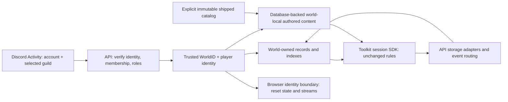
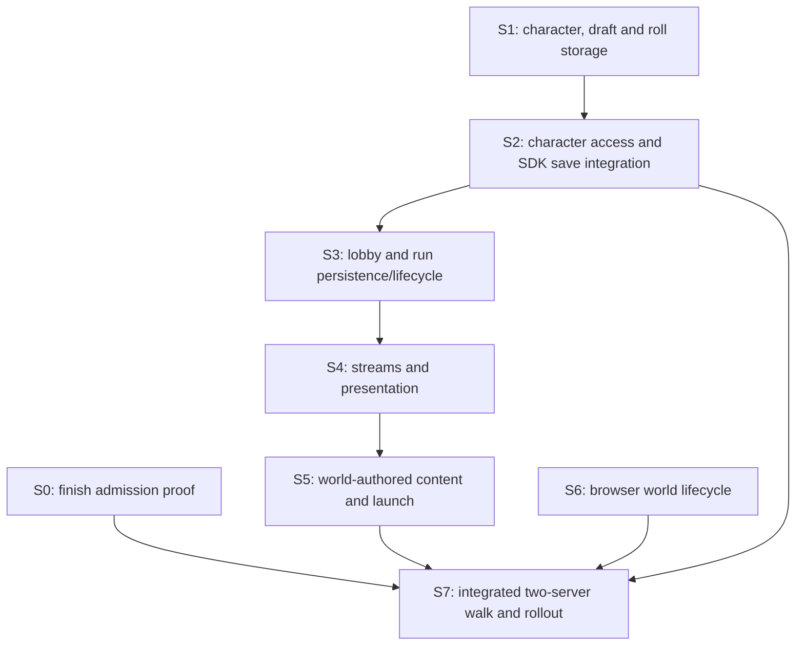

# Discord worlds — verified implementation and delegation plan

## Brief and authority

Run one independent game world per Discord server, with the same Discord user
able to play in both without sharing characters, possessions, progression,
authored content or running games. **WorldID = Discord GuildID.**

Authority: [parent #518](https://github.com/KirkDiggler/rpg-project/issues/518),
its agreed boundaries and completion proof, and the operator's request to review,
verify and prepare individual implementation handoffs. This is a working plan,
not a new design law or permission to merge. No implementation started in this
planning pass. Create scoped sub-issues under #518 only as implementation starts;
S0 continues [#514](https://github.com/KirkDiggler/rpg-project/issues/514).

Keep API-owned access/storage separate from toolkit-owned rules. Reuse verified
`worldcontext.Value`, preserve global Discord identity, and keep SDK persistence
payloads opaque. No blanket WorldID addition to gameplay protobufs. Business
Input/Output contracts remain with their owning orchestrators/repositories;
handlers may declare narrow consumer interfaces. Read the owning instructions
and [working agreements](../../docs/teams/roles/working-agreements.md) at dispatch.

Non-goals: billing, player/concurrency quotas, role discovery, bot installation,
character transfer, multiple worlds per guild, a new rewards/admin-grant feature,
a new guild-picker UI, distributed event delivery, cross-server dungeon sharing,
a schema-generated editor form, or a general storage rewrite. Sharing and
schema-driven forms are future directions, not prerequisites for database storage.
Unimplemented character RPCs need not become implemented to close this goal.

### Existing agreed shape, carried forward



## Inspected baseline and findings

Planning date: 2026-10-01. Inspection used freshly fetched worktrees, **not** the
older shared checkouts. Re-fetch and inspect intervening changes before dispatch.
Paths below are relative to the named repository.

| Repository/provider | Revision inspected |
|---|---|
| rpg-project | `c0010a0ee18a10aca7595c4bec9d953e646e8e34` (`origin/main`) |
| rpg-api | `fa1a0779c96ff2c64ab896a3a8b487fb80a22f2b` (`origin/dev`) |
| rpg-dnd5e-web | `9cfd4ca61da4b9c014f90d3cc996d71920fd46b1` (`origin/dev`) |
| rpg-api-protos | `729defeb708542ac2e2cc142ad64b08572e5ee6c` (`origin/main`) |
| API's consumed session SDK | `rulebooks/dnd5e/session v0.112.0`, repository interfaces and Manager implementation in the Go module cache |

| Finding | Evidence at the revisions above | Consequence |
|---|---|---|
| Admission/configuration exists; it is not resource isolation | API `internal/auth/role_interceptor.go`, `role_policy.go`, `world_management_interceptor.go`; `internal/worldcontext/context.go` | Extend resource ownership below the existing gates; do not rebuild Discord auth. |
| Parent publication status is stale | API #1065 merged; protos #366 merged/published v0.1.216; web #1214 merged at `9cfd4ca6`; game-dev #111 remains OPEN | Only launcher publication and actual Discord proof remain in #514's recorded completion work. |
| Character/draft entities wrap toolkit data without WorldID | API `internal/entities/character.go:9`, `character_draft.go:9`; repositories' `repository.go` and `redis.go` | Add API ownership metadata, world-scoped keys and indexes. |
| A draft in another world can replace the same player's draft | API `internal/repositories/character_draft/redis.go:89-120` keys replacement by player alone | Scope replacement, TTL cleanup and mapping deletion, not just listing. |
| Several legacy direct-ID methods do not even bind the owner | API `internal/handlers/dnd5e/v1alpha1/character/handler.go`: `GetCharacter`, `DeleteCharacter`, `GetCharacterInventory`, `EquipItem`, draft mutations/finalization | Close both world and player boundaries on every implemented method, including legacy routes. |
| Existing v2/level-up gates compare player only | API `internal/handlers/dnd5e/v2/character/handler.go:185`; v1 `level_up.go:345` | Same account in two worlds is the essential negative test. |
| Session character saves reconstruct the API wrapper | API `internal/orchestrators/session/character_repo.go:58-62` | Preserve WorldID through SDK-driven XP, recovery, inventory and progression writes. |
| Ability-score roll state is another mutable creation input | API `internal/repositories/dice_session/redis.go:213`; `internal/orchestrators/character/orchestrator.go:482`; `internal/handlers/api/v1alpha1/dice_handler.go` | Scope stored rolls and their application; a foreign roll ID must not become valid in this world's draft. |
| Lobby/resume is global by player | API `internal/repositories/lobby/redis.go:52-136`; `internal/orchestrators/lobby/get_my_active_lobby.go` | Include world in records, join lookup, player indexes and cleanup. `CampaignID` is not a substitute for WorldID. |
| Session/encounter adapters store raw SDK data by global ID | API `internal/orchestrators/session/redis_repos.go:22-119` | Host-owned envelopes and scoped keys can enforce ownership without an SDK contract change. |
| StreamEvents bypasses the Manager | API `internal/handlers/dnd5e/session/v1alpha1/stream_events.go:18-36` checks character owner, then subscribes by session/member | Require session-world and exact seat validation before subscription; changing SDK repositories alone is insufficient. |
| Lobby disconnect loses request values | API `internal/handlers/dnd5e/lobby/v1alpha1/stream_lobby.go:70` creates `context.Background()` | Preserve the already verified world on bounded cleanup; do not let detached callbacks acquire a default world. |
| Dungeon registry is one mutable namespace | API `internal/dungeons/registry.go`: `entries`, `putLocks`, `List`, `Get`, `Put`; `cmd/server/server.go:344-378` seeds shipped files into writable directory | Separate explicit shipped content from world-authored storage; include compile cache and per-key locks. |
| Browser isolation is partial | Web `src/App.tsx:100-176` isolates composition source; `useMyActiveLobby.ts` keys by player; `useDungeonScene.ts:159` by dungeon key/client; `draftStorage.ts:49` by mode | Add a whole-game identity boundary, stale-response fences and scoped local drafts. |

### Verification actually run

From the inspected API worktree:

```sh
go test ./internal/auth ./internal/repositories/character ./internal/repositories/character_draft ./internal/repositories/lobby ./internal/repositories/composition ./internal/orchestrators/session ./internal/handlers/dnd5e/sessionaccess ./internal/integration/world
```

All eight packages returned `ok`. These are **baseline regression/admission
checks**, not proof of the proposed cross-world behavior. No web suite, full API
CI gate or live Discord walk was run in this planning pass. Existing world
integration uses real gRPC, Redis adapters and an HTTP Discord fixture; its
session stream is a role-gate test server, not the real gameplay handler.

## Decisions and readiness

1. **Legacy data disposition — SETTLED: clean reset, no preservation.**
   KirkDiggler confirmed that this runs only on their Discord server and no
   existing data needs preservation. Plan a database reset at cutover; do not
   build migration, backfill, backup/quarantine requirements or compatibility
   reads. World configuration and compositions need not survive either: repeat
   owner bootstrap and seed only deliberate new-world fixtures after reset.
   Old ownerless records must never be assigned to whichever world reads first.
   Legacy server-authored files and unscoped browser drafts may be discarded;
   immutable shipped content and source repositories are not reset targets.
   This settles the data policy, not the timing of a destructive operation.
   No running database is reset during planning; S7 identifies the exact target
   and performs the reset as part of the coordinated cutover.
2. **Authored ownership and storage — SETTLED: server-owned database records.**
   KirkDiggler confirmed that editing a shipped dungeon creates a version owned
   by that server; cross-server sharing is a later feature. Resolve the selected
   world's key first, then the explicit immutable shipped catalog. Saving never
   changes the shared original. The operator's main persistence requirement is
   database storage, with content type and optional record-level comments; either
   YAML or JSON content is acceptable. This supersedes this plan's first proposal
   for per-world writable directories. S5 introduces an API-owned repository,
   initially Redis, carrying the authored document rather than a compiled run.
   Keep the existing YAML wire/editor path initially, stamp `application/yaml`,
   and do not force a format conversion for assumed size savings. Schema-driven
   forms and JSON import/export can be separate consumer-led work; no second
   content format is advertised until its codec and round-trip are implemented.
3. **Live inputs — required for S0/S7, not a code-design blocker.** Two guilds,
   their owners/role IDs, consenting test members, and a reachable Discord
   Activity are needed. Local Dev fixtures do not establish real membership.
4. **No measured proto/toolkit change is required.** The consumed SDK repositories
   receive `context.Context`; the Manager holds capabilities, not cached game
   state, and passes context to storage/event calls. Keep WorldID in the host.
   If an implementation finds a real lost-context/provider capability gap,
   report that seam; do not add guild ownership to game rules speculatively.

## Sequence and delegation boundaries



- Start with **S1+S2 as the character outcome slice**, the recommended next child
  of #518. They are two bounded handoffs on one API branch, not independently
  deployable partial protections. Consumer tests/contracts in S2 drive S1;
  storage then adapter integration is the commit/test sequence.
- **S3+S4 form the run outcome slice**, on one API branch based on the completed
  character slice. **S5 is the content outcome slice.** Serial API ownership is
  intentional: session adapters, launch and handler fixtures overlap. Do not
  dispatch concurrent writers to these files or multiply branches for fixes
  found within the same slice.
- One **web owner for S6** may work in parallel with API after these contracts are
  published; S0's live proof can proceed alongside both. Land/adopt API provider
  changes before claiming the joined web behavior. Do not postpone browser
  isolation until after declaring backend multi-server readiness.
- Bases: API/web `origin/dev`, project `origin/main`; isolated
  `.worktrees/discord-world-characters`, `discord-world-runs`,
  `discord-world-content`, `discord-world-ui` as the respective work starts.
  Assign one writer per branch/worktree; hand the next worker its predecessor's
  commit and evidence. No automatic merges or environment resets.
- Develop outside-in; merge inside-out. No scheduled proto/toolkit wave. If a
  measured contract change is approved, protos publish through CI, toolkit
  providers release, then API/web adopt released pins and recheck. No local proto
  generation and no pseudo-version pins in a merge-ready consumer.
- Each feature PR gets the applicable single independent review round, reusing
  evidence and resolving findings; do not add repeated automatic review rounds.
  S7 reconciles that evidence rather than rerunning a review ceremony by default.

## Common task contract

The fields below apply to every task. Proposed test names/new paths are labeled
as such. Commands run in that task's isolated repository worktree unless stated
otherwise. Focused tests are expected to PASS after implementation; none of the
new test results are claimed here. Docker must be available for the existing
character integration/TestMain harness and full API gate. Coordinate one
Docker-backed integration runner at a time; reuse the package-owned Redis
container rather than spawning one per test. The baseline world fixture above
uses miniredis and does not substitute for those container-backed checks.

For each implementing handoff:

- [ ] Add the named assertions; demonstrate at least one fails against the old behavior.
- [ ] Implement only the assigned seam and its compile-required callers/mocks/fixtures.
- [ ] Run the focused checks and the joined provider/consumer check named below.
- [ ] Update the owning architecture/status documentation invalidated by the change.
- [ ] Run API `make ci-check` or web `npm run ci-check` at the PR boundary, not after every edit.
- [ ] Report files, commit, exact commands/results, deviations, blockers and PR evidence.

Do not silently expand a task into a new public contract, owner, lifecycle or
user-visible behavior. Ordinary implementation choices within the contracts
below need no further approval. S0 and S7 are proof tasks, not artificial
red/green coding exercises.

### S0 — Finish existing admission/configuration slice

**Delivers:** R1/R2 below; actual Discord identity/owner/role evidence.
**Owner:** Existing #514; platform coordination, no replacement implementation.
**Prerequisites:** Live guild/member inputs; reconciled publication state.
**Files:** Existing API `internal/integration/world/access_test.go`, web
`src/world/WorldAccessSettings.tsx`, `src/discord/DiscordProvider.tsx`; existing
root `envs/local/world-access.env` and runbook remain local. No new file required
unless the live walk identifies a defect.
**Interfaces:** Existing `GetWorld`, owner-only `SetWorldRoles`, delegated
`SetWorldMemberRoles`; `x-rpg-guild-id`; OAuth `guilds` and `guilds.members.read`.
**Behavior/tests:** In both guilds, owner boots an unconfigured world; two members
of the configured admin role can configure builder/player access but cannot
replace admin authority. Builder can build/play but not configure; player cannot
build; no-role and non-member cannot enter. Remove Discord roles and observe
unary denial and idle stream cancellation within the configured refresh bound.
Owner consent denial/missing scopes produces a reconnect/setup refusal, not a
fallback identity.
**Verification:** Reconcile #1214 as merged and #111's publication separately;
run `go test ./internal/integration/world ./internal/auth` if code changes.
Use the real Activity for the above matrix; record actor role (not tokens), guild,
action/result, build refs and revocation elapsed time in #514.
**Completion evidence:** Published/adopted paired work, actual Discord matrix;
leave #514 open if live proof is incomplete. No permission to merge #111 implied.

### S1 — World-owned character, draft and creation-roll storage

**Delivers:** R3/R4/R8 storage foundation, including draft replacement and rolls.
**Owner:** API `entities`, `repositories/character`, `character_draft`, `dice_session`.
**Prerequisites:** Verified world context exists; clean-reset disposition above
is settled. S2's caller requirements below are the consumer contract.
**Files:** Modify `internal/entities/character.go`, `character_draft.go`;
`internal/repositories/{character,character_draft,dice_session}/{repository.go,redis.go,redis_contract_test.go}`;
regenerate their existing `mock/` files. Proposed new regression files:
`internal/repositories/{character,character_draft,dice_session}/world_test.go`.

**Interfaces:** Add `WorldID string` (`json:"world_id"`) to API character/draft
wrappers and `DiceSession`, not toolkit `character.Data`/`DraftData`. Add mandatory
`WorldID string` to repository operation inputs, including reads, deletes, lists,
patches and create/update; where an existing operation takes the stored object,
its ownership field is mandatory. Input and stored WorldID must agree.
Return types retain their current payloads, error sentinels and equipment version
semantics. Use world-scoped record/index key builders; the tuple of
(world, record ID), (world, player ID), (world, session ID), or
(world, dice entity ID, dice context) must be unambiguous. No old-key lookup on a
miss. Keep generated resource IDs opaque and their existing generation behavior.

**Behavior:** Ownership cannot be moved by Update/Patch; reject attempts to change
stored player/world ownership. Read missing/foreign world as NotFound; reject an
empty world before I/O; report malformed stored envelopes as storage corruption,
not empty success. Character index iteration verifies the returned world and
requested player/session association. Draft create replaces only that player's
draft in that world; deletion/expiry cleans only its scoped mapping. Preserve
TTL policy and equipment CAS/condition replacement. Dice updates retain remaining
TTL; a roll ID from A is not available to B's assignment step.

**Tests (proposed):** `TestSamePlayerSeparateWorldLists`,
`TestForeignWorldDirectOperationsDoNotWrite`, `TestOwnershipCannotMove`,
`TestDraftReplacementStaysInWorld`, `TestAbilityRollsStayInWorld`,
`TestLegacyKeysAreNotFallback`, `TestCorruptOwnershipDoesNotLeak`, and a scoped
variant of the existing equipment CAS/rollback tests. Seed A/B with the same
player, distinct owned characters, and deliberately poisoned index references;
assert exact returned sets and byte-for-byte unchanged foreign records/indexes.

**Verification:** `go test -race ./internal/repositories/character ./internal/repositories/character_draft ./internal/repositories/dice_session`.
S1 is an intermediate handoff: compilation/caller adoption finishes in S2 on the
same branch; do not publish S1 alone as an effective boundary.
**Completion evidence:** Schema/key table, legacy treatment, passing adapter
contract tests, exact interface diff and commit for S2.

### S2 — Enforce character ownership through RPCs and SDK saves

**Delivers:** R3/R4/R8: complete character slice, not merely hidden list entries.
**Owner:** API character/dice application boundary and session character adapter.
**Prerequisites:** S1 storage contract; keep SDK session v0.112.0 behavior intact.
**Files:** `internal/orchestrators/character/{service.go,orchestrator.go,view.go}`;
`internal/handlers/dnd5e/v1alpha1/character/{handler.go,level_up.go}`;
`internal/handlers/dnd5e/v2/character/handler.go`;
`internal/handlers/api/v1alpha1/dice_handler.go`;
`internal/orchestrators/dice/{types.go,orchestrator.go}`;
`internal/orchestrators/session/{character_repo.go,character_repo_test.go}`;
`internal/handlers/dnd5e/sessionaccess/access.go`;
`internal/orchestrators/lobby/character.go`; related existing tests/mocks;
`internal/sandboxseed/` and its CLI callers. Proposed integration test:
`internal/integration/character/world_isolation_test.go`.

**Interfaces:** Handlers take world only from `worldcontext.Get(ctx)` and player
from `auth.GetPlayerID(ctx)`. Character orchestrator resource-operation inputs
carry `WorldID` and `PlayerID` alongside the existing ID/choice fields; list/create
inputs gain WorldID. Reuse existing player fields, do not introduce a parallel
services package. Catalog-only operations need no stored-world field. All private
character/draft operations validate both owners before projection or mutation.
The SDK-facing `GetCharacter(ctx,id)`/`SaveCharacter(ctx,data)` signatures stay
unchanged: the adapter derives the trusted world from ctx, uses S1's repository
inputs, and preserves ownership on full writes. It must NOT restrict all SDK
saves to the invoking player: a party action can legitimately save another
member's character **in the same verified world**.

**Behavior:** Cover every implemented legacy and v2 direct-ID read/update/delete,
finalize, appearance, inventory/equip/unequip and level-up path. Foreign/missing
private character/draft returns indistinguishable NotFound, with no write or SDK
verb. Missing trusted context fails closed; no `test-world` production default.
Finalization stamps world from the owned draft. `SaveCharacter` loads/preserves
the wrapper (including immutable player ownership), replaces only toolkit data,
and refuses missing/foreign records instead of creating or rehoming them.
`resolveCharacter` and sessionaccess's ownership lookup adopt scoped reads now;
run ownership is S3/S4. Dice business inputs carry world; the currently measured
creation consumer sends `entity_id = playerId` with `context = ability_scores`.
Bind that path to the authenticated player and refuse a supplied different
player; never use a client entity ID as authority. Keep non-creation dice state
world-scoped without inventing a generic entity ownership model.

**Tests (proposed):** `TestCharacterRPCWorldMatrix`: same account A/B plus second
player; every implemented resource RPC refuses A's ID under B and the wrong
player under A; positive operations still succeed. `TestFinalizePreservesWorld`,
`TestSDKSavePreservesOwnership`, `TestSameWorldPartySaveAllowed`,
`TestForeignRollAssignmentRejected`, `TestLegacyV1EquipmentCannotBypassOwner`.
Use actual Redis adapters plus real SDK NextLevel/LevelUp for the joined save
path. Prove inventory/currency/known-spell/XP fields survive the scoped round trip;
actual reward/loot/trade flows are also required in S7. Do not implement missing
AddToInventory/RemoveFromInventory RPCs as a shortcut to the proof.

**Verification:** `go test -race ./internal/orchestrators/character ./internal/orchestrators/dice ./internal/orchestrators/session ./internal/handlers/dnd5e/v1alpha1/character ./internal/handlers/dnd5e/v2/character ./internal/handlers/api/v1alpha1 ./internal/handlers/dnd5e/sessionaccess ./internal/integration/character`.
Run `make ci-check` at publication for the full-suite/compile gate, including all
adapters, seeders and generated mock callers. Seeders must receive an explicit
world, not write new ownerless records.
**Completion evidence:** Direct-method inventory with tested/not-implemented
status, same-player A/B proof, SDK-save proof and finalized legacy decision.

### S3 — World-local lobby, resume and run persistence

**Delivers:** R5/R8: same account can have independent lobbies/runs and resume.
**Owner:** API lobby lifecycle and SDK session/encounter storage adapters.
**Prerequisites:** S2, legacy disposition; SDK context-bearing repository contracts.
**Files:** `internal/repositories/lobby/{repository.go,redis.go,in_memory.go}`
and their tests; `internal/orchestrators/lobby/{create_lobby.go,join_lobby.go,set_ready.go,leave_lobby.go,set_connected.go,get_my_active_lobby.go,abandon_encounter.go,start_encounter_session_stack.go,character.go}`;
`internal/handlers/dnd5e/lobby/v1alpha1/` caller bindings;
`internal/orchestrators/session/{redis_repos.go,redis_repos_contract_test.go,orchestrator.go}`;
`internal/integration/harness/` fixture construction and affected session tests.
Proposed new `internal/orchestrators/lobby/world_test.go` and
`internal/orchestrators/session/world_repos_test.go`.

**Interfaces:** Add WorldID to lobby `Data`, and required WorldID to lobby
business inputs. Replace the touched positional repository operations with
Input/Output forms: `GetInput{WorldID,ID}`/`GetOutput{Data}`,
`GetByJoinRefInput{WorldID,JoinRef}`/`GetByJoinRefOutput{Data}`,
`GetByPlayerIDInput{WorldID,PlayerID}`/`GetByPlayerIDOutput{Data}`,
`SaveInput{WorldID,Data}`/`SaveOutput{}`, and
`ClearPlayerIndexInput{WorldID,PlayerID}`/`ClearPlayerIndexOutput{}` (string fields,
`Data *lobby.Data`). Return existing ErrNotFound semantics; use pointer
Input/Output parameters consistently for these newly reshaped operations.
SDK SessionRepository/EncounterRepository signatures remain unchanged. Store
API envelopes containing WorldID and the opaque typed SDK data; derive world
from trusted ctx for each get/save and namespace both record types. Validate
stored world/key identity when loading. Do not rename SDK `World` (encounter
state) into Discord WorldID; these are different concepts.

**Behavior:** Stamp lobby at create; require matching world before all ID/join-ref
operations. Resolve every selected character under that world and player. Carry
verified context through StartSession/Join and SDK save/load. Scope player resume
and all index cleanup, including leave/abandon/stale-run handling. Preserve
existing same-world lifecycle semantics and TTLs; do not introduce a new
multi-lobby product policy. Foreign/legacy session is missing in the requested
world; no cross-world resume or default-world read. Use world+ID for host locks
where keyed; preserve generated opaque globally unique run IDs.

**Tests (proposed):** `TestSamePlayerTwoActiveWorlds`,
`TestForeignJoinRefAndCharacterRejected`, `TestForeignLobbyLifecycleRefused`,
`TestScopedResumeSurvivesRestart`, `TestCleanupDoesNotClearOtherWorld`,
`TestSDKRunRoundTripScoped`, `TestForeignSessionReadAndMutationRefused`,
`TestOwnerlessRunNeverResumes`. Assert GetMyActiveLobby(A)=run A,
GetMyActiveLobby(B)=run B, ending A leaves B intact, and a handler in B cannot
read/act on A even when caller owns a character in each world.

**Verification:** `go test -race ./internal/repositories/lobby ./internal/orchestrators/lobby ./internal/orchestrators/session ./internal/handlers/dnd5e/lobby/v1alpha1 ./internal/integration/session`.
**Completion evidence:** Persisted world envelopes/indexes after restart; working
launch on shipped content; no unaudited ownerless fixture callers. Streaming
completion depends on S4; do not claim the run slice closed yet.

### S4 — Gate and scope streams, presence cleanup and presentation

**Delivers:** R5/R7, including direct subscriptions and stale/idle stream behavior.
**Owner:** API event/access boundary; continuation of the S3 branch.
**Prerequisites:** S3 world-scoped session/lobby reads and S2 character lookup.
**Files:** `internal/handlers/dnd5e/sessionaccess/{access.go,access_test.go}`;
`internal/handlers/dnd5e/session/v1alpha1/{stream_events.go,stream_events_test.go}`;
`internal/handlers/dnd5e/lobby/v1alpha1/stream_lobby.go`;
`internal/orchestrators/{session,lobby}/broker.go` and broker tests;
`internal/orchestrators/sessionpresentation/{service.go,orchestrator.go}`;
`internal/repositories/sessionpresentation/{repository.go,redis.go,redis_test.go}`;
`internal/handlers/dnd5e/sessionpresentation/v1alpha1/`;
proposed `internal/integration/world/streams_test.go`.

**Interfaces:** Reuse `CallerMemberSeated(ctx,session,member)` before session and
presentation subscriptions: scoped character ownership + scoped SDK Roster's
exact player seat. `CallerSeated` must consume S3's scoped roster reads.
Broker subscription Input/Output contracts gain WorldID with existing
session/recipient or lobby IDs (`SubscribeInput`, `SubscribeOutput{Subscription}`).
Lobby publish likewise takes a world-bearing `PublishInput`; SDK
`EventStream.Publish(ctx,[]sdk.Event) error` remains unchanged and obtains world
from ctx. World+session+recipient and world+lobby are distinct routing keys;
include world in lag counters and cleanup keys. Presentation operation inputs
and Redis publish/subscribe/idempotency keys include WorldID, preserving the
existing payloads, attempt identity and TTL.

**Behavior:** Refuse unauthorized subscription before sending any bytes.
For lobby snapshot-first ordering, validate world/member before opening the
broker, then retain subscribe-before-snapshot ordering and SetConnected's
revalidation. On disconnect retain only the verified world needed for the
bounded presence cleanup (e.g. `context.WithoutCancel` on the already sanitized
context plus existing timeout); never recover it from client metadata or default
it. Existing role renewal continues to cancel idle streams. No SDK event
visibility re-derivation; namespace and gate delivery, preserve recipient content.

**Tests (proposed):** `TestForeignWorldStreamsEmitNothing`,
`TestOwnedCharacterNotSeatedCannotSubscribe`, `TestScopedBrokerRoutesAndCloses`,
`TestPresentationAttemptIndependentAcrossWorlds`,
`TestDisconnectPreservesVerifiedWorld`, `TestRealGameplayIdleStreamRevocation`.
Use the same session/member identifiers in broker tests to prove namespacing,
not just different random IDs. Register real gameplay/presentation handlers in
the composed auth fixture; subscription should fail before any snapshot/event,
and removing a role must close an otherwise idle actual stream.

**Verification:** `go test -race ./internal/handlers/dnd5e/sessionaccess ./internal/handlers/dnd5e/session/v1alpha1 ./internal/handlers/dnd5e/lobby/v1alpha1 ./internal/orchestrators/session ./internal/orchestrators/lobby ./internal/orchestrators/sessionpresentation ./internal/repositories/sessionpresentation ./internal/integration/world ./internal/integration/sessionpresentation`.
**Completion evidence:** No cross-world bytes, same-world fanout preserved,
disconnect/index state correct, and bounded revocation timing recorded.

### S5 — Database-backed authored content, catalog resolution and launch

**Delivers:** R6/R8/R10; server-owned source records with content type/comments;
same key in two worlds survives save, restart, launch and render.
**Owner:** API dungeon repository, content compilation/resolution, authoring and
launch integration. Toolkit retains document validation and game rules.
**Prerequisites:** S3/S4; database and world-local copy-on-write decisions above
are settled. Legacy authored files are reset, never adopted as shared content.
**Files:** New `internal/entities/dungeon.go` and
`internal/repositories/dungeon/{repository.go,redis.go,redis_test.go}` with
consumer-driven mocks; modify `internal/dungeons/{registry.go,registry_test.go,seed.go,seed_test.go}`;
`internal/orchestrators/authoring/orchestrator.go`;
`internal/handlers/dnd5e/authoring/v1alpha1/{get_dungeon.go,put_dungeon.go}`;
`internal/orchestrators/lobby/{list_dungeons.go,start_encounter_session_stack.go}`;
`cmd/server/server.go`; new `internal/dungeons/world_registry_test.go`;
existing `internal/orchestrators/lobby/start_encounter_dungeon_key_test.go`.

**Interfaces:** Proposed `entities.Dungeon` has string fields `WorldID`, `Key`,
`Name`, `ContentType`, `Content`, `Comments`, JSON keys `world_id`, `key`, `name`,
`content_type`, `content`, `comments`. Name comes from the validated authored
source, not an independently editable competing title. Content is UTF-8 source
text, not a base64-encoded byte slice or compiled encounter payload. Comments
are optional record metadata (empty is valid), not extracted/synchronized YAML
comments. Keep inline source text intact for the current editor contract.

Repository `Get(ctx,*GetInput{WorldID,Key}) (*GetOutput{Dungeon *entities.Dungeon},error)`,
`List(ctx,*ListInput{WorldID}) (*ListOutput{Dungeons []*entities.Dungeon},error)`,
`Save(ctx,*SaveInput{WorldID,Dungeon *entities.Dungeon}) (*SaveOutput{Dungeon *entities.Dungeon},error)`;
WorldID/Key fields are strings. JSON records live in a world-scoped Redis hash
`dungeon:v1:<WorldID>`, with dungeon key as the field; atomic HSET replaces the
complete record, no TTL. Require nonempty world/key, matching stored ownership
and record key; Get misses return a specific NotFound error, lists return empty
slices, I/O/corruption remains an error. Never enumerate other worlds.

Registry consumes explicit WorldID: proposed
`List(ctx,*ListInput{WorldID}) (*ListOutput{Dungeons []Summary},error)`,
`Get(ctx,*GetInput{WorldID,Key}) (*GetOutput{Entry *Entry},error)`;
existing `PutInput` gains WorldID, result preserves Entry/Errors. Authoring
GetDungeon/PutDungeon inputs and lobby ListDungeons input gain WorldID; launch
uses the lobby's verified world. Existing PutDungeon.yaml/GetDungeon.yaml and
GetAtlas.dungeon_key stay unchanged: the current ingress produces content type
`application/yaml`. Preserve existing record Comments on a YAML-only update;
new saves use empty Comments until an actual metadata-editing consumer exists.
No comments editor, schema-form engine or speculative proto fields in this slice.

**Behavior:** Compile/validate before saving to the dungeon repository; commit
the complete authored source only on success. Preview remains no-write. Load
world-authored source from the database and compile through the existing toolkit
path for editor preview/launch. Initially support `application/yaml`; reject
unsupported stored content types explicitly rather than guessing a parser or
falling through to shipped content. The discriminator permits later codecs, not
an untested promise that JSON works today. A failed save leaves the old document;
a failed load is not a successful empty dungeon or a shipped fallback.

Use the shipped/image catalog read-only. Saving a shipped key writes the selected
world's database record, leaving shared bytes and every other world unchanged.
List returns the world-visible union with one row per key; get/launch/render use
the same world-first resolver. Fall back to the shipped catalog only on a genuine
world-record miss, never on storage/compile errors or missing world identity.
Keep runtime session/encounter JSON separate; gameplay mutations never update
the authored source record.

Remove filesystem writes/seeding of mutable authored content from server wiring;
`RPG_CONTENT_DIR` must no longer be an alternate authored source of truth. Keep
explicit shipped-directory loading and validation of the shared default. Do not
load all worlds at startup. Read world records on demand; initially compile on
read rather than retaining a process-long authored cache that misses another
writer's updates. Shared immutable compiled entries may remain cached. No
filesystem fallback and no dual-write migration.

**Tests (proposed):** Repository `TestDungeonRecordRoundTrip` checks all six
fields, optional Comments, no TTL and JSON without base64 source;
`TestDungeonOwnershipMismatchRejected`, `TestDatabaseFailureNotNotFound`.
Registry `TestSameKeyDifferentWorldDocuments`, `TestWorldCatalogAndLaunchAgree`,
`TestShippedBytesNeverMutated`, `TestWorldOverrideIsLocal`,
`TestValidateOnlyWritesNothing`, `TestWorldContentReload`,
`TestUnknownKeyDoesNotFallAcrossWorlds`, `TestUnsupportedContentTypeRefused`,
`TestYAMLSavePreservesRecordComments`, `TestFreshReaderSeesDatabaseSave`.
A/B each save `trial-room` with distinct name/layout; construct a fresh registry
against the same database with no authored files and assert Get/List/launch
still resolve correctly. Test that Redis errors/corrupt world records never
expose a shipped dungeon under the same key. Existing composition foreign-world
selector checks remain in force for rendering.

**Verification:** `go test -race ./internal/repositories/dungeon ./internal/dungeons ./internal/orchestrators/authoring ./internal/handlers/dnd5e/authoring/v1alpha1 ./internal/orchestrators/lobby ./internal/repositories/composition ./cmd/server`.
S7 pairs web GetDungeon rendering with launch, and checks Redis persistence/volume
configuration plus a database-service restart: no TTL alone is not durability.
**Completion evidence:** Inspected database source records, fresh-process load,
no authored-file dependency, selected-world launch/render agreement, no new proto
field. Update the owning repository/data-model and content configuration docs.

### S6 — Browser world/auth lifecycle and scoped local drafts

**Delivers:** R7 plus client proof for R3/R5/R6. UI hiding is never the server gate.
**Owner:** Web application identity boundary; one web worker may run alongside API.
**Prerequisites:** Existing Discord auth epoch and guild metadata; S2-S5 are needed
for joined proof, not initial UI regression tests. No new guild-selection feature.
**Files:** `src/App.tsx`, `src/discord/{DiscordProvider.tsx,types.ts}` as needed for
observable identity; `src/api/{auth.ts,client.ts,hooks.ts,useMyActiveLobby.ts,useCharacterData.ts}`;
`src/character/creation/useCharacterDraft.ts`; `src/components/session/{SessionEncounterView.tsx,useDungeonScene.ts,useSessionEventStream.ts}`;
`src/api/useLobbyStream.ts`; `src/author/{AuthorView.tsx,DungeonBuilder.tsx,draftStorage.ts}`;
existing tests at those seams. Proposed `src/App.worldIsolation.test.tsx` and
`src/api/gameIdentity.ts` with tests for a shared identity value.

**Interfaces:** One `GameIdentity` value containing auth kind, player ID,
WorldID (Discord guild or explicitly configured dev world) and authSessionId;
its opaque `scopeKey` is an unambiguous serialization, never a credential/token.
Use this identity to key the stateful game subtree and scope per-world request
caches, rather than adding WorldID to gameplay RPC messages. `useCharacterData`'s
existing `ownerScope` receives that key instead of player ID only.
`useMyActiveLobby` takes a scope identity as well as player readiness. Local draft
functions consume `DraftScope{worldId,playerId}` plus existing mode; persistence
keys intentionally exclude the credential epoch so a same-user/world reload can
restore a draft. No anonymous/global draft fallback.

**Behavior:** On guild/player/auth-epoch change, before rendering old content,
clear selected character/draft, lobby/run IDs, resume state, authoring document,
atlas/scene/roster/story/presentation state. Tear down old streams and retry timers;
fence late success, error and mutation callbacks so A cannot repopulate B or
trigger a follow-up write carrying B's credentials for A's resource. Revalidate
admission and refetch B's data. World-scoped draft autosave must not write the
old document under the new world's key. Keep A's saved local draft recoverable
when returning to A. Old unscoped local drafts are not silently adopted; discard
only the known legacy game-draft keys under the settled reset policy. Immutable
rule catalogs and personal theme/layout preferences may remain shared.

**Tests (proposed):** In `App.worldIsolation.test.tsx`, same player switches A→B
while A list/resume/scene/mutation responses and stream events are held pending;
first B render shows no A data, late callbacks cannot route to A, B requests carry
B's header and A streams are canceled. Also test sign-out, different player,
same-guild reauthentication and return to A. Extend `useMyActiveLobby.test.ts`,
`useCharacterData.test.ts`, `draftStorage.test.ts`, `DungeonBuilder.test.tsx` with
these scoped assertions; same mode in A/B has independent saved YAML; debounced
A autosave cannot overwrite B; a missing world does not send gameplay requests.

**Verification:** `npm run test:run -- src/App.worldIsolation.test.tsx src/api/useMyActiveLobby.test.ts src/api/useCharacterData.test.ts src/author/draftStorage.test.ts src/author/DungeonBuilder.test.tsx src/discord/DiscordProvider.test.tsx src/api/client.test.ts`;
`npm run ci-check` at PR boundary. Render-check the running two-world fixture via
the workspace screenshot tool; mocked hook passes alone do not establish it.
**Completion evidence:** Identity transition tests, scoped browser storage keys,
stream cleanup, screenshots and joined API proof after adopting S2-S5.

### S7 — Integrated same-player/two-server proof and rollout

**Delivers:** R1-R10 together; no isolated-unit-test substitution for this task.
**Owner:** Platform integration, with API/web fixes returned to the owning slice.
**Prerequisites:** S0-S6 complete, both decisions above recorded, review findings
disposed, released pins and runtime build refs known. Live guild/member inputs.
**Files:** Proposed `internal/integration/world/isolation_test.go` in API, extending
`access_test.go`'s real auth/provider/Redis setup with actual character, lobby,
session, presentation and authoring handlers. Add a tracked operational runbook
`rpg-project/docs/howto/discord-worlds.md`; keep run evidence in #518, not that
how-to. Local `envs/local/discord-worlds.env`/fixtures remain local. If launcher
or deployment changes are needed, inspect their owning instructions/worktrees
first rather than editing the root checkout.

**Interfaces/fixtures:** Two worlds A=`123456789012345678`,
B=`223456789012345678`; identical authenticated player P in both, another player Q,
independent owners/roles; all tests share one API instance and one Redis namespace.
HTTP Discord fixture verifies the selected guild for the same token. Dev auth's
fixed `RPG_DEV_WORLD_ID` ignores arbitrary selectors: two disconnected dev stacks
alone are not shared-backend isolation proof. Use the composed Discord fixture
for automated tests and real Discord for final admission proof.

**Behavior/tests:** Proposed `TestTwoWorldJourney` creates drafts/characters in
both worlds, attempts every foreign direct-ID operation, creates independent
lobbies/runs, changes only A's inventory/currency/scroll/known spell/XP through
existing SDK game verbs/appropriate deterministic fixtures, and verifies B's
records remain unchanged. Cover Trade/Unpack/Loot and advancement save seams,
not a new grant RPC. Save `trial-room` differently in A/B; launch both and fetch
world-correct atlas and authored presentation. Publish events/dice presentation
in A while B listens; B receives none. Restart API against the same stores and
repeat lists/resume/content checks. Inspect the dungeon's content_type/content/
comments record and prove authored dungeons reload without writable content
files. In the isolated stack, restart Redis with its configured persistence and
volume retained and confirm saved records survive; do not confuse an API-only
restart or Redis no-TTL key with database durability. Parameterized resource-method coverage must
include reads, mutations, and all three stream families.

**Verification:** `go test -race ./internal/integration/world ./internal/integration/character ./internal/integration/session ./internal/integration/sessionpresentation`;
API `make ci-check`, web `npm run ci-check`, CI on the final heads. Workspace stack
commands run from `/home/kirk/game-dev` (root checkout):
`scripts/dev-env.sh up local/discord-worlds` and
`scripts/dev-env.sh status local/discord-worlds`, after preparing the local
manifest and reconciling launcher #111. Browser render proof uses
`node tools/browser/screenshot.mjs <running-url> <output.png>` with concrete
runtime URL recorded in #518.

Walk the same account in the two real Discord servers alongside owner/admin/
builder/player/no-role actors. Verify reload/switch, role removal, owner-only
admin authority, direct IDs, content and progression. Do not record tokens.
At cutover verify the exact environment, Redis database/namespace and mutable
content directory before resetting them; do not flush unrelated databases or
remove shipped/source assets. No data backup or migration is required. Stop/drain
old writers for the change; never run mixed old/new writers against the cutover
data. Start with empty mutable stores, repeat owner configuration and create
explicitly world-owned fixtures. Recovery uses a known-good compatible build and
fresh empty stores/reseeding in maintenance, not restoration of legacy global
records or a compatibility fallback. Record and rehearse the reset/recovery
steps before running them against the operator's server; no reset command is
prescribed until its exact target and cutover timing are established.

**Completion evidence:** Named build refs, automated matrix results, inspected
rendered screenshots, live two-server walk, documented cutover/rollback rehearsal,
review/CI links. #518 closes only when its actual completion boxes have proof.

## Visible plan checks

### Requirement coverage

Labels identify #518's agreed behavior, not additional rulings.

| Requirement / acceptance scenario | Implementing tasks | Concrete proof |
|---|---|---|
| R1: independent owner setup and multiple delegated admins | S0, S7 | Two owners + two admin-role members; settings persist independently. |
| R2: hierarchy, owner-only admin authority, denial and revocation | S0, S4, S7 | Builder/player/no-role matrix, owner-only role replacement, actual idle-stream cancellation. |
| R3: world/player-owned characters and drafts, all direct IDs | S1, S2, S6, S7 | Same-player lists, foreign/wrong-player method matrix, replacement/finalization, UI switch. |
| R4: items/currency/scrolls/known spells/rewards/XP do not transfer | S1, S2, S3, S7 | Scoped complete payloads and SDK saves; Trade/Unpack/Loot/LevelUp in A leave B bytes unchanged. |
| R5: lobby/join/resume/run/presentation/events are world-local | S3, S4, S6, S7 | Separate resume indexes after restart, direct stream refusal, no cross-world fanout/presentation. |
| R6: reusable authored keys, correct launch/atlas/render | S5, S6, S7 | Same `trial-room`, different layouts before/after restart; selected world's GetDungeon matches launch. |
| R7: browser caches and direct-ID/stream authority survive switches | S2, S4, S6, S7 | Held A responses/events released after B transition; first B paint empty of A; server negatives independent of UI. |
| R8: explicit legacy handling, no silent global fallback | S1-S3, S5-S7 | Old ownerless keys/files never read as selected world; decision recorded; cutover/rollback rehearsal. |
| R9: automated shared-backend and actual Discord two-server proof | S0, S7 | Real-handler composed tests plus separately recorded live owner/member walk. |
| R10: database-backed authored dungeons with content type and optional comments | S5, S7 | All-field repository round trip; save/edit metadata preservation; fresh registry with no authored files; Redis persistence restart. |

### Provider/consumer seam checks

| Provider | Consumer | Produced vs consumed contract | Availability/dependency | Joined proof |
|---|---|---|---|---|
| Existing role/auth interceptors | S2-S5 handlers/adapters | `worldcontext.Value.WorldID`, authenticated PlayerID; no client-trusted world | Exists at baseline; renewal already implemented | Real production-order auth fixture feeding actual handlers in S7. |
| S1 character/draft/dice repos | S2 orchestrators + SDK character adapter | Mandatory explicit WorldID; ownership wrappers; NotFound/invalid/corrupt distinctions | New S1 contract; S2 same branch | CharacterRPCWorldMatrix, FinalizePreservesWorld, SDKSavePreservesOwnership. |
| Existing SDK repository interfaces | S2/S3 host adapters | Context + ID/data; toolkit types unchanged; world metadata stays outside payload | Inspected session v0.112.0; no provider release scheduled | Real NextLevel/LevelUp and launch/load/save tests using scoped adapters. |
| S2 character ownership | S3 lobby admission; S4 session access | `(world,character ID)` scoped read, separate player ownership gate | S2 precedes both | ForeignJoinRefAndCharacterRejected; SameWorldPartySaveAllowed. |
| S3 session/encounter persistence | All SDK session verbs and S4 roster gates | Scoped SDK get/save, foreign world as missing; no ownerless fallback | S3 before S4 | ForeignSessionReadAndMutationRefused; exact seat checks before streaming. |
| S3 lobby repository | Lifecycle/resume + S4 presence | World-bearing Input/Output operations; world-scoped indexes | Both adapters and all callers updated together | Two active worlds, restart, leave/disconnect do not affect B. |
| S4 broker/presentation storage | Session/lobby/presentation streams | Same WorldID used on publish/subscribe/idempotency; SDK Publish keeps ctx | New host routing contracts; no wire change | Identical-ID broker collision tests + real gated stream tests. |
| S5 dungeon repository | S5 registry/authoring | World/key lookup, six-field source entity, atomic no-TTL save, distinct miss/error | New API repository; database decision settled | Source/metadata round trip and fresh reader after save, failure does not fall back. |
| S5 registry | Authoring, ListDungeons, StartEncounter, web GetDungeon | World-first database lookup, existing YAML wire/key, explicit immutable shipped catalog | Copy-on-write settled; repository before resolver integration | Same key/layout through Put→database→launch→Atlas→GetDungeon→render. |
| Existing Discord provider + S6 GameIdentity | Stateful game subtree, async callbacks, local drafts | Runtime scope includes epoch; durable draft scope includes world/player, not epoch | Existing auth epoch; new consumer identity join | A→B pending callbacks, auth expiry, reload and local draft tests. |
| Scoped API + S6 UI + released dependencies | S7 runtime | One configured build, one shared store, two independently verified worlds | All slices; live test inputs | Full two-server journey and restart/cutover evidence. |

### Check findings and dispositions

- **Covered missing seams:** creation dice sessions, legacy v1 owner checks,
  SDK wrapper reconstruction, stream bypass of Manager, detached presence
  cleanup, authored registry locks/cache, and localStorage drafts all have owners
  and explicit negative assertions above.
- **No duplicate authority:** body WorldID is not added to gameplay RPCs; existing
  composition/world selectors must still match verified context. Player identity
  is not conflated with world membership or character ownership.
- **No unnecessary providers:** no toolkit rules change, proto generation wave,
  new transfer/admin reward mechanism or distributed broker project is scheduled.
- **Ordered overlapping files:** S2→S3→S4→S5 API handoffs; one S6 web owner; shared
  fixtures/mocks updated on the same outcome branch, not competing writer trees.
- **Design decisions settled:** clean reset without preservation, server-owned
  copy-on-write edits and database-backed authored source with a content-type
  discriminator/optional comments. S5's filesystem proposal is superseded, not a
  second supported path. No migration, JSON conversion or form-engine prerequisite.
- **Execution readiness remains qualified:** S0/S7 need live access; S7 coordinates
  reset timing/target and verifies database durability. No completed isolation
  is claimed merely because the planning decisions are settled.

## Dispatch brief wrapper

Send the chosen task's full section plus this plan/issue link and predecessor
commit. Before the task description, name the required instruction chain:
`rpg-project/AGENTS.md`, `rpg-project/CLAUDE.md`, #518 and its started child issue,
selected Team charter, owning repo AGENTS/CLAUDE and nearest scoped instructions,
and the applicable design/planning skill. Derive the operator and Team signature;
select an available model explicitly at dispatch rather than embedding a guess
in this plan.

State exact repo/worktree/base, exclusive files/seam, dependencies already
available, any still-blocking decision, and that the worker may implement/test/
publish only its assigned slice, **not merge, reset data, deploy or spawn more
agents**. Require the completion report from the common contract. Return any
ownership/public-behavior gap to the parent; do not ask another blanket approval
for routine steps already settled here.
