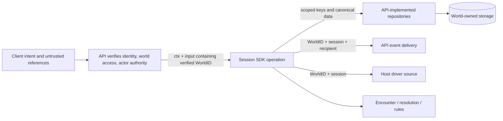

# Explicit world scope at the host seam — proposal

Working proposal for #518, not accepted law or an implementation instruction.
The paused plan and code candidates do not authorize this shape. This document
re-derives the host contract from the operator's correction and current source.

## Shape



WorldID is an opaque ownership namespace at the SDK boundary. Only the API knows
that it maps to Discord GuildID. It is not a permission token. The SDK does not
verify Discord membership, read headers, or reauthenticate the caller.

The existing SDK `World` field means an authored encounter snapshot, not the
ownership namespace. Preserve that distinction in names and documentation.

## Two explicit shapes considered

- **One WorldID on each stateful verb input — recommended.** All IDs in that
  operation are relative to one world. The stateless Manager continues serving
  every world concurrently. This fits NextLevel/LevelUp as well as seated verbs,
  without first finding a session to discover ownership. It is a real interface
  change across the stateful surface, not just a character adapter patch.
- **An explicitly constructed world-bound SDK handle.** API constructs a scoped
  handle and then calls its verbs. This can be sound, but introduces handle
  lifecycle and construction plumbing and leaves individual verb inputs silent
  about scope. There is no measured need to add that lifecycle here.

Neither approach gets scope from ctx. A Manager-global mutable current world,
implicit default, lookup of world by a globally fetched target, and context-bound
repository workaround are not options.

## Proposed input/data flow

Illustrative fields, not committed Go API:

```go
session.MoveInput{
    WorldID: verifiedWorldID,
    Session: requestedSessionID,
    Member:  authorizedMemberID,
    Path:    requestedPath,
}

session.LevelUpInput{
    WorldID: verifiedWorldID,
    Character: authorizedCharacterID,
    // The existing rule choices follow unchanged.
}

session.GetCharacterInput{WorldID: worldID, ID: characterID}
session.SaveCharacterInput{WorldID: worldID, Data: updatedCharacterData}
```

1. API admission verifies the requested world. Handlers extract its result and
   pass explicit values into service/SDK inputs; only the API admission boundary
   reads the auth carrier. SDK adapters/repositories never derive WorldID from
   `ctx.Value` or request metadata.
2. A stateful SDK verb requires nonempty WorldID before repository access or
   effects. Session/member/target/window IDs are resolved only inside that world.
   Character-only verbs require it too; they cannot infer it from a session.
3. All three SDK repository interfaces carry WorldID explicitly. Composite
   storage identity is `(WorldID, local ID)`; this remains key-value storage,
   with no new scan/query requirement. Save inputs use the payload's existing ID
   rather than duplicating that ID in another argument where unnecessary.
4. API repositories own world/owner storage envelopes and key construction.
   Toolkit rule data need not all acquire tenancy fields: an engine encounter
   snapshot or a character's rules data is not the storage envelope. Preserve
   existing ownership on updates; never invent a character's world/owner from a
   save payload or copy a record found through a global fallback.
5. SDK event delivery and a stateful driver source carry world scope too.
   Publish uses an explicit world-scoped batch; event routing/subscriptions are
   keyed by `(WorldID, SessionID, RecipientID)`. Driver lookup uses
   `(WorldID, SessionID)`. Existing per-recipient visibility remains toolkit-owned.
6. World scope is not caller ownership. API gates private operations and binds
   the acting character to the caller. A valid SDK action can read/update other
   party members or targets in the same world; a storage adapter must not limit
   every write to the invoking player's own character.
7. Missing scope is an invalid internal input, not an invitation to infer a
   default. A missing scoped key is NotFound; do not probe other worlds to
   distinguish it from a foreign record. A contradictory stored envelope is a
   repository-integrity error and fails closed. Underlying storage errors must
   not become misses. Preserve explicit partial-save/delivery reporting.
8. Value-only rules/calculations do not take WorldID merely to be uniform.
   AtlasOf receives supplied content rather than looking up a stored world; its
   exemption must be backed by a no-repository-access test. Pure character-rule
   operations likewise do not become tenancy-aware just because the API stores
   their results in world-owned drafts/characters.
9. `ctx` carries execution cancellation/deadlines, not mandatory world routing.
   No new `_ context.Context` plus saved-context replacement. Existing encounter
   callback propagation is a separate execution contract to repair at its source,
   not the mechanism by which world ownership reaches storage.

## Measured consumer map

Measured from fetched toolkit main `26664812` (session v0.113.0) and API dev
`fa1a0779`. The API currently pins session v0.112.0 / encounter v0.109.0; toolkit
main uses encounter v0.110.0. Do not assume a pin bump contains only this work:
main already changes View/Knowledge/Roster surfaces the API has not adopted.

| Surface | Current source / finding | Contract consequence |
|---|---|---|
| SDK verbs | session has 39 exported Manager verbs; not the stale charter count of 34 | Review all stateful inputs, not only Move/LevelUp; qualify the value-only AtlasOf exception |
| SDK storage | `session/repositories.go`: three bare-ID interfaces | Explicit world on Get/Save inputs for sessions, encounters, characters |
| SDK delivery | `session/events.go`: Publish(ctx, []Event) | Explicit world-scoped batch; no lookup of tenant through ctx |
| SDK drivers | `session/turndriver.go`: DriverFor(ctx, sessionID) | Scope the host-owned driver/cache identity |
| API admission | `internal/auth/role_interceptor.go`, `world_resolver.go` | Existing verified result feeds explicit SDK inputs; no new client protobuf field |
| API private characters | v1/v2 handlers, character service/repositories; v1 `level_up.go` calls SDK directly | Same explicit world in authorization, SDK call, and response reread |
| API session handlers/access | `handlers/dnd5e/session/v1alpha1`, `sessionaccess` | Scope both access checks and verb calls; reconcile current Roster/Knowledge contract separately |
| API lobby lifecycle | start/spawn/join/place, status/end, appearance Recheck | Scope lobby references before they cause SDK calls; do not let a foreign lobby choose a world |
| API SDK adapters | `orchestrators/session/character_repo.go`, `redis_repos.go` | World comes from typed inputs, never the old candidate's trustedWorld(ctx) |
| API live delivery | `orchestrators/session/broker.go`, stream handlers | Current key is only (session,recipient); add world to publish and subscription identity |
| Authoring/presentation | registry/content lookup and server AtlasOf adapter | API chooses world-owned content; preview receives selected values, not a global content fallback on errors |
| SDK workbench / test doubles | session cmd/session-workbench and interface implementations | Explicit fixture world; update keys/fakes alongside provider contract |

This is a boundary map, not a checked implementation plan. API lobby/content
storage and the UI must be measured further when planning their adoption. The
old outcome slices cannot justify leaving a mixed scoped/unscoped SDK contract.

## Proof required for this contract

- One shared Manager and one store, with deliberately equal local IDs in two
  worlds; interleaved/concurrent calls never cross namespaces.
- SDK calls work with ordinary background ctx plus explicit valid WorldID;
  missing WorldID fails even if ctx contains a plausible world value.
- Spies/real adapters assert the explicit world on every Get/Save, event batch
  and driver lookup, including callback-driven writes and resumed reactions.
- Foreign-world and wrong-player direct-ID RPC requests cannot disclose or
  mutate private records; compare stored state/versions/indexes on refusal.
- Same-world multi-player effects still update their valid targets.
- The API actually takes scope from verified admission, not an unchecked client
  field; scope used to authorize is scope sent to the SDK.
- Cancellation/deadline tests are independent from world-routing tests. Do not
  use a successful world-routing test as proof context propagation is correct.
- Same-player A/B browser proof on one backend/database remains necessary for
  the eventual outcome, but it is not equivalent to real two-guild Discord proof.

## Next design step

Confirm this shape with the operator before elaborating a replacement plan.
Then settle exact persistence/API types, map context-taking capability callers,
reconcile the published provider/API baseline, and evaluate candidate reuse
against the new contract. No implementation, release or merge is authorized by
this proposal alone.
