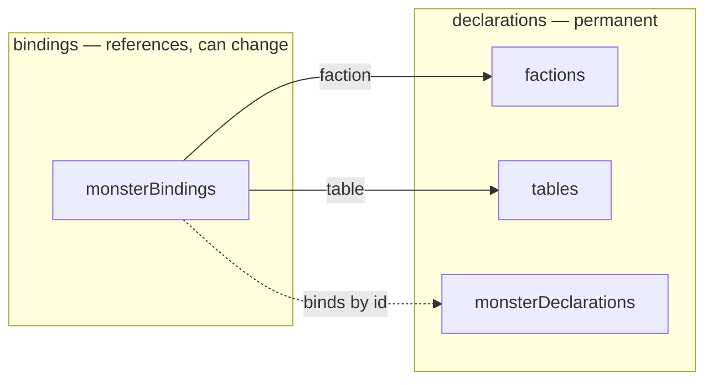

# Declarations and bindings — a permanent thing and a reference to a shared one

**Status:** IMPLEMENTED — the v4 grammar (`monsterDeclarations`,
`monsterBindings`, `factions[].table`, `startingCell`) is live in
`rpg-toolkit`, with the authoring law and consumer migration in
`rpg-toolkit/docs/how-to/world-builder-v4-declarations.md`. Re-shaped
2026-09-25 into law + rulings per `.agents/skills/design/SKILL.md`.

**Case file:** the origin conversation, the measured evidence at the ruling
commits, and the arguments that lost are preserved in this file's git history
(`4a26b70`, PR #501) and in the re-shaping PR — one hop from this law.

## Shape



The v4 spelling:

```yaml
version: 4
factions:
  - id: watch
    table: watch-drill
tables:
  watch-drill:
    time:
      - { when: { enemy: reach }, attack: enemy }
      - { when: { enemy: none }, hold: {} }
room:
  room:
    monsterDeclarations:
      - id: guard-1
        ref: dnd5e:monsters:thug
        startingCell: { location: { q: 2, r: 0 }, facing: ne }
    monsterBindings:
      guard-1:
        faction: watch
```

## Law

- **A declaration is permanent. A binding is a reference to something shared,
  and can change.** Why the word: a declaration *forecloses silently* — the
  word binding tells the truth that the fact can be re-bound.
- When a field's block is not obvious, ask in order: could it change mid-run →
  binding. Is it a reference to a named declaration → binding. Otherwise it
  is a declaration, and required.
- A declaration requires `id`, `ref`, `startingCell.location`; `facing` is
  optional — a model has no "no facing," only the one it came with. A binding
  requires nothing, including the block: a block naming a faction is a
  binding doing its one job.
- `startingCell` is authored once and read once at compile; it never tracks a
  live position. `facing` is presentational — carried, never read by the
  engine.
- A faction's table and a monster's table are one mechanism: a binding's table
  overlays its faction's by trigger key, a nearer trigger replaces the whole
  row list, and conditions only control row eligibility.
- `mind` is the faction's eyes, not its captain: the member whose knowledge
  becomes the side's — a knowledge hub; no authority and no orders flow through
  it. Why the care: a faction of many that waits on a fact without naming a
  mind is refused at compile ("name a mind, or the faction cannot learn"), and
  validation runs at construction and again at Join — the same invariant held
  at two doors, not mutability.
- **The test for the whole shape: write the front room in it.** Four goblins,
  one table, one faction, three of them plain. If the control case got
  noisier, the shape is being paid for by the thing it was meant to serve.

## Rulings

| ID | ruling | status | scope | ruled by | date |
|----|---------|--------|--------|----------|------|
| R1 | `startingCell` is the nested shape: `location` required, `facing` optional, one noun | settled | declarations | kirkdiggler | 2026-09-24 |
| R2 | `factions[].table` added — a faction may name a root table; the inline `on:` spelling remains | settled | factions | kirkdiggler | 2026-09-24 |
| R3 | `mind` stays on the faction; a faction's mind may later be updated to learn from another member | settled — capability deferred-until-use-case | factions | kirkdiggler | 2026-09-24 |
| R4 | `actions` stays on the binding as monster overrides; a faction supplies no arms — known debt | settled | bindings | kirkdiggler | 2026-09-24 |
| R5 | `intimidate`/`persuade` removed from the builder — they come from interacting with an NPC, and a hostile monster cannot have them | settled — engine fields deferred-until-NPC-use-case | builder | kirkdiggler | 2026-09-24 |
| R6 | The builder YAML cleanup is the implementing work (v4) | settled — implemented | builder | kirkdiggler | 2026-09-24 |

## Open

- **Runtime faction re-binding.** The rule licenses it; v4 deliberately does
  not implement it. A use case brings the mechanism.
- **The mind update capability.** When its use case arrives, the question is
  not "where does `mind` go" but "does the faction get its own mind" — if it
  does, the field disappears rather than moving. Faction-level perception is
  the further step behind it.
- **Engine-side social fields.** `intimidate`/`persuade` are gone from the
  builder; the engine still reads them. They return with the NPC-interaction
  use case (R5).
- **`mind` is a poor name** — one word covers a package family, a member
  pointer, and a store. Renaming is deliberately not done: the field may not
  survive its use case, and renaming a field that may be deleted is churn.