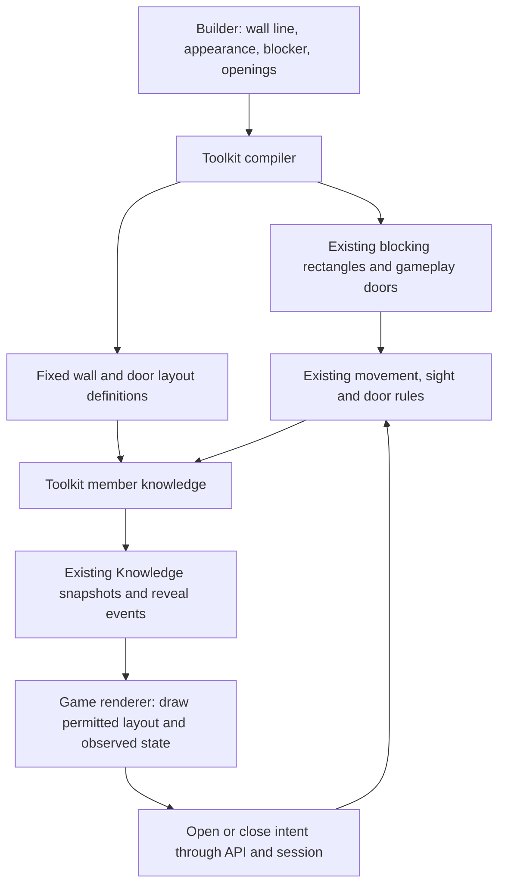

# Wall work: a plain-language walkthrough

**Start here, not with the implementation plan.** This explains the proposed wall
experience and the implementation currently under review. It is not a claim that
the whole feature has shipped, or approval to implement the remaining geometry
proposal. [Issue #527](https://github.com/KirkDiggler/rpg-project/issues/527) carries
the work and its acceptance record.

## The idea in one minute

**Draw a wall once. Put holes in it. Optionally put doors in those holes.**

The wall is not a row of individually placed stone models. Those models are its
appearance. The toolkit receives the wall's authored blocking geometry and uses
the existing movement, sight, door and knowledge systems.

There are three distinct facts:

| Fact | Example | Who owns the answer? |
|---|---|---|
| Appearance | Stone wall, 8 feet high, with a wooden door | Author chooses; renderer draws |
| Gameplay geometry/state | This strip blocks movement; this door is closed | Toolkit |
| Player knowledge | This player knows the doorway, but not its current state | Toolkit, per observer |

Changing the stone asset must not change whether an arrow or a character can
pass. Knowing a doorway exists must not automatically reveal whether it is open.



**The client does not fetch the full builder document to discover what to draw.**
That would expose the author's secrets. It receives the toolkit's permitted
records through the existing session channel.

## 1. What you edit

A wall has:

- A stable identity and a straight start/end line. Placement is free; snapping is
  optional. It is not restricted to hex edges.
- An appearance asset, visible height, thickness and elevation.
- A separate rectangular blocker: length, depth, offsets along/across the line,
  and independent movement-blocking and sight-blocking flags.
- Openings, each with a position along the wall and a width.
- An optional door attached to each opening.

The opening owns an attached door's position and orientation. There is no second
free-standing door transform to keep aligned. The door keeps its own identity and
its existing initial-state binding: open, closed or locked.

**Editing behaviors in the current implementation:**

- Moving or rotating the whole wall carries its openings, doors and local blocker
  offsets with it.
- Changing the wall's length preserves the doorway's world position. Shortening
  stops before cutting through an opening. The blocker preserves its end margins.
- Changing the appearance does not rewrite the blocker.
- Removing a door leaves the opening. Removing the opening removes its attached
  door and state binding. These are undoable edits using the existing room history.
- Overlapping openings, duplicate identities and invalid geometry are refused,
  rather than silently repaired.

These are **full-height gaps**, not a general system for windows, arches or holes
at arbitrary heights. The blocker remains planar gameplay geometry. A visual
height/elevation setting does not introduce 3D sight or multilevel movement.

## 2. What the toolkit builds

Consider a 20-foot wall with a 5-foot doorway centred halfway along it. Assume
its blocker follows the full wall length:

```text
Author's wall:     |--------------------|
Opening:                 |-----|
Compiled blockers:|-------|     |-------|
                         optional door
```

The compiler subtracts the opening from the blocker, leaving two rectangles,
7.5 feet long each. Those are the **same kind of blocking contributors the
existing footprint system already understands**, not a new wall collision engine.

If a door occupies the opening:

- Closed: the door contributes its existing blocking behavior in the gap.
- Open: that door stops blocking; the wall pieces on either side remain.
- A separate pillar or overlapping blocker remains effective. Opening a door
  does not erase other contributors.

For an offset or differently sized blocker, the compiler defines that rectangle
**first**, then subtracts the opening corridors. Offsetting the pieces after
cutting would accidentally move blocking material back into the doorway.

The attached door's mechanical width comes from the opening; its depth and
cross-wall offset follow the wall's blocker strip. Its mesh does not set these.

There is also a nonblocking wall identity record. Think of it as the wall's index
card: it remains identifiable even if openings remove every blocking span. Its
movement and sight flags are both false, so it cannot secretly plug the holes.

The source is one editable wall. Generated rectangle pieces are compiled output,
not extra author-managed props. Their IDs are deterministic for a given shape,
but editing the cuts can renumber the pieces; the authored wall ID stays stable.

## 3. Why the toolkit also carries visual layout

Blocking rectangles alone cannot tell a renderer:

- which pieces came from one authored wall;
- which asset to repeat at which visible dimensions;
- which cut belongs to a door that this player has not discovered.

The draft therefore adds **fixed layout definitions**, alongside the existing
mechanical contributors. They carry wall endpoints, dimensions, appearance
references and openings. The compiler resolves them from the same authoring
input, and encounter persistence saves/loads them.

This is not a second editable wall or a second source of door state. It is the
compiled drawing description needed for a player-safe runtime view. The toolkit
carries asset references without loading models or consulting the asset catalog.

At the session/wire boundary, lengths and points use canonical feet. The web
converts them to scene units once. This keeps model scale out of gameplay math.

## 4. How secrets and door state reach the game

A player's layout contains only what the toolkit permits. A concealed attached
door is omitted, and its cut is omitted from that player's wall description, so
the intended appearance is continuous wall rather than an obvious empty doorway.

When discovery permits the door, an existing room/concealment reveal event carries:

1. The complete updated wall record, now including the opening.
2. The newly permitted door layout record.

The client replaces records by identity rather than inventing a special "punch a
hole" operation. Replaying the same event does not add another wall or door.
A fresh Knowledge snapshot agrees with those updates.

**Door layout and door state are separate.** Existing observations supply the
state. If the layout is known but no state observation is supplied, the current
renderer uses a neutral marker instead of pretending the door is closed. That
marker is a truthful fallback, not a promise that the final interaction UX is done.

Door records are delivered independently of wall records. That matters because
concealment selection is explicit:

- Selecting a wall hides that wall and its generated parts, not an unselected door.
- Selecting a door does not select every object that overlaps it.
- Concealing floor cells does not automatically select unrelated walls or props.

An undiscovered room can still withhold its contents through the existing room
knowledge rules. **Unexplored space and explicit concealment are different things.**

## 5. What the game renderer does—and does not do

It repeats/fits wall assets along the permitted solid spans, and fits the chosen
door assembly into the supplied opening. Builder and game reuse the same visual
components instead of maintaining two implementations of wall fitting.

It sends open/close/unlock intentions through the existing session API. The server
still decides ownership, reach, state changes, refusal and persistence. The renderer
does not run sight checks against Three.js meshes or decide who discovered a secret.

Exact authored dimensions take precedence over the model's native dimensions.
That can stretch repeated pieces or expose unsuitable trim. Current fitting uses
the door assembly's outer bounds, not a separately modelled clear aperture. A model
with bundled masonry or an unfinished reverse face may simply be the wrong asset.
We should improve/select the asset rather than change the game's blockers to hide it.

## 6. The trade-offs

| Choice | What it buys | What it costs / does not promise |
|---|---|---|
| One line with openings, rather than many placed props | Coherent resizing, movement and door attachment | Less arbitrary per-piece dressing; props remain available for decoration |
| Appearance separate from blocking | Art swaps cannot change rules; deliberate independent flags/offsets | More authoring controls; a badly authored picture and blocker can disagree |
| Compile to existing rectangle contributors | Reuses movement/sight/overlap rules and persistence | Generated pieces need identity bookkeeping; corners/joins are not automatic mesh booleans |
| Fixed layout beside mechanical data | Safe rendering without downloading secret source content | Additional validated/persisted fields and DTO mappings across the existing seams |
| Explicit concealment membership | Predictable selection; no accidental hiding of unrelated objects | Authors must select what they intend; a visible door on a concealed wall is possible |
| Whole-record reveal updates | Straightforward replay and snapshot agreement | More payload than a tiny cut-only patch |
| Exact asset fitting | Author's dimensions remain authoritative | Some distortion; asset curation and join polish still matter |
| Free wall placement in a hex-based game | Walls need not follow hex edges | Existing cell-based observation assumptions become visible and need careful correction |

Drawing walls does **not** automatically partition floor into rooms or define
room-discovery boundaries. Room assembly and floor-surface painting are separate
work, tracked by [#528](https://github.com/KirkDiggler/rpg-project/issues/528).

## 7. What exists, what has shipped, and what is still fuzzy

| Slice | Status / where to look |
|---|---|
| CloseDoor host verb and API adapter | Merged: [toolkit #1957](https://github.com/KirkDiggler/rpg-toolkit/pull/1957), [API #1075](https://github.com/KirkDiggler/rpg-api/pull/1075). Does not require the new wall system |
| Structural layout wire records | Merged: [protos #376](https://github.com/KirkDiggler/rpg-api-protos/pull/376). Contract availability is not full runtime delivery |
| Wall compilation, fixed layout, member projection, persistence and reveal production | Draft [toolkit #1935](https://github.com/KirkDiggler/rpg-toolkit/pull/1935) |
| Carry those answers across the session SDK | Draft [toolkit #1947](https://github.com/KirkDiggler/rpg-toolkit/pull/1947). Must reconcile the now-extracted CloseDoor work before delivery |
| Structural API mappings and shared builder/game rendering | Implemented in local wall worktrees; not yet published as consumer PRs |
| Final regular-builder publish/play flow, version migration and UX/asset polish | Not complete. "Builder v5" is not a settled serialization contract |

Real local game checks exercised visible wall/door rendering, closed movement
refusal, clicking to open/close, reload persistence, and automatic discovery
carrying an updated opening through the existing reveal event. Those are useful
checkpoints, **not** proof that the complete builder-to-game feature is ready.

Two concrete blockers prevent that claim:

### A. Seeing the door itself

An existing footprint-observation path asks whether you can see a representative
hex for the door. For a thin closed door between hexes, that hex can be on its far
side: the near-side player is effectively asked to see *through* the door before
being told its state. Conversely, a door and another blocker inside one hex can
be treated as visible just because they share that hex.

The bounded direction discussed is to end a permitted sight ray at the door's
actual first contact, while retaining the existing finite connected-sight rules.
A candidate eye across a blocker is still unavailable. Simply choosing another
hex or ignoring the target as a blocker is not an adequate fix.

**This extension is not implemented or approved for full implementation.** The
investigation found that the current cell-ray API cannot accurately answer which
hard wall edges a physical terminal segment crosses. Contact construction and
that traversal belong in spatial, not in the web/API. Edge/tangent behavior and
exact interfaces still need a checked contract. No new "any visible sliver means
visible" optical model has been agreed.

### B. A concealed door still leaves a floor-hole tell

The current live test hides the door and correctly fills its visual opening, but
the old support-cell concealment also removes a floor hex beside it. That visibly
marks where the secret is, even though the author selected only the door.

This needs a toolkit projection/masking correction. Painting the missing floor in
the client is not safe: the client must not invent space the toolkit withheld.
Restoring the floor while leaving an invisible full-hex movement refusal would
also be wrong. Disclosure of generated blocker pieces needs checking alongside it.

## 8. How to inspect the implementation without reading everything

Start with the two toolkit PRs above. Within
[the encounter branch](https://github.com/KirkDiggler/rpg-toolkit/tree/feat/structural-surfaces/rulebooks/dnd5e/encounter):

- `dungeonspec/single_room_walls.go`: source validation, opening subtraction and
  attached-door lowering.
- `structural_walls.go`: fixed layout definitions and validation.
- `projection.go` and `roomknowledge.go`: permitted member-facing data.
- `structural_reveal.go`: changed whole records carried by existing reveal events.
- The corresponding tests: examples of intended behavior, including negative cases.

[The session branch](https://github.com/KirkDiggler/rpg-toolkit/tree/feat/527-structural-session/rulebooks/dnd5e/session)
adds `structural.go` and projection/decoder tests. Its job is to carry answers,
not decide visibility.

**The useful next design conversation is about this shape and its boundaries.**
The unresolved observation and concealment work should not turn into a surprise
visibility rewrite, and a working preview should not be mistaken for a shipped
builder feature. Implementation remains paused while that understanding is shared.
