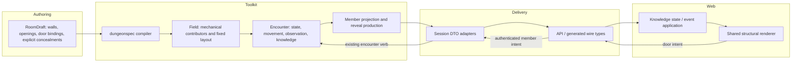

# Structural walls — architecture and boundaries

This is an architecture overview of [#527](https://github.com/KirkDiggler/rpg-project/issues/527),
not a new implementation authorization. The CloseDoor SDK/API slice has shipped;
the structural-wall providers and consumers remain work in progress.

## Component shape



The new authoring abstraction is a structural wall. It does not introduce a new
collision engine, a second visibility authority, or a gameplay read of the full
builder document.

## Ownership and contracts

| Component | Owns | Input → output |
|---|---|---|
| Builder | Editable structure and explicit selections | `room.walls`, existing `doorBindings`, existing concealment declarations |
| `encounter/dungeonspec` | Validation and lowering | Authored wall → existing `PlacedPropInput` / `DoorInput`, plus `StructuralWallInput` |
| Encounter field/persistence | Compiled world definitions | Mechanical contributors and fixed layout → `FieldData` / encounter save-load |
| Encounter runtime | Door state, movement, observation, discovery | Existing verbs and world transitions → authoritative state and observer knowledge |
| Encounter projection | What a member may receive | `AtlasFor(member)` and existing reveal beats → permitted layout records |
| Session | Host seam and type boundary | Encounter answers → session-owned Atlas/Knowledge/reveal DTOs |
| API | Authorization and wire translation | Caller-owned member + SDK result → generated proto messages |
| Web | Event application and presentation | Permitted layout + supplied door observations → rendered assets; user intent → RPC |

The API and session adapters do not independently filter visibility or reconstruct
wall geometry. The renderer does not calculate gameplay from mesh bounds.

## Authoring model → compiled model

An authored wall contains:

- Stable wall ID and a continuous line.
- Appearance reference and visible dimensions.
- An independent rectangular blocker, including local offsets and separate
  movement/LOS flags.
- Openings as intervals along the line; each may bind a door ID and appearance.

The opening owns an attached door's pose. Its mutable state remains in the
existing door model, not in the layout record. Existing standalone doors are not
migrated into attachments implicitly.

The compiler produces two different views of that one authored structure:

### Mechanical contributors

1. Resolve the authored blocker extent and offsets.
2. Subtract opening intervals from that extent.
3. Emit the remaining spans as existing placed-footprint contributors.
4. Emit attached doors through the existing footprint-door path.

A nonblocking presence entry retains the wall's identity independently of how many
blocking spans remain. It cannot refill an opening. Span IDs are derived;
authored wall and door IDs are stable.

This preserves the current movement/sight contributor model. Opening a door
removes that door's blocking contribution, not any overlapping contributor.

### Fixed layout definitions

`StructuralWallInput` carries the authored line, appearance dimensions, openings
and bindings to existing identities. It is needed because mechanical fragments
do not preserve enough information to reconstruct the authored wall or safely
project a conditional opening.

This is **compiled presentation data, not another editable source or another
collider**. The compiler derives it once from the source; encounter validates and
persists it. Asset references remain opaque to the toolkit.

The runtime-facing geometry uses canonical feet (`FootprintPoint` / spatial
points). The web converts to scene units at the rendering boundary. Asset fitting
cannot modify the gameplay rectangle.

## Run lifecycle and discovery ownership

The dungeon key identifies authored content, not a live encounter. Each playthrough
creates its own encounter from that content and applies the normal first-admission
long rest. Encounter persistence owns its learned facts and attempt history:
reloading or rejoining that encounter preserves them; a new encounter using the
same character and dungeon key starts undiscovered with fresh attempts.

The character profile retains sharing preferences only. It must not export or
restore discoveries across encounters. Old profile JSON may contain check memory;
the corrected SDK ignores it without clearing the operator's active encounter.

## Runtime projection and event contract

The member-facing Atlas contains two flat collections:

- `StructuralWalls`: permitted wall lines, dimensions and opening intervals.
- `StructuralDoors`: permitted door identity, appearance and resolved pose.

Door layout is separate from mutable door observations. Missing observation does
not mean closed. It is also separate from parent-wall delivery: withholding a
wall must not hide an independently permitted door or disclose a hidden parent
association through that door.

For a concealed attached door, the member projection omits its layout and the
corresponding cut in the wall's drawing description. This is an entity/layout
projection, **not a reason to conceal surrounding floor**.

The agreed update model is **complete snapshots, full entity introductions, then
typed component replacements** on the existing room/concealment reveal events.
A known wall acquires a newly permitted opening through a replace-openings patch;
its asset, dimensions and endpoints are not resent. Door introductions travel in
the same atomic layout update. Historical complete-record updates stay decodable.
Snapshot and event replay must agree for the original recipient.

The [concrete patch contract](layout-patch-contract.md) specifies the wire shape,
empty/default semantics, sequencing, malformed input and missing-baseline recovery.
The [checked task plan](layout-patch-plan.md) maps it onto the existing PRs and
acceptance tests. These are the next bounded implementation slices.

State changes continue through existing door verbs and observations. The new
layout channel does not become a second door-state channel.

## Concealment membership is not spatial support

These are separate contracts:

| Query | Source of truth |
|---|---|
| Which floor cells are explicitly concealed? | Authored concealment cell membership |
| Which wall, door or prop is concealed? | Authored object membership, expanded only to that object's compiled representations |
| Where can an actor reach or attempt discovery of an object? | Its existing spatial support / reach rules |
| Which ordinary room geometry is not yet known? | Existing room knowledge, separately from explicit concealment |

Concealing a wall can include the generated spans representing that same wall.
Concealing a door can include its gameplay and drawing identities. Neither
operation adds overlapping, underlying or behind-the-object cells to the
concealment. Nor does it select a different authored object such as an attached
door when only its wall was selected.

### Correction in the encounter draft

The earlier `Encounter.hiddenCellsOf` implementation returned:

```text
explicit c.cells ∪ placedCells(each concealed footprint door)
```

That inferred union fed member projection and reveal payloads, causing the
floor-hole symptom. The provider draft now returns only explicit cells and also
removes support-cell-based occupancy discovery. It retains door footprint support
separately for manual search and automatic discovery distance.

This separates **membership** from **spatial query support**, rather than removing
the ability to locate a door or introducing a new concealment model.
`memberPropCells` expresses the same distinction for props: their footing is usable
for reach without becoming hidden floor. Provider tests cover unchanged floor,
discovery support and anonymous physical refusals. The integrated regular-builder
walk also retains all authored floor across a door-only reveal.

Required coverage is correspondence between authored membership, member snapshot
and reveal payload, with door/wall overlap unable to grow the concealed-cell set.
The fix belongs in encounter. The client must not fill in withheld cells as a
workaround.

## Bounding geometry and supported authoring

The editor already has authored blocking rectangles, and those rectangles are
available to the runtime. They remain the gameplay geometry; model bounds are not
a competing authority.

The current footprint-observation path uses support cells. Some freely positioned
thin doors expose limitations of that approximation. That does **not** establish
a requirement to support every arbitrary placement or introduce a new
continuous-surface visibility contract.

The operator's direction is to permit supported placement conventions, validation
and authoring best practices. Placement on the approach side of a hex is one
candidate to verify against the intended authored encounter. It is not yet a
claim that the same placement solves every approach direction.

Accordingly:

- Preserve existing connected-sight rules and the authored bounding geometry.
- Verify representative supported placements using the same geometry in editor
  and play; make any supported-placement limits explicit.
- Do not use universal edge-case coverage as the completion bar for this slice.
- Park the proposed terminal-contact spatial extension. Its need has not been
  established against a bounded authoring contract.

This is a scope decision, not permission to infer state from the rendered asset
or ignore independent blockers.

## Architectural trade-offs

| Decision | Benefit | Cost / boundary |
|---|---|---|
| Structural source compiled into existing contributors | Reuses the established rules engine | Compiler owns fragment generation and identity mapping |
| Appearance separate from blocking | Presentation changes cannot alter rules | Authoring must expose/validate the intended relationship |
| Fixed layout in toolkit knowledge | No unrestricted source fetch in gameplay | Additional persisted definitions and DTO mappings |
| Flat independent door projection | Explicit membership and parent privacy survive delivery | Renderer joins layout and observation by canonical ID |
| Snapshot + full introductions + typed component replacements | Smaller updates for known walls; snapshot remains the recovery baseline | Explicit replacement/presence semantics and atomic missing-baseline recovery |
| Bounded authoring support | Avoids expanding the geometry contract without a demonstrated need | Placement guidance and representative acceptance cases become part of delivery |

This remains a planar, hex-based gameplay model with continuous authored
rectangles. Visible height/elevation does not add 3D LOS or multilevel traversal.
Builder compilation derives ordinary discovery regions from the painted floor and
its blocking geometry. Door topology is measured closed so opening a door does not
rename or merge those regions. Existing encounter discovery then controls what each
observer learns; neither floor nor ordinary props need secret declarations simply
because they are behind an opaque wall. Finding a secret door is not seeing through
its closed leaf. Authored sight-blocking flags remain authoritative.

Permanent opaque boundary footing uses the existing scenery path, not a phantom
room and not a connection between adjoining rooms. Door and movable-prop cells must
retain ownership wherever their changing state permits standing. The ordinary
room-discovery and footing correction has completed its independent review;
release adoption remains separate from that gate.

Floor-surface authoring and room assembly remain separate work under
[#528](https://github.com/KirkDiggler/rpg-project/issues/528).

## Delivery boundaries

- **Merged:** standalone CloseDoor [SDK #1957](https://github.com/KirkDiggler/rpg-toolkit/pull/1957)
  and [API #1075](https://github.com/KirkDiggler/rpg-api/pull/1075).
- **Merged contract:** structural wire records in
  [protos #376](https://github.com/KirkDiggler/rpg-api-protos/pull/376).
- **Open provider:** [toolkit #1935](https://github.com/KirkDiggler/rpg-toolkit/pull/1935),
  containing compilation, layout, persistence, projection and reveal production.
  The newer ordinary-discovery delta and its footing correction are independently
  reviewed; both findings are verified addressed.
- **Draft adapter:** [toolkit #1947](https://github.com/KirkDiggler/rpg-toolkit/pull/1947),
  carrying those answers across the session boundary on pushed provider pins.
- **Draft consumers:** [API #1077](https://github.com/KirkDiggler/rpg-api/pull/1077)
  and [web #1226](https://github.com/KirkDiggler/rpg-dnd5e-web/pull/1226), including
  replacement mappings and atomic cache/hydration recovery. The prop repair and
  wall-control/default edits are now published with a green full web gate;
  their fresh implementation review is in progress.
- **Merged patch wire:** [protos #380](https://github.com/KirkDiggler/rpg-api-protos/pull/380),
  published as v0.1.225 and adopted by both consumers. Encounter replacements /
  membership correction are in #1935; the typed session adapter is in #1947.
- **Joined proof:** regular World Builder import/Save & Play, model-click door
  operation and event-only rendering while snapshot responses are held. The earlier
  unchanged-floor proof concerns explicit door-only concealment, not permission to
  reveal an ordinary far-side room. The newer ordinary-discovery walk withholds that
  floor and reveals it on opening. A follow-up walk verified all35 authored cells
  after opening, including the corrected wall footing, while snapshot responses
  were held. Actual toolkit release pins and consumer-base reconciliation remain.
- **Outstanding acceptance:** additional authored scenarios and placement guidance;
  document migration and UX/asset polish.
  "Builder v5" is not an agreed serialization version.

## Walk findings still open

- Wall selection uses the normal Move/Rotate gizmo and cardinal buttons, with
  pointer/undo/reload proof. New walls default to blocking movement and sight;
  existing authored values remain unchanged. Numeric transforms are secondary.
  Full CI passes; fresh review of this UI delta is in progress.
- Ordinary prop appearance now uses recipient-permitted records through the
  existing knowledge/reveal transport and shared renderer. Declared books and
  undeclared vase/altar GLBs are verified in the normal builder/play route, including
  event-only room discovery. The v2 renderer path remains. Fresh implementation
  review is in progress; no unrestricted source fetch was restored. Older encounters
  without captured definitions require a normal new playthrough, not a profile reset.

The cross-run discovery correction is independently reviewed and active locally.
That closure does not cover ordinary-room partitioning, wall controls or prop
appearance. Existing encounters keep their saved geometry and learned facts; the
new compiler behavior is exercised by new playthroughs, never a profile reset.

## Source map

Under [encounter's feature branch](https://github.com/KirkDiggler/rpg-toolkit/tree/feat/structural-surfaces/rulebooks/dnd5e/encounter):

| Concern | Source |
|---|---|
| Source validation / lowering | `dungeonspec/single_room_walls.go` |
| Fixed definitions and identity validation | `structural_walls.go` |
| Builder discovery-region derivation | `partition_region.go`, `dungeonspec/single_room_regions.go` |
| Member projection / ordinary room knowledge | `projection.go`, `roomknowledge.go` |
| Reveal deltas | `structural_reveal.go`, `revealbeat.go` |
| Explicit membership vs inferred support-cell coupling | `concealment.go`, `discovery.go`, `search.go` |

[Session's feature branch](https://github.com/KirkDiggler/rpg-toolkit/tree/feat/527-structural-session/rulebooks/dnd5e/session)
adds `structural.go` and the corresponding conversion/replay tests. It carries
encounter answers; it does not own their geometry or disclosure policy.
