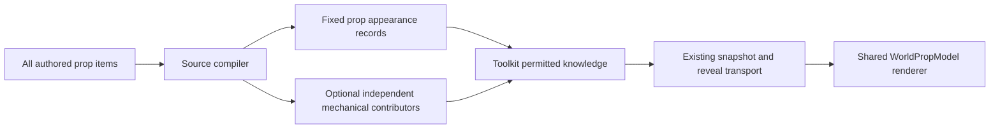

# Ordinary prop presentation — consumer gap

## Observed requirement

Room disclosure now works. Operator reports authored props invisible inside and
outside the room. Props must render from permitted knowledge, not by downloading
unrestricted builder YAML. No appearance RPC or client-side visibility rule.

## Regression origin — corrected after operator challenge

Props DID render before this effort. The direct cutover is web commit
dd94d8e9e26f9e3a2191fc77848de2e021c1d443, merged to dev in PR1217 on
2026-10-02 at af4ee892304671d02cdec9bb6323d5152d9f698b. SessionEncounterView changed
`useDungeonScene(atlas?.dungeonKey ?? '')` to `useDungeonScene('')` while adopting
GetKnowledge. Empty key returns no presentation and issues no source read. Before
that change, useDungeonScene fetched authored YAML and passed scene.items (including
undeclared decorative props) to the existing RoomSceneEnvironment/WorldPropModel.
That input was removed without a permitted replacement for ordinary prop appearance.

The toolkit's narrow mechanical lowering predates this: its presentation-removal
commit c25c2d6a/PR1836 is from2026-09-19. It was paired with the web-side content
read, which explains why props rendered despite no asset refs in placed geometry.
The current gap must be described as a regression in that delivery transition,
not as a capability that never worked or evidence that all props need blockers.
Removing unrestricted gameplay YAML access remains required; restore the renderer's
permitted inputs, not the unrestricted fetch. Exact historical evidence:
/tmp/prop-regression-web-knowledge-diff.txt and
/tmp/prop-regression-old-useDungeonScene.ts; GitHub confirms PR1217's base was dev.

## Measured current path

Read-only diagnostic /tmp/props-not-rendering-current.log, current run
b0753b71-de7a-4dbe-811f-50d5814c5d62. Latest source has books, vase and altar.
Only books have a propDeclarations entry. The latest source is not proof of what
was captured at encounter creation; do not patch the run from that mutable key.

- single_room_lowering.go reads IDs and X/Z/yaw only for declared props. It
  intentionally does not carry assetRef/elevation/heightScale/point-light data.
- CanonicalPlacedProps emits only declared mechanical contributors. Undeclared
  vase/altar are visual dressing, so no runtime prop record is compiled for them.
- AtlasPlacedProp contains ID, mechanical rectangle/pose and support cells, but no
  appearance metadata. Existing successful disclosure cannot make that renderable.
- atlasToScene3D renders legacy Atlas.props (Ref/At/etc), not arbitrary placed
  contributors. Structural walls/doors have their separate permitted fixed-layout
  path. WorldPropModel exists and is shared with authoring; the assets need no
  replacement renderer.
- RoomSceneEnvironment's old source-document path supplied everything, but is not
  an acceptable fallback: it would reintroduce hidden source disclosure.

## Proposed shape (contract design, not implementation complete)

Every authored visual prop needs a disclosure-capable identity even when it has no
blocking declaration. Appearance is not collision: preserve authored world pose,
asset ref, elevation and visual scale; do not fit art from collider dimensions or
invent a blocking rectangle for decorative scenery. Group/support relations are
already baked into item world transforms; do not replay parent transforms or leak
unpermitted parent IDs. Toolkit owns disclosure; API transports its answer.

The contract must account for static presentation and existing mutable observation
separately. A remembered mutable pose cannot be refreshed from live authored truth;
a fixed appearance definition cannot become a second mutable placement authority.
Point-light presentation is not mechanical illumination. Exact DTO/source lowering
and mutable-pose treatment require inspection/design before coding the wire.

## Acceptance

- Declared and undeclared ordinary props render in the known room.
- Unknown far-room props are absent before discovery, then arrive through the
  existing reveal flow and agree with snapshot/reload.
- Explicitly concealed trap/prop stays absent independently of room visibility.
- Render pose agrees with authoring; blocker offsets/dimensions/flags do not alter
  art pose or scale, and nonblocking scenery requires no mechanical declaration.
- No complete authored-source fetch in gameplay; no asset-ref or visibility guessing.
- Saved definitions preserve the content used by that encounter. Legacy encounters
  without appearance metadata must not be silently enriched from edited source.
- Unknown/missing appearance has an explicit policy rather than an invisible model.

No implementation or generated binding has landed for this correction yet. Any
proto change follows CI-owned generation and actual published tag adoption. The
separate web gizmo/default work remains uncommitted and must be preserved.
