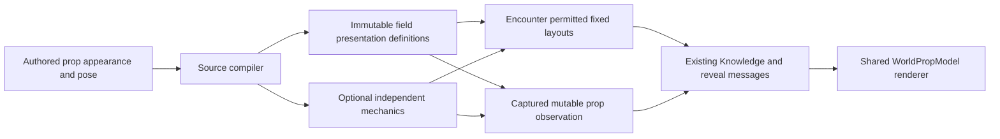

# Repair permitted prop presentation

## Goal / authority / baseline

Operator: repair props that rendered before web#1217 disabled gameplay source reads.
Current instruction authorizes restoring the renderer's permitted inputs, not new
prop mechanics or unrestricted authoring access. The measured regression and source
map are in prop-presentation-brief.md. Same wave: project#527 / web#1226.

Inspected: encounter ad855beb; SDK bcb46313; API2afdf22a; web5b36d447 plus existing
local gizmo/default edits (preserve); proto origin/main fdfa471. Existing renderer:
WorldPropModel / RoomSceneItem. Item transforms are already world-posed; parent and
support transforms must not be reapplied. Collider offsets/sizes never fit the art.

All source items with authored appearance participate, not only propDeclarations.
No blocker is invented for decorative scenery. Toolkit owns permission using the
existing ordinary-discovery/concealment and observation mechanisms. API translates;
web renders those records. No new appearance RPC, generic patch engine or source
fetch. Presentation definitions are captured for the encounter, not read from an
edited dungeon key later. Legacy worlds without them are not silently enriched;
verify on a normal new playthrough with the same character, not a profile reset.

## Contract

`PropPresentation`: ID, Ref, Origin (canonical planar feet), Elevation (feet above
floor), FacingDegrees (canonical plane, same sign as footprint facing), HeightScale
(positive dimensionless Y scale), optional visual PointLight, optional canonical
DoorID for a standalone bound door, Label. No blocking flags, editor groups,
parent/support IDs, room membership or mutable door state.

Visual point light: Enabled, Offset (local planar feet), OffsetElevation (feet),
Color (#RRGGBB), Intensity (nonnegative renderer scalar), Range (positive feet).
This is not mechanical region lighting or sight range.

Identity is the SAME PropID namespace used by AtlasProp/AtlasPlacedProp and the
observed shape in PropSighting; matching IDs denote one object, not duplicate art.
Fixed collections are sorted by ID. Opening-attached doors belong ONLY to the
AtlasStructuralDoor rendering channel and MUST NOT also emit PropPresentation;
validate this at minting, never guess a client tie-break. Standalone bound doors
may use PropPresentation with their supplied canonical DoorID.

All numbers are finite. A present light requires offset, #RRGGBB color and positive
range; disabled records are still validated. Numeric offsets/elevation and intensity
default to0, enabled defaults false. These are explicit wire zeros, not inferred
asset style. Presentation paired with observed_empty=true is malformed/refused.

Fixed records: `Atlas.PropPresentations`; full new introductions via both existing
room/concealment reveal payloads. Collections are ID keyed; absence is no addition,
not a request to delete. Validate a whole update before committing it. Historical
payloads remain their original recipient-scoped records.

Mutable records: optional `PropSighting.Presentation`, captured with the observed
shape. Absent when observed-empty. Current/remembered currency stays on the sighting;
never join remembered mechanics with fresh live appearance/pose. Ref/style come from
the immutable definition, current XY/facing from the current gameplay placement.
The existing dropped journal fact explicitly means on the floor: render elevation
is zero after a drop, rather than keeping an old table-top elevation. No second
mutable transform is stored. Held/reserved objects get no live presentation.

Unbound decorative definitions are immutable/noninteractive. Their position supplies
only disclosure support on the declared floor, not collision or hold permission.
A definition bound to a declared placement follows that placement's existing
permission and lifecycle. Constructor validation prevents identity collisions,
nonfinite poses, invalid scales and conflicting bound source poses. Missing
presentation on legacy mechanical-only inputs remains absent; new well-formed
builder items carry complete render records. Unknown renderer refs get named errors.

## Tasks

### P1 — Existing transport carries permitted appearance

Owner: rpg-api-protos, worktree prop-presentations.
Files: dnd5e/api/session/v1alpha1/types.proto, service.proto, events.proto;
docs/architecture/components/session-service.md.
- New PropPresentation and PropPointLight messages, canonical units/signs above.
- GetAtlasResponse.prop_presentations=19, PropSighting.presentation=8.
- RegionRevealed/ConcealmentRevealed.prop_presentations=13.
- No new RPC or repurposing deprecated room_scene_json.
Verify: make format; make test. CI alone generates SDKs. Push and independently
review the contract; operator merge and actual published bindings precede consumers.
No fabricated generated tag, local generation, replace/go.work or source override.

### P2 — Compile/capture/project inside encounter

Owner: encounter module, structural-surfaces worktree.
Files: new prop_presentation.go + tests, dungeonspec/single_room_presentation.go +
tests; adapt single_room_lowering.go/compile.go, compilefield.go, field.go, data.go,
atlas.go, projection.go, roomreveal.go, revealbeat.go, prop_observation.go and its
tests; inspect existing record validation before extending capture.
Interfaces: typed FieldInput/FieldData presentation definitions; detached
Atlas.PropPresentations and PropSighting.Presentation. Definitions own ref/style;
existing placement/journal owns live movement. Use the existing support/knowledge
masks; decoration has no mechanical contributor. Explicit concealment names that
identity without requiring collision; extend existing identity/support lookups,
not a second secrets table or concealment membership inferred from footprint.
Mint in the existing PropID namespace; never also mint an opening-attached door
already represented by AtlasStructuralDoor. Assert one visual representation per
identity and fail on conflicting definitions. Read source appearance only at
construction. Preserve legacy mechanical-only
fixtures; validate any present appearance record rather than guessing missing pose.

Assertions: declared books + undeclared vase/altar retain correct ref/pose; arbitrary
rotation/elevation/scale and visual light survive; collider offsets/dimensions don't
move art; concealed/far/reserved/held props absent; room/secret reveal matches
snapshot; no parent leakage; movable observation retains its old picture after an
unseen hold/drop, witnessed-empty clears it, observed drop uses floor elevation;
caller data unaliased, journal replay unchanged, save/load matches. No authored
source read at runtime. Profile data remains uninvolved.
Verify red first on current lack of presentation; then full go test -race ./...,
vet, lint and normal module hook with Go1.24.1 and isolated temp/cache.

### P3 — SDK/API transport adoption

Owner: session SDK + API, existing separate worktrees/PRs.
Files SDK: types.go, atlas.go/convert.go, structural/room_revealed/events decoders,
knowledge.go; preserve S2 by owning DTOs rather than exposing encounter types.
API: handler convert.go/convert_structural.go (or new convert_prop_presentation.go),
conversion tests, real session integration fixture. Pure copies only.
Adopt actual pushed provider commits through go get; API additionally waits for
published generated proto bindings. Integration uses real authoring→compiled world
→repositories→Knowledge/reveal/View, not only mocked mappings. Assert frozen
recipient replay and no source/identity bypass. Full SDK/API gates, no merge until
actual released provider pins and base reconciliation.

### P4 — Restore the shared renderer's input

Owner: web, existing structural-surfaces worktree; preserve uncommitted wall work.
Files: atlasToScene3D.ts, DungeonEnvironment.tsx, RoomSceneEnvironment.tsx or a thin
PropPresentationEnvironment.tsx, applyReveal.ts, useSessionKnowledge.ts and tests,
sessionRefreshKeys.ts. Use WorldPropModel, not a new model loader.
Convert feet to scene units once and canonical facing to Three yaw once. Render
fixed records and supplied current/remembered mutable records once per ID; suppress
only duplicate legacy representations of those SAME IDs. Unknown door state remains
noninteractive/unknown. Apply permitted visual lights, never mechanical lighting.
Missing/malformed present rows are visible failures, not silently absent meshes.
Existing arrival refresh must request the appropriate known fixed data as well as
mutable observations; no source request is reintroduced.
Verify refs, pose, scaling, memory/empty behavior, loading/error markers, reveal
cache atomicity and snapshot parity; Node22 full npm run ci-check at PR boundary.

### P5 — Joined proof and independent review

Normal World Builder import/draw→Save & Play, same ordinary character lifecycle:
books with declaration, vase/altar without one, known room and far side of closed
door, explicit hidden trap/prop. Inspect actual loaded GLBs, not only API IDs.
Hold GetKnowledge responses while reveal renders introduced props; reload agrees.
No unrestricted gameplay GetDungeon, no client inference of visibility. Verify
mutable observation/holding through existing verbs without stale pose enrichment.
Keep original operator data untouched. Independent fresh review, focused closure,
then release chain only on operator merge authorization.

## Plan checks

| Requirement | Task | Concrete proof |
|---|---|---|
| Restore previous props, not fake collisions | P2,P4 | declared + undeclared source fixtures and real GLBs |
| No whole-source disclosure | P1–P5 | scoped DTOs, no hidden refs, browser request audit |
| Exact authored render pose | P2–P4 | canonical conversion, elevation/scale/light, offset-independent tests |
| Hidden room/explicit secret stays hidden | P2,P3,P5 | two observers, closed-door/secret negatives |
| Mutable memory is not live truth | P2–P4 | unseen hold/drop and observed-empty/drop tests |
| Events/reload agree | P2–P5 | frozen payload + event-only browser proof |
| No implicit historical rewrite | P2,P5 | no source lookup after construction; legacy data stays unchanged |

| Provider | Consumer | Contract / dependency |
|---|---|---|
| P1 proto | API/web P3/P4 | exact field numbers and units; real CI-published bindings required |
| P2 encounter | SDK P3 | typed immutable definitions/permitted rows/captured observation; pushed commit pin |
| SDK P3 | API P3 | SDK-owned DTOs; no inner type boundary escape |
| API/proto | P4 shared renderer | supplied full records, canonical pose, supplied observation currency |

P1 checkpoint: proto PR381 @69e55ab61fdb83c1f343ada4284f2fa512775842 is published
and marked ready after closure. make format/make test and normal commit hooks pass. Review5449536486
at248b97a raised two Important identity/exclusive-door-channel findings and three
Minor validation clarifications. All five have pushed changes and in-thread
Addressed responses. Same-reviewer closure5449596356 @69e55ab verified all five;
parent read back concessions4213025860/4213025997/4213026097/4213026179/4213026299,
verified exact PR head and passing GitHub CI37701395254, and resolved all threads.
No findings remain. Bound output /tmp/prop-presentation-contract-review.md.
Operator merged PR381 at3189bddadd15857810e4bcfb49155dfab1b9f305. CI37703215913
published v0.1.226/generated67c8075222637b749beca38926704cbc7a92be47; both consumers
adopt that actual output.

Implementation checkpoints (pushed, normal hooks): encounter49590c826a385fd359258e2bf4c2124c4ded5ae2,
SDK a91ef7c4b6547f48cad6ec89fa9d18c2b90daaeb, API ad84d040df9edc70a4238f82d5ff4664e1c6b985,
web0dc84561af4ccb4671b1d6fcad2d14b2ca587c3f. Full backend race/vet/lint and API
ci-check pass. Full web Node22 ci-check passes:7623 tests/5 skipped. The web commit
also publishes the previously local wall controls/defaults; review includes them.

Native /tmp/prop-presentation-live-proof.json verifies actual declared books and
undeclared vase/altar GLBs, known-room presence, far-room absence, event-only reveal
while a positive-control GetKnowledge request is held (0 responses), close/reload
memory and no gameplay source fetch/page errors. V2 provider/legacy-render tests
remain green. New compiled worlds receive captured appearance; existing worlds
without it are not silently rewritten from a mutable content key.

Fresh implementation workflow4c5b8e24-e4f0-475a-8166-fa12ac1aa5d3 is running with
separate provider, transport and web reviewers. Reports bound to
/tmp/prop-presentation-review-{provider,transport,web}.md. No implementation review
closure or merge readiness is claimed yet. Release pins and base reconciliation
remain; no automatic merges.

No implementation is called complete before its tests and joined evidence exist.
Public constructor details and any new lifetime decision must be checked against
these contracts; do not silently weaken unseen-state protection to restore pictures.
