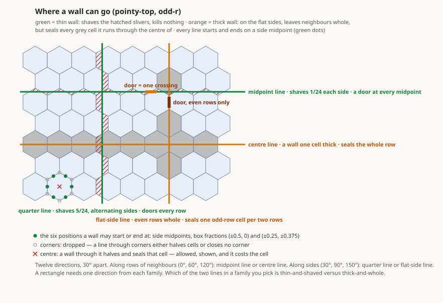

# Wall geometry — design

**Status:** RULED 2026-09-03 (Kirk: *"i think we are good… let's continue"*),
sixth revision. Record and the why: `wall-geometry.md`. Plan:
`wall-geometry-plan.md`. Amended by the plan: §5.2 gains `sealed`.
**Scope:** one model, two slices. Slice 1 = scenery floor. Slice 2 = walls as
lines. Both ride journey rpg-project#169.

Nothing is left open for Kirk in this revision. What he ruled in
conversation and where it landed:

| ruling | where |
|---|---|
| wall ends are picked from a small named set, never typed freehand | §2.6, §3.3 |
| the set is the six side midpoints and the centre; 30° steps between them | §3.3, §3.5 |
| to change angles a thick wall ends in the centre; thin walls turn at midpoints | §3.6 |
| a wall lies on a hex axis if a door is to stand in it | §3.5, §3.4 |
| a wall may run on a flat side and leave the hex whole; it seals what it centres | §1.7, §4.3 |
| the file keeps numbers; the designer hides them | §2, §3.2 |
| standability is a number, tuned later | §4.3 |
| legacy dungeons are deleted and recreated; the defaults are rewritten | §4.5, §7 |
| room templates come after this is clean | §8 |

## 0. Vocabulary

| thing | word | in the file |
|---|---|---|
| one straight wall with a start and an end | **wall** | a `walls[]` entry |
| a side midpoint or the centre of a hex | **position** | `{cell, offset}` |
| the hexes a wall passes through | **cells**, its footprint | never written; derived |
| the hex-to-hex step a wall blocks | **crossing** | never written; derived |
| where two walls meet | **corner** | two ends with the same position |
| floor nobody stands on | **scenery** | `scenery` |

## 1. The model

1. A cell carries two facts: an **owner** (a region, or none) and whether it
   is **standable**. Floor is any cell with an owner or a scenery mark. Void
   is neither.
2. **Owner decides visibility and meaning** — concealment, lighting,
   archetype. A cell with no owner is visible to everyone.
3. **Standable decides feet.** Members and the start stand only on standable
   cells. Props may stand on any floor.
4. **Scenery** is floor that is not standable. Three producers, one state:
   the author's brush (owner none), the cells a wall cuts (owner as painted),
   and the footing of a presented wall (projection only, §4.6).
5. **A wall is a straight line between two positions, and the file holds
   nothing else.** The crossings it blocks and the cells it cuts are derived.
6. **A position is the midpoint of one of a hex's six sides, or its
   centre** — seven per hex — written as `{cell, offset}` in bounding-box
   fractions. The set is closed: an offset outside it is refused by name.
   Kirk: *"the six sides in the middle and 1 for center."*
7. **A wall lies in one of twelve directions, 30° apart.** The six along
   rows of neighbours and the six along hex sides, together. Kirk: *"we are
   not making precision walls here and can be constrained."* In each family
   two lines exist: a **thin** one that shaves its neighbours, and a
   **thick** one on the flat sides that leaves neighbours whole and seals the
   cells it runs through the centre of (§4.3). Both are legal; the designer
   shows the cost.
8. **A door is a position on a wall.** It opens the one crossing of the side
   it is the midpoint of.
9. **The wall invariant.** A wall looks the same from the visible side
   whatever is beyond it: floor, void, scenery, or hidden space.
10. **Scenery is transparent and impassable. It seals nothing.** Sight and the
    concealment walk pass through it; walls are the only seal.
11. **One offset unit.** Bounding-box fractions, x east and y south, for wall
    positions, door positions, and prop offsets alike. Props move from
    circumradius units to this in the same wave; the content that would have
    needed converting is being recreated.

## 2. The panel — what a streamer sees and does

### Slice 1

- **2.1 Scenery brush.** A brush beside the room brush that paints floor
  belonging to no room. On the 2D board scenery is floor with a distinct
  hatch; in the 3D preview and in the game it is plain floor. *Plain floor
  is lit like the floor beside it* (ruled 2026-09-03 in the build): an
  ownerless floor cell takes the light of the nearest owned floor cell, a
  flood from every owned cell through floor, first arrival wins, ties by
  atlas cell order; with no owned floor reachable it takes the scene's
  ambient. Never a dungeon-wide fallback: the client's "unowned floor cells"
  legacy bail guarded an invariant this slice retires. Not ambient for all
  scenery, because in slice 2 every cut sliver and wall footing becomes
  scenery, and ambient would fringe every wall in every room that is not
  ambient-lit: the tell one layer down.
- **2.2 One state per cell.** Painting scenery over a room cell moves it out
  of the room; painting a room over scenery moves it in. Erase makes void and
  cascades as today (walls, doors, placements on the cell go with it).
- **2.3 Walls and doors** may stand on any floor, room or scenery.
- **2.4 Placement.** A prop drops on scenery. A monster or the start does
  not: the drop is refused in place with the reason ("nobody can stand
  here").
- **2.5 Errors point at the thing.** A compiler refusal that names a cell
  highlights that cell.

### Slice 2

- **2.6 A wall is two picked positions.** Pick a side midpoint to start.
  The end snaps to side midpoints that lie on one of the twelve rays from
  the start and put no cell centre on the line; nothing else is offered.
  Kirk: *"snapping could snap to one of those 12 points."* Once a start is
  picked the designer draws the lines from it, thin and thick told apart,
  with the cells each would seal greyed, so the author sees where a wall can
  go and what it costs before choosing (Kirk: *"maybe in the design we can
  visualize where we can go"*).
- **2.7 Corners.** Picking a position another wall already ends at joins
  them: the same `{cell, offset}` is written to both, and moving one end
  moves the other. That is the whole of snapping.
- **2.8 Doors.** Click a midpoint the wall passes through. The door is that
  side's crossing, and it draws as a gap in the wall around the midpoint.
- **2.9 Wall this boundary.** The common case is a straight wall between
  two rooms. One gesture along a boundary picks the ends for it, thin by
  default; the thick line is one toggle away (§4.3).

## 3. The file — dungeonspec version 2

### 3.1 Slice 1: `scenery`

| field | type | rule |
|---|---|---|
| `scenery` | rows of `[col,row]`, same encoding as `regions[].cells` | optional; omitted = none. Emitted after `regions`, before `start`. |

- **F1.** A cell MUST NOT appear in both `scenery` and any region's `cells`,
  nor twice in `scenery`. Refused naming the cell and the region.
- **F2.** `place[]` entries of prop refs MAY sit on scenery. Monster refs and
  `start` MUST NOT. Refused naming the placement and the cell.

### 3.2 Slice 2: a wall

Kirk: *"edges just need the starting and ending hex coordinate… not only be
easy to read it would be easy to edit."*

```yaml
walls:
  - start: { cell: [1, 2],  offset: [-0.25, -0.375] }   # across rows, quarter line
    end:   { cell: [1, 10], offset: [-0.25,  0.375] }
    height: 1
  - start: { cell: [1, 10], offset: [-0.25, 0.375] }    # along row 10, midpoint line
    end:   { cell: [9, 10], offset: [ 0.25, 0.375] }
```

| field | type | rule |
|---|---|---|
| `start`, `end` | position | required |
| `cell` | offset `[col,row]` | the hex the point is named from |
| `offset` | `[x,y]`, bounding-box fractions | MUST be one of the six positions (§3.3) |
| `height` | as today | |
| `name` | as today | |

- **F3.** Nothing derived is written. Footprint and crossings are the
  compiler's (§4.2).
- **F4.** The pair form (`edges: [[a,b], …]`) is **deleted**. Files that use
  it are refused at the header with a message naming the form. The defaults
  are rewritten by hand in this form (§7).
- **F5.** A corner is two walls carrying the same position at an end. Kirk:
  *"so long as the cells that overlap have the same offsets it is a
  corner."* The designer writes a join by copying the position; the compiler
  has no corner concept and needs none.
- **F6.** A wall's `offset` is mechanical (§4). A prop's `offset` stays
  visual only. Same shape, same unit, different law.
- **F7.** The list stays `walls`. `edges` is retired with the pair form.

### 3.3 The seven positions

Bounding-box fractions: x in widths, east positive; y in heights, south
positive (the axis the prop offset's y already maps to in world z). Every
value is a dyadic rational, so the set compares exactly as floats, and a
60° rotation maps it onto itself.

| orientation | side midpoints | centre |
|---|---|---|
| pointy-top | `[0.5,0]` `[-0.5,0]` `[0.25,-0.375]` `[-0.25,-0.375]` `[0.25,0.375]` `[-0.25,0.375]` | `[0,0]` |
| flat-top | `[0,0.5]` `[0,-0.5]` `[0.375,0.25]` `[0.375,-0.25]` `[-0.375,0.25]` `[-0.375,-0.25]` | `[0,0]` |

- **F8.** An `offset` not in the set for the file's orientation is refused
  naming the wall and the value.
- **F9.** The set may grow; nothing here needs it to.

### 3.4 Slice 2: a door

```yaml
doors:
  - id: crypt-door
    at: { cell: [1, 6], offset: [-0.25, 0.375] }
    closed: true
```

| field | type | rule |
|---|---|---|
| `at` | position | replaces `edges` |
| `id`, `closed`, `locked`, `concealed` | as today | |

- **F10.** Exactly one wall MUST pass through the door's position. None, or
  two, is refused naming the door.
- **F11.** The door's crossing is the crossing of the side whose midpoint
  the position is. One door, one crossing. A wider doorway is two doors.
- **F11a.** A door whose two cells are both sealed (a door in a centre-line
  wall) is legal. Nobody passes it; open, sight passes the gap — a window.
  The designer labels it "nobody can pass here"; the compiler does not
  refuse it. Kirk: *"not all walls have doors. I am fine having them not
  usable that way so long as we are not making some low level decision."*
- **F12.** `doors[].edges` is retired with the pair form.

### 3.5 Direction

- **F13.** The direction from `start` to `end` MUST be a multiple of 30°.
  Refused naming the wall and the angle.
### 3.6 Corners, by kind

- **F15. Thick walls turn at centres.** Every one of the twelve lines
  through a centre is a thick line — the row's centre line or a flat-side
  line — and a thick wall seals the cells it centres, so a centre end costs
  nothing more. Kirk: *"if you want to change angles I think it has to end
  in the center… then it would go out a clean axis on one of the 30 deg
  angles."* A thick flat-side wall can also turn onto a centre line at an
  even-row side midpoint, and nowhere else.
- **F16. Thin walls turn at midpoints.** Through every slanted midpoint
  pass thin lines at 0°, 60°, and 90° (for the upper-right one); through
  every flat-side midpoint at 30°, 60°, 120°, and 150°. So a thin wall makes
  60°, 90°, and 120° corners at midpoints and keeps the corner cell (3/4).
  No thin line passes through any centre — geometry, not policy — so a thin
  wall that wants to turn at a centre does it as a second wall: the ray from
  its end midpoint to the centre is a thick stub that seals that one hex,
  and the thick continuation leaves the centre. Legal, and the stub's cost is
  shown. Kirk: *"I just like restricting after [it] becomes a problem."*
- **F16a. Thin and thick are not in the file or the compiler.** They name
  what a line costs. The compiler knows seven positions, twelve directions,
  the area rule, and doors as positions on walls; the designer colours each
  offered ray by what it seals. There is no lower-level decision to relax.
- **F17. Thin meets thick at a flat-side midpoint**, through which pass two
  thick lines and four thin ones.

### 3.7 Through centres

- **F14.** A wall may pass through cell centres. Each cell it halves is
  sealed scenery: unstandable, every crossing out of it blocked. Nothing is
  refused; the designer shows the sealed cells at pick time. (An earlier
  revision refused these lines; Kirk: *"ideally one of the lines would be on
  the edge of the flat side not cutting off the hex at all"* — that line
  exists, and its price is the sealed cells, so it is a choice, not a trap.)

## 4. The compiler — `rulebooks/dnd5e/encounter/dungeonspec`

### 4.1 Floor (slice 1)

- **C1.** `owner` is unchanged. A `scenery` set is added. The flat cell list
  is `owner ∪ scenery`.
- **C2.** A wall MUST pass through at least one floor cell (owned or
  scenery); void cells on its path are not part of its footprint — nothing to
  cut, and the crossings into them are impassable already. This is how a wall
  stands against void (§1.9).
- **C3.** Props MUST be on floor; monsters and the start MUST be on standable
  cells.
- **C4. The concealment walk crosses scenery.** A *way* between regions A and
  B is a wall-free path from a cell of A to a cell of B whose interior cells
  are all scenery. It is a concealed way iff **any** crossing along it is a
  concealed door — the same answer from either end. So the walk is a flood:
  from visible space, cross bare crossings and ordinary doors, through
  scenery, stopping at walls and concealed doors; reaching a hidden region's
  cell is the refusal, naming the scenery cell the path enters and the room.
  Where the concealed door stands on the way is the author's choice: on the
  hidden room's own edge (a strip of floor in front of a secret door), on the
  visible room's edge (floor beyond a masked wall, byte-identical to the twin
  with the secret room deleted and the strip kept), or between two scenery
  cells. *Ruled 2026-09-03 during the slice-1 build: the earlier "first
  crossing" wording depended on which end the walk started from and refused
  the natural shape.* Visible reach from the start extends through scenery.
- **C5.** `hiddenFrom` is unchanged: hidden space is region cell sets. Scenery
  with no owner is in every member's atlas.
- **C6. The masquerade never stands a wall on scenery's far side.** Scenery is
  not visible *space*; a bare crossing from scenery into hidden space gets no
  synthesized wall. (C4 guarantees the scenery on the near side of such a
  crossing is unreachable from visible space: every way to it stops at a wall
  or a concealed door, and both read as wall.)

### 4.2 What a wall derives (slice 2)

- **C7. Crossings.** A crossing between adjacent cells P and Q is blocked iff
  the closed segment from the centre of P to the centre of Q intersects the
  closed wall segment.
- **C8. Footprint.** The wall's cells are every floor cell whose hex the
  closed segment intersects, in order along the wall.
- **C9. Embedding.** The compiler embeds cells in the plane for this alone:
  centre, corners, and bounding box of axial (q, r) under the file's
  orientation, circumradius 1. This is the toolkit's first world-unit
  geometry; `tools/spatial/room.go` names the corner-rule sight test as its
  second customer.

### 4.3 Standability (slice 2)

- **C10.** A footprint cell keeps its owner and is standable iff the area of
  its hex clipped by the near half-plane of every wall through it is at
  least `F` of the whole. `F` is one constant in the compiler, first value
  **0.7**, tuned in the game.

  With ends on side midpoints and twelve directions, exactly four kinds of
  wall exist, two per family, by symmetry the same in every direction of
  their family:

  | wall | passes through | neighbours | doors |
  |---|---|---|---|
  | along a row, **midpoint line** (thin) | slanted-side midpoints | shaved 1/24 both sides | every midpoint |
  | along a row, **centre line** (thick) | every centre in the row | whole; the row itself is sealed | none on the row |
  | across rows, **quarter line** (thin) | slanted-side midpoints | shaved 5/24, alternating | every row |
  | across rows, **flat-side line** (thick) | flat sides in even rows, centres in odd | whole; one odd-row cell sealed per two rows | even rows |

  

  *Generated from the hex geometry (`wall-geometry-lines.svg`); the
  fractions it labels are computed, not drawn. Green = thin, orange = thick,
  hatched = what a thin wall shaves, grey = what a thick wall seals, green
  dots = the six midpoints, orange dot = the centre.*

  A thin wall never makes a cell unstandable on its own. Only corners can: a
  square room's inside corner (quarter line + midpoint line) keeps exactly
  3/4, a hexagonal room's corner (two quarter lines) keeps 7/12. **0.7, not
  0.75**, so the square corner is not decided by float noise; the hexagonal
  corner goes scenery and the designer shows it. A thick wall's sealed cells
  are scenery by the same rule (1/2 < 0.7) and need no special case.
- **C11.** The designer displays the compiler's answer. A local mirror is
  deferred until the picker feels dead without one; if built, it is pinned to
  the compiler by a golden fixture.
- **C12.** A monster or the start on a cut cell is refused naming the wall
  that cuts it. A prop on a cut cell is allowed.
- **C13.** "Walkable anyway" on a cut cell is a named empty shelf. The
  scenery brush covers the direction the author needs today.

### 4.4 Doors (slice 2)

- **C14.** The door's crossing is the crossing of the side whose midpoint
  it stands on (F11). It reaches the wire as one doorway under the door's
  id, exactly as a single-edge door does today.
- **C15.** The door's presented gap is the wall's segment through the door
  hex on either side of the midpoint, one side's length in all.
- **C16.** Lock and concealment semantics are unchanged.

### 4.5 Legacy — deleted

- **C17.** The pair form and its fitter are removed, not deprecated. Kirk:
  *"legacy dungeons will be deleted and started over again."* The client's
  chain-fitting (`CHAIN_TOLERANCE`, `boardWallScene`) retires in the same
  wave; a wall renders as the segment it is.

### 4.6 Projection (slice 2)

- **C18. Footing.** In `AtlasFor`, every footprint cell of a *presented* wall
  is in the recipient's atlas as scenery with no owner, even when its owner
  is hidden. Only presented walls foot: the footing of a withheld wall would
  trace the secret. This is rpg-dnd5e-web#898, built.
- **C19. Masquerade on a wall.** A concealed door in a wall is presented to a
  non-knower as the wall's whole segment without the gap. `maskHeight`
  reads the wall's height; it no longer reconstructs a chain.

## 5. The wire — `dnd5e.api.session.v1alpha1.GetAtlasResponse`

### 5.1 Slice 1: no change

`cells` is already the flat floor list and `regions[].cells` the membership.
A cell in `cells` and in no region is scenery. Movement is refused by the
engine, not the client.

### 5.2 Slice 2: additive

```proto
message AtlasSegment {
  AxialPoint from = 1;   // fractional axial: a point in the atlas's own frame
  AxialPoint to = 2;
  float height = 3;      // the wall's height multiplier, the SAME width as
                         // AtlasBoundary.height so a client never compares a
                         // float32 0.7 against a float64 0.7 (ruled in the build)
}
message AxialPoint { double q = 1; double r = 2; }
repeated AtlasSegment segments = 10;   // on GetAtlasResponse
```

- The client's axial-to-world formula already accepts fractions; no unit and
  no second basis cross the wire.
- `repeated Position sealed = 11;` — every cell in this recipient's atlas
  nobody can stand on: scenery and the cells walls seal. Needed because a
  sealed cell keeps its region, so membership no longer implies standable.
  (Plan amendment, 2026-09-03.)
- `boundaries` and `doorways` are unchanged and remain the mechanical truth.
  `segments` is presentation: what the client draws instead of fitting. A
  door's gap is derived client-side from its doorway and the segment.
- Prop offsets on the wire change unit (§1.11): the proto comment, not the
  field.
- rpg-api translates; the runtime never reads segments.

## 6. The runtime — what it answers today and what it needs

| question | today | needed |
|---|---|---|
| can a member step onto an ownerless cell | refused, "is not floor" | scenery refused as "is scenery: floor nobody stands on" (ruled 2026-09-03 in the build; "is not floor" would lie about a cell §0 calls floor, and Kirk reads that line in the walk); void unchanged |
| can a wall stand on an ownerless cell | refused, "a crossing nobody can make" | accept scenery (C2) |
| does sight pass over an ownerless cell | treated as void, so per `void` setting | scenery is transparent regardless (§1.10) |
| can a prop sit on an ownerless cell | refused | accept scenery (C3) |
| which crossings does a wall block | the pairs as written | derived (C7), still delivered as pairs |
| which crossing does a door open | its listed pair | its side's crossing (C14), still delivered as a doorway |
| who sees a cut cell | n/a | footing (C18) |

Mechanics on the wire do not move. rpg-api is a pin in slice 1 and a pin plus
a translation in slice 2.

## 7. Acceptance

Slice 1:

- **A1.** Every current content file compiles to a byte-identical atlas.
  (Slice 1 touches no wall.)
- **A2. Yardstick.** Kirk's concealed room re-authored with a scenery strip
  behind the visible room's wall: a non-knower's `AtlasFor` is byte-identical
  to the twin dungeon with the secret room deleted and the strip kept.
- **A3.** The forgotten wall: visible room, scenery, hidden room, no wall.
  Refused, naming the scenery cell and the room.
- **A4.** A monster on scenery is refused; a prop on scenery compiles and
  renders.
- **A5.** In play, a step onto scenery is refused and two members in visible
  rooms separated only by scenery see each other.

Slice 2:

- **A6. The tomb, rewritten.** `reference-tomb.yaml` re-authored in the wall
  form compiles to the same cells and the same blocked crossings as its
  pair-form original, and every door opens the same crossing. This is the
  forcing case and the regression net that replaces byte-identity. Kirk:
  *"we built the thing, verify it works, then rewrite that and commit it."*
- **A7.** The record's 6×6 room: four walls emit four segments, the board
  draws four lines, and the blocked crossings are the same 46 the room tool
  authored.
- **A8. Calibration.** A quarter-line wall and a midpoint-line wall leave
  every adjacent cell standable at `F = 0.7`; a flat-side wall seals exactly
  the odd-row cells on it and nothing else; a square room's inside corner is
  standable; a hexagonal room's corner is scenery.
- **A9. Refusals.** An offset outside the six; a direction off the twelve; a
  door position no wall passes through; a door position two walls pass
  through; a pair-form file. Each refused naming the thing.
- **A10.** A concealed door in a wall: the non-knower's atlas carries the
  full segment and no doorway; the knower's carries the gap. Yardstick twin
  identical.
- **A11.** The hugging layout with a quarter-line wall: the non-knower's atlas
  shows floor on both sides of the wall (C18) and equals the twin authored
  with scenery where the footprint falls.
- **A12.** Two walls carrying the same position at an end close a corner on
  the board: thin at a midpoint for 60°, 90°, and 120°, keeping the corner
  cell; thick at a centre for the same three; thin-to-thick at a flat-side
  midpoint. A thin wall offered a centre end is a picker defect.
- **A13.** Every prop in the rewritten defaults renders where it did, after
  the unit change, by screenshot.

## 8. Shelves — named, empty

- **Room templates.** Kirk: *"template shapes that are a region built out…
  map parts that we assembled"* (Gloomhaven). A template is a region, its
  walls, and its doors in a local frame; placing one translates the cells and
  rotates by a multiple of 60°, under which the six positions map onto
  themselves. After this design is clean.
- "Walkable anyway" on a cut cell (C13).
- Region-scoped authored scenery (`regions[].scenery`): not needed; cuts
  produce it derived, with the region's visibility.
- More than one prop per hex: its own thing (record, ruling 8).
- Cliff edges, the third thing a floor edge can be: rpg-toolkit#1443.
- Sight across transparent void between two regions with no wall between
  them: a pre-existing gap of the same shape as C4, to be filed on the
  toolkit, not folded in here.
- A designer-local mirror of the standability rule (C11).

— cross-team agent, on behalf of KirkDiggler
