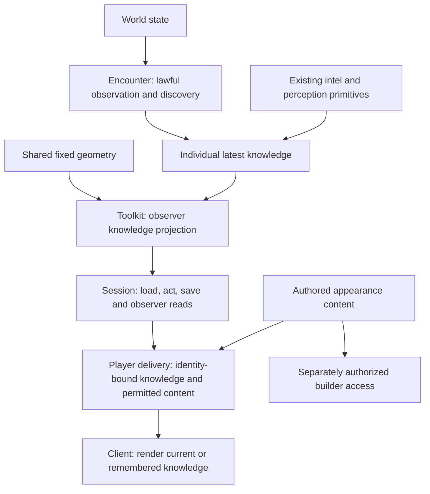

# Individual dungeon knowledge

## Shape

The world, a character's knowledge, and the picture delivered to that character
are different answers. Observation changes knowledge; the client does not derive
knowledge from world truth. The delivery boundary uses the toolkit's disclosure
answer and does not implement another perception algorithm.

The [first-slice proof](first-slice-proof.md) is the walk for ruling; investigation
and evidence stay on [#508](https://github.com/KirkDiggler/rpg-project/issues/508).

The proposed first slice is **one room, two characters, one ordinary door and one
pickup-able prop**, with an opaque partition that lets their observations differ.
The room's fixed layout is explicitly pre-explored in this proof fixture; this is
not a default for newly entered dungeons. The slice proves observed, remembered,
and replaced changeable state through the real player path and reload.

Shared fixed geometry need not be copied into every character's memory. Which
parts a character knows is individual. Mutable prop and door observations cannot
be replaced by references to their unseen live state. Exact observation units,
indexes and payload types remain open.

Appearance remains content, not a rendering document embedded in encounter
state. Player delivery selects only permitted content; separate builder authority
may permit the complete authored document. The mechanism and responsibility split
for that selection require a ruling before implementation.

The endpoint is sight-shaped exploration with undiscovered content absent from
player delivery. Slice 1 is not a claim that unexplored geometry, secret-door
checks or arbitrary authored dungeons already satisfy that endpoint. A
fixture-only or local-only proof is labeled as such, not shipped as complete
production knowledge protection.

## Law

### Settled behavior and endpoint

- **R1 — Individual knowledge.** A character learns through its own observation or
  discovery. Another character's discovery does not automatically teach it;
  explicit intel sharing is outside this work's first slice.
- **R2 — Discovery is not interior sight.** Finding a concealed door teaches the
  discoverer about that door, not the room behind it. A character who perceives it
  standing open can discover it independently; room contents still require their
  own observation.
- **R3 — Latest knowledge, not history.** Loss of sight preserves the last-known
  observation. New evidence that disproves it replaces the stale knowledge rather
  than retaining an additional historical version.
- **R4 — Absence needs evidence.** An unseen world change does not update knowledge.
  Observing a remembered location empty replaces the disproved location belief
  without disclosing where the object went or who took it. Omission from a percept
  alone does not establish that the old location was observed empty.
- **R5 — Server disclosure boundary.** Undiscovered dungeon content does not reach
  the player's client. Reads, events, replay, reconnect and player-accessible
  content requests obey the same individual knowledge boundary. Hiding delivered
  truth in a renderer does not satisfy this rule.
- **R6 — Slices keep their limits visible.** Every intermediate slice states its
  proof and remaining gaps. Any temporary relaxation of R1–R5 requires its own
  explicit scope and ruling; permission to work incrementally grants no unnamed
  exception.

### Proposed first-slice contract — R7–R10 remain open

- **R7 — Bounded vertical proof.** The first slice uses the one-room fixture in
  Shape, real toolkit observation, session persistence, authenticated player
  delivery and the existing game renderer. Pre-explored fixed geometry is a
  fixture condition, not a substitute for exploration or permission to download
  the complete authored document.
- **R8 — Existing knowledge mechanism.** The slice composes existing intel
  replacement semantics rather than creating an observation-history store. It
  supplies evidence using encounter-owned perception rules, including range,
  obstruction and applicable sight effects. Every sustained observation pass
  remains complete for its observer and channel.
- **R9 — One permitted view.** Prop and door reads, relevant action responses and
  event payloads agree with the observer's knowledge. The slice's player path
  cannot bypass that answer by fetching authored world truth or selecting another
  character's identity. Appearance selection consumes authorized disclosure;
  neither the API nor the client computes game visibility.
- **R10 — Refresh and reload agree.** Current observation replaces stale state
  without a visible interval in which stale and replacement facts are both
  presented as current. Save/load and reconnect restore each character's own
  latest knowledge; they do not regenerate remembered state from live world
  state. Remembered state is not itself permission to interact with an unseen
  object.

## Rulings

The settled rows bind the behavior and endpoint of this design, not a storage
schema or implementation wave. Open rows are proposals. Publication of this
draft does not authorize implementation.

| ID | status | scope | ruled by | date |
|---|---|---|---|---|
| R1 | settled | Individual knowledge; no automatic sharing | KirkDiggler | 2026-09-30 |
| R2 | settled | Door discovery separate from observing the interior | KirkDiggler | 2026-09-30 |
| R3 | settled | Latest knowledge replaces disproved memory; no history layer | KirkDiggler | 2026-09-30 |
| R4 | settled | Witnessed absence replaces stale location, not unseen truth | KirkDiggler | 2026-09-30 |
| R5 | settled | End-state player disclosure excludes undiscovered content | KirkDiggler | 2026-09-30 |
| R6 | settled | Incremental delivery with explicit compromises | KirkDiggler | 2026-09-30 |
| R7 | open | First-slice fixture and vertical proof boundary | — | — |
| R8 | open | Composition of observation and existing intel | — | — |
| R9 | open | First-slice read/event/content and identity boundary | — | — |
| R10 | open | First-slice refresh/reload behavior and interaction distinction | — | — |

## Open

- **Observation unit.** Select how observed places, props and doors contribute to
  knowledge without storing competing answers about the same placement. The
  absence witness must describe the area it actually observed; partial footprint
  visibility, concealment and unavailable senses cannot silently count as a
  complete empty observation.
- **Shared geometry.** Choose the explored-geometry representation and its
  association with the content revision. A shared definition does not imply
  shared discovery, nor may a mutable content key rewrite a remembered picture.
- **Player content delivery.** Decide how the toolkit's disclosure answer selects
  appearance content without moving the World Builder's document into encounter
  or implementing visibility in the content service. Specify player versus
  builder authorization and resistance to direct document/identifier requests.
- **First-slice compatibility.** Name the supported authored shape and player
  route. State any interim limitation and its acceptance boundary explicitly;
  neither an unrestricted content fallback nor silent partial room support is
  implied by this draft.
- **Existing creature behavior.** Decide the scope of observed-absence
  replacement for creatures alongside props. Preserve existing observer and
  currency semantics; no creature-behavior change is silently bundled with the
  prop/door proof.
- **Knowledge lifetime.** Distinguish reloading/reconnecting to the same encounter
  from leaving and returning to it, starting a new encounter, or revisiting a
  different revision of a dungeon. The first-slice proposal covers reload and
  reconnect only.
- **Scale.** Choose representative geometry, prop and observer counts and a
  measured budget before selecting new indexing or compression.
- **Later slices.** Specify sight-shaped floor/wall discovery and the two-room
  secret-door proof, then broaden content delivery and compatibility coverage.
  Later acceptance includes every player-facing path, not just the first-slice
  fixture.
