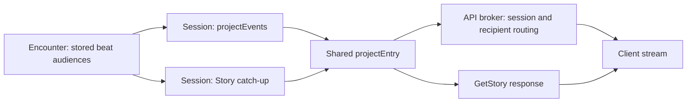

# Tomb sight and delivery investigation — 2026-10-01

Working evidence for [#508](https://github.com/KirkDiggler/rpg-project/issues/508)
and [#509](https://github.com/KirkDiggler/rpg-project/pull/509), not design law,
a production implementation, or a checked implementation plan. Recommendations
below are **proposed**, not new operator rulings.

**Scope correction after this checkpoint:** the operator's first proof starts in
room 1 with room 2 unseen behind a closed door; observing its further door must
not deliver room 3. Fixed non-holdable scenery belongs to the shared geometry,
while creatures, holdable props and door state use current/remembered intel.
The revised [design](design.md) and [proof](first-slice-proof.md) carry that scope.
The pre-explored experiments below remain historical capability evidence, not
completion of the corrected first proof.

## Revisions and method

| Repository | Inspected revision |
|---|---|
| toolkit | `0ffef08b92bfb88882539a22c352c26a064a583b` |
| API | `c42120a089985b106c1fb2c983189d4db787da28` |
| web | `2bad29ac26a5d644a0f3beb3a84b2ca300b0fe31` |

Detached worktrees: `<repo>/.worktrees/508-mechanism-probe`.
Go 1.27.0, linux/amd64. `GOWORK=off`, `-mod=readonly`: committed provider
pins, no workspace overrides. Encounter and session consume spatial v0.16.1
and perception v0.3.0; session consumes encounter v0.109.0. API consumes
encounter v0.109.0 and session v0.111.0.

The [probe source and runner](probes/run.py) are kept with this investigation.
The runner overlays otherwise nonexistent test files; it changes no toolkit or
API source. It compiles **the API's actual** `content/reference-tomb-heirloom.yaml`,
then uses its field with two fixture characters. Three compiled monsters are
excluded from the bounded geometry experiment. Both characters start inside
the vault, so existing occupancy discovery establishes prior knowledge. No new
secret-door check behavior is being tested.

Geometry queries use the existing private `sightReach.Reaches`, with supplied
24-cell range, real canvas LOS and runtime sight areas. They ask whether a
specified position is inspectable; they are **not a production absence producer**.
Equipment, participation, checks and driver are explicitly test capabilities,
not real character sheets. The vault's authored darkness is not a RAW light test.

## Measured walk candidate

Coordinates here are **authored offset cells**, not runtime axial coordinates.
The probe obtains the latter through the field's one conversion.

| Moment | A | B | Result |
|---|---|---|---|
| Initial view | `[28,2]` | `[29,4]` | Both reach heirloom at `[29,3]` and a door-side endpoint |
| Withdraw | Walk to `[27,3]` | Stays | A reaches neither old prop position nor either door endpoint |
| Pickup and close | Stays withdrawn | `Hold(heirloom)`, `CloseDoor` | Both normal verbs succeed; pickup does not end the run |
| Approach shut door | Walk to `[27,5]` | Stays | A reaches the near door endpoint, not the prop's old position |
| Open | `OpenDoor` from `[27,5]` | Stays | A reaches the now-empty old position without standing on it |
| Reload | Two JSON save/load cycles | Same | Geometry and actual holding survive; run remains open |

Runtime door ID: `reference-tomb-heirloom/vault`. It starts **open** in these
compiled bytes; the initial experiment wrongly tried opening it again and was
refused. Runtime heirloom position is `(28,3)`; door-side cells are `(25,5)` and
`(26,4)`.

The normal withdrawal path, in axial coordinates, is:
`(27,2) → (27,3) → (26,4) → (25,5) → (25,4) → (26,3)`.
The approach is `(26,3) → (25,4) → (25,5)`.
All steps were routed through the encounter's own cell query and executed with
`Step`. B's `[29,4]` reaches both the prop and door with their default adjacency
rules. Starting B at `[28,4]` would put the prop two cells away; it was not kept
as the fixture position.

A scan found three standable tomb positions out of reach of both supports while
the door is open: authored `[27,1]`, `[27,3]`, `[27,7]`. The selected route needs
no hall-tomb unlock. Whether the full monster-populated live game permits an
uninterrupted walk remains unproved.

**Door observation is still a design choice.** One fixed door-side anchor failed
to let both sides observe the door. The revised experiment uses reach to either
endpoint for this one edge door. That is a hypothesis about its observation
support, not proof that arbitrary edge/footprint doors are fully observed when
any occupied cell is visible.

## Baseline gaps reproduced, not fixed

The normal walk deliberately asserts current behavior, not the new acceptance
contract:

- Blind A's `AtlasFor` loses the heirloom immediately on B's pickup.
- Blind A's `DoorsFor` returns closed immediately on B's unseen close.
- A's saved/reloaded story contains both
  `{"beat":"held","holder":"bob","prop":"heirloom"}` and
  `{"actor":"bob","beat":"door","door":"reference-tomb-heirloom/vault","state":"closed"}`.

Source explains the measured results: `encounter/projection.go:99,303` filters
concealment, not last-observed state; `hold.go:313` records `held` to a subject-beat
audience and does not run a prop knowledge pass; `doorverbs.go:510` audiences a
state beat to door **knowers**, not current witnesses. Knowing something exists
is not permission to learn its unseen changes.

## Observation approaches tested against the geometry

Both experimental shapes passed the measured walk, with a complete percept
including the other character, fog blocking an otherwise-open LOS, repeated
observations and independent JSON knowledge reloads. The experimental store is
separate from the encounter's production store; payloads and ID prefixes are
illustrations, not approved schema. The fixture supplies the successful pickup
as world state, but replacement is separately gated by each observer's actual
reach to the remembered position.

| Approach | What replaces stale state | Cost / unresolved obligation |
|---|---|---|
| Subject-oriented | Latest prop/door snapshot; after the complete pass fades an absent prop, an evidence-gated `Report` replaces its old location with unknown | Small mutable records, keeps object identity; needs lawful absence witnesses, ordering and typed subjects |
| Place-oriented | Latest complete observed contents at a place, including empty | Absence is direct; needs place granularity/completeness and a policy retaining known object identity without competing placement answers |

**Recommendation for ruling:** subject-oriented prop/door snapshots, with an
encounter-owned observation of their spatial support supplying absence evidence.
This fits the bounded mutable-state use case without adopting a per-cell contents
store just because the map already has cells. No second historical layer, no
full dungeon copy. Observing empty changes only the stale location assertion,
not knowledge of a carrier or destination.

Do not extend the prop experiment into creature arrival correction implicitly.
Creature absence behavior is still the design's named open scope. Prop and
creature observations must compose into one complete sight pass, not two passes
that fade each other's subjects. The existing `Report` preserves currency: it
can only supply this correction after the sustained pass has retired current
sight of the prop.

## Delivery trace and approaches

The existing route is:



- `session/events.go:38,120,162`: `EventStream.Publish` already receives
  recipient-projected batches; live and catch-up share `projectEntry`.
- `encounter/encounter.go:1201`: replay uses the audience saved with the beat,
  not a new audience derived from current knowledge. New discovery must not
  expand old state-beat audiences.
- `session/stream.go`: persisted per-member dense numbering closes the gap
  oracle; `read.go:447` reports trimmed replay explicitly.
- API `internal/orchestrators/session/broker.go`: in-process, best-effort routing;
  recovery is SDK `Story`, not broker persistence. `stream_events.go:18` checks
  ownership, then forwards; it carries no replay contract.
- Web `useSessionEventStream.ts:158,236,360`: connect/gap recovery uses `GetStory`
  and buffers/deduplicates live events. This is existing machinery to extend,
  not evidence a Redis Streams rewrite is necessary.

**Recommendation:** keep this seam and decide lawful audiences when writing
prop/door knowledge beats. Preserve per-recipient numbering and shared live/replay
projection. Verify reconnect hydration separately from replay: replaying a
bounded story window is not rebuilding all current knowledge.

The separate appearance path still bypasses the desired boundary:
`useDungeonScene.ts:102` downloads full YAML even for the v2 Tomb, then returns
no authored scene for that dialect. Its visuals already come from atlas geometry
and reusable prop definitions. `authoring/v1alpha1/get_dungeon.go:14` checks only
that a player is signed in. `handler.go:51` explicitly says no per-player
ownership exists. The global authoring-enabled switch is not builder authority.

| Player content approach | Trade-off |
|---|---|
| Session disclosure manifest → authorized appearance fragments from content | Keeps content and rules separate, allows reuse; requires identity-bound fragment reads and revision binding, never client-chosen hidden IDs |
| One session-facing response assembled from SDK disclosure plus a host content provider | Easier response coherence; requires an outward content-provider seam, without encounter holding or validating a rendering document |
| Reuse full document and hide it in web | Rejected by settled R5/R9, even if the renderer looks correct |

For the **v2 Tomb proof**, the smallest plausible route is no authored-document
fetch at all: SDK-projected geometry and prop/door knowledge plus reusable
appearance definitions. This is a **proposed compatibility boundary**, not an
approved exemption for authored-room support. The general fragment-versus-
assembled-response contract remains open. Both sound approaches need separately
authorized builder document access; deleting one web fetch does not close it.

Before broadening to authored rooms, source inspection also requires handling
scene groups/transforms/lights and purely visual scenery, rather than filtering
only gameplay prop IDs. The registry replaces content under mutable keys;
`SessionData.Dungeon` stores a key, not an immutable revision. A content revision
must not rewrite a remembered picture. Exact revision storage/provider contract
and builder authority need shaping before their implementation.

## Checks run

| Check | Result | What it does not claim |
|---|---|---|
| Tomb generator, spatial scan, baseline walk, both knowledge shapes | 5 passing leaf cases, race detector | No production integration or real character/browser walk |
| Selected session event, story and numbering tests | 16 passing leaf cases, race detector | No new prop/door delivery semantics |
| Selected API atlas/doors/stream tests | 26 passing leaf cases, race detector | No whole-product authorization closure |
| API existing `GetDungeon` tests | 4 passing leaf cases, race detector | Signed-in access is not builder authorization |
| Web `useSessionEventStream` and `useDungeonScene` tests | 25 passing tests | No native browser/network proof |

Exact commands for the first row:

```sh
python3 ideas/dungeon-intel/probes/run.py <toolkit-worktree> <api-worktree> --output <local-evidence-dir>
```

Other commands, from their owning worktrees:

```sh
# toolkit/rulebooks/dnd5e/session
GOWORK=off go test -mod=readonly -race -count=1 -json . -run 'TestEventsSuite|TestMonsterTurnSuite/TestLiveDeliveryAndStoryCatchUpAreByteEqual|TestReadSuite/TestStory|TestNumberEntries'
# API
GOWORK=off go test -mod=readonly -race -count=1 -json ./internal/handlers/dnd5e/session/v1alpha1 ./internal/handlers/dnd5e/authoring/v1alpha1 -run 'TestGetAtlas|TestGetDoors|TestStreamEvents|TestHandlerSuite/TestGetDungeon'
# web (installed dependencies shared with the identical-revision root checkout)
npm run test:run -- src/components/session/useSessionEventStream.test.ts src/components/session/useDungeonScene.test.ts
```

No full CI gate, performance budget, native browser walk, Redis integration or
independent review was run. No provider source, content, dependencies, running
session or continuity file changed.

## Decision to take next

Choose the observation representation first: **subject snapshots with a spatial
absence witness** (recommended) or **complete place contents**. Then settle the
first-slice content compatibility and builder authorization, and derive the
checked implementation plan. Do not treat these recommendations as settled law.

— cross-team agent, on behalf of KirkDiggler
