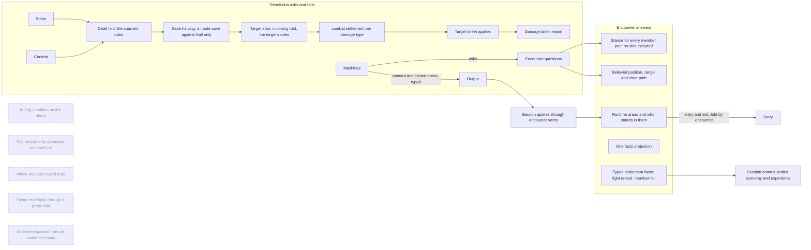

# Encounter answers, resolution asks

## Shape

A question about the target or the field belongs to the layer that owns the
target or the field. What a target lets through is the target's answer, folded
in a step of its own. Who stands where, what an observer believes, which side a
member is on and what a verb settled are the encounter's answers. Resolution
asks and rolls; it never recomputes an answer from raw holdings, geometry or
story text, and never decides one by matching a content ref. The dashed boxes
are the recomputations and copies this design retires.

## Law

### Damage a target receives

- Every damage source in resolution delivers through one target step: a strike,
  a contest, and any source added later. No source applies damage to a sheet
  any other way.
- The order is fixed: the dealt fold, then the save's halving when a made save
  meets a Half gate, then the target step (the incoming fold, then the
  settlement), then the sheet applies the settled instances, then the damage
  taken report and its follow-ups.
- The dealt fold carries what the source deals and nothing the target answers.
  The incoming fold carries only the target's answers: reductions (a negative
  modifier on one damage type) and multipliers (immunity, resistance,
  vulnerability). A target answer never changes or removes a dealt component;
  the step refuses a fold that did.
- A condition that answers on both sides subscribes to each fold separately.
  Raging adds its damage on the dealt fold and resists on the incoming fold.
- Both folds read the action's frame; the incoming fold's frame names the
  target as known. A target rule that depends on how the damage arrived (a
  weapon attack, a saving throw, a magical source) reads the frame, never a
  component's source stamp. A contest's frame is the saving-throw frame with
  the weapon pool known false, so a weapon-attack rule answers "does not
  apply" there, and an unknown weapon pool fails the fold.
- A target reduction sits on one damage type, the grain the settlement folds
  on. A reduction spanning types arrives with the first rule that needs one.
- The settlement is combat's: for each damage type, what was dealt, the
  effective factor its stacking rule chose, and what is taken, including a
  type taken as nothing. `FinalDamage` is the settlement's landing instances.
  Nothing reads a factor back by folding a probe amount.
- The received damage carries one trace: the dealt components, the save's
  halving, the target's reductions, and one line per multiplied type that
  names the first multiplier in fold order whose own factor is the effective
  one and carries the change it made. The trace totals the number the sheet
  takes; the step refuses to apply a number its trace does not explain. Strike
  and contest outcomes carry this one shape. A raw multiplier component never
  leaves resolution.
- The target step is a fold and poses no question to the host. A reaction that
  changes the damage a target takes answers in a window that closes before the
  step opens; its answer reaches the step as a target reduction or multiplier,
  rolled by the machine that holds the window.

### Rules as written

- Resistance and vulnerability apply after every other modifier, the save's
  halving and target reductions included. Immunity wins over both; resistance
  and vulnerability cancel; neither stacks. Rage resists bludgeoning, piercing
  and slashing from any source; Blade Ward resists those types only from weapon
  attacks. No divergence is introduced.

### Who is in an area

- A runtime area and who stands in it is the encounter's. Encounter answers
  membership from the same placement every member read uses, at every step a
  member takes and at every change to the area set, and tells entry and exit
  itself in the story.
- Nothing persists membership. No condition on a sheet records it, and no pass
  reconciles one from geometry. A member is in an area exactly when the
  encounter says so, at the moment it is asked.
- Resolution reports the areas an interaction opens (the area input) and closes
  (the source whose areas end) as typed output. The session applies them to
  the live encounter through encounter's own verbs. No layer replaces the area
  set wholesale.
- An area's membership label is content's: the spell declares it and the area
  carries it. Encounter interprets geometry only. Resolution never selects an
  area by its spell ref.
- A rule that bears on membership asks the encounter at use, through the frame,
  and the question is added with that rule.

### What an observer believes and reaches

- Where an observer believes a subject stands, and whether that believed point
  is within a range on a clear path, is the encounter's answer, typed: the
  location state, whether the point is in range, and whether the subject has
  moved off it. Resolution applies the rule's policy to that answer (refuse the
  cast, or attempt and miss a displaced target). Resolution never decodes a
  holding's payload and never measures distance or a path itself.
- Encounter answers the stance for every pair of members: hostile, neutral,
  allied, or no side for a member in no faction. A pair naming a non-member is
  refused. Every reader takes that answer; none reconstructs "no side" from a
  missing stance and a membership check.
- A creature's table reads its facts from one projection, for a social verdict
  and for a driven turn alike. A downed subject is never an enemy in reach.
- A target beyond range reaches the host as out of range on every verb. An
  attack whose delivery cannot reach stays its own refusal.

### What a verb settles

- Encounter reports what a verb settles as typed facts: a fight ended (its
  members and its cause) and a member fell (who, their kind, and the sequence
  of the fall). Session reads them through one encounter read bounded by the
  verb's baseline sequence, at commit, before the save, for the economy reset
  and for experience.
- Settlement facts come from the encounter's own record, across every
  audience. A settlement never reads an audience's story and never decodes a
  payload; a payload's format belongs to the module that writes it, and only
  that module decodes it.
- The beat kinds a client reads are constants encounter exports; the session's
  projection maps constants, never string literals.
- An empty member id is refused as an empty id; a non-empty id that names no
  member is refused as not a member, at every encounter door.

### What stays out

- No proto change. The damage component's multiplier field stops being
  written; marking it deprecated rides with the next protos change.
- The one capabilities value and resolution's whole-world write-back belong to
  the capabilities design; reaction windows and their envelope belong to the
  pause envelope design. This design fixes only where a damage-changing
  window sits relative to the target step.
- Perception and mind internals are not touched.

## Rulings

| ID | status | scope | ruled by | date |
|---|---|---|---|---|
| R1 | settled | Tier 2 items B, G and H are one design, "encounter answers, resolution asks", after sheet facts at use time and before session verbs | KirkDiggler | 2026-10-07 |
| R2 | deferred-until-the-pause-envelope-design | The window a damage-changing reaction answers in (Deflect Missiles, Uncanny Dodge) and its envelope; its position before the target step is this design's law (owner unset) | — | — |
| R3 | deferred-until-an-entry-triggered-area-ships | How a rule fired by entering an area resolves inside a walk (owner unset; see Open 3) | — | — |
| R4 | deferred-until-a-sourceless-damage-ships | The frame for damage with no acting member: falling, a trap, an environment (owner unset) | — | — |
| R5 | deferred-until-a-rule-asks | An exported area-membership question for a rule that bears on membership (owner unset) | — | — |

## Open

1. **Does the target step pose a question to the host?** Recommendation: no.
   The step stays a fold. Deflect Missiles and Uncanny Dodge are both decided
   when the attack hits, before damage is known, so their window sits between
   the settled hit and the damage roll, owned by the strike and shaped by the
   pause envelope design. The answer reaches the step as a target reduction or
   multiplier the machine rolled. One place holds windows, and the step stays
   re-entrant-free.
2. **Retire the In Fog condition outright?** Recommendation: yes. No rule reads
   it (its own contract adds no Blinded and no attack modifier; both censuses
   mark it not bearing), visibility already comes from the area's geometry,
   and the story already tells entry and exit from encounter's own
   transitions. The cost is the "In Fog" line on the sheet's condition list.
   Old saved sheets carrying it load and drop it — the treatment sheet facts
   gave its copies, asked here for this one rather than assumed.
3. **When a rule fires on entering an area (Spirit Guardians, Web, Moonbeam),
   does it resolve at the step or at the end of the move?** Recommendation: at
   the step, through the walk's existing interrupting resolve (the
   opportunity attack's channel), because the tabletop resolves it mid-move
   and its outcome can end the move. Nothing ships it now; encounter already
   reports the entry at the step, which is all this design needs to fix.
