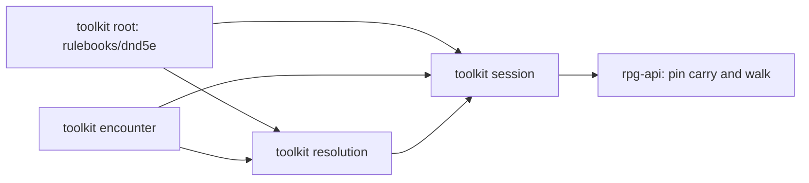

# Encounter answers, resolution asks — slices

A working document beside `design.md`: the slice order and what done means per
module. It is not the implementation plan. The plan, with task contracts and
verification commands, follows design agreement under the design skill's
planning guide.

Develop outside-in, merge inside-out. One nearest-`go.mod` module per toolkit
PR; every consumer PR builds on its provider's branch pseudo-version until the
provider tags; the wave is walked once on the local stack before anything
merges.

## Order

Root and encounter are independent of each other and can build in parallel.
No protos slice and no web slice.

## 1. toolkit root — `rulebooks/dnd5e`

Lands: the incoming damage topic and its event (target, source, the dealt
components read-only, the action's frame); combat's exported per-type
settlement (dealt, effective factor, taken, a type taken as nothing included)
with `FinalDamage` as its landing instances; immunity, vulnerability, Raging's
resistance and Blade Ward answering on the incoming topic, Blade Ward deciding
"weapon attack" from the frame; Raging's damage bonus staying on the dealt
fold; the dealt topic's documentation saying it carries no target answer; the
In Fog condition type, its factory, census, display and status-view entries
retired, its loader dropping an old saved entry (R7); the In Fog ref kept
as the area's membership label for the story.

Done when:

- A raging barbarian's own Rage bonus folds on the dealt fold, and a strike
  against a raging barbarian folds no resistance there; the resistance appears
  only on the incoming fold.
- Blade Ward resists a weapon attack's slashing and does not resist a
  saving-throw frame's slashing.
- The settlement reports factor 0 and taken 0 for an immune type that
  `FinalDamage` drops, factor 1 for resistance and vulnerability together, and
  0.5 for two resistances.
- A sheet saved with an In Fog condition loads and carries none.

## 2. toolkit encounter

Lands: one membership function over the shared placement read, used by a step's
transitions and by area changes; `AddSightArea` and `RemoveSightArea` queueing
their own transitions; `ReplaceSightAreas`, `QueueSightAreaTransitions` and the
exported `SightAreaContains` retired; the believed-aim answer (location state,
in range on a clear path, displaced); `StanceBetween` answering no side for a
member in no faction and refusing a non-member; one facts projection for social
verdicts and driven turns; the settlement read over the encounter's own record
from a baseline sequence (fights ended with members and cause, falls with
member, kind and sequence); exported beat-kind constants; `ErrNoMember` only
for an empty id, `ErrNotMember` for an unknown one.

Done when:

- A member stepping into an area and out again in one walk is told entering and
  leaving, from the same function an area change uses.
- Removing an area tells every member inside it "area ended"; adding one tells
  every member inside it they entered.
- An aim at a remembered location out of range answers not in range; an aim at
  a location the subject left answers displaced.
- A member in no faction reads no side toward every other member; a stance
  naming a stranger is refused as not a member.
- A social verdict and a driven turn over the same holdings agree on enemy in
  reach, and a downed enemy is in reach of neither.
- A fight that ends by defeat and one ended by decision both appear in the
  settlement read with their members and cause, whichever audiences their
  beats reached.
- A warded source naming an unknown member is refused as not a member.

## 3. toolkit resolution

Lands: the target step used by strike and contest (dealt fold, halving, incoming
fold, settlement, the one trace, apply), the probe fold deleted; the dealt fold
publishing on the dealt topic only; the fog reconcile and
`ReconcileFogMembership` deleted; opened and closed areas reported as typed
output; known-creature targeting asking the encounter's believed-aim answer and
keeping only its stale-target policy; the execution stance taken from the
encounter's answer; an unavailable known target refused as out of range; the
package guide's placement table naming the encounter as the owner of a runtime
area and its membership.

Done when:

- A strike and a contest landing fire on a fire-immune target, and slashing on a
  raging target, carry the same trace shape: dealt lines and one named
  multiplier line per type, totalling the damage taken.
- A made save against Half on a raging target halves before the resistance
  applies.
- A fold whose target answer alters a dealt component is refused.
- A Fog Cloud cast reports one opened area and writes no condition on any sheet;
  breaking its concentration reports the area closed.
- Known-creature targeting decides from the encounter's answer alone; no payload
  is decoded in the module.

## 4. toolkit session

Lands: commit without a fog reconcile; the interaction landing paths applying
opened and closed areas through encounter's verbs, `ReplaceSightAreas` gone;
`exitDissolvedCombatants` and the experience settlement reading the encounter's
settlement facts, no story read, no payload decoded; the event projection
mapping encounter's beat constants; resolution's out-of-range refusal
translated to the host's out-of-range sentinel.

Done when:

- A player whose fight ends by defeat mid-turn starts the next fight with a full
  turn, read from the settlement facts.
- Two monsters falling in one act grant experience in the order they fell, from
  the settlement facts.
- A strike that breaks Fog Cloud's concentration inside a walk ends the area on
  the live encounter, and the story tells everyone inside it.
- No session source matches a beat by a string literal.

## 5. rpg-api

Lands: the pin carry of the four toolkit modules. No source change is expected:
rpg-api calls none of the retired or reshaped functions.

Done when walked on the local stack:

- Cast Fog Cloud, walk a member in and out: the story tells entry and exit, the
  sheet shows no In Fog condition.
- A goblin hits a raging barbarian: the struck beat shows a "resisted" line
  naming Raging, and the damage matches it.
- The last monster falls: experience is granted and each player's next fight
  starts with a full turn.

## Rides along, not owned here

- `foldDamage`'s documentation narrates its own history; it is rewritten when the
  resolution slice moves it.
- Marking the damage component's multiplier field deprecated rides with the next
  protos change (owner unset).
- Deflect Missiles' reduction still reaches no damage; it lands with the pause
  envelope design's window (R2).
