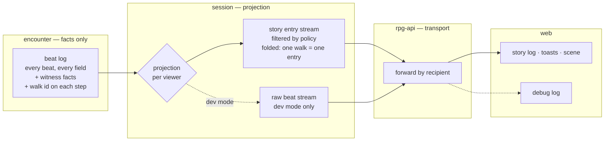
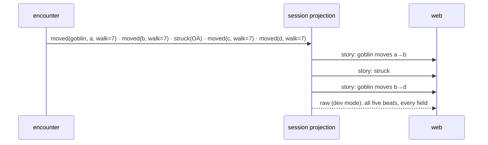

# Event projection — the lower layers state facts, the session decides delivery

Encounter records everything that happens, with the facts a delivery decision
needs. The session module's projection is the one place that decides who
receives what, in what shape. rpg-api carries what the session hands it.

## Shape

A monster walk, through the projection:

## Law

1. **Encounter states facts and decides no delivery.** A beat carries what
   happened and the facts a delivery policy reads — subjects, witnesses,
   the concealment a cell sits under and who knows it — never a recipient
   list chosen for presentation.
2. **Witnessing is a rule; delivery is policy.** Who saw, heard or knows
   something is decided by the rules in encounter and recorded as testimony.
   The projection reads those facts and never re-derives sight, so the
   holdings fold and the emitted event keep one audience.
3. **The projection is the single delivery decision.** It lives in the
   toolkit session module, runs per viewer, and serves live delivery and
   story catch-up through the same code, so a replayed story equals the live
   one.
4. **rpg-api transports.** It routes by the recipient the session names and
   neither filters, reshapes nor re-derives visibility.
5. **The UI reads only projected entries, in every mode.** Story log, toasts
   and scene render the projection's output; the same policy runs in dev and
   live, so what is played in dev is what ships.
6. **Dev mode adds the raw stream; it never swaps what the UI reads.** In dev
   mode the projection also emits every beat, every field, to every viewer,
   and only the debug log consumes it. The mode switch decides that one thing.
7. **A walk reaches the story as one entry per uninterrupted segment.** Steps
   carry the walk they belong to; the projection folds consecutive steps of
   one walk into one entry with the ordered cells. Any other beat landing
   mid-walk closes the segment, and the walk resumes as a new entry after it.
8. **Encounter keeps one beat per step.** Reactions, a mover downed partway
   and per-cell concealment happen between steps; the raw stream and the
   folded entry are both read from that one record.
9. **A projected entry carries what its policy allows and nothing more.** The
   raw beat bytes ride only the raw stream.

## Rulings

| ID | ruling | status | scope | ruled by | date |
|----|--------|--------|-------|----------|------|
| R1 | Lower layers state all facts; no audience decision lives below the session projection | settled | encounter, session | KirkDiggler | 2026-10-08 |
| R2 | The projection lives in the toolkit session module; rpg-api sends what toolkit sends | settled | session, rpg-api | KirkDiggler | 2026-10-08 |
| R3 | What the stream carries today is dev mode; live is the projection's filtered view | settled | session | KirkDiggler | 2026-10-08 |
| R4 | Detection beats scoped to qualifying players inside encounter (2026-08-30 narrowing) — replaced by R1: encounter states the qualifier, the projection applies it | superseded | encounter | KirkDiggler | 2026-10-08 |
| R5 | Dev mode adds a raw stream for the debug log; the UI reads projected entries in both modes | settled | session, web | KirkDiggler | 2026-10-08 |
| R6 | A walk is one story entry (one toast); steps carry a walk id so the fold is by identity, not adjacency | settled | encounter, session, web | KirkDiggler | 2026-10-08 |

## Open

- **Where the mode is chosen.** Recommendation: a session Manager option set by
  the deployment, off in production. A per-viewer grant (a GM who sees the raw
  stream in live play) is a later use case, not this one.
- **The raw stream on the wire.** A second stream RPC beside `StreamEvents`, or
  raw entries flagged on the same stream. Recommendation: a second RPC, so a
  live client cannot receive raw beats by reading a field it should ignore.
- **First slice scope.** Recommendation: the walk end to end — walk id on the
  step, `frontierAudience` restated as a witness fact, the fold, the raw stream,
  the debug log on raw — with today's delivery policy unchanged. The other
  audience-writing sites in encounter move up in a dedicated cleanup wave.
- **The web's line-of-sight step guard.** It moves into the projection's
  policy; whether that happens in the first slice or with the live policy.
- **Seq over folded entries.** One seq per projected entry; whether the raw
  stream shares the per-recipient seq or carries its own.
- **The live policy itself.** What a viewer without line of sight receives of
  a monster's walk — nothing, the segment they witnessed, or a sound — is
  decided when live play is the use case.
