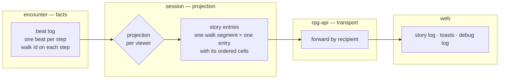
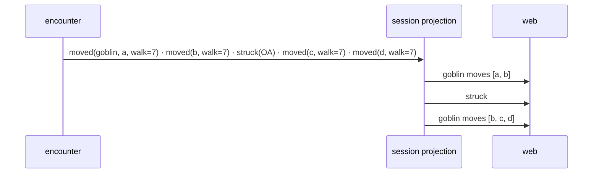

# Event projection — the lower layers state facts, the session shapes delivery

Encounter records what happens. The session module's projection turns that
record into what each viewer receives. rpg-api carries what the session hands
it. Filtering, when a use case brings it, has one place to live.

## Shape

A monster walk, through the projection:

## Law

1. **Encounter states facts.** A beat carries what happened and the facts a
   delivery decision would read; who saw what is a rule, recorded as testimony.
2. **The session projection owns delivery.** It turns the beat log into each
   viewer's entries, and serves live delivery and story catch-up through the
   same code, so a replayed story equals the live one.
3. **rpg-api transports** what the session hands it, by recipient.
4. **Encounter keeps one beat per step.** Reactions, a mover downed partway
   and concealment happen between steps; the record keeps them in order.
5. **A walk reaches the story as one entry per uninterrupted segment**,
   carrying its ordered cells. Steps carry the walk they belong to, so the
   fold is by identity; any other beat landing mid-walk closes the segment.

## Rulings

| ID | ruling | status | scope | ruled by | date |
|----|--------|--------|-------|----------|------|
| R1 | Lower layers state facts; delivery is shaped in the session projection | settled | encounter, session | KirkDiggler | 2026-10-08 |
| R2 | The projection lives in the toolkit session module; rpg-api sends what toolkit sends | settled | session, rpg-api | KirkDiggler | 2026-10-08 |
| R3 | Detection beats scoped to qualifying players inside encounter (2026-08-30 narrowing) — replaced by R1 | superseded | encounter | KirkDiggler | 2026-10-08 |
| R4 | A walk is one story entry (one toast) carrying its path; steps carry a walk id | settled | encounter, session, web | KirkDiggler | 2026-10-08 |
| R5 | Pre-playtest, every viewer receives everything; filtering arrives with its use case | settled | session | KirkDiggler | 2026-10-08 |

## Open

- **Seq over folded entries.** One per-recipient seq per projected entry is
  the expected shape; confirm against story catch-up when building.
