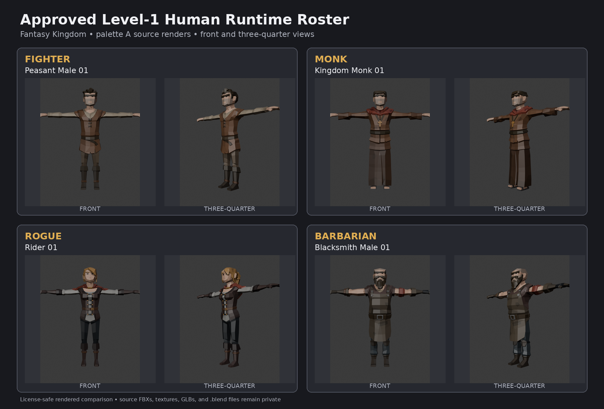

# Level-1 Townfolk Four-Class Runtime Roster

**Status:** Design and plan approved by Kirk on 2026-08-15; PR held open through implementation and final verification

**Date:** 2026-08-15

**Tracking:** [rpg-project#225](https://github.com/KirkDiggler/rpg-project/issues/225), [rpg-game-assets#59](https://github.com/KirkDiggler/rpg-game-assets/issues/59)
**Approved source checkpoint:** [rpg-game-assets#58](https://github.com/KirkDiggler/rpg-game-assets/issues/58)
**Implementation:** [plan.md](plan.md)

## Goal

Replace the current Fantasy Rivals party-character visuals with a modest, human, level-1 Fantasy Kingdom roster while preserving the game's existing four-class asset contract and idle/walk behavior.

The approved class mapping is:

| Class | Fantasy Kingdom source |
|---|---|
| Fighter | `SK_Chr_Peasant_Male_01` |
| Monk | `SK_Chr_Monk_01` |
| Rogue | `SK_Chr_Rider_01` |
| Barbarian | `SK_Chr_Blacksmith_Male_01` |

## Approved roster preview



*License-safe palette-A source renders from the private Fantasy Kingdom pack. Front and three-quarter views were independently opened and inspected before publication; source FBXs, textures, GLBs, and `.blend` files remain private.*

Class identity comes primarily from clothing and future equipment, not exaggerated class-specific bodies. Every standing model remains intentionally unarmed; the existing standalone weapons and socket metadata remain available for the equipment-driven weapon system.

## Scope

This promotion includes the complete current class-asset contract:

- animated standing GLBs in Fantasy Kingdom palette variants A, B, and C;
- one static downed GLB per class and palette;
- one 512px transparent portrait per class and palette;
- deterministic 2048x2048 runtime atlas derivatives from the private 4096x4096 Fantasy Kingdom A/B/C sources;
- updated private manifest provenance, color inventory, animation declarations, mesh statistics, and deterministic release inventory;
- removal of obsolete Fantasy Rivals D color siblings and manifest entries;
- exact-provider sync into the web's ignored Synty runtime tree;
- end-to-end visual verification of idle, movement/facing, and downed rendering for all four classes.

This promotion does **not** implement runtime weapon attachment, combat animations, a selectable model-family system, or arbitrary appearance-color projection onto Synty atlases.

## Decision

### Replace the existing aliases in place

The provider continues to publish:

```text
characters/fighter.glb
characters/barbarian.glb
characters/monk.glb
characters/rogue.glb
```

with matching `-b`, `-c`, `-downed`, portrait, and manifest siblings. The web continues resolving `CharacterData.class_ref.id` through its existing `characters/<class>.glb` contract. No runtime model-selection feature or class lookup change is introduced.

This is preferred over versioned townfolk filenames because the class alias is already the stable consumer interface. The provider manifest, hashes, Git history, and release inventory carry provenance. Rollback is a single provider revert.

### Rejected alternatives

1. **Versioned townfolk filenames plus a web mapping change.** This would preserve parallel files but add public client work and duplicate inventory without changing the product behavior.
2. **Selectable Rivals/Kingdom model families.** This creates a new customization subsystem, persistence question, and UI surface unrelated to the approved roster replacement.

## Provider architecture

### Private checkpoints

Peasant/Fighter and Kingdom Monk already have approved Blender 5.0.1 checkpoints with exact `Idle_Relaxed [2,55]` and `Walk_Forward [2,33]` actions. Rider/Rogue and Blacksmith/Barbarian receive the same Auto-Rig Pro 3.78.34 treatment before promotion.

Each checkpoint must prove:

- exact source FBX identity;
- one 55-bone `Root` armature and one body mesh;
- preserved geometry, topology, UVs, vertex groups/weights, shape keys, and rest pose;
- all 46 configured bone mappings, including active `Hips -> Pelvis`;
- 47 live bind constraints while each clip is solved;
- zero final constraints after baking;
- no weapon mesh or unrelated helper object;
- one packed Fantasy Kingdom atlas;
- only `Idle_Relaxed` and `Walk_Forward` as release actions.

### Deterministic release stage

A new townfolk promotion configuration drives a repository-root-shaped disposable stage. The stage starts as a complete copy of the current canonical `harness/models/synty/` tree and then replaces only the four class families and their generated metadata.

For each class:

1. Export the palette-A approved checkpoint to the standing class alias.
2. Validate the exported GLB's one-body/55-joint structure, exact Root wrapper, geometry contract, action names/ranges, packed image, and absence of weapons.
3. Verify that the private Kingdom A/B/C sources are exact 4096x4096 compatible atlases, then derive each runtime payload in Blender 5.0.1 with a fixed `Image.scale(2048, 2048)` step. No loose derived PNG is committed; the result is embedded in the staged GLB.
4. Produce B and C by swapping the embedded atlas payload without changing geometry, rig, animation semantics, or node structure. Every standing and downed output must contain exactly one 2048x2048 packed image.
5. Fail rather than fabricate a missing palette, accept a mismatched source dimension, or silently retain a 4096x4096 runtime image.
6. Produce one static palette-A downed pose from the validated standing model, preserving the Root wrapper and grounding the evaluated mesh.
7. Produce B/C downed siblings by atlas replacement so all downed variants share the exact pose and structure.
8. Render A/B/C portraits from the exact standing GLBs and record input/output hashes.

The manifest is regenerated or structurally updated in the stage to:

- change each class's source provenance to the approved Fantasy Kingdom source;
- declare `idleClips: ["Idle_Relaxed"]`;
- retain existing standalone weapon files and socket transforms;
- require `bakedIntoModel: false`;
- expose exactly A/B/C color entries;
- remove obsolete D paths and stale comments that describe weapons as baked or Fantasy Rivals as the active body source.

The stage deletes the old `*-d`, `*-downed-d`, and portrait-D files. It regenerates mesh stats and a deterministic promotion inventory after all replacements and deletions.

### Atomic apply

Canonical files are untouched until the full stage passes. Apply uses a same-filesystem, rollback-safe directory replacement, verifies the Git index against the sealed stage inventory, and records the result as one provider release commit. The Git commit is the durable atomic release boundary; an injected materialization failure must restore the pre-apply tree byte-for-byte. A partial class set, mixed source family, stale D sibling, or inventory mismatch is a hard failure.

The provider PR is ready for review rather than draft. It carries license-safe rendered evidence, a load-bearing-files section, command output, and the exact stage inventory digest. Kirk alone merges.

## Consumer flow

The web's existing class lookup remains unchanged. After the provider PR merges:

1. Record the merged `rpg-game-assets` commit.
2. Create a detached provider worktree at that exact commit and pass it through the sync script's merged `RPG_GAME_ASSETS_PATH` override; never rely on an incidental sibling checkout or branch pull for release verification.
3. Confirm `public/models/synty/` mirrors that detached provider tree with delete semantics and byte-identical hashes, including absence of all retired D files.
4. Exercise the real class model renderer for Fighter, Barbarian, Monk, and Rogue through standing idle, ordered-path movement/facing, and downed rendering.

The synchronized GLBs remain ignored licensed runtime inputs. No converted Synty asset enters the public web repository. The renderer and resolver require no behavior change. A narrow public documentation/test-fixture PR updates stale four-clip comments to the exact two-clip contract after the provider merge; license-safe runtime evidence uses the standing public evidence branch.

## Failure handling and rollback

The stage is disposable and all-or-nothing. Any failed mechanical, semantic, visual, inventory, or budget gate destroys or rejects the candidate stage without touching canonical provider files.

Hard failures include:

- missing or extra actions;
- a bind count other than 47;
- changed source structure or rest pose;
- an incorrect Root wrapper;
- a weapon or extra mesh in a standing/downed model;
- animation in a downed model;
- missing or unpacked textures;
- a non-4096x4096 private source atlas or a runtime atlas that is not exactly 2048x2048;
- palette structure/parity mismatch;
- missing portrait or downed sibling;
- retained D inventory;
- manifest paths that do not resolve;
- asset sync resolving a provider commit other than the reviewed merge;
- runtime 404s, loader errors, or broken standing/moving/downed presentation.

The release is rolled back by reverting the single provider release commit and resynchronizing the web tree. No public client rollback is needed because the consumer mapping does not change.

## Verification

### Mechanical and semantic gates

- Blender 5.0.1 and Auto-Rig Pro 3.78.34 provenance recorded.
- Source-vs-checkpoint and source-vs-export reports pass for all four classes.
- `Idle_Relaxed [2,55]` and `Walk_Forward [2,33]` are exact; final constraint count is zero.
- Every standing GLB has one body mesh, 55 joints, the established Root wrapper, one packed 2048x2048 atlas, and no weapon.
- A/B/C private sources are 4096x4096; staged standing/downed runtime images are 2048x2048 and pass the character texture budget without weakening unrelated budgets.
- A/B/C standing variants have semantic geometry/rig/action parity and differ only by intended image payload/material references.
- Every downed GLB is static, grounded, unarmed, and Root-compatible with its standing sibling.
- Portraits are 512px transparent PNGs hash-bound to their standing inputs.
- Manifest paths, color cardinality, source provenance, weapon metadata, mesh stats, and deterministic inventory pass repository-local tests.
- The full asset test suite passes.

### Visual gates

For all four classes, review:

- fixed-camera, visible-ground idle/walk evidence from front, side, three-quarter, and high-oblique angles;
- walk contact strips against a stable checker reference;
- A/B/C palette sheets;
- matched private-4096-source versus staged-2048-runtime close-up sheets for all classes and palettes;
- standing/downed comparison sheets;
- portrait sheets;
- anatomical plausibility, clipping, foot contact, silhouette, cross/collar integrity for Monk, and clothing deformation at maximum stride.

The visual gate does not claim zero foot slide. It establishes that any slide or deformation is visible and acceptable for the current level-1 presentation.

### Runtime gate

After exact-provider sync:

- all four classes load without 404s or console/GLTF errors;
- each class visibly plays `Idle_Relaxed` while stationary;
- each class plays `Walk_Forward` while traversing the real ordered path and faces travel direction;
- each class resolves its static downed sibling at the existing client scale;
- retired D files are absent after sync;
- the web's complete `npm run ci-check` passes;
- screenshots and browser console evidence are preserved.

A fresh independent reviewer audits the provider PR, reruns the relevant suites, views the evidence, and posts the required gate verdict before Kirk merges. A final independent check binds the merged provider commit to the runtime evidence.

## Ownership and tracking

- `rpg-project#225` owns this cross-repository design and remains open through implementation.
- `rpg-game-assets#59` owns the private source-to-runtime promotion and provider PR.
- `rpg-game-assets#58` is the completed creative checkpoint and is not reopened for implementation.
- The Assets team owns the 3D consumer verification seam. A web issue is opened only if real renderer or sync behavior must change.

All GitHub issues and PR comments use the asset-pipeline signature because they are posted through Kirk's account.

## Definition of done

The promotion is complete when:

1. the approved four-class A/B/C standing, downed, and portrait families are merged in `rpg-game-assets`;
2. the provider manifest and inventory contain no stale Fantasy Rivals class provenance or D variant paths;
3. the exact merged provider commit is synchronized into the web runtime tree;
4. all four classes pass standing idle, ordered-path walk/facing, and downed visual verification;
5. asset and web gates pass with independent review evidence;
6. `rpg-game-assets#59` and `rpg-project#225` are closed and their Board 19 items are Done.

## Retro criterion

After the first full runtime playtest, ask whether the modest bodies preserve clear class readability once weapons remain unbaked. If Fighter/Rogue/Barbarian are not distinguishable enough without equipment, the response is to prioritize the existing equipment-driven socket work—not to return to exaggerated class-specific bodies or introduce a model-family selector.
