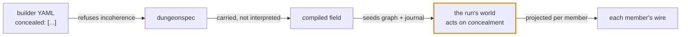
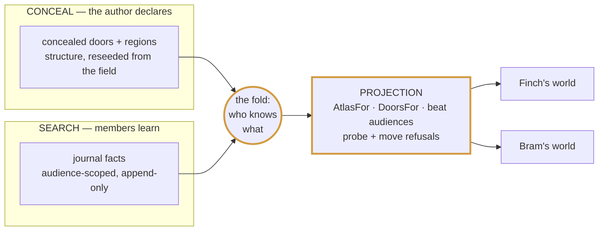
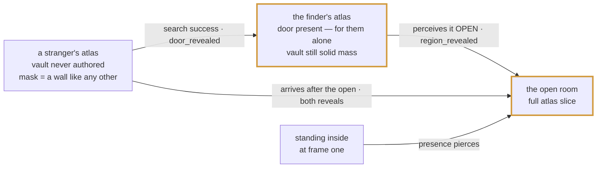
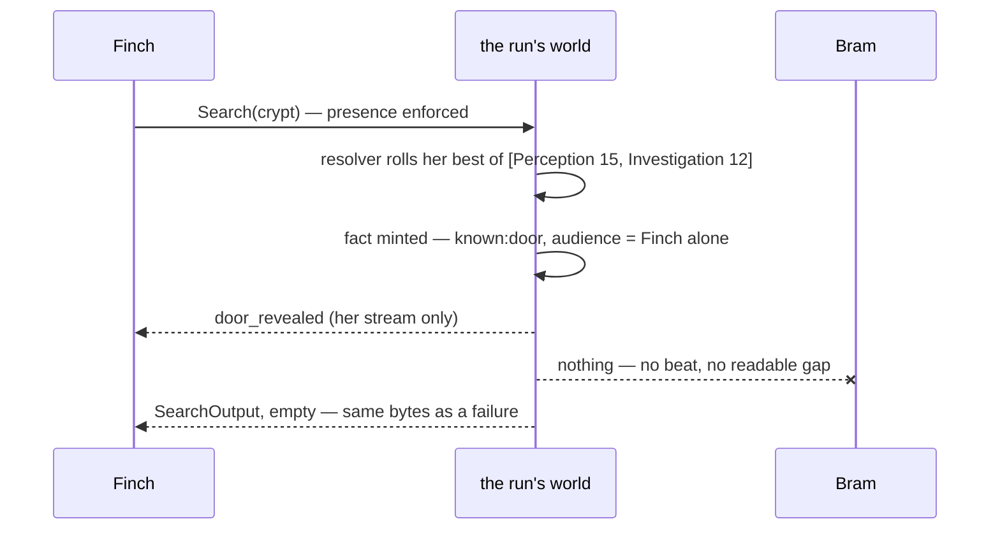
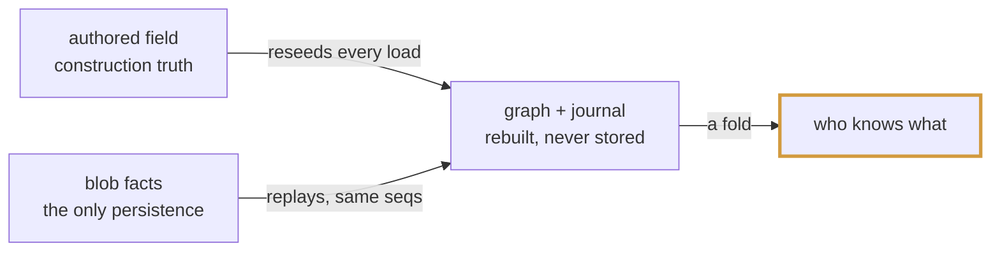

# The Concealed Door — how the machine works

*The team's map of slice 1. One secret door, kept honestly, end to end. The
whole machine answers a single question — **who knows what?** — and every law
in it exists to stop the answer from leaking through a side channel. In every
diagram, the **amber-bordered node is where the secret lives**.*

*Normative record: [design.md](design.md) (every ruling) and
[plan.md](plan.md) (the waves). This page is the explainer — if it ever
disagrees with design.md, design.md wins and this page has a bug.*

## The pipeline

Concealment is authored once, then **carried** — no layer interprets it until
the one layer whose job that is. The builder writes data; dungeonspec
validates it; the compiled field hauls it opaquely; the run's world acts on
it; the wire shows each member only their own slice.



Only the amber stage has opinions. dungeonspec refuses incoherent authoring
(the frontier invariant) but never learns what Perception means; the field
hauls approach lists as data; the run's world is the first and only place
concealment becomes behavior.

```yaml
# the whole authoring surface, in dungeonspec's dialect
doors:
  - id: vault-door
    edges: [ ... ]
    concealed: [{ ability: perception, dc: 15 }, { ability: investigation, dc: 12 }]
    locked:    [{ ability: str, dc: 15 }, { ability: dex, tool: "dnd5e:item:thieves-tools", dc: 12 }]
regions:
  - id: vault
    concealed: true
```

## The three mechanisms

Everything in this slice is one of three things — and the third is where the
page's opening question gets answered.



- **Conceal** is the author's declaration: structure marked secret in the
  field. It never changes at runtime — a door's *state* may toggle open and
  shut, but what was declared concealed stays declared, which is why closing
  the door re-conceals it for strangers.
- **Search** is how knowledge enters: audience-scoped facts, append-only.
  (Perception is the other writer — witnessing an open door, standing inside
  a room. Same journal, same grain.)
- **Projection** is where **who-knows-what actually happens**. Nobody stores
  the answer. Every time any output leaves the world — an atlas, a door
  list, a beat's audience, even a *refusal* — it passes through the same
  fold of declared structure plus learned facts, computed for **that
  member**. The probe law and the move law aren't separate features; they're
  the projection applied to error paths. The four atlases below aren't four
  maps kept in sync; they're **one world asked the same question by four
  different people**.

## One dungeon, four atlases

The core trick: a member's atlas is not a filtered copy of the truth — it is
**the atlas of a smaller dungeon that was honestly authored without the
secret**. That's the never-authored yardstick, and it's why nothing can leak:
there is no seam to find, because the non-knower's map is internally
consistent.

The world holds the authored truth — hall, vault, the concealed door between
them. What each member's atlas shows depends only on their knowledge state:



Two knowledge moments, deliberately distinct:

- **Finding the door** (a successful search): the door appears for the finder
  alone; the vault stays never-authored, because knowing where a door is is
  not seeing what's behind it.
- **Perceiving it open**: present at the opening, walking up later, or
  standing inside from frame one (presence pierces).

## Search: the answer never leaks the question

Search is a declared intent aimed at a **room** — never at a door, because a
player can't target what they don't know exists. Its response is a bare
acknowledgment: the same bytes whether the room hid nothing or the roll
failed. Everything a success produces travels as a recipient-scoped beat on
the finder's own stream.



No output varies with what the room holds. A failed check writes no fact and
no beat; an empty room does exactly the same. Even the roll stays private — a
number on the response would tell a failed searcher there had been a DC to
fail against.

## What persists, and what can't drift

Only **facts** ride the save blob — `EncounterData.World` is a journal,
nothing else. The graph (which entities exist, what's concealed, what pierces
what) is **reseeded from the authored field at every load**. Who-knows-what is
always a fold of facts over structure the dungeon itself minted — there is no
second copy of the truth to disagree with the first.



Fail-closed at every edge: a blob world on a dungeon with nothing concealed
refuses by name; a fact whose kind the field can't mint refuses by name; an
old blob with a member already standing in a concealed room is pierced at
load — presence works from frame one, even retroactively.

## The laws

| law | one line |
|---|---|
| **The never-authored yardstick** | A non-knower's atlas is byte-identical to the atlas of a dungeon where the secret room was never authored — cells, region, props, and every boundary touching its cells withheld, border walls included. |
| **The masquerade wall** | Only where a concealed door stands between two *visible* spaces does a synthetic wall fill the gap — matching the neighbouring run's height, marked by nothing. At a hidden room's border no mask is needed: withheld walls already read as solid mass. |
| **The probe law** | Everywhere a door id is spoken — open, close, unlock — an unfound concealed door answers *not found*, byte-identical to a door that doesn't exist. A DC-naming refusal would confirm a guessed id. |
| **The move law** | Walking into a concealed unfound crossing refuses exactly like walking into a wall — the same refusal spatial gives any authored wall, byte-pinned against an honestly-authored twin. |
| **The frontier invariant** (authoring) | The boundary between visible and hidden space consists of concealed doors and nothing else, and visible space is connected from the party start. Everything wholly inside hidden space — a secret suite's interior doors — is nobody's business. |
| **Beats are knowledge-scoped** | `door_revealed` carries the door alone; `region_revealed` is built *from the recipient's own atlas answer*, so the patch and the map can never disagree. Concealed doors never ride the shared moved beat — one shared payload can't tell knowers a secret without telling everyone. |

## The seams the session fills next

The world takes two capabilities at construction — supplied, never defaulted;
a concealed dungeon refuses to build without them. The session implements
both from things it already owns, which is the whole design: the engine asks
questions only the host can honestly answer.

```go
type CheckResolver interface {   // ← dnd5e skills + dice (AbilityCheckChain)
    ResolveCheck(in *ResolveCheckInput) (*ResolveCheckOutput, error)
}   // in:  member + the check's approach list
    // out: beaten, the applied approach, the total

type Witness interface {         // ← the session's sight seam (LOS, 120ft)
    Perceivers(in *PerceiversInput) ([]MemberID, error)
}   // asked one question only: who perceives this OPEN concealed door?
```

| surface | today | session wave |
|---|---|---|
| atlas & doors | `AtlasFor` / `DoorsFor` built and pinned | replace the seam's unscoped reads — per-member becomes the only wire truth |
| search | engine verb complete | wire `Search` RPC → verb; resolver from the character's real sheet |
| reveal beats | on the record, recipient-scoped | project to the wire's typed `DOOR_REVEALED` / `REGION_REVEALED` |
| unlock | applied route required in, echoed out | session picks the route, fills the wire's `dc` |

## Ruled at the seam — and one seed

- **Movement is sight-scoped.** Out of view means no movement events; what
  remains is a last-known-location ghost — the model monster intel already
  lives by, now symmetric for party members. Slice 1 ships the
  concealment-forced minimum: steps inside a region not revealed to you are
  not delivered to you (the trail stops at the frontier), and watching a
  teammate vanish through the wall reveals the door — that's just perceiving
  it open.
- **Closing re-conceals; knowledge is permanent.** State is reversible,
  knowledge is not: a re-shut concealed door is a wall again to strangers,
  while anyone who ever saw it open keeps the door on their map forever.
- **The gap oracle is closed by per-recipient numbering.** Each member's
  stream numbers its own deliveries densely at the session seam — no member
  ever observes a hole, and the wire's gapless contract stays true.
- **The sheet-declared check.** Search is the waypoint, not the destination:
  the player will load their sheet and declare intent from it — check with
  Perception, check with Investigation, with or without a roll — and what
  they learn may differ by skill. The approach lists every check already
  carries are the vocabulary that round will read.

---

*Record: this folder's design.md (all rulings) · wire: rpg-api-protos#267
(merged, v0.1.149) · authoring: rpg-toolkit#1370 (merged, encounter v0.41.0)
· engine: rpg-toolkit#1373 · journey: rpg-project#326.*
