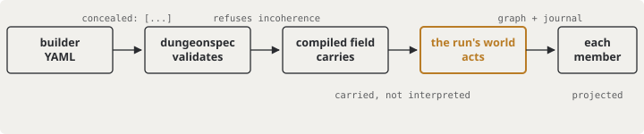
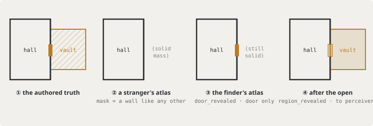
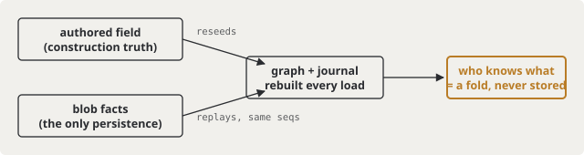

# The Concealed Door — how the machine works

*The team's map of slice 1. One secret door, kept honestly, end to end. The
whole machine answers a single question — **who knows what?** — and every law
in it exists to stop the answer from leaking through a side channel. In every
diagram on this page, **amber marks the secret**.*

*Normative record: [design.md](design.md) (every ruling) and
[plan.md](plan.md) (the waves). This page is the explainer — if it ever
disagrees with design.md, design.md wins and this page has a bug.*

## The pipeline

Concealment is authored once, then **carried** — no layer interprets it until
the one layer whose job that is. The builder writes data; dungeonspec
validates it; the compiled field hauls it opaquely; the run's world acts on
it; the wire shows each member only their own slice.



Only the amber stage has opinions. dungeonspec refuses incoherent authoring
(the frontier invariant) but never learns what Perception means; the field
hauls approach lists as data; the run's world is the first and only place
concealment becomes behavior.

```yaml
# the whole authoring surface, in dungeonspec's dialect
doors:
  - id: vault-door
    edges: [ ... ]
    concealed: [{ ability: perception, dc: 15 }, { ability: investigation, dc: 12 }]
    locked:    [{ ability: str, dc: 15 }, { ability: dex, tool: "dnd5e:item:thieves-tools", dc: 12 }]
regions:
  - id: vault
    concealed: true
```

## One dungeon, four atlases

The core trick: a member's atlas is not a filtered copy of the truth — it is
**the atlas of a smaller dungeon that was honestly authored without the
secret**. That's the never-authored yardstick, and it's why nothing can leak:
there is no seam to find, because the non-knower's map is internally
consistent.



Two knowledge moments, deliberately distinct:

- **② → ③ is finding the door** (a successful search): the door appears for
  the finder alone; the vault stays never-authored, because knowing where a
  door is is not seeing what's behind it.
- **③ → ④ is perceiving it open**: present at the opening, walking up later,
  or standing inside from frame one (presence pierces).

(Schematic squares in the figure; the real grid is hex.)

## Search: the answer never leaks the question

Search is a declared intent aimed at a **room** — never at a door, because a
player can't target what they don't know exists. Its response is a bare
acknowledgment: the same bytes whether the room hid nothing or the roll
failed. Everything a success produces travels as a recipient-scoped beat on
the finder's own stream.


No output varies with what the room holds. A failed check writes no fact and
no beat; an empty room does exactly the same. Even the roll stays private — a
number on the response would tell a failed searcher there had been a DC to
fail against.

## What persists, and what can't drift

Only **facts** ride the save blob — `EncounterData.World` is a journal,
nothing else. The graph (which entities exist, what's concealed, what pierces
what) is **reseeded from the authored field at every load**. Who-knows-what is
always a fold of facts over structure the dungeon itself minted — there is no
second copy of the truth to disagree with the first.



Fail-closed at every edge: a blob world on a dungeon with nothing concealed
refuses by name; a fact whose kind the field can't mint refuses by name; an
old blob with a member already standing in a concealed room is pierced at
load — presence works from frame one, even retroactively.

## The laws

| law | one line |
|---|---|
| **The never-authored yardstick** | A non-knower's atlas is byte-identical to the atlas of a dungeon where the secret room was never authored — cells, region, props, and every boundary touching its cells withheld, border walls included. |
| **The masquerade wall** | Only where a concealed door stands between two *visible* spaces does a synthetic wall fill the gap — matching the neighbouring run's height, marked by nothing. At a hidden room's border no mask is needed: withheld walls already read as solid mass. |
| **The probe law** | Everywhere a door id is spoken — open, close, unlock — an unfound concealed door answers *not found*, byte-identical to a door that doesn't exist. A DC-naming refusal would confirm a guessed id. |
| **The move law** | Walking into a concealed unfound crossing refuses exactly like walking into a wall — the same refusal spatial gives any authored wall, byte-pinned against an honestly-authored twin. |
| **The frontier invariant** (authoring) | The boundary between visible and hidden space consists of concealed doors and nothing else, and visible space is connected from the party start. Everything wholly inside hidden space — a secret suite's interior doors — is nobody's business. |
| **Beats are knowledge-scoped** | `door_revealed` carries the door alone; `region_revealed` is built *from the recipient's own atlas answer*, so the patch and the map can never disagree. Concealed doors never ride the shared moved beat — one shared payload can't tell knowers a secret without telling everyone. |

## The seams the session fills next

The world takes two capabilities at construction — supplied, never defaulted;
a concealed dungeon refuses to build without them. The session implements
both from things it already owns, which is the whole design: the engine asks
questions only the host can honestly answer.

```go
type CheckResolver interface {   // ← dnd5e skills + dice (AbilityCheckChain)
    ResolveCheck(in *ResolveCheckInput) (*ResolveCheckOutput, error)
}   // in:  member + the check's approach list
    // out: beaten, the applied approach, the total

type Witness interface {         // ← the session's sight seam (LOS, 120ft)
    Perceivers(in *PerceiversInput) ([]MemberID, error)
}   // asked one question only: who perceives this OPEN concealed door?
```

| surface | today | session wave |
|---|---|---|
| atlas & doors | `AtlasFor` / `DoorsFor` built and pinned | replace the seam's unscoped reads — per-member becomes the only wire truth |
| search | engine verb complete | wire `Search` RPC → verb; resolver from the character's real sheet |
| reveal beats | on the record, recipient-scoped | project to the wire's typed `DOOR_REVEALED` / `REGION_REVEALED` |
| unlock | applied route required in, echoed out | session picks the route, fills the wire's `dc` |

## Open at the seam — two rulings, one seed

- **The vanishing teammate.** A party-mate's position beat currently walks
  through walls: movement inside a hidden room broadcasts its floor
  cell-by-cell. Proposed: a *witnessed* crossing is just
  perceiving-the-open-door (reveal fires — the fiction agrees: watching your
  friend vanish through a wall is how you learn it's a door); *unwitnessed*,
  the trail stops at the frontier.
- **The gap oracle.** Recipient-scoped beats leave seq gaps in everyone
  else's story — a gap right after a search is a success detector, and it
  breaks the wire's gapless contract. Proposed: per-recipient dense numbering
  at the seam.
- **The sheet-declared check.** Search is the waypoint, not the destination:
  the player will load their sheet and declare intent from it — check with
  Perception, check with Investigation, with or without a roll — and what
  they learn may differ by skill. The approach lists every check already
  carries are the vocabulary that round will read.

---

*Record: this folder's design.md (all rulings) · wire: rpg-api-protos#267
(merged, v0.1.149) · authoring: rpg-toolkit#1370 (merged, encounter v0.41.0)
· engine: rpg-toolkit#1373 · journey: rpg-project#326.*
