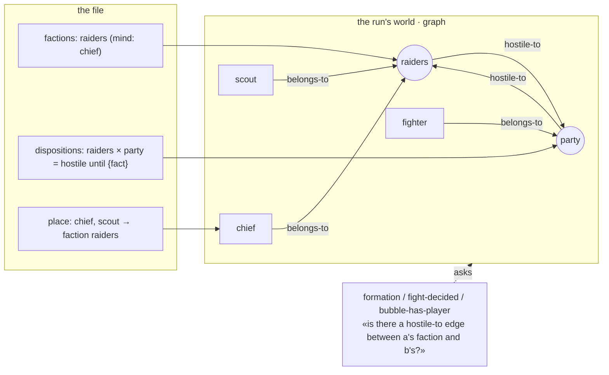
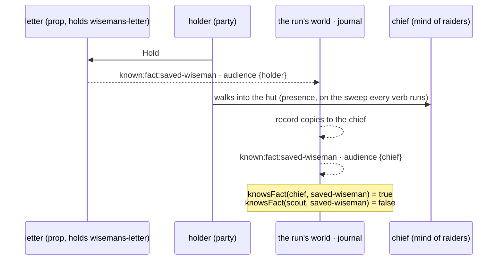
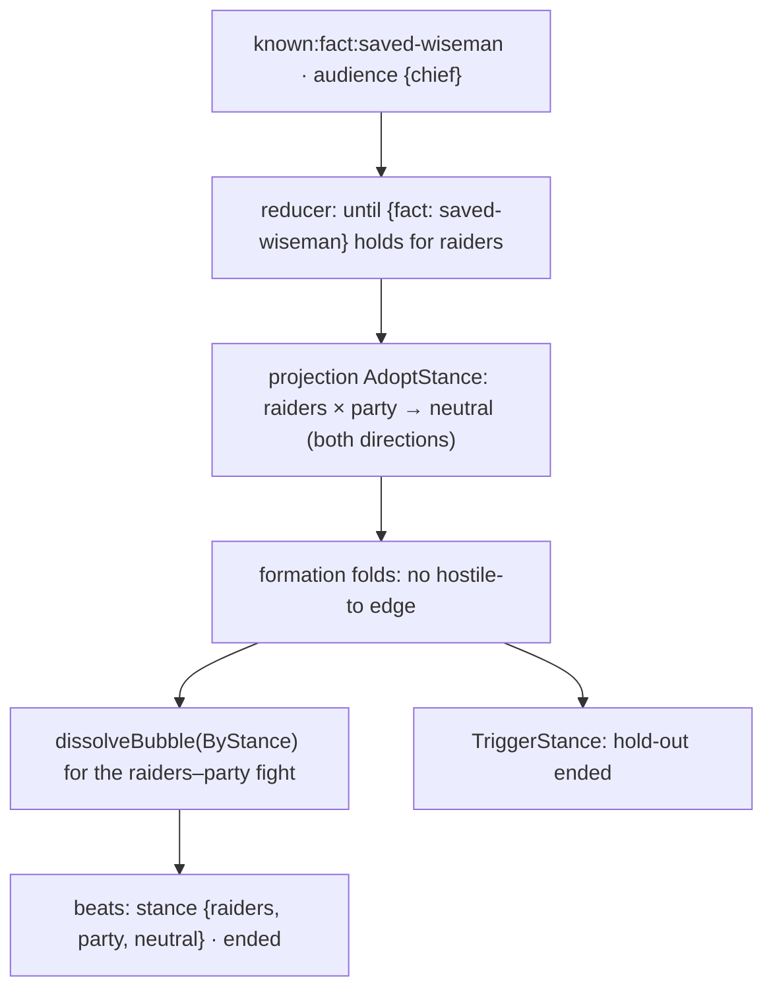
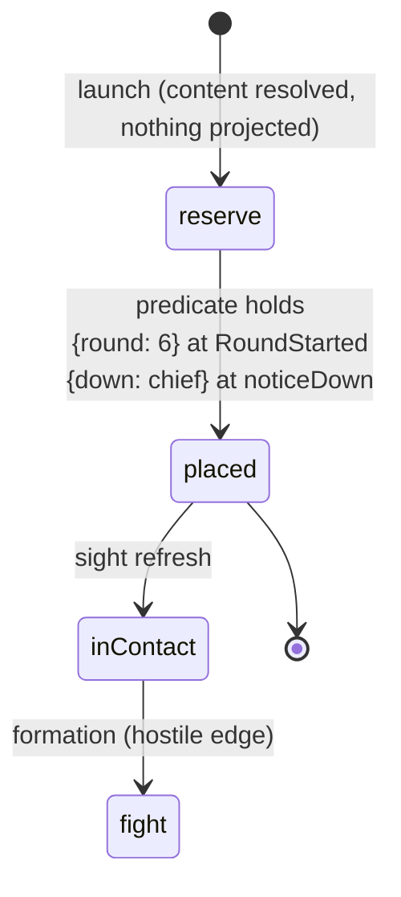

# The hold-out — how it works

Team-facing explainer, one mechanism at a time. Each section flips from
*designed* to *landed* with the branch head that made it true. The design is
`design.md`; this page is the picture.

The law behind all four: **the run's world is the only state.** Content
declares it, verbs append to it, readers fold over it, the projection presents
it. No reader keeps a copy.

## 1. Sides — who fights whom · *landed (encounter/hold-out 5263f098: one graph, formation asks it; 177 leaves fail when the table is forced never-hostile) · authoring landed (web/hold-out 97c0a298: Factions + Dispositions forms, predicate editor)*

Every member belongs to a faction; players to `party`, unauthored monsters to
`monsters`. A disposition is an edge between two factions. Fight formation
stops counting kinds and asks the graph one question.

Today's dungeons declare nothing and get the default table: `party` and
`monsters` mutually hostile, every faction allied with itself. Same answers,
read from data instead of computed from kind.

*Session landed (session/hold-out 25b2891b):* Spawn carries the
faction, the roster says whose side everyone is on, and after the flip every
player's stream reads `stance_changed` → `fight_ended (by stance)` → `ended:
hold-out`, walked through the real verbs on the fixture.

*Resolution landed too (resolution/hold-out 7a32b34d):* Sneak Attack and Pack
Tactics ask the reloaded run, `castRelations` and its two cast-side entities
are deleted, and a cast with no run answers "unknown" for everyone rather
than letting a default table step back in.

## 2. Knowledge — what a member knows · *landed (encounter/hold-out 5263f098: known:fact with the learner as subject and audience; presence teaches the mind on the sweep and at the end of Hold/Loot)*

Knowledge is a fact with an audience. A record's `reveals` is applied when the
record changes hands; a fact reveal writes `known:fact:<id>` with the receiver
as its audience. The faction knows what its mind knows.

A scout who learns it flips nothing: the fold for the faction reads the
mind's facts, and only the mind's.

## 3. The flip — a fact changes a side · *landed (world/pair-settle e9da06e Settle; encounter/hold-out 5263f098 declares Raise + Settle per until, dissolves ByStance; 12 leaves fail without the Raise)*

A declared reducer (`Raise`) flags the mind when a `known:fact` with the mind as
subject appears; a pair projection (`Settle`, new in the kernel — Kirk's R11:
"the graph should tell the truth") drops the hostile edges between the two
factions in both directions while the flag holds. `HasEdge` is the only reader.
Formation now sees no hostile edge, so the encounter dissolves the fight
between those two factions and the hold-out ending fires.

Nothing is stored as a stance. Save after the flip and load again: the facts
are there, the fold runs, the camp is still neutral.

## 4. Reserve and arrival — something enters the run · *designed (step B)*

A placement with `arrives` is spawned at launch but held in reserve: no cell,
no turn, in no pair, absent from every projection for every member. When its
predicate holds, it is placed and the same verb's sight refresh treats it like
anyone walking into view.

The messenger's letter and the reinforcements are the same mechanism with
different predicates. The predicate grammar is the encounter's existing
Trigger set with three new members: `round`, `fact`, `stance`.
