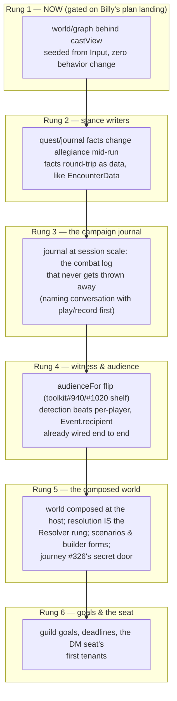

# Where world enters the live stack

*Integration study, 2026-08-31. Ruled in session with Kirk; building is
explicitly gated (see "What gates what"). Companion to brainstorm.md §22
and use-cases.md UC-1..4.*

## The observation this study starts from

Kirk's: resolution and world are doing similar things. `world.Act` and
`resolution.Resolve` are the same shape at two scales — a verb goes in
with everything it needs supplied, an attributed outcome comes out, and
nothing survives the call that wasn't returned as data. One is custody of
the *interaction* (a swing, a save, a boundary), the other custody of the
*campaign* (a search, a betrayal, a rescue).

The original instinct — resolution could just use the sub-components —
is the right frame. The units of adoption are the **packages** under the
`world` module: `journal`, `graph`, `quest`, `goal`. The composer at the
module root is campaign-scale assembly; resolution never wants it. A
layer adopts the tool that answers its question, not the whole machine.
By §17's own test ("real = the rulebook imports it"), the first such
import is also the moment a kernel package finishes becoming real.

## What we can get now: the graph behind the cast view

Resolution's sharpest documented debt is a flagged lie with a designed
expiry — `castView.IsHostile` (resolution/cast.go):

> "v1 answers 'one of you is a character and the other is a monster',
> and that is a LIE with a known expiry. Allegiance is a directed
> relation between factions that quest events can change mid-run... The
> lie is confined HERE, to one function, on purpose... when stance
> arrives, this body reads a relation table and not one rule changes."

The relation table it promises is `world/graph`: entities and directed
edges, present state derived by fold over facts, stance changed mid-run
by quest events. This is not speculative — the hostage camp (UC-2)
proved the exact flip: *a turned hostage reads allied again in every
view*, via the `AdoptStance` reducer that already exists.

**Step 1, no behavior change:** resolution takes `world/graph` as a
dependency (world imports nothing but testify — no layering violation;
it sits below everything resolution already uses). `castView`'s body
becomes a read over a graph fold. The graph is *seeded from what the
Input already holds* — participants' kinds produce exactly today's
character-vs-monster edges — so the lie's **content** is preserved while
its **shape** is fixed. This is the load-bearing-or-deferred dance: the
principle (allegiance is a folded relation) becomes true now; the
writers stay shelved until something writes stance facts.

Why this is safe by resolution's own constitution:

- **R2 holds** — the graph declaration is data at the seam, derived from
  the cast the caller already handed over.
- **The `installTruth` door's own rule holds** — "everything it installs
  is derived from what the interaction already holds," and its comment
  says a new tenant is "a design decision — bring it to the design."
  This document is that design.
- **The acceptance test is written in the module already**: *not one
  rule changes.*
- **Tri-state falls out**: `IsAllied` is deliberately not `¬IsHostile`
  because neutral is coming; edges express present/absent/kind
  naturally, where the current shape has nowhere to put a third answer.

Downstream beneficiaries the moment stance is a relation: monster
targeting policy (parsed today, acted on never) and the behavior lane
read allegiance instead of kind.

## How the whole thing evolves

- **Rung 2 — stance writers.** Something writes the facts the fold
  reads: quest events, a redemption, a betrayal. Needs the persistence
  story — facts round-trip as data on Input/Output exactly the way
  `EncounterData` does, because load-act-save is already resolution's
  law. The graph's *mechanism* doesn't change; it gains a past.
- **Rung 3 — the campaign journal.** The journal arrives at session
  scale as the record that survives runs. Requires the one honest
  naming conversation this study defers: `play/record` and `journal`
  are two candidate owners of "what happened" — presentation beats vs
  belief substrate. Decide ownership *before* the first fact is written
  twice.
- **Rung 4 — witness and audience.** §22's game rung. The wire is
  already per-recipient end to end (`Event.recipient`, broker routing);
  the flip is one function body in the encounter (`audienceFor` — the
  #940 shelf, future policy "subjects ∪ current sight-holders", which
  is the Witness question). Detection beats go per-player; intel keeps
  owning perception (who I've seen), the graph keeps owning relations
  (who is allied) — different questions, no dual state.
- **Rung 5 — the composed world.** The host composes a world (guild =
  world = tenant); scenarios arrive as packages exposing builder forms;
  `resolution.Resolve` becomes the realest rung of world's Resolver
  ratchet — a world verb's check answered by a full interaction. This
  is where journey #326's secret door lands in the live game, with
  concealment (world v0.3.0) doing the hiding.
- **Rung 6 — goals and the seat.** Guild needles, wall-clock deadlines,
  the DM seat's tenancy ladder (dice → streamer → model). All already
  proven at examples scale (UC-3); they ride once rung 5 exists.

Each rung composes with the ones before it and forecloses none after
it. Rung 1 is deliberately the smallest: one function body, one new
dependency, one acceptance test the module wrote for itself.

## Boundaries held on purpose

- Resolution's subscription ledger stays — transaction bookkeeping, not
  world facts.
- Margin bands stay out of resolution — its machines return rich
  outcomes, rightly; bands are verb-outcome vocabulary for the campaign
  scale.
- `play/intel` stays the perception store. The graph never answers "who
  have I seen"; intel never answers "who is allied."
- The composer stays out of the rulebook stack until rung 5. Packages
  are the units of adoption.

## What gates what

- **Everything here is a study until Billy's plan lands.** The tag
  freeze is dissolving (precision tags were the want behind it; latest
  module version is the actual want), but his crew has a plan in flight
  across encounter/session and we do not force them to adjust it.
  Rung 1 touches resolution only — the module least entangled with
  their lane — which is part of why it is rung 1.
- Rung 2 gates on a first real writer (a quest event that changes
  stance), not on calendar.
- Rung 3 gates on the play/record naming conversation.
- Rung 4 gates on rungs 1–2 only socially, not technically — the wire
  is ready today.
- Rung 5 is its own journey and gets its own design round.

— recorded from the session of 2026-08-31; scouts' ground-truth reports
(sight seam, wire pipeline, resolution charter) live in the session
record; the quoted code lives at rulebooks/dnd5e/resolution/cast.go,
truth.go, and encounter/encounter.go's audienceFor.
