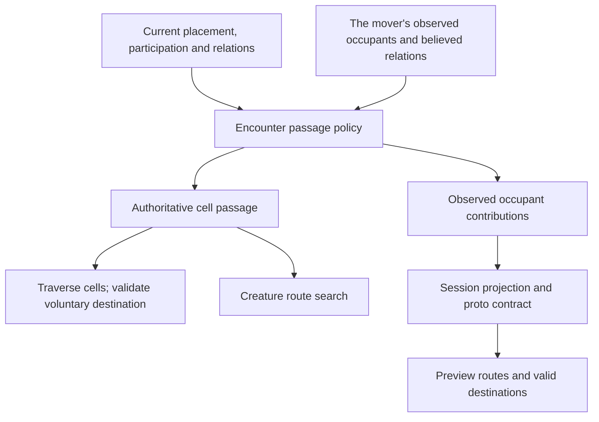

# Movement passage

## Shape

Encounter owns the passage policy and its fold. Execution supplies current
world facts; preview supplies the mover's knowledge. These are two inputs to
one policy, not two implementations of the rule. Session carries the answers;
the API translates them; the web searches and draws the resulting graph.

An occupant contributes `blocked`, `pass-through`, or `standable`. A cell's
most restrictive contributor wins. Terrain and crossings retain their own
restrictions. The mover never contributes an obstacle to itself.

## Law

The Rulings table scopes each settled rule. Unsettled extensions are named in
Open and do not grant implementation authority.

### R1 — One owner, distinct passage and stopping

The toolkit owns occupancy permissions. Intermediate cells may be pass-through;
a voluntary destination must be standable. Both player walks and creature routes
consume this distinction. A client sends a path and receives the server's actual
result; a preview is not execution authority.

### R2 — Occupant policy

| Occupant | Enter or cross | Voluntarily stop |
|---|---|---|
| Upright nonhostile creature, including an ally | Yes | No |
| Upright hostile creature | No | No |
| Downed monster | Yes | Yes |
| Downed party member | Open | Open |
| World NPC with blocking movement policy | No | No |
| World NPC with passable movement policy | Yes | No |

Downed means the rulebook's participation answer, not a client HP comparison,
a model filename, or absence from initiative. Recovery restores the ordinary
occupant contribution. The downed-monster ruling does not decide downed-party
occupancy.
A downed occupant cannot make a wall, closed door, prop, or another blocking
occupant passable.

Creature-size exceptions and new terrain pricing are outside this slice.
The per-cell movement price remains unchanged; only cells actually traversed
consume movement capacity.

### R3 — Walk endpoints and interruption

The encounter distinguishes a chosen destination from an intermediate cell.
Known invalid voluntary destinations are refused before movement or spend.
Unknown occupancy does not cause an omniscient preflight refusal: execution
validates each newly encountered crossing and cell against current truth.

A reaction may pause a walker on an ally's cell in the middle of a path. The
pending walk retains its continuation. If the walker is not downed and can
continue, resolving the reaction resumes movement toward a standable cell;
the pause is not permission to finish the walk on the ally. The client cannot
turn that pause into a voluntary stop by discarding the remainder.

A reaction that downs the walker leaves them where the reaction occurred.
No teleport or rollback changes that causal position. Each resumed step
rechecks current occupancy, disposition, and movement restrictions. A change
of clock or combat formation must preserve the obligation to leave a
pass-through cell; it cannot silently convert the intermediate position into
a legal voluntary endpoint.

A newly discovered obstacle may shorten a requested walk. Successfully walked
cells remain real and are reported as the actual path; discovery is an ordinary
movement outcome, not a transaction-wide failure that erases progress. Movement
capacity is charged only for cells actually traversed. Discovery, reactions,
and other early stops never charge for the unwalked remainder. A paused walk
charges its completed steps once; resuming it charges only additional steps
actually taken.
The result distinguishes completion, a reaction pause, and an early stop.

A conscious walker with no legal continuation from a pass-through cell requires
the separate ruling in Open; neither automatic displacement nor permission to
remain indefinitely is implied.

This distinction governs voluntary walking. Forced movement retains its
existing restrictions; it does not acquire permission to shove creatures into
occupied cells as a side effect of enabling passage.

### R4 — Knowledge-safe preview

Preview occupancy derives from the observer's currently sighted occupants,
observed standing, and believed relations. It does not call the omniscient
cell fold and transmit its result. Unseen occupants and remembered figures do
not become live obstacles in the preview. An observed downed figure does not
silently reveal an unseen recovery.

The provider supplies a typed, mover-relative occupancy contribution alongside
the current sighting. The client does not derive passage from `MemberKind`,
`Standing`, or `stance`. Static geometry and live door restrictions remain
independent contributors to the route graph.

The contract distinguishes unknown world knowledge from a missing or invalid
provider contract. A player may request a destination in fog and see an
uncertain route through unobserved space. Unknown knowledge is not proof of
standability, nor a reason to fabricate hostility or block all planning.
Execution discovers obstacles as the walker reaches them and may cut the walk
short. A missing required permission field or failed query is an error, not fog.

The provider's permission is relative to the mover and refreshes when a
relation changes. A creature's kind cannot fix its movement permission for the
encounter's lifetime. The preview uses observed standing and believed relations;
execution uses their current authoritative answers through the same policy.
A world NPC's authored blocking policy requires an explicit observation path.

Fog targeting does not reveal unauthored or concealed map truth. The exact
source of candidate cells in wholly unexplored geometry is scoped in Open.
A stop reports only what the mover is entitled to discover at that point;
preview must not identify an unseen occupant or expose a concealed crossing.

### R5 — Freshness and failure

Occupancy derives from placement and participation, never from a second durable
copy of life state. A down, recovery, relocation, relation change, or perception
change refreshes the affected viewer projection. Reload produces the same
answer as a fresh observation of the same state.

Authoritative passage queries propagate participation failures. They neither
assume every member is upright nor treat an unassessed cell as free. A bounded
query may reuse a validated participation assessment within that query; it
must not reuse it across a mutation that can change participation.

## Rulings

| ID | status | scope | ruled by | date |
|---|---|---|---|---|
| R1 | settled | Toolkit owns passage; traversal is separate from stopping; extend the existing contract across preview and execution | KirkDiggler | 2026-09-28 |
| R2 | settled | A downed monster permits passage and voluntary stopping; downed-party policy is not included | KirkDiggler | 2026-09-28 |
| R3 | settled | An ally cell is intermediate; reactions may pause there, but a walker who is not downed must continue when able; charge only actual traversal, never unused movement | KirkDiggler | 2026-09-28 |
| R4 | settled | Provider-owned permissions follow runtime dispositions; fog permits uncertain destination planning and discovery may shorten execution | KirkDiggler | 2026-09-28 |
| R5 | settled | Passage and participation failures preserve their errors; unknown knowledge is distinct from a failed query | KirkDiggler | 2026-09-28 |

## Open

- **R2 extension:** Does the downed-monster stopping rule also apply to a downed
  party member? The monster ruling does not settle that case.
- **R3 edge:** If a walker remains conscious but a reaction removes movement,
  changes disposition, or closes every exit while they overlap an ally, what
  happens until a legal continuation becomes possible? The ordinary reaction
  continuation is settled; automatic displacement is not authorized.
- **R4 geometry:** Fog destinations on known floor and requests into wholly
  unexplored floor need distinct input contracts. Define the candidate-cell
  source and preview extent without transmitting concealed geometry. The fog
  interaction is approved; this boundary remains to be measured and specified.
- **R4 observation:** Specify how authored NPC blocking policy becomes observed,
  and the exact permission field and refresh carriers. Missing contract data
  must not be interpreted as ordinary fog.
- **R5 mechanism:** Settle the error-capable passage API and assessment lifetime;
  cell queries and route callbacks must preserve errors. These are implementation
  details under the settled error-preservation rule, not new gameplay rulings.
