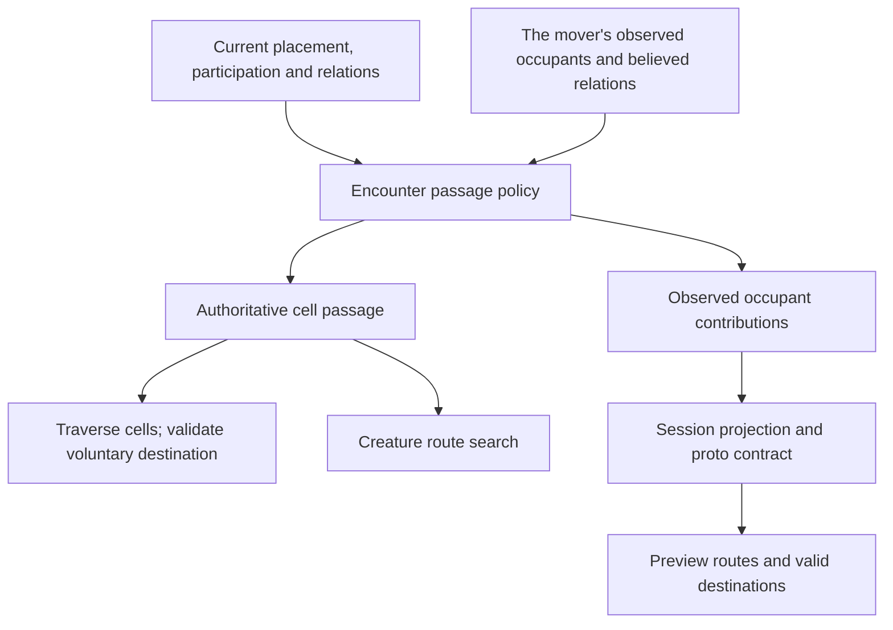

# Movement passage

## Shape

Encounter owns the passage policy and its fold. Execution supplies current
world facts; preview supplies the mover's knowledge. These are two inputs to
one policy, not two implementations of the rule. Session carries the answers;
the API translates them; the web searches and draws the resulting graph.

An occupant contributes `blocked`, `pass-through`, or `standable`. A cell's
most restrictive contributor wins. Terrain and crossings retain their own
restrictions. The mover never contributes an obstacle to itself.

## Law

The rules below are proposed except where the Rulings table marks their
scope settled.

### R1 — One owner, distinct passage and stopping

The toolkit owns occupancy permissions. Intermediate cells may be pass-through;
a voluntary destination must be standable. Both player walks and creature routes
consume this distinction. A client sends a path and receives the server's actual
result; a preview is not execution authority.

### R2 — Occupant policy

| Occupant | Enter or cross | Voluntarily stop |
|---|---|---|
| Upright nonhostile creature, including an ally | Yes | No |
| Upright hostile creature | No | No |
| Downed creature | Yes | Open: proposed yes |
| World NPC with blocking movement policy | No | No |
| World NPC with passable movement policy | Yes | No |

Downed means the rulebook's participation answer, not a client HP comparison,
a model filename, or absence from initiative. The same downed policy applies
to party members and monsters; recovery restores their ordinary contribution.
A downed occupant cannot make a wall, closed door, prop, or another blocking
occupant passable.

Creature-size exceptions and new terrain pricing are outside this slice.
Movement retains its current cost until a separate cost rule is approved.

### R3 — Walk endpoints and interruption

The encounter supplies a voluntary-destination check. Session invokes it before
charging or announcing a requested walk, and execution rechecks changing
occupancy as it traverses the path. Refused voluntary destinations preserve
persisted state and movement capacity.

A pass-through cell is a legal intermediate position. Involuntary pauses and
stops preserve the cell actually reached: reactions, a downed mover, combat
formation, and encounter completion do not teleport the mover to another cell
or erase events that already occurred. Resuming a held walk revalidates its
remaining path. A voluntary new walk from an overlapping position must end on
a standable cell.

This distinction governs voluntary walking. Forced movement retains its
existing restrictions; it does not acquire permission to shove creatures into
occupied cells as a side effect of enabling passage.

### R4 — Knowledge-safe preview

Preview occupancy derives from the observer's currently sighted occupants,
observed standing, and believed relations. It does not call the omniscient
cell fold and transmit its result. Unseen occupants and remembered figures do
not become live obstacles in the preview. An observed downed figure does not
silently reveal an unseen recovery.

The provider supplies a typed, mover-relative occupancy contribution alongside
the current sighting. The client does not derive passage from `MemberKind`,
`Standing`, or `stance`. Static geometry and live door restrictions remain
independent contributors to the route graph.

The contract distinguishes unavailable knowledge from all three passage values.
Missing or unknown permission cannot silently become standable or hostile.
The exact preview behavior for unavailable permission remains an open ruling.
A world NPC's authored blocking policy must have an explicit observation path;
preview cannot infer it from the NPC's kind.

Preview can differ from execution when knowledge differs from reality. A refusal
must respect the existing information boundary and cannot identify an unseen
occupant or reveal a concealed crossing through a preview response.

### R5 — Freshness and failure

Occupancy derives from placement and participation, never from a second durable
copy of life state. A down, recovery, relocation, relation change, or perception
change refreshes the affected viewer projection. Reload produces the same
answer as a fresh observation of the same state.

Authoritative passage queries propagate participation failures. They neither
assume every member is upright nor treat an unassessed cell as free. A bounded
query may reuse a validated participation assessment within that query; it
must not reuse it across a mutation that can change participation.

## Rulings

| ID | status | scope | ruled by | date |
|---|---|---|---|---|
| R1 | settled | Toolkit owns passage; traversal is separate from stopping; extend the existing contract across preview and execution | KirkDiggler | 2026-09-28 |
| R2 | open | Exact occupant matrix, including downed-body destinations, parity for downed players, and unchanged pricing | — | — |
| R3 | open | Voluntary endpoint enforcement and involuntary overlap during an interrupted walk | — | — |
| R4 | open | Knowledge-scoped projection, unknown permission behavior, and NPC blocking observation | — | — |
| R5 | open | Refresh, reload, and participation failure semantics | — | — |

## Open

- **R2:** Allow passing through an ally but not stopping on it; allow both passing
  and stopping on a downed creature? The alternative is passage-only for both.
- **R3:** Preserve involuntary overlap when a walk pauses or stops on a
  pass-through cell? The proposed rule preserves causal location and avoids
  automatic displacement or skipping a reaction.
- **R4:** For missing permission, withhold the preview for that route and surface
  the missing contract, or permit a clearly uncertain preview that execution
  may refuse? Neither alternative assigns a fabricated allegiance.
- **R4:** Specify which observable fact establishes a world NPC's blocking
  policy, then settle the exact sighting field and update carriers. Do not
  expose hidden true relations to make the preview appear exact.
- **R5:** Settle the error-capable passage API and assessment lifetime before
  changing consumers; the cell query and route callbacks must preserve errors.
