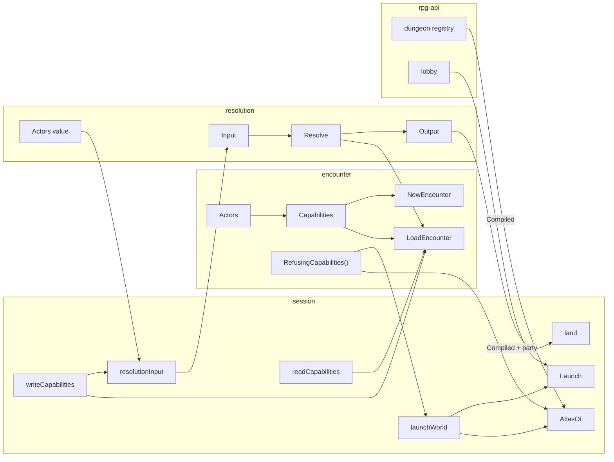

# One capabilities value — walkthrough

For [rpg-toolkit#1965](https://github.com/KirkDiggler/rpg-toolkit/issues/1965)
tier 2 D. The law is [design.md](design.md); the slices are
[slices.md](slices.md).

## What this is

An encounter asks its host a dozen questions — who is down, how far each member
sees, what they hold, what their sheet says, who drives an unplayed member,
which die the world rolls — and calls its host back to act: to strike, to step,
to announce a boundary. Those capabilities become **one value,
`encounter.Capabilities`**, owned by encounter and carried whole by every input
that builds an encounter. On top of it the session gets **one function that
builds a resolution input** and **one function that lands a resolution
output**. This design adds no capability, no verb and no wire field. It
introduces no second validator, no session-side capability list, and no world a
host builds for itself.

## Component shape

## Ownership and contracts

| Component | Owns | Input → output |
|---|---|---|
| `encounter.Capabilities` | The list of capabilities an encounter asks, and their presence check | `Validate() error` → encounter's `ErrNo*` |
| `encounter.Actors` | The three capabilities that call the host to act | embedded in `Capabilities` |
| `encounter.RefusingCapabilities()` | The one answer set for a world nobody plays | → `Capabilities` whose asks about members, turns, checks and actions refuse by name |
| `NewEncounter` / `LoadEncounter` | Construction, and the concealment rule that needs the field | `SetupInput{Field, Members, Endings, Retention, Capabilities}` / `LoadEncounterInput{Data, Capabilities}` → `*Encounter` |
| `resolution.Resolve` | One interaction over loaded data | `Input{World, Participants, Machine, Cost, Capabilities}` → `Output` |
| `resolution.Actors` | What a resolution's world carries as actors | `encounter.Actors`, each refusing |
| session `writeCapabilities` / `readCapabilities` | Composing capabilities for a write scope or a read | scope or standing → `encounter.Capabilities` |
| session `resolutionInput` | Building every resolution input | `resolutionAsk{World, Participants, Machine, Cost}` → `*resolution.Input` with `resolution.Actors` installed |
| session `land` | The order an output lands in | `*resolution.Output` + `*landing` → `*landed{Saved, Delivery}` |
| session `launchWorld` | Building a run's empty world from a compiled dungeon | `*dungeonspec.Compiled` → `*encounter.EncounterData` |
| session `AtlasOf` | Previewing a dungeon's map | `AtlasOfInput{Dungeon, DungeonKey}` → `*Atlas` |
| rpg-api dungeon registry | Storing authored dungeons and serving their atlas | YAML → `sessionworld.Compile` → `AtlasOf` |

The refusals, one per boundary:

- **Encounter does not default a capability.** A missing one is refused by name;
  the refusing value answers only what is true of an empty world.
- **No carrier edits the value.** Setup, Load and resolution's Input embed it;
  resolution hands its own input's value to `LoadEncounter` untouched.
- **Resolution does not pick its actors.** It exports `resolution.Actors`; the
  session installs them.
- **No session verb composes capabilities or a resolution input.** Only
  `capabilities.go` writes an `encounter.Capabilities` or `resolution.Input`
  literal.
- **No verb lands an output field by hand.** It chooses what to record and which
  window to pose, and hands the rest to `land`.
- **rpg-api builds no world.** It hands the compiled dungeon to `AtlasOf` and to
  `Launch`.

## Walk one thing through

A goblin's multiattack on its own turn: the first swing hits the cleric who
holds Fog Cloud, and before the second swing a party member is offered a
reaction.

1. A player ends their turn and the goblin is next. `openScope` builds the scope and
   loads the world with `writeCapabilities(ctx, scope)`: the encounter's
   `Driver` is the compelled driver bound to that scope, and its `Striker` is
   the session's `strikerSeam`.
2. The encounter drives the goblin and calls `Striker.Strike(ctx, enc, ...)`.
   The seam builds the multiattack machine and calls
   `resolutionInput(ctx, scope, resolutionAsk{World: enc.WorldView(), ...})`.
   The input carries the same `Sight` and `Sheets` seams, with
   `Actors: resolution.Actors`.
3. `Resolve` loads `LoadEncounterInput{Data: in.World, Capabilities:
   in.Capabilities}`. If a driven turn ever reached that world, its striker
   would refuse with `ErrRefusingStriker`; none does, because `Resolve` calls
   no encounter verb.
4. The first swing hits the cleric, who fails concentration; before the second
   the machine poses the offered reaction. The output carries a settled sequence, a closed area
   (the cleric's fog), the cleric's dirty sheet and the concentration break
   attributed to the first step.
5. The seam calls `land` with `Live: enc` (the goblin's encounter is mid-turn),
   `Record: recordPendingSequence`, and `Areas{Payload: &p, Split: true, Told:
   steps}`. `land` writes the cleric's sheet, records the first swing (its beat
   carries the break), closes the fog now because its caster broke in a told
   step, poses the reaction window, and returns without committing. The seam
   returns `ErrStrikePaused` to the encounter.
6. The verb that drove the turn commits once. The answer later
   resumes through `react_pending_attack`, whose landing answers the window
   first in its window step.

At no hop does any component other than `land` read the output's world, sheets,
areas or concentration.

## Separations that look like one thing

| Query | Source of truth |
|---|---|
| Which capabilities an encounter asks | `encounter.Capabilities` |
| Whether the field needs a check resolver and witness | the field, checked in `NewEncounter` and `LoadEncounter` |
| Whether a die is required | encounter: never at construction; resolution: always |
| Which actors a resolution's world carries | `resolution.Actors`, installed by `resolutionInput` |
| Which world a launch plays and a preview shows | `launchWorld` |

**A shared capability list is not a shared requirement list.** Encounter
requires the roller only at the roll; resolution requires it at the door. An
implementation that moves the roller check into `Capabilities.Validate` refuses
every compile-only world and every read, which carry no die.

**A refusing actor is not a missing one.** `Validate` refuses a nil actor; a
refusing actor passes and names the bug only when called. Leaving resolution's
actors nil to mean "never called" turns every resolution into `ErrNoStriker`.

## Trade-offs

| Decision | Benefit | Cost / boundary | Not taken |
|---|---|---|---|
| Embed the value in each input | Field reads and writes compile unchanged | Every composite literal moves its keys into one nested literal; the worker pays it once with a rewrite tool | A named non-embedded field |
| `Actors` as a nested type | The session installs resolution's actors with one assignment | One more type name in encounter | Three flat fields swapped one by one |
| Capabilities built at each use | A seam always answers from the roster the scope holds now | A few struct allocations per verb | Caching the value on the scope |
| One `land` with optional steps | One order, one place a test can mutate | A verb expresses its arm as closures; the landing table in slices is the map | One landing function per window kind |
| Delete `StartSession` and `Spawn` | One way to start a run | About a hundred toolkit test files and two dozen rpg-api tests move to Launch, through one helper each | Keeping them as test-only verbs |
| rpg-api keeps scenario validation | An author's bad scenario still answers as field errors | Scenario facts are read in two places until the compiler owns the check | Moving validation into the compiler now |

## Edges

- The landing tells no concentration on paths that tell none today: design Open 1.
- A failure after the first durable write reports what landed; design Open 2.
- `Resolve` does not inspect the actors it is handed; design Open 3.
- The resolution sheet outputs of `ShortRest` and `Depart` are separate types
  with their own landings in `rest.go` and `depart.go`; they are not
  `resolution.Output` and stay where they are.

## Where a change lands

- **A new capability** (say, a light source the encounter asks about): one field
  on `encounter.Capabilities`, one member of `RefusingCapabilities()`, one line
  in each session builder. No carrier changes.
- **A new pause kind** (tier 2 E): a new `Window` closure at the sites that pose
  it, and possibly one more `areaLanding` option; `land`'s order does not move.
- **A new interaction verb**: a machine, one `resolutionInput` call, one `land`
  call with its record and window choices.

## Source map

| Concern | Where |
|---|---|
| The value, the actors, the refusing value | `rulebooks/dnd5e/encounter/capabilities.go` |
| Stand-in types | `rulebooks/dnd5e/encounter/standins.go` |
| Construction and load | `rulebooks/dnd5e/encounter/encounter.go` `NewEncounter`, `data.go` `LoadEncounter` |
| Resolution's input and load | `rulebooks/dnd5e/resolution/resolve.go` `Input`, `resolveOn` |
| Resolution's actors | `rulebooks/dnd5e/resolution/actors.go` |
| Session builders | `rulebooks/dnd5e/session/capabilities.go` |
| Session landing | `rulebooks/dnd5e/session/land.go` |
| World builder and launch | `rulebooks/dnd5e/session/launch.go` `launchWorld`, `Launch` |
| Atlas preview | `rulebooks/dnd5e/session/read.go` `AtlasOf` |
| Registry | rpg-api `internal/dungeons/registry.go`, `internal/sessionworld/sessionworld.go` |
