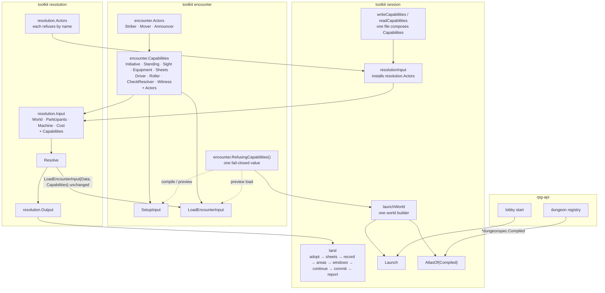

# One capabilities value — one input, one landing

Tracking: [rpg-toolkit#1965](https://github.com/KirkDiggler/rpg-toolkit/issues/1965) tier 2 D.
Walkthrough: [README.md](README.md). Slices: [slices.md](slices.md).

## Shape

One value names every capability an encounter asks. Encounter owns it; Setup,
Load and resolution's Input carry it whole. Resolution loads its world with the
value it was handed and never swaps a member. The session composes the value in
one file, builds every resolution input in one function, and lands every
output in one function that owns the order. A world compiled or previewed gets
encounter's one refusing value; nothing else does.

## Law

### One capabilities value

- `encounter.Capabilities` is the one list of capabilities an encounter asks:
  `Initiative`, `Standing`, `Sight`, `Equipment`, `Sheets`, `Driver`, `Roller`,
  `CheckResolver`, `Witness`, and the embedded `Actors`. A capability the
  encounter gains is added to this type and to nothing else.
- `SetupInput`, `LoadEncounterInput` and `resolution.Input` embed it. No carrier
  copies, defaults, swaps or re-checks one member of it on its own.
- `Capabilities.Validate` is the one presence check. It refuses a missing
  capability with encounter's own sentinel, in the order `ErrNoInitiative`,
  `ErrNoStanding`, `ErrNoSight`, `ErrNoEquipment`, `ErrNoSheets`,
  `ErrNoTurnDriver`, `ErrNoStriker`, `ErrNoMover`, `ErrNoAnnouncer`.
- The concealment pair is checked only where the field is known: Setup and Load
  refuse a missing `CheckResolver` or `Witness` exactly when the field declares
  a concealment.
- `Roller` is optional to the encounter and refused at the roll. Resolution
  refuses an input without one (`resolution.ErrNoRoller`), because its machines
  roll.
- A missing capability has one sentinel everywhere: encounter's. Resolution
  declares no duplicate.

### The actors

- `encounter.Actors` holds `Striker`, `Mover` and `Announcer`: the capabilities
  through which an encounter calls its host to act.
- Inside a resolution no actor is ever called, because `Resolve` calls no
  encounter verb. The actors a resolution's world carries are
  `resolution.Actors`, each of which refuses by name.
- Resolution exports that value and never installs it itself. The session's one
  resolution input builder installs it.

### The refusing value

- `encounter.RefusingCapabilities()` is the one value for a world compiled or
  previewed and never played. Each member answers only what is true of a world
  nobody is in, and refuses every other ask by name: initiative, participation
  of a member, sheets of a member, a check, a driven turn, a strike, a step, a
  boundary.
- Its `Driver` refuses; no refusing value passes a turn silently.
- Capabilities are never persisted. Every play load supplies the session's own.

### One world builder, two readers

- The session builds a run's empty world from a compiled dungeon in one
  function. `Launch` plays it; `AtlasOf` loads it with the refusing value and
  projects its map. What a builder previews is what Launch plays.
- `AtlasOf` takes the `*dungeonspec.Compiled` and the content key. A host
  builds no world of its own.

### One input builder

- The session composes `encounter.Capabilities` only in `capabilities.go`: one
  builder for a write scope, bound to that scope, and one for a read, whose
  actors, check resolver and witness refuse and which carries no roller.
- Capabilities are built at each use from the scope's current standing, never
  cached on the scope: adopting a world replaces the roster the seams answer
  from.
- `resolutionInput` is the only constructor of `resolution.Input` in the
  session.

### One landing

- `land` is the only reader of an output's `World`, `DirtyCharacters`,
  `DirtyMonsters`, `OpenedAreas`, `ClosedAreas`, `ConcentrationChecks` and
  `ConcentrationBreaks`. A verb reads `Outcome` and `Posed` to choose what it
  records and which window it poses. `Hooks` is resolution's diagnostic and the
  session reads it nowhere.
- The order is fixed: adopt the world, write the dirty sheets, record the
  outcome, land the areas (held first, then now, or split by the breaks a
  sequence told), answer and pose windows, run the verb's continuation, commit,
  report. Every field lands exactly once.
- A verb's landing adopts the output's world into its scope. A seam's landing
  records on the encounter that called it, adopts nothing because that
  encounter is mid-verb, and commits nothing because the calling verb commits.
- The record step receives the interaction's concentration checks and breaks
  from the landing; no verb reads them off the output.

### What goes away

- `CompileOnlySetup` and `CompileOnlyLoad`.
- `Manager.StartSession` and `Manager.Spawn`. A host starts a run only through
  `Launch`; `Join` stays for a rejoin and `PlaceNPC` for the demo vendor.
- The `TurnDriver` alias and field name; the field is `Driver`.

### No behaviour, no wire

- No proto, response, beat or refusal a host sees changes. The atlas a registry
  serves and the run a lobby launches are byte-identical to today's.
- The gate is the landing: deleting any one step of `land`, or the `land` call at
  any site, fails a test.

## Rulings

| ID | status | scope | ruled by | date |
|---|---|---|---|---|
| R1 | settled | Remaining tier 2 order: F, then this design (D), then E, then A | KirkDiggler | 2026-10-08 |
| R2 | settled | One `encounter.Capabilities` value owned by encounter, carried unchanged by `SetupInput`, `LoadEncounterInput` and `resolution.Input` | KirkDiggler | 2026-10-09 |
| R3 | settled | Resolution's stand-in Striker, Mover and Announcer become one `resolution.Actors` value the session installs | KirkDiggler | 2026-10-09 |
| R4 | settled | Encounter ships one fail-closed refusing capabilities value for compile and preview; `CompileOnlySetup` and `CompileOnlyLoad` are deleted | KirkDiggler | 2026-10-09 |
| R5 | settled | `Manager.AtlasOf` takes the `*dungeonspec.Compiled` and builds the world the way Launch does | KirkDiggler | 2026-10-09 |
| R6 | settled | The session has one resolution input builder and one output landing that owns the order (record, areas held or landed, windows, save, report) | KirkDiggler | 2026-10-09 |
| R7 | settled | `StartSession` and `Spawn` are deleted; `Join` stays for a rejoin; `PlaceNPC` stays | KirkDiggler | 2026-10-09 |
| R8 | settled | This wave changes no behaviour and no wire; its gate is every output field landing exactly once from one place, proved by a deletion-mutant sweep over the landing; the walk is one fight, one cast, one rest, one launch | KirkDiggler | 2026-10-09 |
| R9 | open | Concentration an output carries on a path that tells no beat today (Open: untold concentration) | — | — |
| R10 | open | A failure after the landing's first durable write always reports what landed (Open: one error shape) | — | — |
| R11 | open | Whether `Resolve` refuses an input whose actors are not `resolution.Actors` (Open: foreign actors) | — | — |

## Open

1. **Untold concentration.** Several landings can carry concentration checks
   and breaks that no beat tells today: the announcer's boundary (a
   concentration that runs out at a turn end, or ends with the fight), a
   compelled turn, an activation, and every landing that poses a window without
   a settled hit. The areas those breaks close still land. Slices lists each
   arm. Telling them needs an encounter verb that records a break with no
   outcome beat. Recommendation: in this wave the landing drops them by name,
   through one `untold` arm a test pins, and the verb ships with E, whose
   envelope carries settled facts whole.
2. **One error shape.** Some landings wrap a failure after the dirty sheets are
   written in a `SaveError` naming what landed, and some return it bare. The
   landing applies one rule. Recommendation: every failure after the first
   durable write reports what landed (the existing S6 law). Only failure paths
   change.
3. **Foreign actors.** A host could hand `Resolve` real actors. They would never
   be called, so the only loss is a bug named by a refusing actor. Refusing them
   means comparing interface values, which panics on a seam that holds a slice
   or map. Recommendation: no refusal; `resolution.Actors` is installed in one
   place and the session's structural test proves it.
