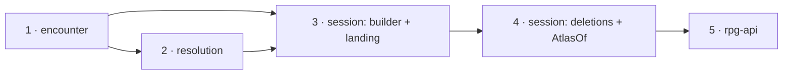

# One capabilities value — slices

A working document beside [design.md](design.md): slice order, the task list a
worker executes per module, what done means, and what is deleted. Every
`file:line` is at the survey heads: rpg-toolkit `origin/main` `3b0d531a`
(dnd5e v0.206.0 · encounter v0.119.0 · resolution v0.66.0 · session v0.122.0)
and rpg-api `origin/dev` `541f91bd`. Paths in the toolkit are relative to
`rulebooks/dnd5e/`. Line numbers drift as a slice edits a file; the symbol named
beside each line is the anchor.

Develop outside-in, merge inside-out. One nearest-`go.mod` module per toolkit
PR. Each consumer builds on its provider's gate-approved branch head (never a
draft) and pins the tag once the provider merges. The wave is walked once on
the local stack before anything merges. No protos or web slice exists.

## Order



Session is two PRs in sequence: the landing is the gate's subject and is
reviewed alone; the deletions move about a hundred test files and are reviewed
as a migration.

## The rewrite tool (used by slices 1–5)

The reshape breaks every composite literal of the three inputs. A worker writes
one throwaway Go program under `$CLAUDE_JOB_DIR/tmp/capsrewrite/` (never
committed) using only `go/parser`, `go/ast`, `go/format`:

- **Match** a composite literal whose type is `SetupInput`, `LoadEncounterInput`
  (inside package `encounter`), `encounter.SetupInput`,
  `encounter.LoadEncounterInput`, `tkencounter.SetupInput`,
  `tkencounter.LoadEncounterInput`, `Input` (inside package `resolution`) or
  `resolution.Input`.
- **Move** its keyed elements `Initiative`, `Standing`, `Sight`, `Equipment`,
  `Sheets`, `TurnDriver`, `Roller`, `CheckResolver`, `Witness` into a new keyed
  element `Capabilities: <pkg>.Capabilities{...}` (`<pkg>` is empty inside
  package `encounter`, else the file's import name for encounter), renaming the
  key `TurnDriver` to `Driver`.
- **Move** `Striker`, `Mover`, `Announcer` into `Actors: <pkg>.Actors{...}`
  inside that `Capabilities` literal.
- **For a resolution input** (slice 2 onward), add `Actors: resolution.Actors`
  (`Actors: Actors` inside package `resolution`) when the literal names no
  actor and names at least one capability.
- Leave every other key in place; print with `go/format`; never touch a file
  that has no match.

Selector reads and writes (`setup.Sight = x`) keep compiling because the value
is embedded. Only `.TurnDriver` selectors break; the compiler lists them and
each becomes `.Driver`. A worker runs the tool, then `go build ./... && go vet
./...`, and fixes what remains by hand.

## 1. toolkit encounter

### Types (new file `encounter/capabilities.go`)

```go
// Capabilities is every capability an encounter asks of its host.
type Capabilities struct {
	Initiative    InitiativeRoller
	Standing      StandingWithParticipation
	Sight         Sight
	Equipment     EquipmentWithConditions
	Sheets        Sheets
	Driver        Driver
	Roller        dice.Roller // optional; refused at the roll (ErrNoRoller)
	CheckResolver CheckResolver // required exactly when the field declares a concealment
	Witness       Witness       // same rule as CheckResolver
	Actors
}

// Actors are the capabilities through which an encounter calls its host to act.
type Actors struct {
	Striker   Striker
	Mover     Mover
	Announcer Announcer
}

// Validate refuses a missing capability every encounter asks, in this order:
// ErrNoInitiative, ErrNoStanding, ErrNoSight, ErrNoEquipment, ErrNoSheets,
// ErrNoTurnDriver, ErrNoStriker, ErrNoMover, ErrNoAnnouncer. It does not check
// Roller, CheckResolver or Witness.
func (c *Capabilities) Validate() error

// validateConcealed refuses a nil CheckResolver (ErrNoCheckResolver), then a
// nil Witness (ErrNoWitness).
func (c *Capabilities) validateConcealed() error

// RefusingActors returns actors that each refuse: RefusingStriker{},
// RefusingMover{}, RefusingAnnouncer{}.
func RefusingActors() Actors

// RefusingCapabilities returns the one value for a world compiled or previewed,
// never played.
func RefusingCapabilities() Capabilities
```

`RefusingCapabilities()` returns: `Initiative: refusingInitiative{}`,
`Standing: nobodyDown{}`, `Sight: zeroSight{}`, `Equipment:
UnobservedEquipment{}`, `Sheets: noSheets{}`, `Driver: RefusingDriver{}`,
`Roller: nil`, `CheckResolver: RefusingCheckResolver{}`, `Witness:
NobodyPerceives{}`, `Actors: RefusingActors()`. Its godoc carries the per-member
paragraph now on `CompileOnlySetup` (`standins.go:8-56`), with `Driver` stated
as refusing.

### Tasks

1. Create `encounter/capabilities.go` with the types above.
2. `SetupInput` (`field.go:1265-1402`): delete the fields at `field.go:1280`
   (`Initiative`), `:1287` (`Standing`), `:1296` (`Sight`), `:1307`
   (`Equipment`), `:1315` (`Sheets`), `:1328` (`TurnDriver`), `:1343`
   (`Roller`), `:1352` (`Striker`), `:1360` (`Mover`), `:1367` (`Announcer`),
   `:1375` (`CheckResolver`), `:1381` (`Witness`) and their comments; embed
   `Capabilities` after `Endings`. Move each field's REQUIRED/refusal paragraph
   onto the matching `Capabilities` field.
3. `LoadEncounterInput` (`data.go:2212-2298`): delete the fields at
   `data.go:2219` (`Roller`), `:2227`, `:2232`, `:2238`, `:2246`, `:2254`,
   `:2263` (`TurnDriver`), `:2271`, `:2278`, `:2286`, `:2293`, `:2297`; embed
   `Capabilities` after `Data`.
4. `LoadEncounterInput.Validate` (`data.go:2308-2342`): body becomes nil check
   (`ErrNilInput`) then `if err := in.Capabilities.Validate(); err != nil {
   return fmt.Errorf("load encounter: %w", err) }`.
5. `NewEncounter` (`encounter.go:568`): keep the nil and `ErrNoEnding` checks
   first; replace the nine checks at `encounter.go:585-659` with
   `in.Capabilities.Validate()` wrapped `"newencounter: %w"`. Replace
   `encounter.go:727-733` with `in.Capabilities.validateConcealed()`.
   Construction at `encounter.go:821-832` and `:857-858` reads the same names
   through the embedded value; only `driver: in.TurnDriver` becomes
   `driver: in.Driver`.
6. `LoadEncounter` (`data.go:2392`): replace `data.go:2528-2535` with
   `input.Capabilities.validateConcealed()`; `data.go:2902` becomes
   `driver: input.Driver`.
7. `standins.go`: delete `CompileOnlySetup` (`:8-73`) and `CompileOnlyLoad`
   (`:75-125`). Keep every stand-in type. Rewrite the doc comments that name
   the deleted functions (`UnobservedEquipment`, `nobodyDown`, `noSheets`,
   `RefusingCheckResolver`, `NobodyPerceives`, `RefusingDriver`) to name
   `RefusingCapabilities`. The compile-time assertions at `:127-141` stay.
8. `errors.go:476-506`: rewrite the `ErrRefusing*` doc comments that name
   `CompileOnlySetup` to name `RefusingCapabilities`. Messages unchanged.
9. `turndriver.go:67`: delete the `TurnDriver = Driver` alias and its comment.
   Replace each of its 15 uses with `Driver` (the compiler lists them).
10. `cmd/freeroam-workbench/main.go:105` and `:567`: rewrite with the tool.
11. Tests: run the rewrite tool over the module (312 `SetupInput{` and 152
    `LoadEncounterInput{` literals in 119 files). Replace every
    `CompileOnlySetup(field, endings)` with `&encounter.SetupInput{Field: field,
    Endings: endings, Capabilities: encounter.RefusingCapabilities()}` and every
    `CompileOnlyLoad(data)` with `&encounter.LoadEncounterInput{Data: data,
    Capabilities: encounter.RefusingCapabilities()}` at: `standins_test.go:28,
    80, 103, 117, 131, 134, 137`, `standins_internal_test.go:23-24`,
    `sheets_test.go:325, 331`, `prop_presentation_test.go:70`,
    `dungeonspec/prop_presentation_test.go:36, 127, 136`.
12. `standins_internal_test.go`: the reflect walk asserts every field of
    `RefusingCapabilities()` (and of its `Actors`) is non-nil except `Roller`.

### Done when

- `Capabilities.Validate` on a value missing each required member in turn
  returns that member's sentinel, and the order test pins the sequence above.
- `NewEncounter` and `LoadEncounter` with a concealed field and a nil
  `CheckResolver` or `Witness` refuse with `ErrNoCheckResolver` /
  `ErrNoWitness`; with a plain field they construct.
- A world built with `RefusingCapabilities()` constructs, round-trips through
  `ToData` and `LoadEncounter` with `RefusingCapabilities()`, and its
  `Initiative`, `Driver`, `Striker`, `Mover`, `Announcer`, `CheckResolver`
  refuse with their `ErrRefusing*` sentinels.
- `grep -rn 'CompileOnlySetup\|CompileOnlyLoad\|TurnDriver' rulebooks/dnd5e/encounter`
  finds nothing but `ErrNoTurnDriver`.
- `go test ./... -count=1` in the module, `golangci-lint run`, and every
  existing test green with no assertion changed except the deleted functions'
  own.

### Deletions

`CompileOnlySetup`, `CompileOnlyLoad`, the `TurnDriver` alias, the twelve
duplicated fields on each input, the nine inline checks in `NewEncounter`, the
nine in `LoadEncounterInput.Validate`.

### Rides along (tier 3)

The `TurnDriver` alias kept for one release; the compile-only pair disagreeing
on `PassDriver` versus `RefusingDriver` (the one value refuses).

## 2. toolkit resolution

### Types

```go
// resolve.go
type Input struct {
	World        encounter.EncounterData
	Participants []Participant
	Machine      Machine
	Cost         *Cost
	encounter.Capabilities
}

// actors.go (new)
// Actors are the actors every world a resolution loads carries. Resolve calls
// no encounter verb, so none is ever asked; each refuses by name if one is.
var Actors = encounter.RefusingActors()
```

### Tasks

1. `Input` (`resolve.go:68-213`): delete the fields at `resolve.go:99`
   (`Initiative`), `:109`, `:125`, `:145`, `:162`, `:176` (`Roller`), `:193`
   (`TurnDriver`), `:208`, `:213`; embed `encounter.Capabilities` after `Cost`.
   Keep each field's "carried, never consulted" paragraph as one paragraph on
   the embed.
2. `Input.Validate` (`resolve.go:217-274`): after `ErrNilInput` and
   `ErrNoMachine`, call `in.Capabilities.Validate()` and return its error
   unwrapped (`errors.Is` reaches encounter's sentinel); then `if in.Roller ==
   nil { return ErrNoRoller }`; participants and cost unchanged.
3. `resolveOn` (`resolve.go:408-451`): the literal becomes
   `encounter.LoadEncounter(&encounter.LoadEncounterInput{Data: in.World,
   Capabilities: in.Capabilities})`. Delete the three stand-in comments.
4. Create `actors.go` with `Actors`.
5. `errors.go:14-78`: delete `ErrNoInitiative`, `ErrNoStanding`, `ErrNoSight`,
   `ErrNoEquipment`, `ErrNoSheets`, `ErrNoTurnDriver`. `ErrNoRoller` stays.
6. `doc.go:20`: the example builds `Capabilities` with `Actors: resolution.Actors`.
7. Tests: run the rewrite tool (156 `Input{` literals in 42 test files, 28
   `SetupInput{` and 3 `LoadEncounterInput{` in 25). `resolve_test.go:592-647`
   asserts `encounter.ErrNo*` in place of the deleted sentinels, plus one case:
   an input with nil `Actors.Striker` refuses with `encounter.ErrNoStriker`.

### Done when

- `Resolve` with `Actors: Actors` loads a world; with `Actors: {}` refuses with
  `encounter.ErrNoStriker` before any participant attaches.
- `TestResolveLoadsWithTheCapabilitiesItWasHanded` (new, AST): the only
  `encounter.LoadEncounterInput` literal in the module's non-test files has
  exactly the keys `Data` and `Capabilities`, and the value of `Capabilities`
  is `in.Capabilities`.
- `grep -rn 'RefusingStriker\|RefusingMover\|RefusingAnnouncer' rulebooks/dnd5e/resolution --include='*.go' | grep -v _test`
  finds only `actors.go`.
- Module tests, lint, gorelease green; gorelease reports the input reshape and
  the six sentinel removals as the intended breaking changes.

### Deletions

Six duplicate sentinels; nine fields on `Input`; the hard-coded stand-ins at
`resolve.go:424-449`.

## 3. toolkit session — one builder, one landing

### Input sites (11), each replaced by `m.resolutionInput`

| # | site | world | cast | cost |
|---|---|---|---|---|
| 1 | `activate.go:265` | `scope.enc.WorldView()` | `cast` | — |
| 2 | `announcer.go:91` | `enc.WorldView()` | `cast` | — |
| 3 | `attack.go:368` | `scope.enc.WorldView()` | `cast` | `cost` |
| 4 | `cast.go:437` | `scope.enc.WorldView()` | `participants` | the `&resolution.Cost{...}` literal |
| 5 | `compelled.go:234` (`ObeyInput.Interaction`) | `d.scope.enc.WorldView()` | `cast` | — |
| 6 | `mover.go:159` | `enc.WorldView()` | `cast` | — |
| 7 | `react_cast_offer.go:96` | `scope.enc.WorldView()` | `participants` | — |
| 8 | `react_pending_attack.go:219` | `scope.enc.WorldView()` | `m.walkCast(ctx, scope, roster)` | — |
| 9 | `react_post_hit.go:122` | `scope.enc.WorldView()` | `m.walkCast(ctx, scope, roster)` | — |
| 10 | `react_post_roll.go:84` | `scope.enc.WorldView()` | `cast` | — |
| 11 | `striker.go:122` | `enc.WorldView()` | `cast` | `cost` |

Seam sites (2, 5, 6, 11) pass their seam's `scope`.

### Encounter load sites, each replaced by the builders

| site | today | becomes |
|---|---|---|
| `read.go:738` (`loadGivenWorld`) | literal with ten parameters threaded from callers | `Capabilities: m.writeCapabilities(ctx, scope)` when `scope != nil`, else `m.readCapabilities(standing, driver)` |
| `read.go:657` (`loadWorld`) | passes five refusing stand-ins | passes `nil` scope and its driver |
| `write.go:1344` (`openScope`) | passes five seams | passes `scope` |
| `write.go:1645` (`adopt`) | literal | `Capabilities: m.writeCapabilities(ctx, scope)` |
| `launch.go:373` (`launchWorld`) | `CompileOnlySetup` | `&encounter.SetupInput{Field: dungeon.Field, Endings: endings, Retention: encounter.RetentionUnbounded, Capabilities: encounter.RefusingCapabilities()}` |
| `start.go:213` (`loadAuthored`) | `CompileOnlyLoad` + three overrides | `&encounter.LoadEncounterInput{Data: *world, Capabilities: encounter.RefusingCapabilities()}` + the same three overrides (deleted in slice 4) |

### Types

```go
// capabilities.go (new) — the only file that composes encounter.Capabilities.

// writeCapabilities binds every capability to scope, read from scope.standing
// at the moment of the call: Initiative m.initiative; Standing scope.standing;
// Sight and Sheets sheetsBeside(scope.standing); Equipment
// equipmentBeside(scope.standing); Driver m.compelledDriverFor(ctx, scope);
// Roller m.encounterDice(); CheckResolver m.checkResolverFor(scope); Witness
// witnessSeam{scope: scope}; Actors {strikerSeam, moverSeam, announcerSeam}
// bound to scope.
func (m *Manager) writeCapabilities(ctx context.Context, scope *writeScope) encounter.Capabilities

// readCapabilities serves a read that advances no clock: the standing seams,
// the given driver, no Roller, RefusingCheckResolver{}, NobodyPerceives{},
// encounter.RefusingActors().
func (m *Manager) readCapabilities(standing standingSeam, driver encounter.Driver) encounter.Capabilities

// resolutionAsk is what a verb or seam brings to a resolution.
type resolutionAsk struct {
	World        encounter.EncounterData
	Participants []resolution.Participant
	Machine      resolution.Machine
	Cost         *resolution.Cost
}

// resolutionInput is the only constructor of resolution.Input in this package:
// writeCapabilities(ctx, scope) with Actors replaced by resolution.Actors.
func (m *Manager) resolutionInput(ctx context.Context, scope *writeScope, ask resolutionAsk) *resolution.Input

// land.go (new) — the only reader of an output's world, sheets, areas and
// concentration.

type landing struct {
	// Live is the encounter a seam was called from; nil for a verb, whose scope
	// adopts the output's world. A Live landing never commits.
	Live *encounter.Encounter
	// Record tells the outcome's beats on enc, given the interaction's
	// concentration. Nil records nothing.
	Record func(enc *encounter.Encounter, told concentration) error
	// Untold declares that this landing tells no concentration (design Open 1).
	// A landing with concentration, no Record and Untold false refuses with
	// ErrInvalidWorld.
	Untold bool
	Areas  areaLanding
	// Answer is the window this resolution resumed; answered first in the
	// window step.
	Answer *windowAnswer
	// Window poses (and tells) the windows the output leaves. Nil poses none.
	Window func(enc *encounter.Encounter) error
	// Continue is the verb's follow-on after the windows. Nil does nothing.
	Continue func(enc *encounter.Encounter) error
}

type concentration struct {
	Checks []encounter.ConcentrationCheck
	Breaks []encounter.ConcentrationBreak
}

type areaLanding struct {
	// Payload is the pending-attack window areas may wait on; nil lands all now.
	Payload *pendingAttackWindowPayload
	// LandHeld lands Payload's held areas before this output's own.
	LandHeld bool
	// Split lands only areas whose caster broke in Told now and holds the rest
	// on Payload (today's landToldAreas rule).
	Split bool
	Told  []resolution.SequenceStepOutcome
}

type windowAnswer struct {
	Window interrupt.Window
	Choice ReactChoice
}

type landed struct {
	Saved    SaveReport
	Delivery DeliveryReport
}

// land lands out on scope in the one order.
func (m *Manager) land(ctx context.Context, scope *writeScope, out *resolution.Output, l *landing) (*landed, error)
```

`land`'s body, in this order and no other:

1. `l.Live == nil`: `m.adopt(ctx, scope, out.World)`; `enc := scope.enc`.
   Otherwise `enc := l.Live`.
2. `m.saveDirty(ctx, scope, out)`.
3. `told := concentration{out.ConcentrationChecks, out.ConcentrationBreaks}`.
   `l.Record != nil`: `l.Record(enc, told)`. Else if `!l.Untold` and told is
   non-empty: `ErrInvalidWorld`.
4. Areas: `LandHeld` → `m.landHeldAreas(scope, l.Areas.Payload)`; then `Split`
   → `m.landToldAreas(enc, scope, l.Areas.Payload, out, l.Areas.Told)`, else
   `m.landAreas(enc, scope, out)`.
5. `l.Answer != nil` → `answerWindow(scope, l.Answer.Window, l.Answer.Choice)`;
   `l.Window != nil` → `l.Window(enc)`; when either ran,
   `scope.data.Windows = scope.ledger.ToData(); scope.touched = true`.
6. `l.Continue != nil` → `l.Continue(enc)`.
7. `l.Live != nil` → return `&landed{}, nil`.
8. `report, delivery, err := m.commit(ctx, scope)`; return.

Errors from steps 3–6 pass through `translate` once and, per design Open 2
(recommended), through `reportUnrecorded(scope, err)`. Move `saveDirty`
(`attack.go:1294`), `landAreas` (`attack.go:1260`), `landToldAreas`
(`react_pending_attack.go:79`), `landHeldAreas` (`:106`) and `holdAreas` (`:57`)
into `land.go` unchanged.

### Landing sites (17), each becomes one `m.land` call

| # | site | Live | Record | Untold | Areas | Answer | Window | Continue |
|---|---|---|---|---|---|---|---|---|
| L1 | `activate.go:289-322` | — | `RecordActivation` (`:306`) | yes | now | — | — | — |
| L2 | `announcer.go:114-117` | `enc` | — | yes | now | — | — | — |
| L3 | `attack.go:419-437` complete strike | — | `Record(recordFor(...))` (`:429`) | — | now | — | — | — |
| L4 | `attack.go:488-510` posed before roll | — | — | yes | now | — | `posePendingAttackWindow` (`:502`) | — |
| L5 | `attack.go:512-533` posed settled hit | — | `Record(recordFor(...))` (`:519`) | — | now | — | `posePostHitWindow` (`:526`) | — |
| L6 | `attack.go:535-611` posed at the roll | — | — | yes | now | — | ledger `Pose` (`:589`) then `RecordRollWindow` (`:600`) | — |
| L7 | `cast.go:495-588` `finishCast` | — | `RecordCast` (`:536`) | — | now | caller's | — | retaliation loop (`:558-566`) then `walkCastPushes` (`:580`) |
| L8 | `cast.go:620-720` `poseCastWindow` | — | — | yes | now | caller's | ledger `Pose` (`:679`), then `RecordRollWindow` (`:697`) unless choices | — |
| L9 | `compelled.go:263-274` | `d.scope.enc` | — | yes | now | — | — | — |
| L10 | `mover.go:182-249` | `enc` | the movement beats (`:203-243`) | — | now | — | posed: `posePendingAttackWindow` (`:188`) | — |
| L11 | `react_post_roll.go:102-128` posed | — | `Record(recordStrike(...))` (`:115`) | — | now | `window, choice` | `posePostHitWindow` (`:121`) | — |
| L12 | `react_post_roll.go:131-165` complete | — | `Record(recordStrike(...))` (`:152`) | — | now | `window, choice` | — | — |
| L13 | `react_pending_attack.go:223-312` | — | per arm below | per arm | per arm | `window, in.Choice` | posed: `posePendingAttackWindow` (`:271`) | complete: `resumeAfterLastAnswer` (`:304`) |
| L14 | `striker.go:146-174` posed before roll or mid-sequence | `enc` | sequence: `recordPendingSequence` (`:155`) | before roll: yes | `Split`, `Told`, `Payload: &p` | — | `posePendingAttackWindow` (`:171`) | — |
| L15 | `striker.go:176-192` posed settled hit | `enc` | `Record(recordFor(...))` (`:183`) | — | now | — | `posePostHitWindow` (`:189`) | — |
| L16 | `striker.go:196-219` complete | `enc` | `Record(recordFor(...))` (`:207`) or `recordSequence` (`:213`) | — | now | — | — | — |
| L17 | `react_post_hit.go:126-163` | — | complete: `recordRetaliation` (`:146`) | posed: yes | now | `window, in.Choice` | posed: `posePostHitWindow` (`:136`) | complete: `resumeAfterLastAnswer` (`:153`) |

`react_cast_offer.go:119` answers the window before handing off today. It
stops answering and passes `&windowAnswer{window, choice}` to `poseCastWindow`
(`:129`) and `finishCast` (`:140`), which gain an `answer *windowAnswer`
parameter carried into the landing's `Answer` (nil from `cast.go:473` and
`:476`).

**L13 arms** (`react_pending_attack.go:238-301`):

| arm | Record | Untold | Areas |
|---|---|---|---|
| posed, movement | movement beats from `out.Posed.Movement` | — | now |
| posed, sequence | `recordPendingSequence` | — | `LandHeld`, `Split`, `Told` (`:244`) |
| posed, settled hit, not yet recorded | `Record(recordFor(...))`, then `p.HitRecorded = true` | — | `LandHeld`, now |
| posed, settled hit already recorded, or before roll | — | yes | `LandHeld`, now |
| complete, movement | movement beats | — | now |
| complete, strike | `Record(recordFor(...))` unless `HitRecorded`, then `recordRetaliation` | — | `LandHeld`, now |
| complete, sequence | `recordPendingSequence` | — | `LandHeld`, now |

### Supporting edits

- `mover.go:203` `recordMovementResults` splits: `movementBeats(moved
  resolution.MovementOutcome) ([]*encounter.RecordInput, error)` builds the
  beats (`:205-226`); the Record closure records them. `saveDirty` and
  `landAreas` leave it. This removes the second sheet write the pending-movement
  resume makes today (`react_pending_attack.go:226`, then `:340` → `mover.go:237`).
- `recordRetaliation` (`react_post_hit.go:166`) takes `told concentration` in
  place of `out *resolution.Output`; `cast.go:560` passes `concentration{}`.
- `recordFor` (`attack.go:835`) takes `told concentration` in place of
  `out *resolution.Output` and passes `told.Checks, told.Breaks` to
  `recordStrike`; the direct `recordStrike` calls at `react_post_roll.go:115`
  and `:152-155` pass `told.Checks, told.Breaks` in place of the output's.
- `loadGivenWorld` (`read.go:727`) takes `(ctx, data, world, scope *writeScope,
  driver encounter.Driver)`; with a scope it sets `scope.standing` before
  building `writeCapabilities`. `loadWorldWithBaseline` (`read.go:693`) the same.
- `attack.go:789`: drop the `resolution.ErrNoSheets` half.
  `sentinels_test.go:116-118, 152`: delete the four `resolution.ErrNo*` rows.
- `cmd/session-workbench/main.go:526`: rewrite with the tool.
- Tests: run the rewrite tool (86 `SetupInput{`, 3 `LoadEncounterInput{` in 53
  files).

### Done when

- `land_internal_test.go` `TestEveryOutputFieldLandsOnce`: one output carrying
  a marked world, one dirty character, one dirty monster, one opened and one
  closed area, one check and one break, landed with counting `Record`,
  `Window`, `Continue` and an `Answer`. Asserts: scope adopted the marked world;
  the character repository saved that record once; `scope.data.NPCs` holds the
  monster; `Record` ran once with exactly that check and break; the area set
  gained and lost exactly those areas; the window was answered once and posed
  once; `Continue` ran once; the encounter and the session were saved once;
  and the recorded call order is adopt, sheets, record, areas, answer, window,
  continue, commit.
- `TestASeamLandingAdoptsAndCommitsNothing`: with `Live` set, `scope.enc` is
  the same pointer after, `Record` received `Live`, nothing was saved.
- `TestAnUntoldLandingDropsConcentrationByName` and
  `TestAnUndeclaredLandingRefusesConcentration` (`ErrInvalidWorld`).
- `land_only_test.go` (AST, `store_only_test.go`'s shape): in non-test files,
  calls to `adopt`, `saveDirty`, `landAreas`, `landToldAreas`, `landHeldAreas`,
  `holdAreas` appear only in `land.go`; a `resolution.Input` composite literal
  and an `encounter.Capabilities` composite literal appear only in
  `capabilities.go`.
- `TestThePendingMovementResumeSavesEachSheetOnce`: a resumed walk whose
  reaction damages the walker saves the walker's sheet once.
- **Deletion-mutant sweep**, reported in the PR body as a table: for each of
  `land`'s eight steps, and for each of the 17 call sites (delete the call;
  nil its `Record`; zero its `Areas`), the test that fails. A surviving mutant
  gets a test before review.
- Every existing session test green with no assertion changed.

### Deletions

The 11 hand-built `resolution.Input` literals; the two hand-built
`LoadEncounterInput` literals and the ten-parameter threading through
`loadWorldWithBaseline`/`loadGivenWorld`; the duplicate sheet write on a
pending-movement resume.

## 4. toolkit session — deletions and AtlasOf

### Types

```go
// read.go — replaces AtlasOfInput{World, Dungeon}
type AtlasOfInput struct {
	// Dungeon is the compiled authored dungeon to preview. Required.
	Dungeon *dungeonspec.Compiled
	// DungeonKey is echoed onto Atlas.DungeonKey, as LaunchInput.DungeonKey is.
	DungeonKey string
}
```

`launchWorld(dungeon *dungeonspec.Compiled) (*encounter.EncounterData, error)`
(`launch.go:368`) is the one world builder. `AtlasOf` (`read.go:306`): nil
input → `ErrNilInput`; nil `Dungeon` → `ErrInvalidWorld`; `world, err :=
launchWorld(in.Dungeon)`; `encounter.LoadEncounter(&encounter.LoadEncounterInput{Data:
*world, Capabilities: encounter.RefusingCapabilities()})` (failure →
`ErrInvalidWorld`); `enc.Atlas()`; `projectAtlas`; `DungeonKey = in.DungeonKey`.
Its godoc drops the false sentence that the only exported construction-only
stand-in is the Striker (`read.go:291-296`).

### Tasks

1. Delete `start.go` whole: `StartSessionInput` (`:14-58`),
   `StartSessionOutput` (`:59-66`), `StartSession` (`:68-172`), `loadAuthored`
   (`:174-222`).
2. Delete `SpawnInput` (`write.go:76-270`), `SpawnOutput` (`:273-322`),
   `Spawn` (`:657-811`), and the helpers only Spawn calls:
   `checkApproachesOf` (`doors.go:482`), `triggerOf` (`reserve.go:85`),
   `projectMonster` (`entities.go:189`). Fix doc references in `doors.go:477`,
   `entities.go:130`, `write.go:951`, `launch.go`, `doc.go`, `data.go`,
   `errors.go`, `locking.go`, `reserve.go`, `sheets.go`, `standing.go`,
   `types.go`, `README.md`, `AGENTS.md`.
3. Reshape `AtlasOfInput` and `AtlasOf` as above.
4. Delete `authored_load_test.go`, `start_test.go`, `spawn_test.go`; fold any
   `spawnactions_test.go`/`spawnholds_test.go` case that asserts a Launch-visible
   fact (authored actions, holds) into `launch_test.go` through the helper below;
   delete the rest.
5. Add `launchscene_test.go` (package `session_test`):

   ```go
   type sceneSeat struct{ ID string; At spatial.Position }
   type scene struct {
       Session  string
       Field    encounter.FieldInput
       Party    []sceneSeat // characters already saved in the fake repository
       Monsters []dungeonspec.MonsterPlacement
       Endings  []encounter.EndingInput
   }
   // launchScene compiles nothing: it builds the dungeonspec.Compiled literal
   // (Field, PartyStart from Party, Monsters, Endings) and calls Launch.
   func launchScene(t *testing.T, m *session.Manager, sc scene) *session.LaunchOutput
   ```
6. Migrate every test that calls `StartSession` (185 calls) or `Spawn` (86
   calls) in 93 files, listed by
   `grep -rl '\.StartSession(\|\.Spawn(' rulebooks/dnd5e/session`. A start plus
   joins plus spawns becomes one `launchScene`. A test whose subject is a
   monster arriving mid-run places it with `MonsterPlacement.Arrives`; a test
   that cannot be expressed through Launch is listed in the PR body with why.
   `cmd/session-workbench/main.go` (3 calls) moves to `Launch`.
7. `atlas_basis_test.go`, `atlas_regions_test.go`, `atlasmap_test.go`,
   `placedatlas_test.go`, `dungeon_key_test.go`: `AtlasOf` takes a
   `dungeonspec.Compiled`.

### Done when

- `TestAtlasOfMatchesTheLaunchedAtlas`: for the same `Compiled`, `AtlasOf` and
  `Atlas` on the launched session answer equal atlases, key included.
- `TestAtlasOfRefusesWithoutADungeon` (`ErrInvalidWorld`) and a dungeon naming
  two bosses refuses with `ErrInvalidWorld`.
- `grep -rn 'StartSession\|\bSpawn(\|SpawnInput\|loadAuthored\|CompileOnly' rulebooks/dnd5e/session`
  finds nothing.
- `land_only_test.go` gains: an `encounter.LoadEncounterInput` or
  `encounter.SetupInput` composite literal appears only in `read.go`
  (`loadGivenWorld`, `AtlasOf`), `land.go` (`adopt`) and `launch.go`
  (`launchWorld`).
- Module tests, lint, gorelease green; gorelease lists the two removed verbs and
  the `AtlasOfInput` reshape.

### Deletions

`StartSession`, `Spawn`, `loadAuthored`, `start.go`, three Spawn-only helpers,
three test files.

## 5. rpg-api

Pins encounter, resolution and session at the tags slices 1–4 produce.

### Tasks

1. `internal/sessionworld/sessionworld.go`: delete `buildWorld` (`:188-212`),
   `endingsFor` (`:239-252`), the `World` field (`:58`) and its build and
   assignment (`:148`, `:155`), `EndingWithdrawn` and `EndingBossDown` (`:337-343`). Keep
   `Compile`'s unknown-monster and two-boss refusals. `endingsOfScenarios`
   (`:275`) becomes `validateScenarios(spec tkdungeonspec.Compiled) error`,
   returning the same `ValidationError` field errors and producing no endings,
   so an author's bad scenario still answers as field errors on PutDungeon.
2. `internal/dungeons/registry.go:133`: the projector interface becomes
   `AtlasOf(ctx context.Context, key string, dungeon *tkdungeonspec.Compiled) (*sdk.Atlas, error)`;
   `:410` passes `d.Spec`.
3. `cmd/server/server.go:580-583` and
   `internal/dungeons/dungeonstest/dungeonstest.go:57-60`:
   `p.m.AtlasOf(ctx, &sdk.AtlasOfInput{Dungeon: dungeon, DungeonKey: key})`.
4. `internal/orchestrators/lobby/abandon_encounter.go:82`: `sdk.EndingWithdrawn`.
5. Tests reading `Dungeon.World` read `Dungeon.Spec`
   (`sessionworld/intel_test.go:39-42, 159-175`, `factions_test.go:56`,
   `workshop_test.go:107-151`, `arrivals_test.go:100`,
   `dungeons/raidercamp_fixture_test.go:67-68`,
   `dungeons/heirloom_fixture_test.go:68-69`); `minting_test.go:105` and
   `sessionworld_test.go:54, 309, 384` build through
   `tkencounter.RefusingCapabilities()` or are deleted where they test
   `buildWorld` itself.
6. Integration tests: an `h.launch(t, compiled, party...)` helper beside the
   harness; migrate the 30 `StartSession` and 22 `Spawn` calls in
   `internal/integration/session/`: `acceptance_test.go`,
   `activation_acceptance_test.go`, `bane_playthrough_acceptance_test.go`,
   `bard_inspiration_acceptance_test.go`, `cast_acceptance_test.go`,
   `concealed_reveal_acceptance_test.go`, `death_save_acceptance_test.go`,
   `driver_acceptance_test.go`, `exact_ref_prop_acceptance_test.go`,
   `holdings_acceptance_test.go`, `interrupt_acceptance_test.go`,
   `martial_arts_attack_acceptance_test.go`, `native_cleric_cast_test.go`,
   `off_hand_attack_acceptance_test.go`, `ordinary_discovery_acceptance_test.go`,
   `placed_atlas_acceptance_test.go`, `roll_trace_acceptance_test.go`,
   `session_serialization_test.go`, `story_events_test.go`,
   `structural_patch_acceptance_test.go`, `two_subscribers_test.go`,
   `world_asset_scenery_acceptance_test.go`. Hand-built worlds
   (`acceptance_test.go:241` `buildTomb`, `interrupt_acceptance_test.go:66`,
   `holdout_acceptance_test.go:165`) become `Compiled` literals or use the
   rewrite tool.

### Done when

- `grep -rn 'CompileOnly\|StartSession\|\.Spawn(\|buildWorld\|Dungeon.World' internal cmd`
  finds nothing.
- `PutDungeon` for each shipped dungeon answers an atlas equal to the one served
  before the wave (registry test compares against a fixture captured on
  `origin/dev` before the change); an unknown scenario still answers field errors.
- `go test ./... -count=1`, lint, and the integration suite green.

## rpg-api-protos and web

No change. `PutDungeonResponse.atlas` and every session message are untouched.

## Walk

On one local stack carrying all five slices: launch a dungeon from the lobby
(atlas preview first in the builder); one fight with a strike that hits and a
monster turn; one cast that opens an area; one short rest. Each beat, response
and refusal matches the same walk on `origin/dev`.

## Tier 3 not riding

Untouched files keep their tier 3 items for the closing deletion PR. Scenario
validation moving from rpg-api into `dungeonspec.Compile` is a follow-up: it
needs a compiler change this wave does not make.
