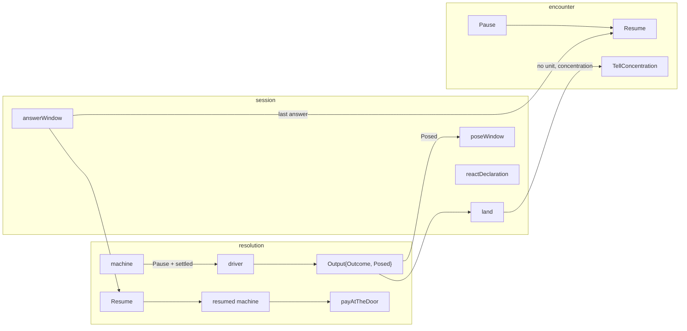

# One pause envelope — walkthrough

For [rpg-toolkit#1965](https://github.com/KirkDiggler/rpg-toolkit/issues/1965)
tier 2 E. The law is [design.md](design.md); the slices are
[slices.md](slices.md).

## What this is

A rules machine that stops to ask somebody a question hands back **one
`resolution.Pause`**: what kind of question it is, the question, what taking it
costs, and the machine's frozen state. Everything that already happened rides
**`Output.Outcome`** and lands at once, so the table never waits on a beat that
already happened. The encounter holds **one `Pause`** and finishes it with
**one `Resume`**. The session stores **one window payload**, poses it in one
function, answers it in one dispatch, and offers it in one declaration. A taken
offer is charged once, at the resume, through **resolution's one door**, at the
price the pause stated. Concentration that ends with no outcome to ride on is
told by **`Encounter.TellConcentration`** instead of being dropped.

## Component shape

## Ownership and contracts

| Component | Owns | Input → output |
|---|---|---|
| resolution machines | Whether to stop, what settled before stopping, the frozen state | → `Pause` with unexported `settled` |
| resolution `Resume` | The one way back, the answer check, the version check | `ResumeInput{Pause, Answer, Roller}` → `Machine` |
| resolution `reactionCost` | The price of a reaction | payer, pool → `*Cost` |
| resolution `payAtTheDoor` | Charging a payer, character or monster | `*Cost`, cast → error |
| dnd5e `Monster.SpendReaction` | A monster's one reaction | → `ErrReactionSpent` or nil |
| encounter `Pause` / `Resume` | Which walk is held and finishing it | → `ResumeOutput` |
| encounter `TellConcentration` | Concentration beats with no causing outcome | `TellConcentrationInput` → `RecordOutput` |
| session `pendingWindow` | The one stored window | `Version · Kind · Audience · Pause · Story` |
| session `answerWindow` | Answering any window | `Answer` → `ReactOutput` |
| rpg-api React handler | The wire's two values | `STRIKE`/`HOLD` + option → `Take`/`Decline` |

The refusals, one per boundary:

- **Resolution refuses a frozen header it did not write** (`ErrStalePause`)
  before loading or charging anything.
- **Resolution refuses an answer the offer did not ask for** (`ErrNotOffered`).
  The zero `Answer` is neither take nor decline.
- **Resolution never accepts a price from the host.** It charges the cost
  frozen with the pause; a disagreeing `Pause.Cost` is `ErrBadFrozen`.
- **The door refuses a monster price that is not one reaction** (`ErrNoPayer`).
- **The encounter refuses a pause version it did not write** and an empty
  concentration tell.
- **The session refuses a window payload of another version** and a landing
  handed concentration with nothing to tell it.
- **rpg-api refuses HOLD with an option** as `INVALID_ARGUMENT`.

## Walk one thing through

A goblin boss's multiattack on its own turn. The first swing hits the cleric who
holds Fog Cloud, who fails concentration. The hit triggers the cleric's
retaliation offer.

1. The encounter drives the goblin and calls the session's striker. The striker
   builds the multiattack machine and resolves it.
2. The first swing hits. Damage applies, the cleric's check fails, the hold
   ends. The post-hit chain offers the cleric a retaliation.
3. The strike machine returns `Pause{Kind: PausePostHit, Cost: one reaction}`
   with its settled hit. The sequence machine wraps the frozen strike as its
   `Inner`, and its settled report is a `SequenceOutcome{From: 0}` holding that
   swing. Resolve attributes the cleric's check and break to that step.
4. The striker lands one landing. The record step tells the swing's struck,
   saved and concentration-ended beats. The area step closes the fog. The
   window step poses one `pendingWindow` with the pause and an attack story.
5. The cleric's dock shows one react row: the retaliation's name, its choices,
   one reaction as its cost.
6. The cleric takes it. `answerWindow` resumes with `Take("option")`. The
   resumed strike pays the frozen cost at the door, runs the retaliation and
   reports `Continued`. The sequence swings again and reports step 1.
7. The landing tells the retaliation, then the second swing. Nothing from step 0
   is told again. The last answer calls `Encounter.Resume`, which finishes the
   goblin's turn.

## Separations that look like one thing

| Query | Source of truth |
|---|---|
| What happened before the pause | `Output.Outcome` of the paused call |
| What the pause asks | `Pause.Ask` |
| What taking it costs | `Pause.Cost`, frozen inside `Pause.Frozen` |
| What the session needs to tell the resume | `pendingWindow.Story` |
| Which walk the encounter holds | `EncounterData.Pause` |

**A pause kind is not a machine.** `Kind` is the innermost question. A post-hit
pause inside a multiattack and one inside an opportunity attack are both
`PausePostHit`. Which machines wrap it is the frozen header's
business.

**A cast is one unit; a sequence is many.** A multiattack's swings are each told
when they settle. A cast is told once, when it finishes, with every target. Its
board changes still land at the pause.

**A continued strike is not a second strike.** A `Continued` outcome carries the
retaliation and identity only. A record function that tells a hit off it is
telling the hit twice.

## Trade-offs

| Decision | Benefit | Cost / boundary | Not taken |
|---|---|---|---|
| `Output.Outcome` set on a pause | One record function per verb for both shapes | A caller can no longer read nil as "paused" | A separate `Settled` field beside `Outcome` |
| Resume reports only what it settled | No told-count bookkeeping in the session | `SequenceOutcome.From` and `StrikeOutcome.Continued` | The session counting recorded steps |
| Opportunity asks ride `MovementOutcome.Asked` | Parallel asks stay parallel; the price is resolution's | One more outcome field | Posing one reactor at a time through `Posed` |
| Charge where the reaction is taken | A re-fold that yields no swing charges nothing | Four door sites inside machines | Charging at the runner's door before the first step |
| A dnd5e slice first | The door can charge a monster | One more PR in the wave | Keeping the `SpendRequestedTopic` publish |
| Typed `Pause` stored in the window | Afford reads the question without a second copy | The window payload depends on resolution's JSON | Opaque pause bytes plus duplicated fields |
| No proto change | No client churn | The wire still says STRIKE and HOLD | `TAKE`/`DECLINE` values with the old ones deprecated |

## Edges

- A cast paused on a later target tells its earlier targets on the resume:
  design Open 1.
- A run whose window was posed by a build before E is refused at every answer
  and is reset (E5).
- Protection's reaction is charged by the fighting style's own fold, not by an
  offer, and keeps its `SpendRequestedTopic` publish.

## Where a change lands

- **A new reaction offer** (Deflect Missiles, #1992): a chain declares it, the
  machine poses `Pause{Kind, Cost: reactionCost(...)}` at one freeze site, and
  one `resumers` entry finishes it. The session changes nothing.
- **A new paused verb**: one story kind, one record function, one `poseWindow`
  call.
- **A pause in a new container**: the container writes its state with the inner
  pause's `Frozen` as `Inner` and adds one `resumers` entry.

## Source map

| Concern | Where |
|---|---|
| The envelope, offer, answer, header | `rulebooks/dnd5e/resolution/pause.go` |
| The resume table | `rulebooks/dnd5e/resolution/pause.go` `Resume` |
| The price table and the door | `rulebooks/dnd5e/resolution/cost.go` |
| The three strike kinds | `rulebooks/dnd5e/resolution/strike_pose.go`, `attack_roll_reaction.go`, `post_hit_reaction.go` |
| The opportunity ask | `rulebooks/dnd5e/resolution/movement.go`, `movement_pose.go` |
| Monster reaction | `rulebooks/dnd5e/monster/monster.go` `SpendReaction` |
| The encounter's pause | `rulebooks/dnd5e/encounter/pause.go` |
| Concentration with no outcome | `rulebooks/dnd5e/encounter/outcome.go` `TellConcentration` |
| The window | `rulebooks/dnd5e/session/window.go` |
| The dispatch | `rulebooks/dnd5e/session/react.go` `answerWindow` |
| The declaration | `rulebooks/dnd5e/session/afford.go` `reactDeclaration` |
| The landing | `rulebooks/dnd5e/session/land.go` |
| The wire mapping | rpg-api `internal/handlers/dnd5e/session/v1alpha1/react.go` |
