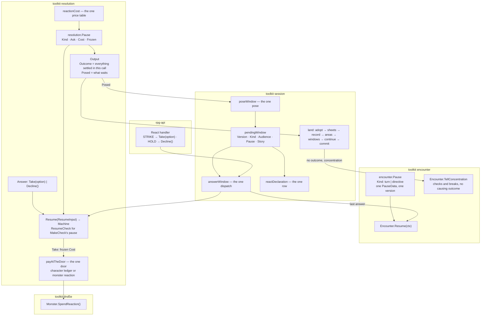

# One pause envelope — output carries the settled, the pause carries the waiting

Tracking: [rpg-toolkit#1965](https://github.com/KirkDiggler/rpg-toolkit/issues/1965) tier 2 E.
Walkthrough: [README.md](README.md). Slices: [slices.md](slices.md).

## Shape



A machine that stops for an answer hands back one `resolution.Pause`. Everything
that settled before it stopped rides `Output.Outcome` and lands at once: beats,
sheets, concentration, areas. The pause carries only the question, its price,
and the machine state needed to finish. A unit of the story is told in exactly
one output, the one in which it settled. The encounter holds one pause and
resumes it with one verb. The session stores one window payload, poses it in one
function and answers it in one dispatch. A taken offer is charged once, at the
resume, through resolution's one door, at the price the pause stated.

### resolution

```go
// pause.go

// PauseVersion is written into every frozen header and checked on every
// resume. It sits above every version an earlier build wrote (the strike wrote
// 3), so no old blob can pass for a new one.
const PauseVersion = 4

// ErrStalePause refuses frozen state this build did not write.
var ErrStalePause = errors.New("resolution: frozen pause was written by another build")

// PauseKind names the question a pause asks. It is the innermost question;
// the containers that hold it (sequence, movement, cast, contest) are machine
// state, never a kind.
type PauseKind string

const (
	PauseBeforeRoll  PauseKind = "before_roll"  // an attack-roll reaction before the d20
	PausePostRoll    PauseKind = "post_roll"    // an offer on an attack's d20
	PausePostHit     PauseKind = "post_hit"     // a reaction to a settled hit
	PauseCheckRoll   PauseKind = "check_roll"   // an offer on a check's d20
	PauseSaveRoll    PauseKind = "save_roll"    // an offer on a saving throw's d20
	PauseOpportunity PauseKind = "opportunity"  // a player asked whether to swing at a mover
)

// Pause is a machine stopped for an answer from outside the process.
type Pause struct {
	Kind   PauseKind `json:"kind"`
	Ask    Ask       `json:"ask"`
	Cost   *Cost     `json:"cost,omitempty"` // the price of Take; nil is free
	Frozen []byte    `json:"frozen"`         // {"v": PauseVersion, "machine": ..., "state": ...}; opaque to every caller
}

func (Pause) isStep() {}

// Ask is the whole question.
type Ask struct {
	Audience    string                       `json:"audience"`
	Offer       Offer                        `json:"offer"`
	Roll        int                          `json:"roll,omitempty"`
	Total       int                          `json:"total,omitempty"`
	Calculation *dnd5eEvents.RollCalculation `json:"calculation,omitempty"`
}

// Offer is the one shape of what is offered, whichever chain declared it.
type Offer struct {
	Ref         core.Ref `json:"ref"`
	Name        string   `json:"name"`
	Description string   `json:"description,omitempty"`
	Die         string   `json:"die,omitempty"`       // set when taking rolls a die
	SourceID    string   `json:"source_id,omitempty"` // whose die it is
	Choices     []Choice `json:"choices,omitempty"`   // empty: Take carries no option
}

// Answer is Take(option) or Decline(). The zero Answer is refused.
type Answer struct {
	given  bool // set by Take and Decline; the zero Answer is refused
	take   bool
	option string
}

func Take(option string) Answer
func Decline() Answer
func (a Answer) Taken() bool
func (a Answer) Option() string

// ResumeInput continues any pause Resolve posed.
type ResumeInput struct {
	Pause  Pause
	Answer Answer
	Roller dice.Roller
}

// Resume returns the machine that finishes a pause. It refuses a frozen
// header whose version is not PauseVersion with ErrStalePause, an Answer the
// offer does not accept with ErrNotOffered, and a nil roller with ErrNoRoller.
func Resume(in *ResumeInput) (Machine, error)

// CheckResumeInput and ResumeCheck answer the one pause MakeCheck poses.
type CheckResumeInput struct {
	Pause     Pause
	Answer    Answer
	Character *character.Data
	Roller    dice.Roller
}

func ResumeCheck(ctx context.Context, in *CheckResumeInput) (*CheckOutput, error)

// cost.go — the one reaction price table.
func reactionCost(payer string, pool coreResources.ResourceKey) *Cost
```

`Output` keeps its fields and changes two contracts:

```go
type Output struct {
	// ...World, DirtyCharacters, DirtyMonsters, OpenedAreas, ClosedAreas,
	// Hooks, ConcentrationChecks, ConcentrationBreaks unchanged...

	// Outcome is every unit this call settled. With Posed set it is what
	// settled before the pause, or nil when nothing did.
	Outcome Outcome

	// Posed is what waits, or nil.
	Posed *Pause
}
```

The outcomes gain what the law needs:

```go
type StrikeOutcome struct {
	// ...unchanged...

	// Continued marks the half of a strike reported after a post-hit pause:
	// AttackerID, TargetID and Retaliation are set and every hit field is
	// zero, because the hit was told in the output that paused.
	Continued bool
}

type SequenceOutcome struct {
	// ...unchanged...

	// From is the declared index of Steps[0]. Zero on an unpaused sequence.
	From int
}

type MovementOutcome struct {
	// ...unchanged...

	// Asked are the players this step asks whether to swing, one pause each,
	// all standing at once.
	Asked []Pause
}

// ReactionAttacks answers which attack a reactor swings, and whether to ask.
type ReactionAnswer int

const (
	ReactionNone  ReactionAnswer = iota // no swing
	ReactionSwing                       // swing now with the definition
	ReactionAsk                         // pose PauseOpportunity with the definition
)

type ReactionAttacks interface {
	AttackFor(reactorID string) (combatActions.Definition, ReactionAnswer)
}
```

`Cost` gains JSON tags `payer_id` and `profile`. `Turn` and `SpellTurn` are
`json:"-"`: a pause's cost never refreshes a turn.

### encounter

```go
// PauseVersion is written on PauseData and checked at load.
const PauseVersion = 1

var ErrStalePause = errors.New("encounter: stored pause was written by another build")

type PauseKind string

const (
	PauseTurn      PauseKind = "turn"      // a driven turn stopped mid-walk
	PauseDirective PauseKind = "directive" // a directed walk held mid-route
)

type PauseData struct {
	Version   int            `json:"version"`
	Kind      PauseKind      `json:"kind"`
	Member    MemberID       `json:"member"`
	From      PositionData   `json:"from"`
	To        PositionData   `json:"to"`
	Remaining []PositionData `json:"remaining"`
	Moved     int            `json:"moved,omitempty"`
	At        uint64         `json:"at,omitempty"`
	Audience  []MemberID     `json:"audience,omitempty"`
	Cause     string         `json:"cause,omitempty"` // required on a directive
	Turn      *TurnPauseData `json:"turn,omitempty"`  // present exactly on a turn
	Forced    bool           `json:"forced,omitempty"` // a directive's only
}

type TurnPauseData struct {
	Round       int            `json:"round"`
	Budget      TurnBudgetData `json:"budget"`
	Intent      int            `json:"intent"`
	Bound       int            `json:"bound"`
	Terminal    bool           `json:"terminal,omitempty"`
	AfterStrike bool           `json:"after_strike,omitempty"`
}

// EncounterData.Pause replaces PausedTurn and HeldDirective.
//   Pause *PauseData `json:"pause,omitempty"`

func (e *Encounter) Paused() bool                // unchanged meaning
func (e *Encounter) PausedMember() MemberID      // unchanged meaning
func (e *Encounter) PauseKind() (PauseKind, bool) // replaces HeldDirective()

type ResumeOutput struct {
	Kind         PauseKind
	Next         MemberID // a turn's
	RoundWrapped bool     // a turn's
	Moved        int      // a directive's
	StoppedBy    string   // a directive's
	Seq          uint64
	IntelDeltas  map[MemberID]*IntelDelta
	Paused       bool
}

// Resume finishes whichever walk is paused. ErrNotPaused when none is.
func (e *Encounter) Resume(ctx context.Context) (*ResumeOutput, error)

type TellConcentrationInput struct {
	Actor  MemberID // whose rule caused them; a current member
	Checks []ConcentrationCheck
	Breaks []ConcentrationBreak
}

// TellConcentration appends the beats Record appends behind an outcome, with
// no outcome. It shares Record's preparation and its post-append consult.
// ErrNilInput; ErrClosed; ErrNoMember or ErrNotMember for the actor;
// ErrInvalidData when both lists are empty; whatever the shared preparation
// refuses.
func (e *Encounter) TellConcentration(in *TellConcentrationInput) (*RecordOutput, error)
```

### session

```go
// Answer is Take(option) or Decline(). The zero Answer is ErrNotOffered.
type Answer struct {
	given  bool // set by Take and Decline; the zero Answer is refused
	take   bool
	option string
}

func Take(option string) Answer
func Decline() Answer

type ReactInput struct {
	Session       string
	Member        string
	DeclarationID string
	Answer        Answer
}

var ErrStalePause = errors.New("window was posed by another build")

// window.go — the one stored payload.
const windowVersion = 1

type pendingWindow struct {
	Version  int                  `json:"version"`
	Kind     resolution.PauseKind `json:"kind"`
	Audience string               `json:"audience"`
	Pause    resolution.Pause     `json:"pause"`
	Story    windowStory          `json:"story"`
}

type storyKind string

const (
	storyAttack storyKind = "attack" // a declared or driven attack, lone or sequence
	storyStep   storyKind = "step"   // an announced step and its reactions
	storyCast   storyKind = "cast"
	storyCheck  storyKind = "check"  // Unlock, Persuade, Intimidate
)

// windowStory is what the session needs to TELL the resume, and nothing
// resolution settled or asks.
type windowStory struct {
	Kind           storyKind                  `json:"kind"`
	Attacker       string                     `json:"attacker,omitempty"`
	Target         string                     `json:"target,omitempty"`
	Definition     combatActions.Definition   `json:"definition,omitempty"`
	Components     []combatActions.Definition `json:"components,omitempty"`
	PresentationID string                     `json:"presentation_id,omitempty"`
	WalkPath       []spatial.Position         `json:"walk_path,omitempty"`
	Door           string                     `json:"door,omitempty"`
	Verb           Verb                       `json:"verb,omitempty"`
	Caster         string                     `json:"caster,omitempty"`
	Spell          SpellRef                   `json:"spell,omitempty"`
	Caught         []CaughtMember             `json:"caught,omitempty"`
}

func poseWindow(scope *writeScope, pause resolution.Pause, story windowStory) error
func thawWindow(raw []byte, audience string) (pendingWindow, error)
func (m *Manager) answerWindow(ctx context.Context, scope *writeScope, w interrupt.Window, a Answer) (*ReactOutput, error)
func reactDeclaration(session, member string, w interrupt.Window) (Declaration, error)
```

## Law

### The envelope

- Output carries everything settled; the pause carries only what waits. Nothing
  is told on resume that had already happened before the pause.
- A told unit is a strike's hit, a strike's retaliation, a sequence step, a
  movement reaction, a cast, a check. Each is reported in exactly one output:
  the one in which it settled. A post-hit pause splits a strike into its hit,
  reported with the pause, and its retaliation, reported by the resume as a
  `Continued` strike.
- A cast is one told unit. Its targets resolved before a pause wait in the
  frozen cast and are told with the cast; what they changed on the board
  (sheets, concentration, areas) lands at the pause.
- `resolution.Pause` is the only suspension. Its `Kind` is the innermost
  question. Every frozen machine writes the one header
  `{"v", "machine", "state"}` with `PauseVersion`; no frozen type carries a kind
  or version of its own.
- `Resume` is the one way back for a pause `Resolve` posed. It dispatches on the
  header's machine name through one table. `ResumeCheck` is the way back for the
  pause `MakeCheck` posed and refuses any other machine.
- A header whose version is not `PauseVersion` is refused with `ErrStalePause`
  before anything loads or is charged.
- Resolve attributes concentration to the units of `Output.Outcome` whether or
  not it posed. A frozen blob is never rewritten after its machine wrote it.

### Offers, answers, price

- An offer reaches a host as one `resolution.Offer` inside one `Ask`. The bus
  payloads that declare offers (`events.Offer`, `AttackRollOffer`,
  `PostHitOffer`) stay the chains' own shapes; the machine converts at the pose.
- An answer is `Take(option)` or `Decline()`. `Take` carries an option exactly
  when the offer lists choices, and the option must be one of them. Every other
  answer is `ErrNotOffered`.
- The price of taking an offer is stated on the pause as `Cost`, from
  `reactionCost`, the one table: one reaction, plus one point of the offer's
  pool when it names one. The price stays resolution's rule.
- A taken offer is charged once, at the resume, by `payAtTheDoor`, at the price
  frozen with the pause. The host never hands a price back.
- `payAtTheDoor` charges a character through its ledger and a monster through
  `Monster.SpendReaction`. A monster price that is anything but one reaction is
  refused with `ErrNoPayer`, as today.
- A reaction a machine takes without asking (a monster's opportunity attack, a
  forced move that spends the mover's reaction) is charged through the same
  door at the moment it is taken.

### The encounter's pause

- An encounter holds at most one `Pause`, a turn or a directive. `Resume`
  finishes it. `Paused` and `PausedMember` answer from it alone.
- `PauseData.Version` other than `PauseVersion` is refused at load with
  encounter's `ErrStalePause`.
- `TellConcentration` tells checks and breaks that have no causing outcome. It
  is not a kind of `Record` and `Record` still requires a kind.

### The session's window

- Every open window stores one `pendingWindow`. Its `Pause` is resolution's,
  stored whole; its `Story` is what the session needs to tell the resume.
  Bookkeeping about what was already told does not exist.
- `poseWindow` is the only writer of a window payload; `answerWindow` the only
  reader that resumes one; `reactDeclaration` the only reader that offers one.
- A payload whose `Version` is not `windowVersion`, or whose frozen header
  resolution refuses, is refused with `session.ErrStalePause`.
- The last answer runs a player's interrupted walk when the window carries one,
  then `Encounter.Resume` when the encounter is paused.

### Landing after E

`land`'s steps and order do not move: adopt, sheets, record, areas, windows,
continuation, commit. What changes is what each site hands it:

- **Record** is the verb's one record function over `out.Outcome`, the same
  whether the output posed or finished. A paused output records what settled; a
  resumed output records what settled after the pause.
- **Areas** always land now. Every area an output changed was caused by a unit
  that output tells, or by concentration it tells through `TellConcentration`.
- **Window** is `poseWindow(out.Posed, story)` exactly when `out.Posed` is set.
- Where an output can carry concentration and no unit (a cast paused on a save
  offer, a turn boundary), `Record` is `TellConcentration`.
- Where no concentration can exist (a strike paused before its roll or on its
  d20, a compelled word, a retaliation paused on its save), `Record` is nil and
  `land` refuses concentration it is handed with `ErrInvalidWorld`.
- No landing drops concentration. The `Untold` arm does not exist.

### What is deleted

- resolution: `Pose`; its `Movement`, `Sequence`, `BeforeRoll`, `SettledStrike`
  fields; `OfferAnswer`, `OfferSpend`, `OfferKeep`, `ReactionUse`,
  `ReactionDecline`; `Ask.Options`; `StrikeResumeInput`, `CastResumeInput`;
  `NewStrikeResumed`, `NewAttackResumed`, `NewMovementResumed`,
  `NewCastResumed`; `frozenStrike`'s `PostHitPhase` and `BeforeRoll` field
  branching (three kinds instead); the seven frozen types' `Kind` and `Version`
  fields and their constants; the two frozen-outcome rewrites in `Resolve`; the
  two hard-coded reaction `SpendProfile` literals; the `SpendRequestedTopic`
  publish in the forced move; the `ReactionTakenTopic` publish in the movement
  machine.
- dnd5e: `ReactionTakenTopic`, `ReactionTakenEvent`, and the opportunity attack
  condition's `onReactionTaken` subscription.
- encounter: `PausedTurnData`, `HeldDirectiveData`, `pausedTurn`,
  `heldDirective`, `EncounterData.PausedTurn`, `EncounterData.HeldDirective`,
  `HeldDirective()`, `ResumeTurn`, `ResumeDirective`, `ResumeTurnOutput`.
- session: `ReactChoice`, `ReactStrike`, `ReactHold`, `ReactInput.Choice`,
  `ReactInput.Option`; `windowPayload`, `postRollWindowPayload`,
  `checkOfferWindowPayload`, `castOfferWindowPayload`,
  `pendingAttackWindowPayload`, `postHitWindowPayload` with their kind
  constants, marshal and thaw functions, and `windowKindOf`; `heldAreas`,
  `holdAreas`, `landHeldAreas`, `landToldAreas`, `areaLanding` and
  `landing.Areas`; `landing.Untold`; `HitRecorded`, `RecordedSteps`,
  `RecordedReactions`; the five per-kind answer functions and five per-kind
  declaration functions; `askedReactor` and the step's own window pose.
- rpg-api: the `sdk.ReactStrike` / `sdk.ReactHold` mapping.

### Proof

- A post-hit reaction inside a multiattack: the paused output's `Outcome` is the
  sequence with the settled swing, whose `saved` and `concentration_ended` beats
  are told at the pause; the area that swing ended closes at the pause; the
  resume tells only the retaliation and the later swings.
- An opportunity attack: the step's output asks each player reactor with one
  `PauseOpportunity` each, all standing at once; Take charges the reactor's
  reaction through the door; Decline charges nothing.
- A save inside a cast: the cast pauses on the save offer, the resume tells the
  cast once with every target.
- A cast that ends its caster's earlier concentration and then pauses tells that
  break through `TellConcentration` at the pause, and the old area closes then.

### The wire

- No proto changes. `ReactRequest.choice` is already a two-value answer and
  `ReactRequest.option` already carries the chosen option. rpg-api maps
  `REACT_CHOICE_STRIKE` to `Take(option)` and `REACT_CHOICE_HOLD` to `Decline()`.
- No web change. The web already sends exactly those two values and an option.
- A react row's `cost` is filled from the pause's `Cost` through the existing
  cost components. The field exists.

## Rulings

| ID | status | scope | ruled by | date |
|---|---|---|---|---|
| E1 | settled | One `resolution.Pause{Kind, Ask, Cost, Frozen}` with one version constant. The settled strike, sequence and movement fields leave the pose and live on `Output` with the other settled facts. `frozenStrike`'s three phases become three kinds. Session's `held_areas` and the split-area landing are deleted, not migrated. | KirkDiggler | 2026-10-09 |
| E2 | settled | Encounter's `PausedTurn` and `HeldDirective` become one `Pause` with a kind and one `Resume`. Session keeps one pending-window payload with kind and version, and one dispatch. | KirkDiggler | 2026-10-09 |
| E3 | settled | The offer states its price from the one cost table; the encounter spends it at resume through one door. The `SpendRequestedTopic` and `ReactionTakenTopic` reaction-billing paths go. The price stays resolution's rule. | KirkDiggler | 2026-10-09 |
| E4 | settled | One `Offer` type and one `Answer{Take option \| Decline}`. `ReactStrike`/`ReactHold` retire. Where this reaches the React proto, the change is additive with `[deprecated = true]`. | KirkDiggler | 2026-10-09 |
| E5 | settled | Old frozen blobs are refused with a sentinel. A table mid-reaction across the deploy loses that window; pre-release, accepted. | KirkDiggler | 2026-10-09 |
| E6 | settled | A dedicated encounter verb tells concentration checks and breaks with no causing outcome, sharing `Record`'s preparation. Not a kind-less `Record`. First case: a cast that ends the caster's own earlier concentration, dropped by name today. | KirkDiggler | 2026-10-09 |
| E8 | settled | The opportunity ask stops the step. The mover's step has not settled when the ask is posed; it lands on the resume after every asked reactor answered and the swings settled. Reach is measured in the live (pre-step) world; nothing is measured at a remembered cell. Session never lands the step at an opportunity pause; `MovementOutcome.From/To` on the resumed output is its one landing. | KirkDiggler | 2026-10-10 |
| E7 | settled | Deflect Missiles (#1992) is E's first consumer after the wave, not an E slice. The envelope's proof cases already exist: post-hit inside a multiattack, an opportunity attack, a save inside a cast. | KirkDiggler | 2026-10-09 |

What each ruling makes true here:

- **E1.** `Pose` becomes `Pause`. `Output.Outcome` is no longer nil on a pause.
  `PauseBeforeRoll`, `PausePostRoll` and `PausePostHit` replace the three
  phases. The split landing and `held_areas` are deleted with no stored-payload
  migration.
- **E2.** `EncounterData.Pause` and `Encounter.Resume` replace two fields and
  two verbs. The session's six payloads and five answer paths become
  `pendingWindow` and `answerWindow`.
- **E3.** `reactionCost` is the table; `Pause.Cost` states it; `payAtTheDoor` is
  the door. The resumed interaction spends the frozen price; the encounter holds
  no economy, so the ruling's "encounter spends" is read as the resume's own
  charge. Charging a monster's reaction through the door needs
  `Monster.SpendReaction` in dnd5e, so the wave opens with a dnd5e slice before
  encounter.
- **E4.** `resolution.Offer` and `resolution.Answer` are the one pair;
  `session.Answer` mirrors the answer at the session boundary. The React proto
  needs nothing: its enum is already take-or-decline and it already carries the
  option, so no field is added or deprecated.
- **E5.** Resolution refuses a stale header with `ErrStalePause`; session
  refuses a stale payload with its own `ErrStalePause`. The encounter's pause is
  posed with the session's windows, so a stale window freezes the run and the
  run is reset. Pre-release, accepted.
- **E6.** `TellConcentration` replaces the `Untold` arm at the two sites that
  can carry concentration with no unit.
- **E8.** `PauseOpportunity` is posed before the step lands. The paused
  `MovementOutcome` reports no step; the resumed one reports `From`/`To` once.
  Found by the resolution gate (#1998): a Take resumed after a landed step
  measured reach against a mover already gone.
- **E7.** No Deflect Missiles slice. The four proof cases above gate the wave.

## Open

None. The cast's told unit was ruled on the design PR (2026-10-10): a cast is
one told unit; nothing is processed until every save is in; its board changes
land at each pause. The ruling covers a monster's multi-target save or a PvP
cast when one arrives.
