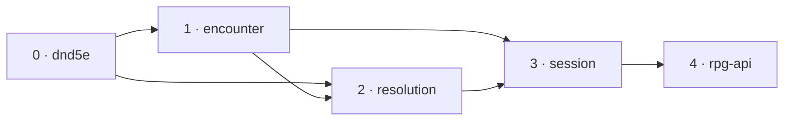

# One pause envelope — slices

A working document beside [design.md](design.md): slice order, the task list a
worker executes per module, what done means, and what is deleted. Every
`file:line` is at rpg-toolkit `origin/main` `423e7827` (dnd5e v0.207.0 ·
encounter v0.120.0 · resolution v0.68.0 · session v0.126.0) and rpg-api
`origin/main` `ed4db4f6`. Toolkit paths are relative to `rulebooks/dnd5e/`.
Line numbers drift as a slice edits a file; the symbol beside each line is the
anchor.

Develop outside-in, merge inside-out. One nearest-`go.mod` module per toolkit
PR. Each consumer builds on its provider's gate-approved branch head, never a
draft, and pins the tag once the provider merges. The squash title's prefix
picks the tag bump. The wave is walked once on the local stack before anything
merges. No protos slice and no web slice exist (design, "The wire").

## Order



| # | Module | PR title |
|---|---|---|
| 0 | `rulebooks/dnd5e` | `feat(dnd5e)!: monster reaction spend, reaction trigger name; delete ReactionTaken (toolkit#1965 tier 2 E)` |
| 1 | `rulebooks/dnd5e/encounter` | `feat(encounter)!: one Pause, one Resume, TellConcentration (toolkit#1965 tier 2 E)` |
| 2 | `rulebooks/dnd5e/resolution` | `feat(resolution)!: one Pause envelope, one Offer, one Answer, one door (toolkit#1965 tier 2 E)` |
| 3 | `rulebooks/dnd5e/session` | `feat(session)!: one window, one dispatch, settled output lands at the pause (toolkit#1965 tier 2 E)` |
| 4 | rpg-api | `feat(session): React answers Take or Decline (toolkit#1965 tier 2 E)` |

Session is one PR. Every session change is forced by the resolution and
encounter APIs it adopts, and a partial adoption does not compile.

## 0. toolkit dnd5e

### Types

```go
// monster/monster.go
var ErrReactionSpent = errors.New("monster: reaction already spent")

// SpendReaction spends this monster's one reaction. It refuses an already
// spent one with ErrReactionSpent and marks the sheet dirty on success.
func (m *Monster) SpendReaction() error

// events/events.go — ReactionTriggerEvent gains the offerer's display name.
type ReactionTriggerEvent struct {
	// ...unchanged...
	Name string // the condition's own display name, e.g. "Opportunity Attack"
}
```

### Tasks

1. `monster/monster.go`: add `ErrReactionSpent` beside the package's other
   sentinels and `SpendReaction` beside `CanReact` (`monster.go:283`). Its doc
   names the resolution door as its caller.
2. `conditions/opportunity_attack.go`: set `Name: "Opportunity Attack"` where
   the condition publishes its `ReactionTriggerEvent` (`:304`). Delete the
   `ReactionTakenTopic` subscription (`opportunity_attack.go:186-192`) and
   `onReactionTaken` (`:336-367`). Rewrite the offer/bill comment at `:332` to
   say the machine bills through resolution's door.
3. `events/events.go`: delete `ReactionTakenTopic` (`:1160-1165`) and
   `ReactionTakenEvent`.
4. Leave `SpendRequestedTopic`, the character keeper's subscription and the
   monster keeper's subscription (`monster/load.go:249`) in place: Protection
   still publishes one, and the monster row stops being reached only once
   slice 2 merges.

### Done when

- `TestSpendReactionSpendsOnceAndMarksDirty`: first call nil and `CanReact()`
  false and the sheet dirty; second call `ErrReactionSpent`.
- `TestOpportunityTriggerCarriesItsName`: the trigger published for a step out
  of reach carries `Name == "Opportunity Attack"`.
- `grep -rn ReactionTaken rulebooks/dnd5e --include='*.go'` finds nothing in
  this module.
- `go test ./... -count=1`, `golangci-lint run` green.

### Deletion mutants

- Deleting the `reactionSpent = true` line in `SpendReaction` fails the first
  test.
- Deleting the `Name` assignment fails the second.

## 1. toolkit encounter

### Types

As in [design.md](design.md) "encounter": `PauseVersion`, `ErrStalePause`,
`PauseKind` with `PauseTurn` and `PauseDirective`, `PauseData`,
`TurnPauseData`, `ResumeOutput`, `Resume`, `PauseKind()`,
`TellConcentrationInput`, `TellConcentration`.

### Tasks, in this order

1. `pause.go`: replace `pausedTurn` (`pause.go:105-120`) and `heldDirective`
   (`held.go:41-51`) with one unexported `pause{kind, member, from, to,
   remaining, moved, at, audience, cause, turn *turnPause, forced}`. Write
   `pauseDataFrom` and `pauseFrom` replacing `pausedTurnDataFrom`
   (`pause.go:194`), `heldDirectiveDataFrom` (`held.go:103`) and
   `heldDirectiveFrom` (`held.go:133`).
2. `validatePause` replaces `validatePausedTurn` and `validateHeldDirective`
   (`held.go:168`), refusing in this order: `Version != PauseVersion`
   (`ErrStalePause`); unknown `Kind` (`ErrInvalidData`); `Turn` absent on a
   turn or present on a directive (`ErrInvalidData`); `Forced` on a turn
   (`ErrInvalidData`); `Cause` not a ref on a directive (`ErrInvalidData`);
   then every check the two old validators made.
3. `data.go`: replace `PausedTurn` (`data.go:118-130`) and `HeldDirective`
   (`:132-141`) with `Pause *PauseData json:"pause,omitempty"`. `ToData`
   (`:1983-1985`) writes one field. `LoadEncounter` (`:2737-2741`) calls
   `validatePause` and keeps the "pause and outcome are exclusive" refusal.
4. `Paused()` and `PausedMember()` (`pause.go:372-385`) read `e.pause`. Delete
   `HeldDirective()` (`held.go:205`); add `PauseKind() (PauseKind, bool)`.
5. `Resume(ctx)` dispatches on `e.pause.kind` to the bodies of `ResumeTurn`
   (`pause.go:500`) and `ResumeDirective` (`held.go:237`), kept as unexported
   `resumeTurn` and `resumeDirective`, and returns `ResumeOutput` with the
   fields of the arm that ran. Delete the exported pair and
   `ResumeTurnOutput`.
6. Every writer of `e.pausedTurn` or `e.heldDirective` sets `e.pause` with its
   kind. The compiler lists them.
7. `outcome.go`: add `TellConcentration` after `Record` (`outcome.go:713`).
   Factor `Record`'s append of the follow-up train and its post-append consult
   into one unexported helper both call, so the two verbs cannot drift. The
   preparation is `prepareConcentrationChecks` then `prepareConcentrationBreaks`
   (`cast.go:718`, `:775`) with verb name `"tell concentration"`.
8. Tests: rewrite every test that builds `PausedTurnData` or
   `HeldDirectiveData` to build `PauseData`, and every call of `ResumeTurn` /
   `ResumeDirective` to `Resume`.

### Done when

- `TestAPausedTurnRoundTripsThroughOnePause` and
  `TestAHeldDirectiveRoundTripsThroughOnePause`: `ToData` then `LoadEncounter`
  then `Resume` finishes the walk exactly as the old verbs did; existing walk
  assertions unchanged.
- `TestAStalePauseVersionIsRefused`: `Version: 0` and `Version: 2` refuse with
  `ErrStalePause`.
- `TestAPauseWithTheWrongArmIsRefused`: a turn without `Turn`, a directive with
  `Turn`, a turn with `Forced` each refuse with `ErrInvalidData`.
- `TestResumeWithNothingPausedIsRefused`: `ErrNotPaused`.
- `TestTellConcentrationAppendsTheTrainRecordWould`: the same checks and breaks
  through `Record` (with a strike) and through `TellConcentration` produce the
  same follow-up beats in the same order, and `FollowUpSeqs` matches.
- `TestTellConcentrationRefusesAnEmptyTell`: no checks and no breaks is
  `ErrInvalidData`; a closed encounter is `ErrClosed`; an unknown actor is
  `ErrNotMember`.
- `grep -rn 'PausedTurn\|HeldDirective\|ResumeTurn\|ResumeDirective' rulebooks/dnd5e/encounter`
  finds nothing.
- `go test ./... -count=1`, `golangci-lint run` green.

### Deletion mutants

- `Resume`'s two arms: deleting either fails its round-trip test.
- `validatePause`'s five new refusals: deleting any one fails its named test.
- The shared train helper's call in `TellConcentration`: deleting it fails
  `TestTellConcentrationAppendsTheTrainRecordWould`.

## 2. toolkit resolution

Pins dnd5e from slice 0 and encounter from slice 1.

### Types

As in [design.md](design.md) "resolution", plus these unexported pieces:

```go
// pause.go
type frozenHeader struct {
	V       int             `json:"v"`
	Machine string          `json:"machine"`
	Kind    PauseKind       `json:"kind"`
	State   json.RawMessage `json:"state"`
}

func writeFrozen(machine string, kind PauseKind, state any) ([]byte, error)
func readFrozen(raw []byte) (frozenHeader, error) // ErrStalePause on V != PauseVersion; ErrBadFrozen otherwise

// The one resume table: header machine name to its resumer.
var resumers = map[string]func(h frozenHeader, in *ResumeInput) (Machine, error){
	"strike.before_roll": resumeBeforeRoll,
	"strike.post_roll":   resumePostRoll,
	"strike.post_hit":    resumePostHit,
	"sequence":           resumeSequence,
	"movement":           resumeMovement,
	"opportunity":        resumeOpportunity,
	"cast":               resumeCast,
}

// Pause carries what settled before it from the machine to the driver.
// Unexported, never marshalled.
//   settled Outcome
```

### Tasks, in this order

1. **The envelope.** Create `pause.go` with `PauseKind` and its six constants,
   `Pause`, `Ask` and `Choice` (moved from `step.go:106-158`), `Offer`,
   `Answer`, `Take`, `Decline`, `Taken`, `Option`, `PauseVersion`,
   `frozenHeader`, `writeFrozen`, `readFrozen`. Add `ErrStalePause` to
   `errors.go`. Add `func (a Answer) accepts(o Offer) error`: zero Answer,
   Decline with an option, Take with an option when `Choices` is empty, Take
   without one or with an unlisted one when `Choices` is not empty, each
   `ErrNotOffered`.
2. **Delete `Pose`** (`step.go:168-185`). The driver's `case Pose` becomes
   `case Pause`; it copies `pause.settled` to `Output.Outcome` and the pause to
   `Output.Posed`. Rewrite `Output.Outcome`'s and `Output.Posed`'s docs
   (`resolve.go:188-204`) to the design's text.
3. **The price table and the door.** `cost.go`: add `reactionCost(payer,
   pool)` returning `&Cost{PayerID: payer, Profile: &combat.SpendProfile{Slots:
   {ActionReaction: 1}, Pools: {pool: 1}}}` with `Pools` omitted when `pool` is
   empty. Add JSON tags to `Cost`. `ledgerFor` (`cost.go:226`) becomes
   `payerFor` returning either a character ledger or a monster; `payAtTheDoor`
   (`cost.go:154`) charges a monster by `SpendReaction` when the profile is
   exactly one reaction, wraps `ErrReactionSpent` as `ErrCannotPay`, and
   refuses any other monster profile with `ErrNoPayer`. `Turn` refresh stays
   character-only.
4. **The three strike kinds.** Split `frozenStrike` (`strike_pose.go:61`) into
   `frozenBeforeRoll{AttackerID, TargetID, Opportunity, Definition, Folded,
   Outcome, Offer events.AttackRollOffer, Cost}`, `frozenPostRoll{AttackerID,
   TargetID, Opportunity, Definition, Folded, Roll, Total, Calculation, Offer
   events.Offer}` and `frozenPostHit{AttackerID, TargetID, Opportunity,
   Definition, Outcome, Offer events.PostHitOffer, Cost, Retaliation
   json.RawMessage}`. `NewStrikeResumed`'s three branches
   (`strike_pose.go:167-235`) become `resumeBeforeRoll`, `resumePostRoll`,
   `resumePostHit`, each keeping exactly its branch's validation. Delete
   `frozenStrikeKind` and `frozenStrikeVersion`.
5. **The eleven freeze sites** each write through `writeFrozen` and return a
   `Pause`:

   | site | machine | Kind | Cost | settled |
   |---|---|---|---|---|
   | `attack_roll_reaction.go:17` `poseBeforeRoll` | `strike.before_roll` | `PauseBeforeRoll` | `reactionCost(offer.ReactorID, offer.ResourceKey)` | nil |
   | `strike_pose.go:269` `pose` | `strike.post_roll` | `PausePostRoll` | nil | nil |
   | `strike_pose.go:400` `posePostHit` | `strike.post_hit` | `PausePostHit` | `reactionCost(offer.ReactorID, offer.ResourceKey)` | `m.reported()` |
   | `sequence_pose.go:30` `freezeSequence` | `sequence` | inner's | inner's | the sequence settled in this call |
   | `movement_pose.go:29` `freezeMovement` | `movement` | inner's | inner's | the reactions settled in this call |
   | `cast_pose.go:77` | `cast` | inner's | inner's | nil (a cast is one unit) |
   | `contest_pose.go:64` | `contest` | inner's | inner's | nil |
   | `save_pose.go:133` | `save` | `PauseSaveRoll` | nil | nil |
   | `check_pose.go:86` | `check` | `PauseCheckRoll` | nil | nil |
   | `post_hit_reaction.go:87` retaliation `onPose` | `strike.post_hit` (Retaliation set) | inner's | nil | nil |
   | new, `movement.go` opportunity ask | `opportunity` | `PauseOpportunity` | `reactionCost(reactor, "")` | n/a, rides `Asked` |

   A container's state stores the inner pause's `Frozen` bytes whole as
   `Inner`. Every frozen type loses its `Kind` and `Version` fields and their
   constants (`sequence_pose.go:11`, `movement_pose.go:11`, `cast_pose.go:18-21`,
   `contest_pose.go:22`, `save_pose.go:21`, `check_pose.go:23`). The pose
   converts the bus payload into `resolution.Offer`: `events.Offer` gives
   `Die` and `SourceID`; `AttackRollOffer` gives one choice `{ID: "use",
   Label: "Use " + Name}`; `PostHitOffer` gives its options as choices.
6. **Settled, not frozen.** `frozenSequence` (`sequence_pose.go:17`) drops
   `Outcome` and keeps `Index`; the resumed machine reports `SequenceOutcome`
   with `From: Index` and only the steps it settles, the paused step first as a
   `Continued` strike when the pause was post-hit. `frozenMovement`
   (`movement_pose.go:13`) replaces `Outcome` with `Mover`, `MoverKind`,
   `From`, `To`, `ForcedBy`; the resumed machine reports only the reactions it
   settles. A lone post-hit resume reports `StrikeOutcome{Continued: true,
   AttackerID, TargetID, Retaliation}`. Delete the two frozen-outcome rewrites
   in `Resolve` (`resolve.go:420-441`, `:451-471`): `attributeToSteps` and
   `attributeToReactions` (`concentration.go:404`, `:464`) run on
   `out.Outcome` whether or not the run posed.
7. **One resume.** `Resume(in)`: nil input `ErrNilInput`; nil roller
   `ErrNoRoller`; `readFrozen`; header `Kind != in.Pause.Kind` `ErrBadFrozen`;
   `in.Answer.accepts(in.Pause.Ask.Offer)`; unknown machine `ErrBadFrozen`;
   then `resumers[h.Machine]`. A frozen `Cost` that differs from
   `in.Pause.Cost` is `ErrBadFrozen`. Delete `NewStrikeResumed`,
   `NewAttackResumed`, `NewMovementResumed`, `NewCastResumed`,
   `StrikeResumeInput`, `CastResumeInput`, `OfferAnswer`, `OfferSpend`,
   `OfferKeep`, `ReactionUse`, `ReactionDecline`. Containers resume their
   `Inner` through the same table. `newContestResumed` and
   `newSaveResumedFromJSON` take an `Answer`.
8. **`ResumeCheck`** (`check_pose.go:148`) takes `CheckResumeInput{Pause,
   Answer, Character, Roller}` and refuses a header whose machine is not
   `check` with `ErrBadFrozen`. `CheckOutput.Posed` (`check.go:123`) is
   `*Pause`.
9. **Charge where taken.** `resumeBeforeRoll` (`attack_roll_reaction.go:35`)
   and the retaliation pay step (`post_hit_reaction.go:69`) call
   `payAtTheDoor` with the frozen `Cost`, not a literal. The forced move
   (`contest.go:839`) calls `payAtTheDoor(ctx, reactionCost(targetID, ""),
   m.cast)` in place of the `SpendRequestedTopic` publish. The movement bill
   (`movement.go:427-431`) calls `payAtTheDoor(ctx, reactionCost(reactor, ""),
   m.cast)` in place of the `ReactionTakenTopic` publish; a resumed
   opportunity bills its frozen `Cost` the same way. Four door sites.
10. **The opportunity ask.** `ReactionAttacks.AttackFor` returns
    `(combatActions.Definition, ReactionAnswer)`. On `ReactionAsk` the movement
    machine appends to `MovementOutcome.Asked` a `Pause{Kind:
    PauseOpportunity, Ask: {Audience: reactor, Offer: {Ref:
    trigger.ConditionRef, Name: trigger.Name}}, Cost: reactionCost(reactor,
    ""), Frozen: writeFrozen("opportunity", PauseOpportunity,
    frozenOpportunity{Mover, MoverKind, From, To, ForcedBy, Reactor,
    Definition})}` and carries on as if declined. `resumeOpportunity` with Take
    returns a movement machine over the frozen step whose reactions answer
    `ReactionSwing` for the frozen reactor and `ReactionNone` for everyone
    else; with Decline it returns a machine that finishes with
    `MovementOutcome{Mover, From, To}` and charges nothing. `ReactionOutcome`
    gains `ConditionName` from the trigger.
11. `StrikeOutcome.Continued`, `SequenceOutcome.From`, `MovementOutcome.Asked`
    as in the design.
12. Tests: every test answering with `OfferSpend`, `OfferKeep`, `ReactionUse`
    or `ReactionDecline` answers with `Take` or `Decline`; every test reading
    `Posed.Sequence`, `Posed.Movement`, `Posed.SettledStrike` or
    `Posed.BeforeRoll` reads `out.Outcome` or `Posed.Kind`.

### Done when

- `TestEveryPauseWritesOneHeader`: drive each of the eleven freeze sites; each
  `Posed.Frozen` decodes to `V == PauseVersion` and the machine and kind in the
  table above.
- `TestAStaleHeaderIsRefusedBeforeAnythingLoads`: a header with `v: 3`, and a
  verbatim pre-E `frozenStrike` blob, each refuse with `ErrStalePause` from
  `Resume`; no sheet is dirty.
- `TestAnAnswerTheOfferDoesNotAcceptIsRefused`: the zero Answer, Decline with
  an option, Take with an unlisted option, Take with an option on a choiceless
  offer each `ErrNotOffered`.
- `TestAPostHitInsideASequenceReportsTheSettledSwingWithThePause`: a two-swing
  multiattack whose first swing hits a concentrating caster who fails, then
  poses post-hit: `out.Outcome` is a `SequenceOutcome` with `From == 0` and one
  step carrying the hit and that step's `ConcentrationChecks` and
  `ConcentrationBreaks`; `out.ClosedAreas` names the caster.
- `TestTheResumeReportsOnlyWhatSettledAfterThePause`: resuming that pause with
  `Decline()` reports a `SequenceOutcome` with `From == 0`, `Steps[0].Strike.Continued`
  true with every hit field zero, then the second swing.
- `TestAPostHitInsideAMovementReportsTheSettledReactionWithThePause`: the same
  for an opportunity attack whose hit poses post-hit.
- `TestAnOpportunityAskIsAPauseWithItsPrice`: a monster stepping out of two
  players' reach, with `ReactionAsk` for both, finishes with `Asked` holding two
  `PauseOpportunity` pauses, each `Cost` one reaction, `Offer.Name ==
  "Opportunity Attack"`.
- `TestTakingAnOpportunitySpendsTheReactorsReaction` and
  `TestDecliningAnOpportunitySpendsNothing`.
- `TestAMonstersOpportunityAttackSpendsItsReactionAtTheDoor` and
  `TestAForcedMoveSpendsAMonstersReactionAtTheDoor`: the monster's
  `CanReact()` is false after, through `SpendReaction`.
- `TestTheDoorRefusesAMonsterPriceThatIsNotOneReaction`: `ErrNoPayer`.
- `TestTakingAPostHitReactionChargesTheFrozenPrice`: reaction slot and pool
  point spent once; a `Pause.Cost` edited before resume is `ErrBadFrozen`.
- `TestASaveOfferInsideACastResumesTheCast`: existing cast-offer assertions
  hold through `Resume`.
- `grep -rn 'Pose\b\|OfferSpend\|OfferKeep\|ReactionUse\|ReactionDecline\|SpendRequestedTopic\|ReactionTakenTopic\|Resumed(' rulebooks/dnd5e/resolution --include='*.go'`
  finds nothing outside tests' own names.
- `go test ./... -count=1`, `golangci-lint run` green.

### Deletion mutants

- Each of the eleven `writeFrozen` calls: replacing it with a bare
  `json.Marshal` of the state fails `TestEveryPauseWritesOneHeader`.
- `readFrozen`'s version check: deleting it fails
  `TestAStaleHeaderIsRefusedBeforeAnythingLoads`.
- Each of the four door sites: deleting the `payAtTheDoor` call fails its
  charge test.
- Each of the three `settled` assignments (post-hit, sequence, movement):
  deleting it fails its "reports the settled" test.
- The `accepts` call in `Resume`: deleting it fails the answer test.
- Each of the seven `resumers` entries: deleting it fails the proof test that
  resumes that machine.

## 3. toolkit session

Pins encounter from slice 1 and resolution from slice 2.

### Types

As in [design.md](design.md) "session": `Answer`, `Take`, `Decline`,
`ReactInput`, `ErrStalePause`, `windowVersion`, `pendingWindow`, `storyKind`,
`windowStory`, `poseWindow`, `thawWindow`, `answerWindow`,
`reactDeclaration`.

### Tasks, in this order

1. **The answer.** `react.go:15-61`: delete `ReactChoice`, `ReactStrike`,
   `ReactHold`, `ReactInput.Choice`, `ReactInput.Option`; add `Answer`,
   `Take`, `Decline`, `ReactInput.Answer`. `React` refuses the zero Answer with
   `ErrNotOffered` before loading anything. Add `ErrStalePause` to `errors.go`
   and translate `resolution.ErrStalePause` and `encounter.ErrStalePause` to it
   in `translateResolution` and `translate`.
2. **The window.** Rewrite `window.go`: delete `windowKindReaction`,
   `windowKindPostRoll`, `windowKindCheckOffer`, `windowKindCastOffer`
   (`window.go:36-59`), `windowPayload`, `postRollWindowPayload`,
   `checkOfferWindowPayload`, `castOfferWindowPayload` and their marshal and
   thaw functions (`:71-460`), `windowKindOf` (`:381`), `poseableReaction`
   (`:466`); delete `windowKindPendingAttack`, `pendingAttackWindowPayload`,
   `heldAreas`, `thawPendingAttackPayload`, `posePendingAttackWindow`
   (`react_pending_attack.go:19-100`) and `windowKindPostHit`,
   `postHitWindowPayload`, `thawPostHitPayload`, `posePostHitWindow`
   (`react_post_hit.go:17-73`). Add `pendingWindow`, `windowStory`,
   `storyKind`, `poseWindow`, `thawWindow`. `thawWindow` refuses, in order:
   undecodable (`ErrInvalidSession`); `Version != windowVersion`
   (`ErrStalePause`); `Audience` empty or not the window's
   (`ErrInvalidSession`); `Kind != Pause.Kind` (`ErrInvalidSession`); an
   offer with no ref or name (`ErrInvalidSession`); duplicate or empty choice
   ids (`ErrInvalidSession`); a story missing what its kind needs
   (`ErrInvalidSession`: attack needs Attacker, Target, Definition; step needs
   Target; cast needs Caster and Spell; check needs Verb). `poseWindow`
   marshals, thaws its own output, and poses on the ledger with no options
   (the ledger's options are the session's own business and the answer is
   validated against the offer).
3. **One dispatch.** `react.go:156-177` becomes one call: `thawWindow`, then
   `answerWindow`. `answerWindow` builds `resolution.Take(option)` or
   `Decline()`, resumes with `resolution.Resume` (or `ResumeCheck` for a check
   story), resolves over `walkCast`, and lands with the story's landing:
   `Record` is the story's one record function over `out.Outcome`; `Answer`
   is this window; `Window` is `poseWindow(*out.Posed, story)` when posed;
   `Continue` is `resumeAfterLastAnswer` when not posed. For a step story whose
   take dropped the mover, it declines the remaining windows first, as
   `holdRemainingWindows` does today. Delete `answerPendingAttack`,
   `pendingAttackLanding`, `answerPostHit`, `answerPostRoll`,
   `answerCheckOffer`, `answerCastOffer`, `strikeForWindow` and
   `recordPendingSequence` / `recordPendingMovement`'s bookkeeping.
4. **Four record functions**, one per story, each the same for a paused and a
   finished output:
   - attack: a `StrikeOutcome` records the hit with `recordFor` unless
     `Continued`, then `recordRetaliation`; a `SequenceOutcome` records each
     step with component `Components[From+i]`, each step's `Continued` strike
     recording only its retaliation; nil records nothing.
   - step: `movementBeats` over the reactions, `Continued` ones recording only
     the retaliation; names come from `ReactionOutcome.ConditionName` and the
     `reactionName` map (`mover.go:28`) is deleted.
   - cast: the cast's existing record when the outcome is a `CastOutcome`;
     `TellConcentration{Actor: Caster}` when it is nil and concentration is
     present.
   - check: the check's existing landing (`react_check_offer.go:188`).
5. **One declaration.** `afford.go:907-930` becomes `reactDeclaration` over a
   thawed `pendingWindow`: `Verb: VerbReact`; `Slot: SlotReaction` exactly
   when `Pause.Cost` spends a reaction, else `SlotNone`; `Reaction` from
   `Offer.Ref` and `Offer.Name`; `Options` from `Offer.Choices`;
   `Information` from `Offer.Description`; `Cost` from
   `castCostComponents(Pause.Cost.Profile)` (`casts.go:395`). Delete the five
   per-kind declaration functions.
6. **The landing.** `land.go`: delete `landing.Untold`, `landing.Areas`,
   `areaLanding`, `holdAreas`, `landToldAreas`, `landHeldAreas`. Step 4
   always calls `landAreas`. Keep the refusal for concentration with no
   `Record` (`land.go:127-131`).
7. **Every paused site lands `out.Outcome`.** One landing each, `Record` over
   `out.Outcome`, `Window` when posed:
   - `attack.go:455-560` `poseAttackWindow`: the before-roll, post-hit and
     post-roll arms become one landing with an attack story.
   - `striker.go:132-183`: the before-roll-or-sequence arm and the post-hit
     arm become one landing with an attack story.
   - `mover.go:170-186`: a nested pause lands with a step story;
     `MovementOutcome.Asked` poses one window per pause with a step story
     (`Target: mover`), replacing `moverSeam.pose` (`mover.go:300-340`) and
     `askedReactor`. `reactionAttacks` returns `ReactionAsk` where it
     recorded an ask.
   - `cast.go:620-680`: one landing, `Record` the cast record function
     (`TellConcentration` for the caster), `Window` with a cast story.
   - `doors.go:379-430` and `social.go:362-410`: check story.
8. **`TellConcentration` sites.** `cast.go:634` (via the cast record) and
   `announcer.go:102`, `Record: tellConcentration(actor)` with the boundary's
   subject as actor. The other six `Untold` sites (`attack.go:469`, `:517`,
   `compelled.go:265`, `striker.go:160`, `react_pending_attack.go:231`,
   `react_post_hit.go:133`) lose the field and pass no `Record`.
9. **The last answer.** `continueAfterLastAnswer` (`react.go:280-298`): the
   walk-path arm stays first; the two encounter arms become one
   `scope.enc.Resume(ctx)` when `scope.enc.Paused()`.
10. `conceal.go:277`: `resolution.OfferKeep` becomes `resolution.Decline()`
    through `ResumeCheck`.
11. Tests: every `ReactInput{Choice: ReactStrike|ReactHold, Option: x}` becomes
    `ReactInput{Answer: session.Take(x)|session.Decline()}`. Rewrite
    `TestASwingThatBreaksConcentrationEndsItsAreaWhenItsSwingIsTold`,
    `TestARepausedSequenceLandsWhatItHasTold` and
    `TestACompletedSequenceLandsTheAreaItsPauseHeld`
    (`multiattack_turn_test.go:342-490`) to the new law: the area closes at the
    pause. Delete `TestAnUntoldLandingDropsConcentrationByName` and
    `TestARecordingLandingCannotBeUntold` (`land_internal_test.go:320-380`).

### Done when

- `TestAPostHitInsideAMultiattackTellsTheSettledSwingAtThePause`: a goblin
  boss's first swing hits the cleric holding Fog Cloud, who fails; the second
  swing's target poses post-hit. After the pause commits, the story holds the
  first swing's struck, `saved` and `concentration_ended` beats; the fog is
  closed; the window payload has no `held_areas` key. After `Decline()`, the
  story gains the second swing only.
- `TestAnOpportunityAttackPausesAndBillsOnTake`: two fighters asked about one
  goblin step; both windows stand; Take by the first spends that fighter's
  reaction and records the swing with the reaction identity; Decline by the
  second spends nothing; the turn resumes after the second answer.
- `TestASaveOfferInsideACastResumesAndTellsTheCastOnce`: Bane on a resistant
  target pauses; Take finishes with one cast beat naming every target.
- `TestARecastThatStopsToAskTellsTheOldBreakThroughTellConcentration`
  (`resistance_cast_offer_test.go:243` extended): the old concentration's break
  beat is in the story at the pause, before any cast beat, and the old area is
  closed then.
- `TestATurnBoundaryTellsConcentrationItEnded`: a boundary effect that forces
  a check tells it through `TellConcentration`.
- `TestAStaleWindowIsRefused`: a stored pre-E `pending_attack` payload, and a
  `pendingWindow` with `version: 0`, each refuse React with `ErrStalePause`.
- `TestTheZeroAnswerIsRefused`: `ReactInput{}` with a valid declaration is
  `ErrNotOffered` and nothing loads.
- `TestAReactRowStatesItsPrice`: an opportunity row's `Cost` is one reaction.
- Every existing React, Warding Flare, Bardic Inspiration, check-offer and
  cast-offer test green under Take and Decline.
- `grep -rn 'ReactStrike\|ReactHold\|held_areas\|HeldAreas\|Untold\|RecordedSteps\|HitRecorded\|windowKind' rulebooks/dnd5e/session --include='*.go'`
  finds nothing.
- `go test ./... -count=1`, `golangci-lint run` green.

### Deletion mutants

- `poseWindow` has eight call sites (attack, striker, mover nested, mover
  asked, cast, doors, social, `answerWindow`). Deleting any one fails a test
  that asserts its window stands.
- `TellConcentration` has two sites (cast, announcer). Deleting either fails
  its named test.
- `Resume` / `ResumeCheck` have three sites (`answerWindow` twice,
  `conceal.go`). Deleting any one fails its story's resume test.
- The four record functions: deleting any one fails its story's proof test.
- `thawWindow`'s version check: deleting it fails `TestAStaleWindowIsRefused`.
- The paused arm's `Record` at attack, striker, mover and `answerWindow`:
  deleting it fails
  `TestAPostHitInsideAMultiattackTellsTheSettledSwingAtThePause` or its
  lone-attack sibling.
- `land`'s step list is gated as before; the deleted `Untold` and area-split
  arms leave no mutant to sweep.

## 4. rpg-api

Pins session from slice 3.

### Tasks

1. `internal/handlers/dnd5e/session/v1alpha1/react.go:36-84`:
   `reactChoiceFromProto` becomes `reactAnswerFromProto(choice, option)`:
   `REACT_CHOICE_STRIKE` is `sdk.Take(option)`; `REACT_CHOICE_HOLD` with an
   empty option is `sdk.Decline()`; `REACT_CHOICE_HOLD` with an option, and
   every other value, is `INVALID_ARGUMENT`. The wire doc already says
   declining leaves option empty.
2. `ReactInput{Session, Member, DeclarationID, Answer}`.
3. `statusError` maps `sdk.ErrStalePause` to `FAILED_PRECONDITION`.
4. Tests: `react_test.go`, `ownership_test.go`, and the three integration
   acceptance tests (`warding_flare_acceptance_test.go`,
   `interrupt_acceptance_test.go`, `bard_inspiration_acceptance_test.go`) move
   to the new input.

### Done when

- `TestReactMapsStrikeToTake` and `TestReactMapsHoldToDecline`.
- `TestReactRefusesHoldWithAnOption`: `INVALID_ARGUMENT`.
- `TestReactMapsAStaleWindowToFailedPrecondition`.
- `make pre-commit` green; the three acceptance tests green.

## Walk

One click per seam, on the local stack with every slice on its gate-approved
head. Post as `- [ ]` boxes on rpg-toolkit#1965 before merging.

- [ ] **Post-hit inside a multiattack.** A goblin boss multiattacks the
      cleric holding Fog Cloud; the first swing hits and the cleric fails the
      save; the hit target is offered the retaliation. The struck,
      saved-failed and concentration-ended beats show before the window, and
      the fog is gone before the window. Decline: the second swing is told and
      nothing from the first is told again.
- [ ] **Opportunity attack.** A goblin walks out of the fighter's reach. The
      fighter's dock shows the Opportunity Attack row with its reaction cost.
      Take: the swing is told as an opportunity attack and the fighter's
      reaction is spent. Next step, a second goblin: Decline, and the
      reaction state is unchanged.
- [ ] **Save inside a cast.** The bard casts Bane on a resistant target and is
      offered the die. Take: one cast beat names every target.
- [ ] **Recast that ends the caster's own concentration.** The cleric holding
      Fog Cloud casts Bane and is offered a die. The concentration-ended beat
      for Fog Cloud shows before the window, and the fog is gone before the
      window.
- [ ] **Warding Flare before a monster's roll.** The cleric is offered Warding
      Flare; Take spends the reaction and the swing rolls with disadvantage.
- [ ] **Stale window.** Not walked: covered by `TestAStaleWindowIsRefused`.

## What is deleted

See design, "What is deleted". Left for tier 3: the monster keeper's
`SpendRequestedTopic` row (`monster/load.go:249`), unreached once slice 2
merges. Deleting it before then would let a forced move on a monster bill
nothing, silently.
