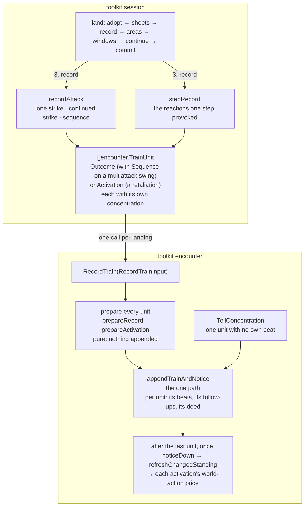

# The record train — one landing tells all its beats, then asks who is standing once

Tracking: [rpg-toolkit#2002](https://github.com/KirkDiggler/rpg-toolkit/issues/2002),
a follow-up of [rpg-toolkit#1965](https://github.com/KirkDiggler/rpg-toolkit/issues/1965).
Walkthrough: [README.md](README.md). Slices: [slices.md](slices.md).

## Shape



A landing writes every dirty sheet before it records, so the standing consult
answers from the end state of the whole output. A landing that tells several
units therefore appends every unit's beats first and asks who is standing once,
after the last. One encounter verb, `RecordTrain`, does that. A single outcome
is a train of one. Session's record functions build one train per landing and
call it once.

### encounter

```go
// outcome.go

// TrainUnit is one told unit of a landing: exactly one of Outcome or
// Activation. Each carries its own concentration checks and breaks
// (RecordInput.ConcentrationChecks/Breaks, RecordActivationInput's same
// fields), told behind that unit's own beat.
type TrainUnit struct {
	// Outcome is a rulebook outcome: a swing, a death save, a trade, a ward,
	// an experience grant.
	Outcome *RecordInput

	// Activation is an activation told inside a landing: a post-hit
	// reaction's retaliation, today.
	Activation *RecordActivationInput
}

// RecordTrainInput is every unit one landing tells, in story order.
type RecordTrainInput struct {
	Units []TrainUnit
}

// TrainLanded is where one unit's beats landed.
type TrainLanded struct {
	// Seq is the unit's own beat: the outcome beat, or the activation's
	// activated beat.
	Seq uint64

	// FollowUpSeqs are every other beat the unit appended, in append order:
	// an activation's save and results, then the unit's concentration checks,
	// then its breaks' trains.
	FollowUpSeqs []uint64
}

// RecordTrainOutput reports one TrainLanded per input unit, in input order,
// and the intel changes the one standing consult produced.
type RecordTrainOutput struct {
	Units       []TrainLanded
	IntelDeltas map[MemberID]*IntelDelta
}

// RecordTrain puts one landing's units into the story and then lets the world
// notice them, once.
//
// Every unit is prepared before anything is appended. Then, for each unit in
// order: its own beat, its concentration checks' saved beats, its breaks'
// trains, and, for a struck or missed outcome, its attack deed. After the
// last unit: the standing consult (down beats, then a party-defeat ending,
// removals and member-down endings), the observed-standing refresh, and each
// activation unit's world-action price in unit order.
//
// Errors, every one before anything is appended: ErrNilInput for a nil input
// or a nil unit field; ErrInvalidData for zero units or a unit with both or
// neither field set; ErrClosed for a closed encounter, except a train whose
// every unit is an OutcomeExperienceGained; and whatever prepareRecord or
// prepareActivation refuses for any unit, wrapped with the unit's index.
// A failure in a deed or the consult happens after the append; the caller
// drops the encounter unsaved (R5).
func (e *Encounter) RecordTrain(in *RecordTrainInput) (*RecordTrainOutput, error)

// SequenceIdentity names the sequence a swing was performed inside — the
// goblin boss's Multiattack — so the story can tell a Multiattack's swing
// from a lone pick. Plain strings checked for presence, as AttackIdentity and
// ReactionIdentity are: this module cannot resolve a rulebook ref (C1).
type SequenceIdentity struct {
	// Ref is the sequence definition's own ref, not the component it swung.
	Ref string

	// Name is the display name for Ref — "Multiattack".
	Name string
}

// RecordInput gains one field.
type RecordInput struct {
	// ...unchanged...

	// Sequence names the sequence this swing was performed inside. Present on
	// a swing of a multiattack, nil on a lone swing and on every reaction.
	// Valid on OutcomeStruck, OutcomeMissed and OutcomeWarded; any other kind
	// is ErrInvalidData, as is an empty Ref or Name. Written as the beat's
	// "sequence": {"ref", "name"} key, and omitted when nil.
	Sequence *SequenceIdentity
}

// TellConcentrationOutput is what TellConcentration appended.
type TellConcentrationOutput struct {
	// Seqs lists every beat appended, checks first, then breaks, in order.
	Seqs        []uint64
	IntelDeltas map[MemberID]*IntelDelta
}

// TellConcentration keeps its input and refusals and returns its own output.
func (e *Encounter) TellConcentration(in *TellConcentrationInput) (*TellConcentrationOutput, error)
```

The one path, unexported:

```go
// preparedUnit is one unit, validated and marshalled, nothing appended.
type preparedUnit struct {
	beats      []preparedActivationBeat // the unit's own beat first when headed, then its follow-ups
	headed     bool                     // beats[0] is the unit's own beat; false for a TellConcentration
	land       func() error             // a struck or missed outcome's deed; nil otherwise
	pass       participationPassInput   // a stabilized or recovered death save's deferReconcile
	worldActor MemberID                 // an activation's actor, who pays the world-action price; "" otherwise
}

func (e *Encounter) prepareUnit(index int, unit TrainUnit) (preparedUnit, error)

// appendTrainAndNotice is the only append-and-notice body for RecordTrain
// and TellConcentration.
func (e *Encounter) appendTrainAndNotice(verb string, units []preparedUnit) ([]TrainLanded, map[MemberID]*IntelDelta, error)
```

The beat key the marker writes, on a struck, missed or warded beat:

```json
{"beat": "struck", "actor": "goblin-boss-1", "targets": ["cleric"],
 "attack": {"ref": "...:scimitar", "name": "Scimitar", "damage_type": "slashing"},
 "sequence": {"ref": "...:multiattack", "name": "Multiattack"}, "...": "..."}
```

### session

No exported verb or input changes. The swing event bodies gain one additive
field:

```go
// types.go

// SequenceRef names the sequence a swing was performed inside.
type SequenceRef struct {
	Ref  string `json:"ref"`
	Name string `json:"name"`
}

// StruckBody, MissedBody and WardedBody each gain:
//
//	// Sequence names the multiattack this swing belongs to. Nil on a lone
//	// swing and on a reaction, which is the common case.
//	Sequence *SequenceRef `json:"sequence,omitempty"`
```

The record functions, unexported:

```go
// landings.go

// retaliationUnit is the activation unit a taken post-hit reaction tells,
// with the concentration its damage tested. Nil for a nil retaliation.
func retaliationUnit(r *resolution.RetaliationOutcome, told concentration) (*encounter.TrainUnit, error)

// recordAttack builds the attack story's one train and records it once. It
// returns the strike unit's TrainLanded for a verb that reports a hit, nil
// for a continued strike or a sequence.
func (m *Manager) recordAttack(
	enc *encounter.Encounter, story windowStory, outcome resolution.Outcome, told concentration,
) (*encounter.TrainLanded, error)

// sequenceUnits builds one strike unit per settled step, each naming the
// sequence and carrying its own concentration, each followed by its
// retaliation unit; a continued step is its retaliation unit alone.
func sequenceUnits(story windowStory, sequence resolution.SequenceOutcome) ([]encounter.TrainUnit, error)
```

## Law

### The train

- One landing tells all its beats, then asks who is standing once. The consult
  answers from sheets the landing already wrote, so asking before the last
  beat reports a fall ahead of the blow that caused it.
- `RecordTrain` prepares every unit before it appends any. A bad unit anywhere
  refuses the whole train and appends nothing. Preparation is pure:
  `prepareRecord` and `prepareActivation` read members and marshal bytes, and
  mutate nothing.
- A closed encounter refuses the train before any append, with `ErrClosed`.
  The one exception is a train whose every unit is
  `OutcomeExperienceGained`, as for a lone experience grant today.
- The story order is: for each unit, its own beat, its concentration checks,
  its breaks' trains, its deed; after the last unit, `down` beats, then any
  ending, then the observed-standing refresh. No consult runs between units.
- A struck or missed unit lands its attack deed behind its own beats, before
  the next unit. A stance the deed turns is told beside the blow that turned
  it.
- No step between the first append and the consult can close the encounter.
  A deed only turns pairs hostile. If a unit after the first finds the
  encounter closed when it was open at the start, the train stops with
  `ErrClosed` naming the unit rather than appending to a closed story.
- The consult's pass defers reconcile when any outcome unit is a stabilized
  or recovered death save.
- An activation unit pays its actor's world-action price after the consult, in
  unit order, as `RecordActivation` pays it after its own consult.
- `appendTrainAndNotice` is the only body that appends a train and runs the
  consult for `RecordTrain` and `TellConcentration`.

### The units session builds

- Session's attack and step record functions each make exactly one
  `RecordTrain` call per landing.
- A lone strike is its strike unit, then its retaliation unit when the strike
  carries one. The landing's concentration rides the strike unit.
- A continued strike is its retaliation unit alone, carrying the landing's
  concentration. A landing handed concentration with no unit to carry it
  refuses with `ErrInvalidWorld`.
- A sequence is, per settled step, its strike unit with the step's own
  concentration, then its retaliation unit. A continued step is its
  retaliation unit with the step's concentration.
- A step is, per settled reaction, its strike unit named as the reaction, then
  its retaliation unit. A continued reaction is its retaliation unit alone.
- Every unit is built before the train is recorded. A build refusal, such as a
  component the attacker does not carry, writes nothing.
- Whether a sequence swings again after its target falls stays resolution's
  rule (`SequenceOutcome.Unswung`). The train tells what settled.

### The sequence marker

- A swing inside a multiattack carries `RecordInput.Sequence`, naming the
  sequence's ref and display name. The ref is `SequenceOutcome.Action`. The
  name is the attack story's definition name, and a story whose definition ref
  is not the sequence's action refuses with `ErrBadAttack` before any write.
- A lone swing, a reaction and every non-swing beat carry no `sequence` key.
- Session decodes the key into `Sequence` on the swing's event body. A present
  but incomplete or null `sequence` leaves the body untyped, as a malformed
  `reaction` does.
- The marker is the beat's. No session output copies it.

### Landing after the train

`land`'s steps and order do not move: adopt, sheets, record, areas, windows,
continuation, commit. The sheets are written before the record step on
purpose: the consult answers from those stores. What changes is the record
step's call. For an attack or step story it is one `RecordTrain` over every
unit the output settled. Trades, death saves and experience grants are trains
of one. `TellConcentration` is unchanged at its two sites.

### The wire

- No proto change. `struck`, `missed`, `warded` and `down` are beats the
  session already projects to `StruckBody`, `MissedBody`, `WardedBody` and
  `DownedBody`, which rpg-api already maps onto the session event stream. The
  train changes only their order.
- The `sequence` key is additive on the beat and on the session bodies. A
  decoder that predates it ignores it. rpg-api does not carry it yet (Open 2).

### What is deleted

- encounter: `Record`; `RecordOutput`; `Record`'s own outcome-beat append, so
  the outcome beat goes through the one path; the `land` and `pass`
  parameters of `appendTrainAndNotice`, which become fields of each prepared
  unit.
- session: the per-step `enc.Record` loop and the per-step retaliation call
  in `recordSequence`; the per-reaction `enc.Record` loop in `stepRecord`;
  the two calls of the lone-strike path in `recordAttack`;
  `recordRetaliation`'s `enc.RecordActivation` call, which becomes
  `retaliationUnit`.

### Proof

- A goblin boss's two swings against a 40 HP cleric holding Fog Cloud tell
  struck, saved, concentration ended, struck, and no `down`.
- The same swings against a 12 HP cleric alone in the party tell both swings,
  then `down`, then the party-defeated ending. The turn commits, the encounter
  is closed, and the cleric's sheet and the struck amounts agree.
- The same swings against a 12 HP cleric with an ally standing tell struck,
  saved, concentration ended, struck, `down`.

## Rulings

| ID | status | scope | ruled by | date |
|---|---|---|---|---|
| T1 | settled | An encounter verb `RecordTrain` takes an ordered list of outcomes, each with its own concentration checks and breaks, appends every beat in order, and runs the standing consult once after the last beat. The session's sequence and retaliation recording build the list and call it once. No defer flag across two calls. | KirkDiggler | 2026-10-10 |
| T2 | settled | A single `Record` is a train of one. The append-and-notice helper is the only path; the duplicate goes. | KirkDiggler | 2026-10-10 |
| T3 | settled | `down` lands after the last beat of the train, which is the blow that caused it. | KirkDiggler | 2026-10-10 |
| T4 | settled | A swing inside a multiattack carries the sequence's ref on its beat, additive, so the log can tell a Multiattack from a lone pick. | KirkDiggler | 2026-10-10 |

What each ruling makes true here:

- **T1.** `RecordTrain` and `TrainUnit`. A retaliation is in the train, so a
  unit is an outcome or an activation. The step story's reactions are one
  landing too, and are one train by the same law.
- **T2.** `Record` and `RecordOutput` are deleted. No caller outside session
  uses `Record`: rpg-api has none. Session's trade, death save and experience
  calls become trains of one and read `Units[0].Seq`. `TellConcentration`
  shares the same body as a unit with no own beat.
- **T3.** Falls out of T1. The consult runs once after the last unit, so any
  `down` it notices follows every beat of the train, and an ending follows
  that `down`.
- **T4.** `RecordInput.Sequence` writes `"sequence": {"ref", "name"}` on the
  swing's beat. The name rides beside the ref as on `attack` and `reaction`,
  because this module cannot resolve a ref to a display name.

## Open

1. **`RecordActivation` keeps its own append and consult.** Its consult runs
   `noticeDown` without the observed-standing refresh. Making it a train of
   one activation would add that refresh to every activation verb, which no
   ruling covers. Recommendation: fold it in a follow-up once a heal that
   stands a member up shows the stale testimony.
2. **The marker does not reach the wire.** The web cannot yet tell a
   Multiattack's swing from a lone pick. Carrying `sequence` is an additive
   proto field on the swing events when the web asks for it.
