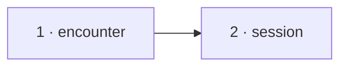

# The record train — slices

A working document beside [design.md](design.md): slice order, the task list a
worker executes per module, what done means, and what is deleted. Every
`file:line` is at rpg-toolkit `origin/main` `56b25b27` (dnd5e v0.208.0 ·
encounter v0.121.0 · resolution v0.69.0 · session v0.127.0). Toolkit paths are
relative to `rulebooks/dnd5e/`. Line numbers drift as a slice edits a file; the
symbol beside each line is the anchor.

Develop outside-in, merge inside-out. One nearest-`go.mod` module per toolkit
PR. Session builds on encounter's gate-approved branch head, never a draft, and
re-pins to encounter's tag at merge-out. Toolkit CI cannot resolve a branch
pseudo-version, so the session PR stays a draft until that re-pin. The squash
title's prefix picks the tag bump. No resolution, protos, rpg-api or web slice
exists (design, "The wire").

## Order

| # | Module | PR title |
|---|---|---|
| 1 | `rulebooks/dnd5e/encounter` | `feat(encounter)!: RecordTrain — one landing tells all its beats, then asks who is standing once (toolkit#2002)` |
| 2 | `rulebooks/dnd5e/session` | `feat(session): record a sequence as one train; multiattack swings name their sequence (toolkit#2002)` |

Encounter carries `!`: it deletes `Record` and `RecordOutput` and changes
`TellConcentration`'s return type. Session carries none: no exported verb,
input or output changes, and the event bodies gain one optional field.

> Ruled on the design PR: slice 1 also folds `RecordActivation` into the
> train (a train of one activation unit); its separate append + consult is
> deleted. Done-when: `TestAnActivationIsATrainOfOne` — the activation's beats
> land, then one standing consult with the standing refresh; grep for a second
> `appendBeat` path for outcomes/activations finds none.

## 1. toolkit encounter

### Types

As in [design.md](design.md) "encounter": `TrainUnit`, `RecordTrainInput`,
`TrainLanded`, `RecordTrainOutput`, `RecordTrain`, `SequenceIdentity`,
`RecordInput.Sequence`, `TellConcentrationOutput`, and the unexported
`preparedUnit`, `prepareUnit`, `appendTrainAndNotice`.

### Tasks, in this order

1. `outcome.go`: add `SequenceIdentity` after `ReactionIdentity` (`:595`).
   Add `Sequence *SequenceIdentity` to `RecordInput` (`:163`) after
   `Reaction`, with the godoc in the design.
2. `prepareRecord` (`:890`): refuse `in.Sequence != nil` on any kind but
   `OutcomeStruck`, `OutcomeMissed`, `OutcomeWarded` with
   `record: sequence does not match outcome kind %q: ErrInvalidData`, next to
   the presentation-id kind check (`:988`). Refuse an empty `Ref` or `Name`
   with `ErrInvalidData`. Write `payload["sequence"] =
   map[string]string{"ref": ..., "name": ...}` after the `reaction` key
   (`:1152`), only when non-nil.
3. Add `TrainUnit`, `RecordTrainInput`, `TrainLanded`, `RecordTrainOutput`
   where `RecordOutput` is (`:606`). Delete `RecordOutput`.
4. Add `preparedUnit` and `prepareUnit(index, unit)`:
   - neither or both of `Outcome`/`Activation` set: `record train: unit %d:
     ErrInvalidData`.
   - `Outcome`: `beats := prepareRecord(unit.Outcome)`; `headed: true`;
     `land` is `func() error { return e.landAttack(in.Actor, beats[0].subjects[1:]) }`
     for struck or missed, exactly as `Record` builds it (`:744-750`); `pass`
     carries `deferReconcile` for a stabilized or recovered death save, as
     `Record` sets it (`:740-743`).
   - `Activation`: `beats := prepareActivation(unit.Activation)`;
     `headed: true`; `worldActor: unit.Activation.Actor`.
   - Wrap any refusal as `record train: unit %d: %w`.
5. Rewrite `appendTrainAndNotice` (`:779`) as
   `appendTrainAndNotice(verb string, units []preparedUnit) ([]TrainLanded, map[MemberID]*IntelDelta, error)`:
   1. `openAtStart := e.outcome == nil`.
   2. For each unit `i`: if `i > 0 && openAtStart && e.outcome != nil`,
      return `%s: unit %d: ErrClosed`. Append every beat, at the current
      high-water reading, through the same `appendBeat` call the helper makes
      today (`:782-790`). The first beat's seq is `Seq` when `headed`;
      every other seq goes to `FollowUpSeqs`. Then, if `e.outcome == nil`
      and `land != nil`, run `land`.
   3. If `e.outcome != nil`, return the seqs with no consult. Only an
      experience train reaches this.
   4. OR every unit's `pass.deferReconcile` into one pass. Run
      `noticeDown(pass)`, then `refreshChangedStanding`, as today
      (`:806-815`).
   5. For each unit with `worldActor != ""`, in order, run
      `spendWorldAction(worldActor)`.
6. Add `RecordTrain` after the types. Refuse `in == nil` with
   `record train: ErrNilInput` and zero units with `ErrInvalidData`. Prepare
   every unit into a slice, returning the first refusal. Only then call
   `appendTrainAndNotice("record train", prepared)`. Return
   `RecordTrainOutput{Units, IntelDeltas}`. Move `Record`'s godoc (`:629-716`)
   onto `RecordTrain`, rewritten to the train: the consult runs once after the
   last unit, and `Units[i].Seq` is unit `i`'s own beat.
7. Delete `Record` (`:717-757`).
8. `TellConcentration` (`:853`): build one `preparedUnit{beats: checks then
   breaks, headed: false}` and call the new helper. Return
   `TellConcentrationOutput{Seqs: landed[0].FollowUpSeqs, IntelDeltas}`. Its
   refusals and their order do not change.
9. Fix every doc comment in the module that names `Record` or
   `RecordOutput`: `OutcomeDown`'s doc, `prepareRecord`'s closed-door
   comment, `ReactionIdentity`'s doc, `doc.go`. `grep -n 'Record\b\|RecordOutput' *.go`
   lists them.
10. Tests: add a `recordOne(e, in) (*encounter.TrainLanded, error)` helper
    once per test package that calls `Record` (`encounter` and
    `encounter_test`), and move every `.Record(` call to it. Assertions on
    `.Seq` and `.FollowUpSeqs` keep their meaning. The calling files are
    `outcome_test.go`, `participation_test.go`, `concentration_test.go`,
    `bothways_test.go`, `deed_test.go`, `encounteranswers_test.go`,
    `monsterturn_test.go`, `killingblow_test.go`, `standing_test.go`,
    `defeat_test.go`, `passage_test.go`, `fighttime_test.go`,
    `bothways_internal_test.go`, `audience_internal_test.go`,
    `facts_readings_internal_test.go`.
11. New file `train_test.go` (package `encounter_test`) holds the tests below.
    Build its scenes on `killingblow_test.go`'s `apart` and `defeat_test.go`'s
    `quartet`, with a standing capability that reports the target down from
    the start. That is the landing's world: the sheet is already at 0 when
    the record step runs.

### Done when

- `TestATrainTellsEveryBeatBeforeAskingWhoIsStanding`: two struck units from
  one attacker against a target the standing capability reports down, with an
  ally of the target standing. The story reads `struck, struck, down`, and
  `Units[0].Seq < Units[1].Seq <` the down beat's seq.
- `TestATrainThatFellsTheLastStandingClosesAfterItsLastBeat`: the same two
  units against the last standing party member, with `PartyDefeated` answered.
  No error. The story reads `struck, struck, down`, then the ending beat. The
  encounter is closed.
- `TestEachUnitsConcentrationRidesBehindItsOwnBeat`: unit one carries one
  break with a failed save; unit two carries nothing; the target is reported
  down; an ally stands. The story reads `struck, saved, concentration_ended,
  struck, down`.
- `TestABadUnitAnywhereRefusesTheWholeTrain`: unit two has an empty
  `Attack.Ref`. The error is `ErrInvalidData`, the story length is unchanged,
  and no deed landed for unit one: the attacker's pair with a neutral target
  is still neutral.
- `TestAClosedEncounterRefusesATrain`: a closed encounter refuses a struck
  unit with `ErrClosed` and appends nothing. A train of one
  `OutcomeExperienceGained` unit on the same encounter is accepted.
- `TestAnEmptyOrMalformedTrainIsRefused`: nil input is `ErrNilInput`; zero
  units, a unit with both fields and a unit with neither are each
  `ErrInvalidData`.
- `TestARetaliationUnitIsToldInsideTheTrain`: a struck unit then an
  activation unit whose damage the standing capability reports felled the
  striker. The story reads `struck`, `activated`, `saved`, the damage
  result, then the striker's `down`. `Units[1].Seq` is the `activated` beat.
- `TestEachStruckUnitLandsItsDeedBehindItsOwnBeats`: two struck units from a
  neutral camp's member. The stance beat lands after unit one's beats and
  before unit two's.
- `TestASwingNamesItsSequence`: a struck unit with `Sequence` writes
  `"sequence": {"ref", "name"}` on its beat; a unit without one writes no
  `sequence` key; `Sequence` on `OutcomeDeathSave` and on `OutcomeBought` is
  `ErrInvalidData`; an empty `Ref` and an empty `Name` are each
  `ErrInvalidData`.
- `TestTellConcentrationAppendsTheTrainRecordWould` (`concentration_test.go:558`)
  passes through `recordOne` and `TellConcentrationOutput.Seqs`.
- Every existing stabilized and recovered death-save test
  (`stabilization_test.go`, `participation_test.go`) passes unchanged
  through `recordOne`.
- `grep -rn '\.Record(\|RecordOutput' rulebooks/dnd5e/encounter --include='*.go'`
  finds nothing outside `recordOne`.
- `go test ./... -count=1`, `golangci-lint run` green.

### Deletion mutants

- Moving the consult inside the unit loop fails
  `TestATrainTellsEveryBeatBeforeAskingWhoIsStanding` and
  `TestATrainThatFellsTheLastStandingClosesAfterItsLastBeat`, which then
  returns `ErrClosed`.
- Preparing each unit inside the append loop fails
  `TestABadUnitAnywhereRefusesTheWholeTrain`.
- Dropping the `land` call fails
  `TestEachStruckUnitLandsItsDeedBehindItsOwnBeats`.
- Running every `land` after the last unit fails the same test.
- Dropping the `sequence` key write, or its kind refusal, fails
  `TestASwingNamesItsSequence`.
- Dropping the `deferReconcile` OR fails the stabilized death-save tests.
- Dropping the mid-train closed check leaves no failing test. It guards an
  unreachable path and is kept as the fail-closed answer.

## 2. toolkit session

Builds on encounter's gate-approved head; re-pins to encounter's tag at
merge-out. Draft until then.

### Types

As in [design.md](design.md) "session": `SequenceRef`, the `Sequence` field on
`StruckBody`, `MissedBody`, `WardedBody`, and the unexported
`retaliationUnit`, `recordAttack`, `sequenceUnits`.

### Tasks, in this order

1. `go get github.com/KirkDiggler/rpg-toolkit/rulebooks/dnd5e/encounter@<gate-approved head>`
   then `go mod tidy`.
2. `landings.go`: replace `recordRetaliation` (`:279`) with `retaliationUnit`.
   It builds the same `RecordActivationInput`, including the told
   concentration, and returns it as a `TrainUnit`. Nil returns nil.
3. Add `sequenceUnits` with the body of `recordSequence`'s loop (`:132-170`)
   building units instead of recording. Keep its two refusals and their
   order: no steps is `ErrInvalidWorld`; a component the attacker does not
   carry is `ErrBadAttack`. Add a third before the loop:
   `story.Definition.Ref != sequence.Action` is `ErrBadAttack`. Every strike
   unit's `Outcome.Sequence` is
   `&encounter.SequenceIdentity{Ref: sequence.Action.String(), Name: story.Definition.Name}`.
4. `recordAttack` (`:99`) builds one unit list:
   - continued strike: its retaliation unit carrying `told`;
   - lone strike: its strike unit carrying `told`, then its retaliation unit
     with no concentration;
   - sequence: `sequenceUnits`.

   No units and empty `told` records nothing. No units and non-empty `told`
   refuses with `ErrInvalidWorld`. Otherwise call `enc.RecordTrain` once and
   return `&out.Units[0]` for a lone strike, nil otherwise.
5. `attackLanded.hit` (`:56`) becomes `*encounter.TrainLanded`. The readers
   in `attack.go` (`:415-446`) read `.Seq` and `.FollowUpSeqs` unchanged.
6. `stepRecord` (`:230`): build the units the same way, a reaction's strike
   unit and then its retaliation unit, while it builds `tells` today. The
   returned closure calls `enc.RecordTrain` once.
7. Delete `recordSequence`.
8. Trains of one: `trade.go:366`, `death_save.go:190` and `write.go:1749`
   call `RecordTrain` with one outcome unit and read `Units[0].Seq` where
   they read `.Seq`.
9. `types.go`: add `SequenceRef` beside `ReactionRef` (`:3551`) and
   `Sequence *SequenceRef json:"sequence,omitempty"` to `StruckBody`
   (`:1932`), `MissedBody` (`:1989`) and `WardedBody` (`:2022`), with the
   design's godoc.
10. `events.go`: `structBody` (`:2079`) adds `"sequence"` to the null-refused
    keys and decodes it like `reaction`. A present sequence with an empty
    ref or name returns nil, an untyped body. `wardedEventBody` (`:2183`)
    does the same.
11. Tests in `multiattack_turn_test.go`, built on `bossBesideFighter` and
    `bossBreaksTheFightersAreaWith`, with dice where both scimitar swings hit
    for 8 and the first swing's concentration save fails.

### Done when

The three reproduction scenes from the rpg-toolkit#2002 cause comment:

- `TestAMultiattackAgainstAHealthyTargetTellsBothSwings`: the target holds
  Fog Cloud at 40 HP. The swing train reads `struck, saved,
  concentration_ended, struck`, with no `down`.
- `TestAMultiattackWhoseSecondSwingFellsTheLastStandingTellsBothThenTheFall`:
  the target holds Fog Cloud at 12 HP and is alone in the party. `EndTurn`
  returns no error. The story after the turn reads `struck, saved,
  concentration_ended, struck, down`, then the party-defeated ending. The
  stored encounter is closed. The stored sheet reads 0 HP, and the two struck
  amounts sum to 12.
- `TestAMultiattackWhoseSecondSwingFellsATargetWithAnAllyTellsTheFallLast`:
  the same target, with an ally seated out of the boss's reach. The swing
  train reads `struck, saved, concentration_ended, struck, down`, with
  `down` after the second `struck`.

And:

- `TestEachMultiattackSwingNamesItsSequence`: both swing events' bodies carry
  `Sequence` equal to the goblin boss's Multiattack ref and name.
- `TestALoneSwingNamesNoSequence`: a player's declared attack's `StruckBody`
  has a nil `Sequence`, and its beat has no `sequence` key.
- `TestTwoReactionsThatFellTheMoverAreBothTold`: a player at low HP steps out
  of two monsters' reach; both opportunity attacks hit, and the second fells
  the player. The story reads both reaction swings, then `down`.
- `TestARetaliationThatFellsTheAttackerIsToldBeforeTheFall`: in the
  `bossBreaksTheFightersArea(true)` scene, with the boss's hit points lowered
  so one Wrath of the Storm fells it, the fighter takes Wrath of the Storm
  against the first swing. The resumed story reads the retaliation's beats,
  then the boss's `down`, and no second swing.
- `TestASequenceWhoseStoryNamesAnotherDefinitionIsRefused` (internal): a
  story whose definition ref differs from the sequence's action refuses with
  `ErrBadAttack` and records nothing.
- `TestStruckBodyDecodesItsSequence` and
  `TestStruckBodyWithAnIncompleteSequenceDoesNotType` in
  `events_internal_test.go`.
- Every existing multiattack, post-hit, opportunity, trade, death-save and
  experience test green.
- `grep -n 'enc\.Record(\|\.Record(\|recordSequence\|recordRetaliation' rulebooks/dnd5e/session/*.go`
  finds nothing.
- `go test ./... -count=1`, `golangci-lint run` green.

### Deletion mutants

- One `RecordTrain` call per step in `sequenceUnits`'s caller fails the 12 HP
  alone test, with `ErrClosed` on step 1, and the 12 HP ally test, with
  `down` before the second `struck`.
- One `RecordTrain` call per reaction in `stepRecord` fails
  `TestTwoReactionsThatFellTheMoverAreBothTold`.
- Recording the retaliation in its own call fails
  `TestARetaliationThatFellsTheAttackerIsToldBeforeTheFall`.
- Dropping `Outcome.Sequence` in `sequenceUnits`, or the decoder's read of
  it, fails `TestEachMultiattackSwingNamesItsSequence`.
- Setting `Sequence` on a lone strike fails `TestALoneSwingNamesNoSequence`.
- Dropping the definition-ref check fails
  `TestASequenceWhoseStoryNamesAnotherDefinitionIsRefused`.
- Dropping the no-units-with-concentration refusal fails no test unless a
  continued strike with no retaliation is built. Add that case to the
  internal test as `TestAContinuedStrikeWithNothingToCarryItsConcentrationIsRefused`.

## Walk

One click on the local stack, with both slices on their gate-approved heads.
The walk verifies the path; the nuances are the tests. Post as a `- [ ]` box
on rpg-toolkit#2002 before merging.

- [ ] **A multiattack whose second swing fells a player.** Lower a player's
      hit points so that two goblin boss scimitar hits drop them, then end
      the turn beside the boss. The log shows both swings, then the fall, in
      that order. When that player was the last standing, the ending follows
      the fall and the turn does not fail.

## What is deleted

See design, "What is deleted". `RecordActivation` keeps its own append and
consult (design, Open 1).
