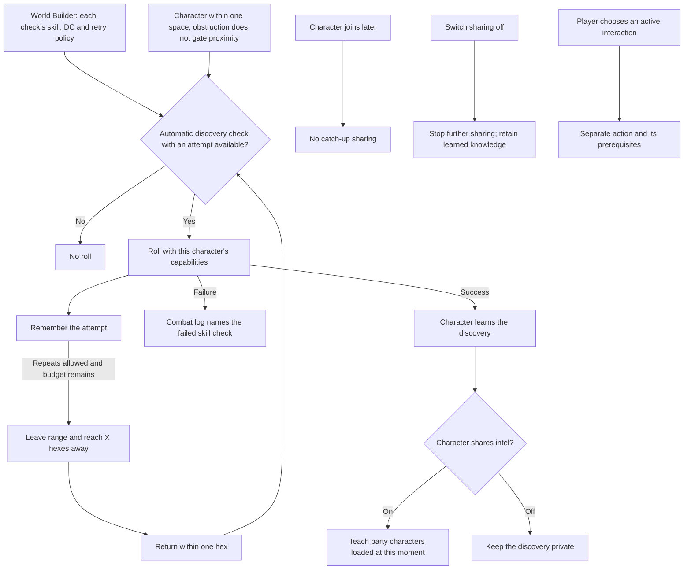

# Automatic discovery checks and party intel

## Shape

An automatic check is the equivalent of the DM asking a nearby character for a
check to notice or recognize something. It rolls dice; it is not a D&D passive
ability score. An active check follows the player's declared action and stays
outside the proximity-discovery path.

Sharing in this slice teaches discovery intel to the loaded party at the time
of discovery. It does not create an omniscient party view or a historical
catch-up service.

## Law

- **R1 — Proximity discovery.** A character within one space of content covered
  by an automatic discovery check receives a roll using that character's
  capabilities and the authored check, subject to its attempt policy.
- **R2 — Attempt budget.** A character gets one attempt by default. Additional
  attempts require explicit configuration on that check. A concealment's
  multiple hidden members do not multiply the attempts at its discovery check.
  Moving, reconnecting or saving/loading cannot grant an unconfigured attempt.
- **R3 — Visible failure.** A failed attempt appears in the combat log as a
  failed check, naming the skill used without identifying the undiscovered
  object. The occurrence of the attempt may hint that something is nearby.
- **R4 — Optional checked discoveries.** A site remains completable if every
  discovery check fails. Mandatory content and the only route to required
  progress do not depend on a successful discovery check.
- **R5 — Character-controlled sharing.** Each character has an easily changed
  party-intel sharing toggle. Sharing is on by default; the default is policy,
  not an invariant of the intel store.
- **R6 — Share knowledge, not truth.** Sharing teaches party characters the
  sender's discovery intel. Recipients need no successful check of their own to
  learn it. Sharing does not substitute authoritative world truth for what the
  character knows, including mistaken or stale information.
- **R7 — No unlearning on toggle-off.** Disabling sharing stops further
  sharing from that character. It does not remove knowledge recipients have
  already learned.
- **R8 — Configurable attempt lifetime.** A check's retry policy can distinguish
  per-run attempts from attempts retained across future visits to the same site.
  Reconnecting or saving/loading the same run does not reset either lifetime.
- **R9 — Automatic is not active or passive-score.** Automatic checks cover
  noticing and recognition, including Religion, Investigation, Survival,
  Perception and other appropriate skills. Those examples are not a closed
  skill whitelist. Lockpicking with thieves' tools and forcing something open
  with Strength are deliberate interactions, with their own action and
  prerequisite rules; proximity never performs them. A skill's name alone does
  not make a player-declared action automatic.
- **R10 — Moment-scoped sharing.** Shared discoveries teach only party
  characters loaded at the moment of sharing. Later arrivals receive no
  retrospective sharing. Disconnect/reconnect catch-up is outside this slice.
  Independent observation can still teach a character about a changed door or
  other perceivable world state; it is not replay of another character's intel.
- **R11 — Distance is sufficient.** The proximity trigger uses the one-space,
  melee-range boundary. An obstruction or blocking object on a hex does not
  prevent the check. This does not change movement legality or ordinary sight.
- **R12 — Check-owned configuration.** Each check carries its own retry policy,
  authored in the World Builder alongside its skill and difficulty. Policy is
  part of the authored check definition, not a world-wide or site-wide setting.
- **R13 — Single-try default.** A check without explicit permission for repeat
  attempts permits one try per character. Multiple attempts are opt-in content,
  not a default inherited from repeated movement or client requests.
- **R15 — Distance re-arm.** A repeatable check becomes eligible for another
  allowed attempt only after that character leaves the trigger range, reaches
  at least the check's configured reset distance of X hexes, and returns within
  one hex. X defaults to **3 hexes** for repeatable checks and is configurable
  per check in the World Builder. It measures distance from the checked content,
  not accumulated steps. Reaching X only re-arms the check; returning triggers the next roll. Standing
  nearby or returning before reaching X does not. Re-arming never replenishes
  an exhausted attempt budget or turns a single-try check into a repeatable one.

## Rulings

| ID | status | scope | ruled by | date |
| --- | --- | --- | --- | --- |
| R1 | settled | Automatic discovery checks at one-space proximity | KirkDiggler | 2026-10-02 |
| R2 | settled | One try by default; explicit per-check repeats; no duplicate attempts per hidden member | KirkDiggler | 2026-10-03 |
| R3 | settled | Failed checks visible in the combat log | KirkDiggler | 2026-10-02 |
| R4 | settled | No mandatory progress gated solely by discovery checks | KirkDiggler | 2026-10-02 |
| R5 | settled | Easy per-character sharing toggle, shared by default | KirkDiggler | 2026-10-02 |
| R6 | settled | Share character discovery intel, not an omniscient world view | KirkDiggler | 2026-10-03 |
| R7 | settled | Turning sharing off retains already learned knowledge | KirkDiggler | 2026-10-02 |
| R8 | settled | Configurable attempt lifetime: per run or retained across visits | KirkDiggler | 2026-10-03 |
| R9 | settled | DM-prompted automatic rolls; player-declared actions and passive scores are separate | KirkDiggler | 2026-10-03 |
| R10 | settled | Sharing limited to characters loaded at that moment; no late-join catch-up | KirkDiggler | 2026-10-03 |
| R11 | settled | Melee-range proximity sufficient despite hex obstructions | KirkDiggler | 2026-10-03 |
| R12 | settled | Retry policy authored per check in the World Builder alongside skill and DC | KirkDiggler | 2026-10-03 |
| R13 | settled | Single try by default; repeated attempts require explicit configuration | KirkDiggler | 2026-10-03 |
| R14 | deferred-until-sharing-recovery | Disconnect-edge recovery and historical catch-up | KirkDiggler | 2026-10-03 |
| R15 | settled | Repeat requires reaching configured reset distance (default 3 hexes) and returning within one hex | KirkDiggler | 2026-10-03 |
| R16 | open | Remaining action-surface and delivery contracts | — | — |
| R17 | open | Persistent check identity and edits | — | — |

## Open

- **R17 — Persistent identity and edits.** Define persistent
  character/site/check identity across authored revisions and the effect of
  editing a check on already spent attempts.
  Old saves without attempt history cannot silently claim a history the system
  never recorded.
- **R16 — Bounded delivery and action surface.** Reconcile the meaning of loaded
  party characters with the existing membership/delivery contract without adding
  the deferred disconnect-recovery system. Specify the failed-check log audience
  and the sharing-toggle persistence. Resolve whether manual Search remains;
  any retained active Search must respect the same authored discovery attempt
  budget rather than bypass it.
- **R14 — Deferred recovery.** Late-join backfill and disconnect/reconnect
  catch-up are not completion prerequisites. An already learned discovery
  remains the character's knowledge; this deferral does not authorize dropping
  it from persisted state or withholding ordinary independent observation.
