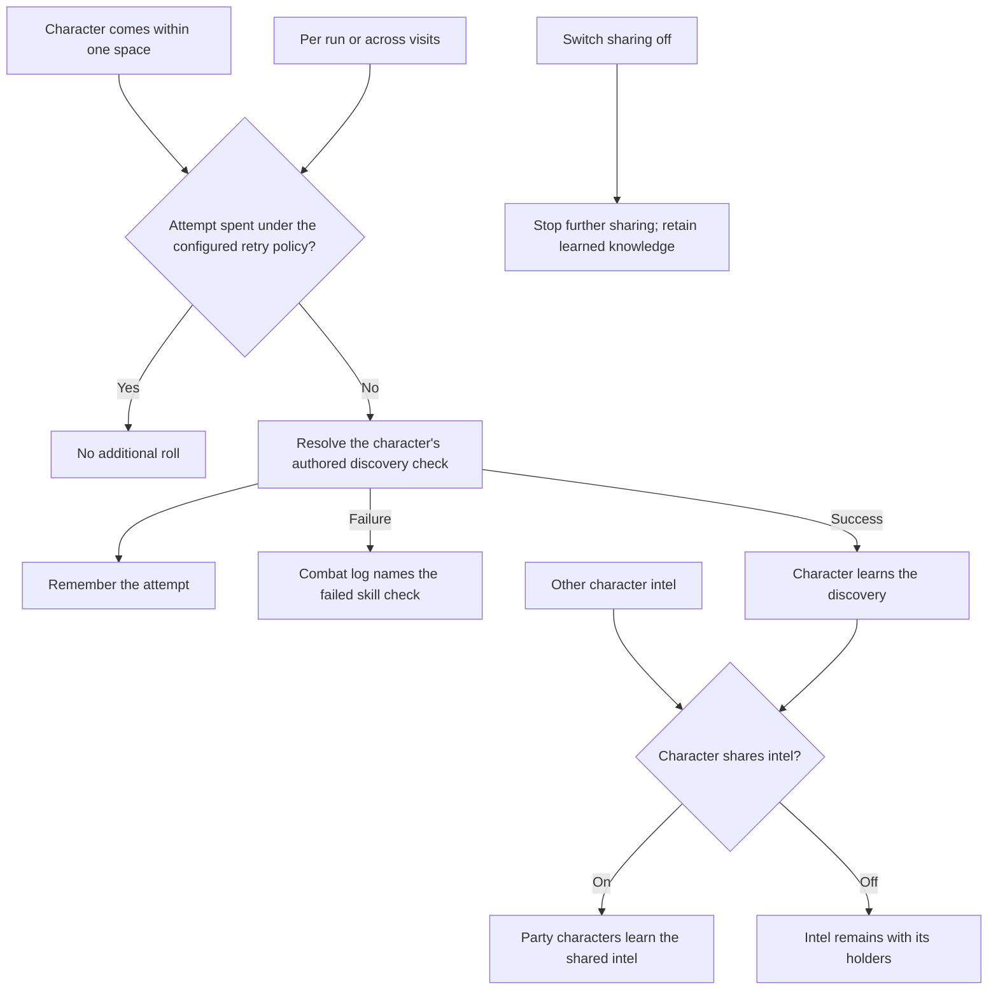

# Proximity discovery and party intel

## Shape

Discovery and sharing are separate capabilities. Proximity supplies an occasion
for a character's check. Sharing teaches other characters what the sender
knows; it does not give them access to authoritative world truth.

The shape covers discovery checks. Whether any other authored checks trigger
on proximity remains an explicit scope question.

## Law

- **R1 — Proximity discovery.** A character within one space of content covered
  by a discovery check receives an automatic roll using that character's
  capabilities and the authored check.
- **R2 — One attempt.** Each character gets one attempt per concealment, not
  one per hidden member of that concealment. Moving away and back, reconnecting,
  or saving and loading the same run does not grant another attempt.
- **R3 — Visible failure.** A failed attempt appears in the combat log as a
  failed check, naming the skill used without identifying the undiscovered
  object. The occurrence of the attempt may hint that something is nearby.
- **R4 — Optional checked discoveries.** A site remains completable if every
  discovery check fails. Mandatory content and the only route to required
  progress do not depend on a successful discovery check.
- **R5 — Character-controlled sharing.** Each character has an easily changed
  party-intel sharing toggle. Sharing is on by default; the default is policy,
  not an invariant of the intel store.
- **R6 — Share knowledge, not truth.** Sharing teaches party characters the
  sender's intel, including discoveries. Recipients need no successful check
  of their own to learn a shared discovery. Shared information remains capable
  of being mistaken or stale.
- **R7 — No unlearning on toggle-off.** Disabling sharing stops further
  sharing from that character. It does not remove knowledge recipients have
  already learned.
- **R8 — Configurable attempt lifetime.** Retry policy selects one attempt per
  character/concealment per run, or one attempt that remains spent across future
  visits to the same site. Neither policy grants another attempt on movement,
  reconnect, or save/load of the same run.

## Rulings

| ID | status | scope | ruled by | date |
| --- | --- | --- | --- | --- |
| R1 | settled | Automatic discovery checks at one-space proximity | KirkDiggler | 2026-10-02 |
| R2 | settled | One attempt per character/concealment; no movement or reconnect rerolls in the same run | KirkDiggler | 2026-10-02 |
| R3 | settled | Failed checks visible in the combat log | KirkDiggler | 2026-10-02 |
| R4 | settled | No mandatory progress gated solely by discovery checks | KirkDiggler | 2026-10-02 |
| R5 | settled | Easy per-character sharing toggle, shared by default | KirkDiggler | 2026-10-02 |
| R6 | settled | Party receives character intel, not an omniscient world view | KirkDiggler | 2026-10-02 |
| R7 | settled | Turning sharing off retains already learned knowledge | KirkDiggler | 2026-10-02 |
| R8 | settled | Configurable attempt lifetime: per run or retained across visits | KirkDiggler | 2026-10-03 |
| R9 | open | Non-discovery checks and the manual Search action | — | — |
| R10 | open | Sharing activation, provenance and competing testimony | — | — |
| R11 | open | Eligible proximity observation and initial placement | — | — |
| R12 | open | Retry-policy ownership, default, identity and changes | — | — |

## Open

- **R12 — Retry-policy configuration.** Specify whether policy belongs to the
  site or the world, who changes it, and its default. Define persistent
  character/site/concealment identity across authored revisions and the effect
  of changing policy on already spent attempts. Configurability does not imply
  a particular reset or migration behavior.
- **R9 — Check scope and manual Search.** Discovery is automatic. Clarify
  whether proximity also attempts non-discovery checks such as unlocking or
  forcing a door, and whether manual Search remains. A retained manual path
  cannot silently bypass R2 for the same concealment.
- **R10 — Sharing lifecycle and testimony.** Specify whether enabling sharing
  transfers existing intel immediately and how a newly joining recipient learns
  it. Define how shared mutable observations interact with the recipient's own
  observations, including provenance, currency, contradictory reports and
  forwarding, without substituting live world truth for testimony. Specify the
  setting's persistence lifetime and the audience for failed-check log entries.
- **R11 — Proximity eligibility.** Specify which part of a multi-part
  concealment supplies proximity, whether an intervening barrier prevents an
  attempt, and whether starting within range triggers the same check. Moving
  and looking are different facts; distance alone does not establish perception.
