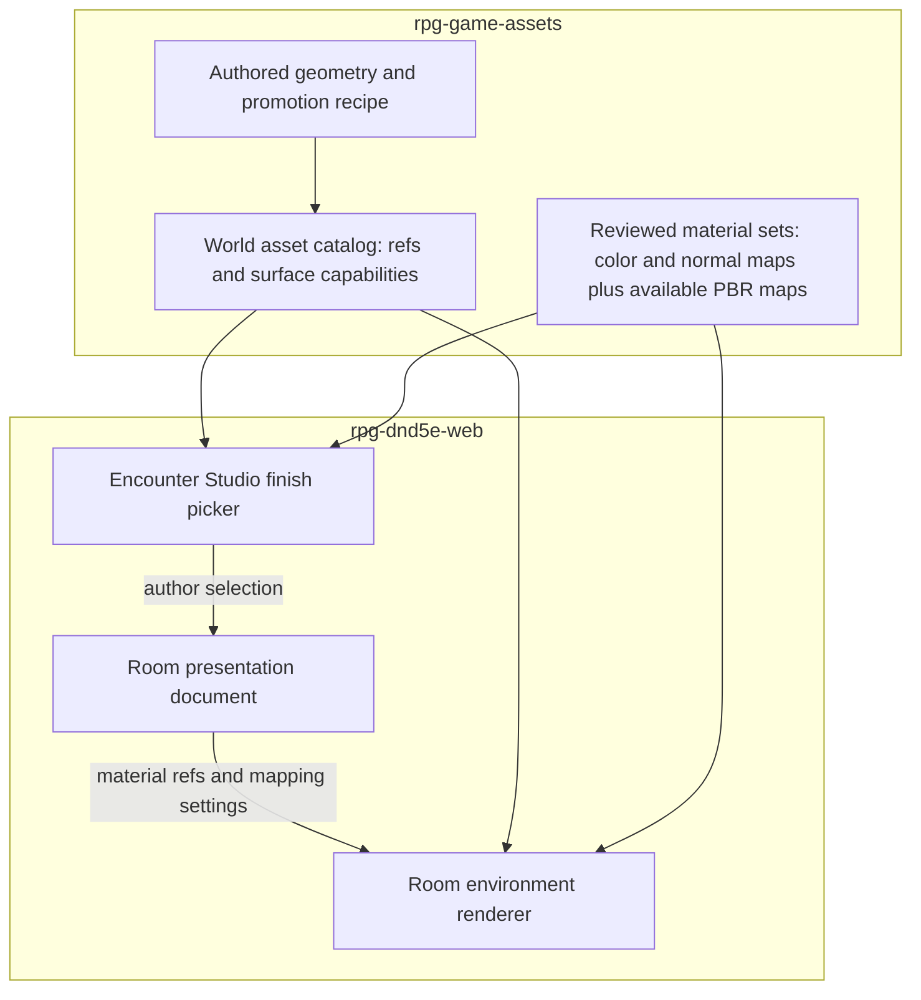

# Room-owned finishes: geometry once, materials once

## What this is

This [design](design.md) extends the appearance conversation around [Assets #290](https://github.com/KirkDiggler/rpg-game-assets/issues/290) and [Encounter Studio #1234](https://github.com/KirkDiggler/rpg-dnd5e-web/issues/1234). **The room chooses a finish; an asset declares which surfaces can receive it.** It reuses the asset catalog and doorway part roles, not a separate family of model exports for every texture. Doorway classification and fit remain their own provider contract; runtime materials do not replace that work.

The [contract proposal](contract-proposal.md) describes candidate provider bindings, material sets and the existing Studio/runtime seams. The [implementation outline and readiness check](implementation-plan.md) records inspected evidence and remaining blockers; it is not an execution-ready implementation plan.

## Component shape

## Ownership and contracts

| Component | Owns | Input → output |
|---|---|---|
| Asset promotion | Geometry, explicit surface compatibility, complete part bindings | Authored recipe + actual GLB → verified catalog entry with existing `ref`, `file`, `glbSha256`, optional `roles`, and a proposed surface declaration |
| Material publication | Reusable map sets, conventions and resource identity | Reviewed source maps → proposed material records with stable refs and private synced resources |
| Studio | Room finish choice and author-visible compatibility | Provider declarations + selection → room presentation content with finish references and mapping settings |
| Room renderer | Mapping evaluation and instance-safe material application | Geometry + material records + room content → aligned visible surfaces |

The new surface declaration, material record, and room fields have **no agreed serialized type yet** (R8). These are contract responsibilities, not keys that a consumer should start accepting. Existing catalog fields and roles retain their owning contract.

Assets does not decide game rules from visual material. Studio does not guess bindings from mesh names or manufacture duplicate GLBs. The renderer does not promote an unsupported asset into a texturable one or mutate another room's appearance through a shared material instance. Server-owned mechanical state and observer knowledge stay outside this appearance path (R6).

## Walk one thing through

Consider an author choosing a small-brick finish for a room containing a wall and a framed wooden door. This is an illustrative value flow, not a declaration that a particular promoted asset supports it.

1. Assets publishes the wall geometry and doorway geometry under their own asset refs. Surface bindings distinguish wall/frame masonry from the wooden leaf and metal hardware. The existing `leaf` role answers which part moves, not which material it receives.
2. Assets publishes the small-brick material under a separate stable material ref. Its base-color and normal images belong to the same set; available roughness and occlusion maps travel with it (R4).
3. Studio records that material ref and the room mapping settings in presentation content. It does not save a newly textured copy of either model (R1).
4. The renderer resolves the refs and applies the finish only to compatible masonry. Wall pieces use the shared reference so extending the wall adds brick repeats rather than enlarging bricks (R3). Matching doorway stonework uses that reference; wood and metal retain their own appearance (R2).
5. Hiding a verified complete leaf group leaves the frame at the same placement. Material mapping is independent of leaf presence (R5). The precise mapping origin and persistence rules belong to R7/R8, not a mesh's current bounding box.

## Separations that look like one thing

| Query | Source of truth |
|---|---|
| Which parts move or can be omitted together? | Verified node roles and door groups |
| Which faces can receive a room masonry finish? | Provider-authored surface compatibility |
| Which finish does this room use? | Room presentation content |
| Where do the bricks and normal-map details land? | Shared mapping convention and room settings |
| Is this mechanically a wooden or iron door? | Game content/rules, not the visual shader |
| How wide is the usable passage? | Provider-owned fit facts, not outer bounds |

The two sides of a shared wall answer to different rooms (R11); sharing geometry does not share finish selection. Doorway trim can belong to the same mesh as the wall body while retaining its own surface binding. Face direction alone cannot distinguish them.

A node role is not a material slot: a leaf can contain both boards and straps. An identical texture image is not identical alignment: independent UV origins can restart the pattern at every join.

## Trade-offs

| Decision | Benefit | Cost / boundary | Not taken |
|---|---|---|---|
| Independent geometry and material sets (R1) | Reuse without model-per-finish duplication | Provider and consumer maintain explicit references | Export every appearance as another GLB |
| Authored surface capabilities (R2) | Predictable changes without recoloring unrelated parts | Asset authors prepare or exclude existing meshes | Replace every material on every mesh |
| Shared mapping (R3) | Stable feature size and aligned adjacent pieces | Renderer implements a corner-aware mapping convention (R7) | Restart each piece at texture origin |
| Coherent map sets (R4) | Lighting detail agrees with visible brick/mortar | Assets verifies map conventions; renderer handles the normal basis | Swap only the color image |

## Edges

Palette-atlas UVs can address flat color swatches instead of surface distance. Those meshes need preparation before a tiling material is meaningful. Geometry with modeled large bricks cannot become genuinely small-brick geometry through a texture swap. Such assets can remain fixed-appearance assets rather than pretending to support the room finish.

Room corners, exposed tops/ends/reveals, and origin changes need the R7 decision. Shared-wall room-facing finishes are independent under R11. Arbitrary meshes and compound multi-opening assemblies are not evidence of general compatibility. Per-wall overrides and coordinated wood/metal palettes remain R10 questions. Missing resources and absent capability need explicit consumer behavior under R8, not an invisible or silently guessed result.

A useful proof under R9 shows two wall lengths, an adjacent-piece seam, a rotated wall and corner under directional light, and the doorway closed/open/leafless. Changing room A must leave room B unchanged; saving and reloading must preserve the finish and alignment. The provider checks the actual exported bindings and maps; Web checks the rendered room and authoring lifecycle.

## Where a change lands

- Another compatible brick finish changes the provider material collection, not wall geometry.
- A new frame shape changes the provider geometry and surface bindings, not the room finish selection model.
- A corner-wrapping improvement changes the renderer's mapping implementation within the agreed R7 contract; a changed persisted mapping meaning needs a coordinated content change.

## Source map

| Concern | Owning path |
|---|---|
| World asset recipe validation | `rpg-game-assets/scripts/world_asset_review.py` |
| Consumer-safe world asset projection | `rpg-game-assets/scripts/build_world_asset_catalog.py`, `harness/catalogs/synty-world-assets.json` |
| Existing conversion/material bindings | `rpg-game-assets/scripts/fbx_to_glb.py`, `scripts/synty_material_bindings.py` |
| Provider promotion workflow | `rpg-game-assets/docs/human/asset-ingestion/world-asset-promotion.md` |
| Existing private environment maps | `rpg-game-assets/harness/models/synty/textures/` |
| Consumer catalog accept boundary | `rpg-dnd5e-web/scripts/generate-world-asset-catalog.mjs` |
| Room identity and boundary intent | `rpg-dnd5e-web/src/concepts/world-building/authoringRegions.ts`, `regionBoundaryGeometry.ts` |
| Shared authored structural surfaces | `rpg-dnd5e-web/src/concepts/world-building/StructuralWallSurfaces.tsx`, `structuralWallEditing.ts` |
| Permitted play layout adapter and renderer | `rpg-dnd5e-web/src/components/session/structuralLayout.ts`, `StructuralLayoutEnvironment.tsx` |
| Studio integration request | [Web #1234](https://github.com/KirkDiggler/rpg-dnd5e-web/issues/1234) |

The source map identifies existing seams, not a checked implementation plan. Concrete material publication and Studio document types are R8 design work.
