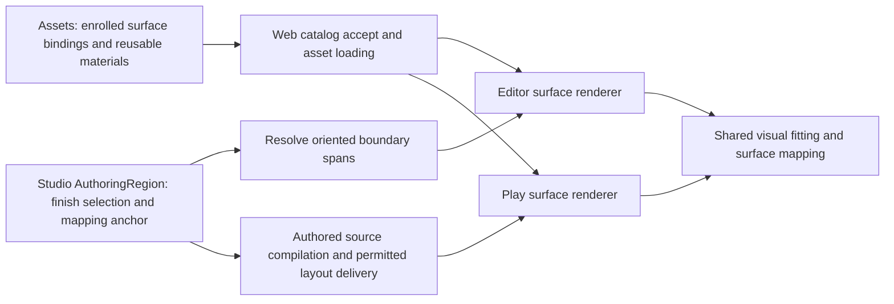

# Room surface contracts — proposal for the provider/consumer handoff

Companion to the [design](design.md) and [walkthrough](README.md). This is a working proposal, not accepted catalog keys, a released runtime contract, or permission to change existing documents. The source probe and checks are recorded in [implementation-plan.md](implementation-plan.md). Accepted visual examples are recorded on [Assets #290](https://github.com/KirkDiggler/rpg-game-assets/issues/290).

## Reuse the owners



Use the existing `AuthoringRegion` owner, not `MapLabel` text, `RoomDraft.implicitRegionId`, or gameplay discovery regions. Automatic regions already carry an `EnclosureWitness` with oriented source wall runs. `RegionResolution` supplies transient area; it does not currently supply the directed, clipped wall-side spans needed by a material renderer. Add that projection to the owning geometry path rather than another flood-fill or nearest-label rule.

The existing `StructuralWallSurfacePieces` / `FittedDoorSurface` path is shared by Studio and play. It is the intended consumer, not the older `WallRunMesh` envelope renderer. Existing appearance fitting changes the rendered model dimensions without changing the independent blocker. Surface mapping belongs after this visual fit so stretching the fitted geometry does not stretch its brick size.

## Provider declarations

### Surface bindings

Proposed optional `surfaces` on an enrolled world-asset recipe/catalog row:

```typescript
// Proposal; names deliberately not accepted by existing strict readers yet.
type AssetSurfaceBinding = {
  id: string;                       // stable within this asset
  node: string;                     // unique authored mesh node
  material: string;                 // unique named material within that node
  side: 'positive-z' | 'negative-z'; // normalized asset frame, not a room ID
  family: 'masonry';
};
```

A binding selects all actual exported primitives on that node using the named material. One primitive must not be claimed by two bindings. An asset can keep a single mesh with distinct material slots; separate objects are not mandatory. Names are authored identity, never guessed from vendor filenames. Promotion must resolve them against the final GLB and bind that exact result to its receipt. A new export must be reverified, not assumed to retain primitive numbering.

Only room-replaceable wall-body surfaces receive bindings initially. Trim, top/end caps, reveals, and leaf/hardware primitives retain their authored appearance unless explicitly enrolled later. The retained regions need no redundant catalog binding solely to say "leave this alone." Existing `roles` remains independent: `frame`/`leaf`/`above` describe parts, not material selection.

The `side` convention must be verified after normalization and hierarchy transforms, not against Blender's local Z axis. An assembly's unbound surfaces may still use the same image as an enrolled surface. Sharing an image must not grant permission to replace their materials.

### Reusable material sets

Proposed separate generated material catalog under `harness/catalogs/`, with licensed resources under the existing private Synty runtime root:

```typescript
type SurfaceImage = {
  file: string;                     // runtime-root-relative, contained path
  sha256: string;
  sizeBytes: number;
};
type SurfaceMaterial = {
  ref: string;
  displayName: string;
  family: 'masonry';
  baseColor: SurfaceImage;          // sRGB
  normal: SurfaceImage;             // linear data, glTF/OpenGL tangent convention
  repeatMeters: [number, number];   // physical U/V repeat, positive finite
  normalScale: [number, number];
  roughness: number;
  metalness: number;
  metallicRoughness?: SurfaceImage; // linear, glTF G roughness / B metalness
  occlusion?: SurfaceImage;         // linear, R occlusion
};
```

Use source hash-pinned recipes and existing publication/inventory custody, not a hand-maintained runtime manifest. Share identical image resources between sets where applicable. Verify dimensions, hashes, safe paths, normal convention, and matching color/normal layout. Do not fabricate an unrelated normal map for a palette-mapped door; this required pair is the contract of a selectable masonry finish.

The physical repeat default requires an explicit calibration check in the browser: the inspected catalog's `boundsMeters` already includes `SHARED_RUNTIME_SCALE = 0.75`, while gameplay layout is in feet. Do not multiply material scale by `SYNTY_SCALE` again or copy the proof's five Blender units into the wire as five feet. Convert a material's meter repeat to feet using 0.3048 meters/foot, then through the existing `sceneUnitsPerFoot` conversion. Author-selected physical scale and the precise initial repeat values require measured fixtures, not an asset-bounds-derived rule.

### External-image custody

The proposed reusable-image path requires an explicit opt-in resource contract for enrolled assets. Every external image URI must resolve to a declared, hash-bound file inside the staged private runtime bundle; arbitrary network URLs, escaping paths, symlinks and undeclared dependencies refuse. Resolve dependencies relative to the actual GLB location, not the process working directory. Geometry buffers remain embedded. A GLB digest alone does not bind its external images.

Publication, runtime texture policy, inventory/staging and consumer verification must all account for that dependency closure. Existing embedded-only asset profiles remain unchanged; a broad `allowExternalImages` switch is insufficient. The final schema must cover default trim/leaf images as well as selectable masonry maps, so preserving authored appearance does not reintroduce hidden dependencies. The flat local prototype does not settle production directory layout or its nested relative-path validation.

## Room authoring and derived spans

Proposed finish setting belongs on the existing `AuthoringRegion`. It names a material ref, not image URLs, GLB paths, or raw shader configuration. Exact persistence/version extension is pending R8. Existing scene3 readers reject unknown region keys, so adding fields under scene3 without a compatibility/version decision is unsafe.

Suggested mapping intent includes a persistent source-wall/direction anchor and a vertical origin. A label move must not move the brick pattern. Replacing/deleting the anchor must produce a named unresolved mapping until repaired; do not silently choose a different wall and move every texture. The closure policy follows R12 below; anchor creation, repair and persistence remain R7/R8 details. Store intent, not a second polygon or a copy of every derived UV.

The proposed transient renderer input is a list of **wall-side intervals**, not whole-wall ownership:

```typescript
type WallSideFinishSpan = {
  wallId: string;
  side: 'positive-z' | 'negative-z';
  start: number;
  end: number;
  materialRef: string;
  distanceAtStart: number;
  direction: 1 | -1;
  heightOrigin: number;
};
```

For editor derivation these values use the existing scene-unit wall line. The wire uses canonical feet with one adapter. Distances are measured on the final room-facing path, including the thickness offsets at joins, not on the wall centerline. The producer must establish actual span bounds from certified region boundary geometry; a compressed witness run alone is insufficient at T-junctions. A source wall can border two different rooms along different subintervals on the same side.

Opposite sides independently resolve their room material and coordinate chart. Door openings interrupt geometry but not the mapping distance, so masonry beyond the opening resumes the same pattern. Door leaf movement does not change the room boundary or finish. Framed assets need provider aperture/fit facts from #290; this proposal does not substitute outer bounds for the opening.

Explicit painted regions do not automatically own neighboring wall faces merely because their cells are near a wall. A concrete side-binding rule for that case remains open; the first wall-finish consumer should use resolved wall-enclosed rooms rather than invent proximity ownership.

## Mapping and corner geometry

Three candidate approaches:

| Approach | Benefit | Cost / limit |
|---|---|---|
| Room planar/triplanar projection | Simple for arbitrary placements | A projection alone does not preserve a continuous brick run around all corners; normal-map bases and blending need explicit handling |
| Oriented wall-distance charts | Preserves feature size, straight seams and corner wrapping | Needs stable anchor, directed side spans, thickness-aware joins and an explicit loop seam |
| Provider-authored UVs/corner meshes only | Maximum control over an individual piece | Does not solve arbitrary room lengths, per-instance fit scaling or every requested join without more assets |

Recommend oriented wall-distance charts for enrolled planar masonry. Preserve authored UVs for everything else. A room may update transient per-instance UV/tangent buffers when geometry changes, or evaluate the same mapping in a shader; neither choice requires a new persisted/exported GLB per room or finish. Stale source tangents must not survive a changed UV chart. Recompute a matching tangent basis, or use a verified derivative-based normal basis consistently.

For the demonstrated equal-thickness 90-degree join, the proposed visual fitter miters only provider-enrolled plain wall-body ends. This is not permission to cut or deform arbitrary catalog art, door frames, leaves or trim. The provider must declare and verify a fit-capable body/end boundary; that declaration is a separate contract from `surfaces`. Exact end-topology/anchor representation needs a real exported prototype before schema finalization. Generated plain slabs are an alternative, but would change which geometry identity the selected asset owns and are not silently substituted.

Web already owns visual fitting, so the proposal extends that shared fitter rather than adding mechanical corner logic. The renderer must receive enough permitted fit information for identical corner geometry even when a neighboring wall is withheld. It must not reconstruct hidden room topology from an unrestricted authoring fetch.

### Closed-loop seam (R12)

A repeating texture generally cannot retain fixed physical scale and also join perfectly around an arbitrary closed perimeter. **The room keeps fixed brick size and places the pattern-phase seam at its explicit mapping anchor** (R12). The anchor can be a corner; its authoring controls and persisted identity remain R7/R8 work.

This seam concerns the repeat pattern, not a geometric crack or mismatched vertical brick courses. Color and normal-map coordinates remain paired. The renderer does not adjust repeat scale to an integer number of repeats around each room. The open L-shaped proof is not evidence of a complete loop implementation.

## Loading, absence and rendering lifecycle — proposed behavior

- No surface declaration: retain authored appearance and do not offer room retexturing for that asset. Missing capability is not an invisible fallback.
- No room finish: retain authored appearance; loading old content creates no new settings/history.
- Declared missing node/material, unknown ref, bad digest or incompatible family: identify the asset/region/surface; never silently substitute a different finish or partially apply only the color map.
- Region or mapping unresolved: preserve settings and draft editability. A preview may show authored appearance only with an explicit unresolved indicator; not an apparently successful stale finish. Publication/play behavior needs a deliberate contract.
- Image cache is shared by immutable resource identity. Material instances and any changed UV/tangent buffers are placement-owned. Dispose only resources the instance owns; do not dispose `useGLTF` cache geometry or shared textures when one room unmounts.
- Apply selected finish before remembered/selected/ghost overlays. `useRememberedModelTint` currently snapshots material references: lifecycle integration must not restore a pre-finish material after an update.
- Finish edits use the existing whole-document commit/history/epoch gates, with one entry per accepted change and none for preview/cancel/no-op. Save/reload must preserve refs and mapping intent.

## Play delivery is part of completion

`StructuralLayoutEnvironment` consumes `AtlasStructuralWall`/`AtlasStructuralDoor` through `structuralLayout.ts`; it does not read `AuthoringRegion` or the source document. Therefore an editor-only finish field is insufficient for the same room to appear in play.

Extend the existing compiled presentation/projection path with resolved visual surface/fit data. Toolkit carries opaque appearance identity and validates structural values; it does not inspect licensed meshes or shader meaning. Session/API transport it. The member projection withholds hidden wall/door/region relationships; Web renders only permitted records. Send the minimal mapping phase/fit needed per permitted surface rather than an entire room walk that exposes hidden topology. Snapshot, reveal introduction and relevant replacement semantics need the outside-in provider brief before implementation.

The schema, unknown-resource policy and any extra provider fields must be accepted by both ends before publication. None of these proposals permits changing generated catalogs by hand or bypassing asset promotion.
