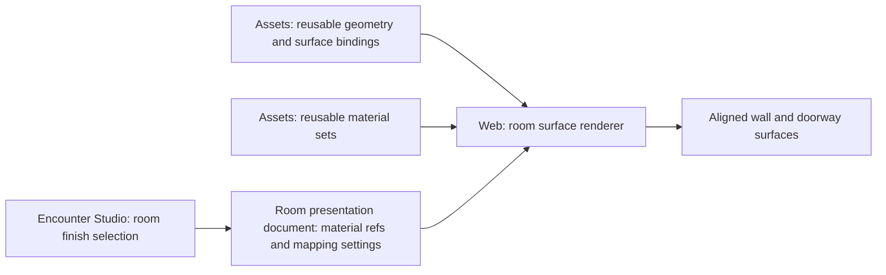

# Room-owned surface materials

## Shape

Geometry, material resources, and room appearance are separate identities. A room selects a finish; compatible surfaces receive it without exporting a new model for each finish.

## Law

- **R1 — Room ownership.** The room owns its selected surface finish and shared mapping settings in presentation content. Geometry and material sets are stored independently and reused; a finish choice does not require a duplicate GLB.
- **R11 — Shared walls.** Opposite room-facing surfaces of one wall independently receive their respective room's finish and mapping. A shared wall does not force neighboring rooms to share an appearance. Tops, ends, and doorway reveals require an explicit ownership rule under R7.
- **R2 — Surface capability.** Assets declares which authored surfaces accept a room finish and which retain their own appearance. Masonry, door boards, and metal hardware remain distinguishable where independently adjustable. Missing capability is not permission to retexture an arbitrary mesh.
- **R3 — Shared alignment.** Compatible room surfaces use a common mapping reference and real-world scale. Extending a wall repeats the material rather than stretching its features; adjacent compatible pieces do not restart their pattern at each asset origin. The concrete mapping and corner convention remain open under R7.
- **R4 — Material sets.** A finish includes base color and its normal map; roughness, metalness, and occlusion maps are included where available. All maps describing the same surface share alignment, scale, and rotation. The renderer interprets normals in the correct surface basis, including rotated walls and supported corners; reusing color coordinates alone is insufficient.
- **R5 — Independent parts.** Existing `frame`, `leaf`, `above`, and asset-local `door` grouping remain the part contract. Omitting a verified complete leaf group preserves the fixed opening geometry and assembly placement. Surface selection does not establish that an assembly is safely leaf-removable.
- **R6 — Boundaries.** Assets owns visual identity, surface compatibility, map resources, and geometry facts. Studio owns room appearance authoring and persistence; Web owns rendering those declarations. Visual material does not assign mechanical substance, durability, locks, collision, line of sight, or observer knowledge. Licensed maps and GLBs remain in the private asset repository and use the existing consumer-safe sync boundary.
- No consumer infers surface bindings, aperture, or removability from filenames, material display names, or whole-assembly bounds. Provider metadata follows the existing recipe/receipt/catalog workflow; schema additions require coordinated consumer acceptance.
- A material change to one room does not mutate another room through shared loaded resources.
- Texture detail does not change geometry or silhouette. Modeled brick size remains a geometry choice; palette-atlas UVs are not presumed compatible with tiling finishes.

## Rulings

| ID | status | scope | ruled by | date |
|---|---|---|---|---|
| R1 | settled | Room-owned finish; independent geometry/material storage | KirkDiggler | 2026-10-09 |
| R2 | settled | Explicit compatible surface regions; distinct masonry/wood/metal | KirkDiggler | 2026-10-09 |
| R3 | settled | Common alignment and real-world scale rather than per-piece restarts | KirkDiggler | 2026-10-09 |
| R4 | settled | Normal maps included and aligned with the material set | KirkDiggler | 2026-10-09 |
| R5 | settled | Reuse part roles; leaf omission preserves verified fixed geometry | KirkDiggler | 2026-10-09 |
| R6 | settled | Asset/Studio/rendering ownership; presentation is not gameplay authority | KirkDiggler | 2026-10-09 |
| R7 | open | Mapping algorithm, corners, room origin, and edge/reveal ownership | — | — |
| R8 | open | Catalog/document schema, resource lifecycle, validation and failure behavior | — | — |
| R9 | open | First representative asset/material set and visual acceptance | — | — |
| R10 | open | Per-surface overrides and non-masonry room finish selection | — | — |
| R11 | settled | Independent room-facing finishes on shared geometry | KirkDiggler | 2026-10-09 |
| R12 | open | Closed-room texture-phase seam versus repeat-scale adjustment | — | — |

## Open

- **R7 — Mapping.** Choose room-local projection, continuous wall-distance mapping, or another measured approach. Define origin stability when rooms move or resize, inside/outside corners, UV seams, normal-map basis, and ownership of exposed tops, ends, and doorway reveals. Room-facing side independence follows R11. Arbitrary projections do not promise seamless wrapping.
- **R8 — Concrete contract.** Agree stable material identities, surface-to-primitive bindings, compatibility declarations, map paths/hashes, color-space and normal conventions, default parameters, and room document fields. Define old-document behavior, missing/invalid resources, incompatible selection, loading/cache/disposal behavior, and reload determinism. No JSON example in the walkthrough is an accepted schema.
- **R9 — Proof set.** Select one suitable wall and one complete framed doorway, plus contrasting brick finishes with normal maps. Establish whether each asset needs UV preparation or replacement geometry. Verify seams, corners, room resizing, closed/open/leafless doorway states, and material isolation between rooms before broad enrollment.
- **R12 — Loop closure.** A fixed-size repeat need not divide an arbitrary room perimeter. Choose whether a deliberate phase seam remains at a stable mapping anchor or the room adjusts repeat scale to close the pattern. Neither behavior is implicit in the accepted open-corner appearance. The [contract proposal](contract-proposal.md) recommends fixed size and an explicit phase seam; geometry must still close.
- **R10 — Overrides.** Room-owned masonry is the initial direction. Whether authors can override individual walls/frames, and how room wood/metal finishes interact with authored defaults, requires a concrete consumer use case and agreement.
