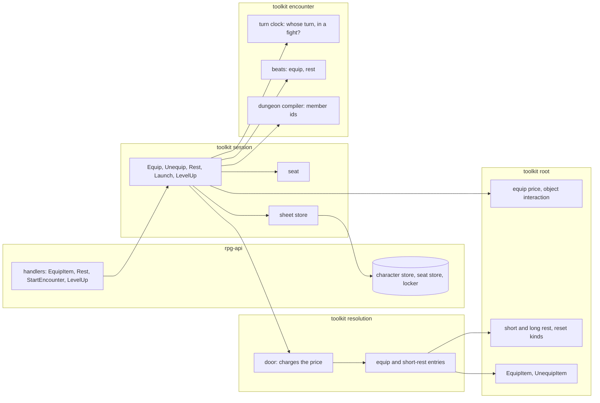

# Session verbs — walkthrough

Tracking: KirkDiggler/rpg-toolkit#1965 (tier 2 F). Law: [design.md](design.md).
Slices: [slices.md](slices.md).

## What this is

Equip, rest and launch move onto the session SDK, beside level-up (R3). Two
small primitives carry them: the **seat**, which says which run holds a
character, and the **sheet store**, the one place a verb reads and writes
character records. They reuse what exists: the session guard, the sheet's own
ledger, resolution's door, the encounter's turn clock and beats, the rulebook's
equip and rest rules. They introduce no second ledger, no second payer and no
equipment rule outside the rulebook.

## Component shape

## Ownership and contracts

| Component | Owns | Input → output |
|---|---|---|
| rpg-api handlers | binding the caller, codes, the armour class in a response | request → SDK verb input; SDK output + saved record → response |
| rpg-api stores | durable bytes, the guard implementation | `GetCharacter`/`SaveCharacter`, seat get/put by character id, session and character guards |
| session verbs | which path a verb takes, the order of guards, the report | `EquipInput{Character, Slot, Item}`, `RestInput{Session, Member, Kind, HitDice}`, `LaunchInput{Session, Dungeon, Party}` → output with `Saved`, `Delivery` |
| seat | which run holds a character | character id → session id or none |
| sheet store | every read and save of a character record in one verb | member id → `*character.Data` or `ErrNoCharacter`; record → saved, noted on the report |
| encounter | whose turn, whether a member is in a fight, the story | member + change → beat, or `ErrNotYourTurn` / in-fight refusal |
| resolution | charging a price and applying the change on an attached sheet | record + `Cost` → dirty record, or unaffordable |
| root | what a change costs, what a rest restores | equipment change + ledger → spend profile; rest kind + dice → restored sheet |

The refusals:

- rpg-api does not price, rest, compile a dungeon or tell watchers; the verb
  does each.
- The session compiles no price and pays nothing; root prices, the door pays.
- The sheet store keeps no copy between asks; the guard, not a cache, is what
  makes its reads current.
- Encounter does not know what an item is; a beat carries the item's ref as a
  name to show.
- Root does not know about runs or turns beyond the ledger it is handed.
- No verb writes a seated sheet without the session's guard, and no verb
  writes an unseated sheet without the character's.

## Walk one thing through

A seated fighter on their turn swaps a dagger for a longsword in the main hand.
The handler binds the caller to the character and calls `Equip{Character:
fighter, Slot: main_hand, Item: longsword}`. The verb takes the fighter's
guard, reads the seat — run S — drops the guard, takes S's guard and re-reads
the seat. The encounter answers that the fighter is in a fight and that it is
their turn. The store loads the record; the turn is readied on the sheet. Root
prices the change against that ledger: the dagger is put away (the action) and
the longsword is drawn (the interaction). The door charges both and the equip
entry applies the swap to the attached sheet; the dirty record comes back and
the store saves it, noting `character:fighter` on the report. The encounter
records the beat; every member who sees the fighter is told. The handler reads
the record back, projects the armour class through the resolution door and
answers. The next attack consult asks the sheet again and finds the longsword.

## Separations that look like one thing

| Query | Source of truth |
|---|---|
| Is the character in a run? | the seat |
| Is the member in a fight, and whose turn is it? | the encounter's clock |
| What is left to spend this turn? | the sheet's ledger |
| What does this change cost? | root's equip price |
| What is the character holding? | the sheet's equipment slots |
| What prop is the member holding? | the encounter's holdings (run-scoped) |

Merging the seat with fight membership would bill a free-roam equip or let an
in-fight one go free. Merging equipment slots with prop holdings would make a
torch picked up in a dungeon a permanent sheet change; whether the two compete
for hands is R9.

## Trade-offs

| Decision | Benefit | Cost / boundary | Not taken |
|---|---|---|---|
| One SDK equip verb that reads the seat | one host path, no host knowledge of fights | a seat store and a character guard for the host to supply | a separate session equip RPC the client must choose |
| Guards, not version checks | one concurrency model with the session's | a host without a locker has none, as today | compare-and-swap saves on the character store |
| Store reads through every ask | no stale copy, the sheet-facts law unchanged | more repository reads per verb (R10) | a verb-scoped cache |
| Price in root, charged at the door | one payer, rule beside the ledger | an equip entry in resolution for a change with no roll | session paying the ledger itself |
| Launch takes the compiled dungeon | rpg-api holds no dungeon vocabulary | the compiler mints member ids | the host passing a pre-built world |

## Edges

- No in-run long rest and no world time for a rest (R5).
- No Afford row for equip; a client learns a refusal by asking (R12).
- Prop holdings and equipment hands are separate models (R9).
- Authored world NPCs are not placed by Launch yet (R11).
- The capabilities Launch installs are whatever the session installs today;
  unifying them is tier 2 D's.

## Where a change lands

- A feat that makes drawing free (Dual Wielder): root's equip price.
- A spell that forces a drop (Command "drop"): an encounter-side drop beside
  the prop drop, and a root price of nothing; the seat and store are untouched.
- A party rest button: one host call per member to `Rest`; nothing in the
  toolkit changes.

## Source map

| Concern | Path |
|---|---|
| Verbs, seat, store, guards | `rpg-toolkit/rulebooks/dnd5e/session` (`level_up.go`, `write.go`, `sheets.go`, `locking.go`) |
| Turn clock, beats | `rpg-toolkit/rulebooks/dnd5e/encounter` (`beats.go`, `hold.go`) |
| Dungeon compiler | `rpg-toolkit/rulebooks/dnd5e/encounter/dungeonspec` |
| Door, rest entries | `rpg-toolkit/rulebooks/dnd5e/resolution` (`cost.go`, `long_rest.go`) |
| Ledger, capacities | `rpg-toolkit/rulebooks/dnd5e/combat` (`capacity.go`, `gate.go`) |
| Equip and rest rules | `rpg-toolkit/rulebooks/dnd5e/character` |
| Host stores and locker | `rpg-api/internal/orchestrators/session` |
| Equip handlers | `rpg-api/internal/orchestrators/character` |
| Launch handler | `rpg-api/internal/orchestrators/lobby` |
